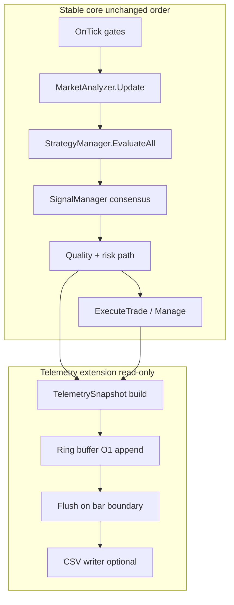

# AURUM SYNAPSE - POST-COMPLETION VALIDATION ROADMAP
## From Development Complete → Production Trading

**Version:** 2.0  
**Status:** Phase 1 complete — **Phase 2** — **§2.4 Require sweep ✅** (`2.4.A`–`2.4.D` logged); **FY net-max lock** still **`2.2.D`** (Q**60**, all Require **false**) — **P0:** **§3.8** **MomentumScalp** **Aug–Dec** silence + **`2.4.C`** Inputs verify *(**§3.1 TrendFollowing** **VERIFIED CORE** — **§3.9** **462**-row lock **`InpMaxSpreadPoints = 50`** + **Phase 3D** contamination **rejected** — see **§Test 3.1** + **PHASE 3D**)* — **CHECKPOINT 3.10** **COMPLETE** (**May 11, 2026**): **V1 production lock** **TF+BO**; **`SupplyDemand`** **ensemble-offender** → **Phase 5** forensic (**PHASE 4A** triple capture **superseded** by pairwise matrix — **see CHECKPOINT 3.10**); **Phase 4** **rollup** **May 11, 2026**: **4.1** **INCONCLUSIVE** · **4.2** **PASS behavioral** · **4.3** **PASS behavioral** **post-fix** · **4.4** **PASS** — **PARTIAL** — **see** **PHASE 4** **checklist**; **Phase 5** — **CHECKPOINT 5.1 — TF+BO Q-sweep** (**Q55/Q60/Q65**) **logged** (**Q60** **optimum** — **see** **Phase 5** **below** **Phase 5A**); **CHECKPOINT 3.12** **session** **forensics** (**S4/S5**) **logged**; **CHECKPOINT 3.13** **Trade execution diagnostics** (`Core/TradeDiag.mqh`, **`[TRADE_BLOCKED]`** / **`[TRADE_ALLOWED]`**) **shipped** — see **ENGINEERING LOCK §D**; **GATE-0** **§ SAFE DEVELOPMENT FOUNDATION** (pre–**STEP 1A** telemetry) **documented**; **# STEP 1A — TELEMETRY INFRASTRUCTURE** (**GATE-1** spec: passive **`AS_TELEMETRY_V1`**, T0–T3) **documented**  
**Last Updated:** May 11, 2026 — **Lot sizing / execution engineering** (**`LOT_SIZE_MAX_BASE`** cap scope, **`LOT_FIXED_PER_BALANCE`** + **`InpBalanceStep`** / **`InpBaseLotPerStep`**, **`ENUM_LOT_METHOD`** order + **preset migration** — see **ENGINEERING LOCK — Lot sizing & execution**); **CHECKPOINT 3.12** **Session Regime Continuity Forensics** (**TF+BO**, **Q65**, **TEST S4/S5** **WIT** **windows**) **logged**; **CHECKPOINT 4C** **weekday** **hardening** **forensics** **(W1–W3**, **TF+BO**, **Asia** **00→07** **WIT**, **Q65**); **CHECKPOINT 5.1 — TF+BO Quality Sensitivity Sweep** (**Q55/Q60/Q65**); **Phase 4.3** consec **post-fix**; **4.1** daily loss Mar **2025**; **4.4** position limit; **4.2** equity DD; **CHECKPOINT 3.10** complete; **§Test 3.1** spread lock; **§3.1** **462** / **§3.2** **398** / **§3.4** **479**; **§ ENGINEERING LOCK §E** — **FPB vs low trade count** **operational audit** (external **TF+BO** lab: time filter **ON**, **$500** deposit, step **500** / **0.01** — **~20** positions, **session/weekday** concentration — **rank `Reason=`** before blaming FPB formula); **§ SAFE DEVELOPMENT FOUNDATION** (**GATE-0** — backup / rollback / stable core); **# STEP 1A — TELEMETRY INFRASTRUCTURE** (**GATE-1** — passive **`AS_TELEMETRY_V1`**, T0–T3, non-interference contract — before regime engine)

**Addendum (2026-05-10 — telemetry-roadmap Phase 3B, join validation):** **GOLDEN FIXTURE SUITE V1 COMPLETE (2026-05-10)** — `Case_001_BasicJoin` through **`Case_010_TimezoneEdge_StaticOffset`** **PASS** deterministically (`Tests/TestTelemetryJoinValidation.mq5`); golden fixtures + **byte-identical** regression; backward-only **`MAX(bar_utc ≤ d_time_utc)`**; **`ORPHAN_DEAL`**; duplicate-candidate / duplicate-ticket / gap / future-leak guards; partial-close + position rollup annotations + multi-context attribution + UTC edge / static-offset **metadata** policy frozen in **`TelemetryAnalytics/PHASE_3B_GOLDEN_FIXTURE_VALIDATION.md`** (**§A1–A10**). **Milestone tag:** `PHASE_3B_GOLDEN_FIXTURE_SUITE_COMPLETE`.

**PHASE STATUS (Suite V1):** **Golden Fixture Suite V1 — FROZEN** (canonical regression baseline / **regression law**). **Freeze charter:** **`TelemetryAnalytics/PHASE_3B_GOLDEN_SUITE_FREEZE_V1.md`**. **Suite marker:** `TelemetryFixtures/VERSION.txt` → `GOLDEN_FIXTURE_SUITE_V1_FROZEN` (freeze date **2026-05-11**). **Optional freeze tag:** `PHASE_3B_GOLDEN_SUITE_V1_FROZEN`.

**Next (planned):** production **`JoinedTradeRecord`** join exporter + **`POSITION_ROLLUP_V1`** + survivability / toxicity analytics **after** explicit spec; **Adaptive AI / governance** — **not started**; **out-of-scope** until deterministic join + analytics layer matures.

---

## 🎯 OVERVIEW

EA development is **COMPLETE** ✅  
**Phase 1 (Basic Functionality)** is **COMPLETE** ✅ (May 7, 2026)

**Validated:** 1-month XAUUSD M5 backtest (2025-01-01 → 2025-01-31), ultra-permissive inputs, real ticks — **15 total trades**, no Stack overflow / OnTester critical error in final run. SL/TP direction and distances consistent with XAUUSD handling.

**This document provides:**
- ✅ Step-by-step debugging workflow
- ✅ Clear checkpoints with expected results
- ✅ Troubleshooting at each stage
- ✅ Progress tracking system
- ✅ Decision points (GO/NO-GO/FIX)
- ✅ **CHECKPOINT 3.13** — structured **`[TRADE_BLOCKED]`** / **`[TRADE_ALLOWED]`** Journal forensics (**ENGINEERING LOCK §D**) for **FPB** + low trade-count triage (**§E**)
- ✅ **§ SAFE DEVELOPMENT FOUNDATION** — backup, branching, stable core, telemetry safety (**GATE-0** before **STEP 1A**)
- ✅ **# STEP 1A — TELEMETRY INFRASTRUCTURE** — passive observability spec, schema **`AS_TELEMETRY_V1`**, T0–T3, **GATE-1** before regime engine

---

## 📋 VALIDATION PHASES (6 PHASES)

```
Phase 1: BASIC FUNCTIONALITY TEST      → Get ANY trade to execute
Phase 2: FILTER CALIBRATION & PERFORMANCE VALIDATION → Quality ladder; one variable/test; WR target 70–75%
Phase 3: STRATEGY VALIDATION           → Test each strategy individually
Phase 4: RISK SYSTEM VERIFICATION      → Confirm circuit breakers work
Phase 5: PERFORMANCE OPTIMIZATION      → Tune for target metrics
Phase 6: PRODUCTION READINESS          → Final validation before live
```

**Estimated Time:** 2-4 days (2-4 hours per phase)

**Pre-requisite (engineering):** **GATE-0** — satisfy **§ SAFE DEVELOPMENT FOUNDATION** (backup, branching, stable core, bounds). **GATE-1** — complete **# STEP 1A — TELEMETRY INFRASTRUCTURE** (passive observability, **T0–T3**) **before** any **regime score engine** (**STEP 1B+**) or adaptive switching work — see sections below.

---

# SAFE DEVELOPMENT FOUNDATION (Institutional MT5 — Pre-STEP 1A)

**Development mode:** **CONTROLLED SURGICAL** — infrastructure + observability only; **not** autonomous rewrite of trading logic.  
**Status:** [ ] Operator checklist complete · [ ] First full snapshot taken · [ ] `stable/core` tag exists  
**Purpose:** Protect **Aurum Synapse** (mature multi-strategy stack) from **corruption, ambiguous refactors, non-reproducible labs**, and **telemetry-induced regressions** (CPU / stack / timing). This section is **process + architecture contract** — not EA runtime code.

**Critical safety rules (roadmap contract — implementation must obey):**

1. **Do not** rewrite existing trading logic, execution flow, **RiskManager** / **MoneyManager** behavior, consensus engine logic, strategy logic, or order execution sequence.  
2. **Only** telemetry-related **extension** files + **minimal** stable-core glue (see **STEP 1A-11** if any touch is unavoidable).  
3. **Passive read-only hooks** only; telemetry **non-invasive**; backtest behavior **reproducible** with telemetry **OFF** bit-identical to pre–STEP 1A baseline (within MT5 floating-point noise only).  
4. **Prefer NEW files** over edits to stable core; integration **reversible** (feature flag / single include / remove folder).

---

## SD-0. Security blueprint (architecture + governance)

### SD-0.1 Survivability pillars

| Pillar | Definition |
|--------|------------|
| **Recovery** | Every material change has a **named snapshot** (git tag + zip) + **Tester `.set`** + optional **`.ex5`** + **MANIFEST** (from **`Tests/MANIFEST.template.md`**). |
| **Branch isolation** | **Telemetry / regime / research** on **`feature/*`** or **`research/*`**; merges to **`main`** only after **compile + smoke tester + diff review**. |
| **Stable core protection** | **`OnTick` pipeline order**, **RiskManager**, **MoneyManager**, **TradeManager**, **consensus / veto pipeline**, **execution timing** — **§SD-5**; edits require **signed checklist**, not drive-by refactor. |
| **Extension layer** | **`Telemetry/`** (new), diagnostics, exporters, shadow buffers — **default OFF** or **`#ifdef TELEMETRY_OFF`** for “reference stable” builds. |
| **Regression evidence** | **Proof =** same **build fingerprint** (`#property version` + optional SHA) + **canonical §Test row** (n / PF / max DD) within **MANIFEST-documented tolerance** — telemetry-only vs logic-change classes differ. |
| **Reproducibility** | **Locked `.set`** + **Journal path** + **commit SHA** archived; no “mystery” tester runs. |
| **Behavioral integrity** | Trading path **deterministic** when telemetry disabled; telemetry **must not** branch on data that changes decisions unless behind **explicit OFF-default research flag** (out of scope for STEP 1A). |

### SD-0.2 Operator gate checklist (intentionally unchecked — human signs)

- [ ] **Operator confirmation** — session goal + risk to stable core documented in **MANIFEST**.  
- [ ] **Stable snapshot** — zip + `git bundle` (or remote push) completed.  
- [ ] **Core freeze** — agreement: no unrelated strategy edits in same branch as STEP 1A.  
- [ ] **Git tag** — `snap-YYYYMMDD-HHMM` (or release tag) applied to **green** commit.  
- [ ] **Rollback checkpoint** — `MANIFEST` lists **restore steps** + **smoke `.set`** + **expected metric band**.

---

## SD-1. Full system backup strategy

### SD-1.1 Backup folder structure (recommended outside Terminal tree)

Host path example: `D:\AurumSynapse_Archive\` (or repo-adjacent `../AurumSynapse_Archive/` — **exclude** from compiler include path).

```
AurumSynapse_Archive/
├── git-bundles/                    # git bundle create (full repo history)
│   └── aurumsynapse_YYYYMMDD_HHMM.bundle
├── zip-snapshots/                  # full Experts/AurumSynapse tree (+ Tests if not in git)
│   └── AS2_YYYYMMDD_HHMM_src.zip
├── ex5-artifacts/                  # compiled .ex5 + .mq5 hash note
│   └── AS2_2.00_bcBUILD_ex5.zip
├── presets-sets/                   # Strategy Tester .set + default profiles
│   └── FY2025_Q60_TFBO_v1.set
├── optimization-exports/           # XML/HTML results + Journal excerpt
│   └── opt_YYYYMMDD_strategy.xml
├── tester-journals/                # copy of Agent-.../logs/*.log after major runs
│   └── 20250511_phase3c_pa.log
├── telemetry-vault/                # STEP 1A+ CSV/binary exports (encrypted at rest if needed)
│   └── run_YYYYMMDD_session.csv
└── MANIFEST.md                     # copy from **Tests/MANIFEST.template.md** — what/when/branch/commit/machine + Tester lock
```

### SD-1.2 Snapshot versioning

| Artifact | Version tag |
|-----------|-------------|
| **Source** | **Git:** semantic tag `v2.0.x` + lightweight tag `snap-YYYYMMDD-HHMM` before risky work. |
| **Binary** | Filename or manifest: **`EA_BUILD_DATE`** + **`#property version`** + **Git SHA** (Print once in `OnInit`) — roadmap already uses build discipline; **extend** with `GIT_SHORT_SHA` only if build script adds it. |
| **Tester** | **`.set`** name encodes: symbol, period, date range, Q, spread, magic, lot method (e.g. `XAU_M5_FY25_Q60_SPR50_M20250505.set`). |

### SD-1.3 What to back up (mandatory vs optional)

| Item | Mandatory | Notes |
|------|-----------|--------|
| **Entire `Experts/AurumSynapse/`** (sources + `Tests/`) | ✅ | Includes `*.mqh` dependency graph. |
| **`MQL5/Include`** only if Aurum pulls custom includes | ⚠️ | Repo grep `#include <` vs `"`; if none, Terminal default includes suffice in zip note. |
| **`.set` files** (Terminal `Profiles\Tester\` or project copy) | ✅ | Reproducibility **P0** for roadmap rows. |
| **Optimization results** | ✅ if used for decisions | XML export + **Inputs screenshot** + **Report**. |
| **Telemetry output** | ✅ post–STEP 1A | Separate vault; **never** mix into `Experts` compile tree unnecessarily. |
| **`AppData\...\Tester\...\logs`** | ✅ for forensics | Large — **rotate**; keep **last N** + milestone logs. |

### SD-1.4 Recovery workflow (ordered)

1. **Stop** active Tester runs using the EA.  
2. **Identify** last known good: **tag** `snap-*` or `v2.0.x` + matching **`.set`**.  
3. **Restore:** `git checkout` tag **or** unzip `zip-snapshots` into clean copy (verify **no** stray `*.ex5` from other branches in same folder if MT5 caches).  
4. **Recompile** F7 — confirm **0 errors** and **same** `#property version`.  
5. **Smoke tester:** **canonical** row (e.g. **§Test 3.1** one month or FY subset) — compare **trade count band** ± tolerance **documented in MANIFEST**.  
6. **If failure:** bisect `git bisect` between good/bad; **do not** layer telemetry on unknown bad.

### SD-1.5 `MANIFEST.template.md` — usage philosophy

- **`Tests/MANIFEST.template.md`** is the **canonical blank** for every snapshot: copy → fill **REQUIRED** tables → store next to **zip / bundle** (see tree **§SD-1.1** `MANIFEST.md`).  
- **Philosophy:** the manifest is a **behavioral fingerprint** for **reproducibility** (Tester lock + commit + artifacts), not administrative paperwork.  
- **Smoke / regression gate** rows in the template define **pass/fail** before declaring a snapshot “green” for merge or for STEP 1A promotion.  
- **Discipline:** no archived “golden” run without a manifest path filled → prevents **silent** `.set` / Magic / spread drift vs roadmap **§Test 3.x** anchors.

---

## SD-2. Git & Sandbox workflow

### SD-2.1 Branch strategy (Git)

| Branch | Role |
|--------|------|
| **`main` / `master`** | **Protected:** always **compilable**; merges via PR or paired review; **tags** for releases. |
| **`stable/as2-2.xx`** | Optional long-lived; only cherry-picks from verified tags. |
| **`feature/telemetry-1a`** | All STEP 1A work; **squash merge** when clean. |
| **`research/regime-scores`** | Experimental scoring; **must not** merge until P0 tests pass. |
| **`hotfix/*`** | Emergency production; branch from **tag**, merge to `main` + tag patch. |

### SD-2.2 Experimental sandbox

- **Separate MT5 data folder** (portable install or copy profile) **optional** — isolates **wrong .ex5** in `experts` cache.  
- **Minimum:** separate **chart template** + **`.set`** named `SANDBOX_*` so **never** overwrite production presets.

### SD-2.3 Feature isolation & fallback

- **Telemetry:** **compile flag** or **`InpTelemetryEnable`** default **false**; **shadow mode** = compute buffer **without** `FileWrite` / heavy `Print`.  
- **Fallback:** if telemetry init fails → **log once**, **permanently disable** that subsystem for session — **never** throw from constructor paths used by `OnInit`.

### SD-2.4 Rollback plan (decision tree)

| Symptom | Action |
|---------|--------|
| Compile break | Revert file(s) to last tag; **do not** partial-revert `*.mqh` without include closure check. |
| Tester silent / wrong n | First check **`.set` / Inputs enum remap** (roadmap **ENGINEERING LOCK**); then **`[TRADE_BLOCKED]`** frequency; then code bisect. |
| Performance / freeze | Disable telemetry; retest; **binary search** commits on `feature/telemetry-*`. |

### SD-2.5 Protected stable build & canary

- **`stable` build:** tag + `.ex5` stored + **one** attached Report (hash in `MANIFEST.md`).  
- **Canary:** run **telemetry ON** build on **subset period** (e.g. one month) **before** FY; promote only if **CPU time** and **Journal size** within budget (§SD-7).

---

## SD-3. MT5 safe development workflow (MQL5-specific)

### SD-3.1 Platform limitations (design around them)

- **No exceptions** as in C++; prefer **early return + last error** pattern.  
- **`#include` order** matters; **circular includes** = subtle compile/runtime breakage — **one-direction** (verify with **`Tests/dependency_snapshot.txt`**): typically `Core/` → `Engine/` → `Execution/` → `Management/` → `Strategies/` → `UI/` → EA root.  
- **Stack depth:** heavy `OnTick` logging, **recursive** logger paths, **deep recursion** — **forbidden**; new-bar gating already mitigates; telemetry **must** follow same **throttle** rules.  
- **String / heap:** avoid **per-tick** `StringFormat` storms; telemetry batch **ring buffer** + flush on **new bar** or **N seconds**.  
- **`#property strict`** / modern strict typing — keep; avoid implicit casts in hot paths.  
- **Tester vs live:** file I/O paths differ agent folder — **always** `FILE_COMMON` or **explicit** `Tester\...\MQL5\Files` documented.

### SD-3.2 Compile safety checklist (every merge)

- [ ] `AurumSynapse.mq5` + **all** `Tests/Test*.mq5` touched compile **0 errors**.  
- [ ] **No new** `#include` from `Strategies/*.mqh` **back** into `AurumSynapse.mq5` globals **without** forward declare audit.  
- [ ] **Warnings:** treat **implicit enum conversion** as **blocker** for hot files.  
- [ ] **Duplicate symbols:** include guards on **all** new `*.mqh`.

### SD-3.3 Hidden side-effect prevention

- **Rule:** telemetry **reads** `MarketState` **copy** after `MarketAnalyzer::Update()` — **no writes** to analyzer or strategy state.  
- **Rule:** no telemetry inside **`CTrade`** call path except **post** result (or ring buffer write O(1)).  
- **Rule:** **no** `Sleep()` in telemetry path in tester unless already gated project-wide.

### SD-3.4 Performance regression guard

- **Baseline:** wall time per FY test from **Tester log** “total time”; **+15%** = investigate (STEP 1A official budget **<5%** — **STEP 1A §10**).  
- **Journal rows per bar:** if telemetry pushes **> X lines/bar** — reduce default verbosity tier.

### SD-3.5 STRICT rules — telemetry vs trading path (MQL5)

| Rule | Requirement |
|------|-------------|
| **R1** | **`MarketState`** (and any snapshot passed to telemetry) is **read-only** for telemetry code — **no** fields written back by telemetry helpers. |
| **R2** | Telemetry **must not** call **`CTrade`**, **`OrderSend`**, **`PositionModify`**, or any wrapper that touches the trade server. |
| **R3** | Telemetry **must not** sit in the **execution-critical path** between **margin check** and **order send**; allowed: **post**-return append, or **new-bar** batch before consensus **only if** it is **O(1)** and **cannot** alter branching (pure record of already-computed values). |
| **R4** | Telemetry **must not** alter **timing-sensitive** sequencing (no extra **`Sleep`**, no blocking I/O on tick path); flush policy = **bar-close** or **bounded queue drain**. |
| **R5** | **Determinism:** with telemetry **OFF** (or `TELEMETRY_OFF` compile), tester results **must** match pre-integration baseline within documented tolerance — telemetry **never** changes RNG, indicator buffers, or `OnTick` control flow. |

---

## SD-4. Refactor protection plan

### SD-4.1 File dependency map (maintain as living doc or generated)

- **Source of truth:** `AurumSynapse.mq5` includes → `Engine/*` → `Management/*` → `Execution/*` → `Strategies/*`.  
- **Action:** before refactor, run **`grep -r "#include"`** under `Experts/AurumSynapse` → save to **`Tests/dependency_snapshot.txt`** in snapshot zip (optional automation later).

### SD-4.2 Interface protection

- **Stable structs:** `MarketState`, `SignalResult`, enums in **`Core/Constants.mqh`**, **`Core/Structures.mqh`** — changes require **version bump** + **migration note** in roadmap **ENGINEERING LOCK**.  
- **Strategy surface:** `Evaluate()`, `GetSignal`, activation hooks — **extend** with **new optional methods** before **changing** signature of existing virtuals (if OOP inheritance used).

### SD-4.3 Backward compatibility

- **Inputs:** never **reuse** same `input` slot for **different meaning** without **preset migration** note (already burned once on **`ENUM_LOT_METHOD`** order — see roadmap **ENGINEERING LOCK §B**).  
- **Telemetry file format:** header row with **version field** `AS_TELEMETRY_V1` — parsers ignore unknown columns, not crash.

### SD-4.4 Regression checklist (classification)

| Change class | Minimum tests |
|----------------|------------------|
| **Telemetry-only** | Compile + **1-month** smoke + **Journal size** spot check. |
| **Risk / lot / `OnTick` order** | **Canonical §Test 3.x row** OR documented FY subset + **`[TRADE_BLOCKED]`** sanity. |
| **Single strategy `*.mqh`** | **Isolation** strategy test + **H2** month chart snapshot. |
| **Consensus / SignalManager** | **TF+BO** locked row + compare **n ± band** from **MANIFEST**. |

---

## SD-5. Stable Core vs Extension Layer

### SD-5.1 Stable Core (**do not touch casually**)

- **`AurumSynapse.mq5`:** `OnTick` **gate ordering** (risk → time → spread → `MarketAnalyzer::Update` → evaluate → consensus → quality → `ExecuteTrade` / manage).  
- **`Management/RiskManager.mqh`:** limits, halt, `CanTrade`, `SetRiskLimitsFromInputs` invariant.  
- **`Execution/TradeManager.mqh`:** margin check, `CTrade` retry semantics.  
- **`Execution/MoneyManager.mqh`:** **`LOT_AUTO`** / **`LOT_FIXED`** / **`LOT_FIXED_PER_BALANCE`** **contract** (FPB isolated path).  
- **`Engine/MarketAnalyzer.mqh`:** regime **detection order** and tape state feeding strategies — **coordinate** any future regime-score **consumer** work with **Phase 3B** continuity notes.  
- **`Engine/SignalManager.mqh`** + **`Engine/StrategyManager.mqh`:** **weighted consensus** aggregation, strategy orchestration, **layered veto** inputs — **stable** for STEP 1A (telemetry **reads outputs** only).  
- **`Engine/QualityFilter.mqh`:** quality score used in **execution gate** — stable; telemetry records **score + inputs snapshot**, does not change formula.  
- **`Execution/ExecutionTimer.mqh`**, **`Execution/FrequencyController.mqh`:** execution timing / rate limits — **stable**; STEP 1A must not inject delays or counters that feed back into **allow trade** without explicit future project (out of scope).  
- **`Engine/RegimeMemory.mqh`:** adaptive regime memory — **stable** for STEP 1A; telemetry **observes** state, **does not** write memory slots.  
- **Trade management / “AI” layer** (position management helpers tied to `TradeManager`): **stable** — no telemetry hooks inside modify/close decision branches.

### SD-5.2 Extension / experimentation-safe (preferred targets for STEP 1A)

- **`Core/TradeDiag.mqh`** (existing — pattern for **side-effect-free** logging).  
- **New:** `Telemetry/TelemetryHub.mqh` (or `Core/Telemetry*.mqh`) — **only** observers + buffer.  
- **New:** optional `Scripts/` or `Tests/` harnesses that **link** shared structs **read-only**.  
- **Strategies:** strategy-local diagnostics **behind** `#ifdef STRAT_DIAG` if needed — **default off**.

### SD-5.3 Extension that needs design review (medium risk)

- **`Engine/SignalManager.mqh`**, **`Engine/StrategyManager.mqh`**: consensus weight changes — **A/B** required.  
- **`Engine/QualityFilter.mqh`:** scoring coupling to future regime scores — **interface** first, **wire** second.

---

## SD-6. Telemetry — pointer to STEP 1A

Normative telemetry safety, staged rollout **T0–T3**, data model, storage, shadow mode, and failure isolation are defined under **# STEP 1A — TELEMETRY INFRASTRUCTURE** below. **§SD-3.5** states **hard MQL5 rules**. **§SD-7–SD-9** remain **executive summaries** for audits.

---

## SD-7. Performance safety (high-frequency decision system)

| Risk | Mitigation |
|------|------------|
| **CPU spike** | Bounded work per bar; **no** full-history scan in telemetry; preallocated buffers; **no** sort on tick. |
| **Memory leak** | **No grow-per-tick** `string`/`dynamic array` without cap; **Static** ring buffer max elements; **FileClose** on `OnDeinit`. |
| **Tick lag / freeze** | Tester: avoid **massive** `Print`/`Comment` updates; live: same + **panel** throttle already in EA — extend to telemetry. |
| **Execution delay** | Telemetry **after** trade attempt **or** on **new bar only** for pre-trade snapshot — **never** between margin check and send. |

**Budget suggestion (initial):** ≤ **200 μs** equivalent work per **new bar** on typical tester host — validate with **Tester “total ticks”** time A/B telemetry OFF vs ON; **reject** if > **5%** wall time regression on same machine.

---

## SD-8. Versioning system (recommendations)

### SD-8.1 Folder structure (repo + runtime)

```
Experts/AurumSynapse/
  AurumSynapse.mq5          # stable entry
  Core/ Engine/ Execution/ Management/ Strategies/ UI/ Tests/ Telemetry/ (future)
Archive/                     # optional INSIDE repo: only manifests + small fixtures — NOT full zips (git LFS off)
```

### SD-8.2 Semantic versioning

- **`#property version` `2.YY`** aligned with **`EA_VERSION`** macro; **PATCH** = git count or manual bump on **each** merge to `main`.  
- **Research builds:** suffix **`-rc.telemetry.1`** in tag only, not in `#property version` until promoted.

### SD-8.3 Archive strategy

- **Git** = canonical line history; **zip** = **lawyer / broker / prop** audit packet.  
- **Retention:** keep **all** monthly zips **year 1**; year 2+ keep **quarterly** + all **release** tags.

---

## SD-9. Safe testing pipeline

| Stage | Purpose | Pass gate |
|-------|---------|-------------|
| **Offline** | Compile + static `grep` forbidden patterns (`Sleep` in hot path, recursive logger) | Clean compile |
| **Module isolation** | `Tests/Test*.mq5` or script loading only `MoneyManager` / one strategy | Expected metrics band |
| **Visual / Strategy Tester** | Short window **real ticks** | No critical / no stack overflow |
| **FY backtest** | Locked `.set` | vs **MANIFEST** tolerance |
| **Forward / demo** | Small risk | Telemetry **T1** shadow only |
| **Shadow telemetry** | Full logic path + no I/O or common folder only | No regression vs OFF |
| **Production release** | checklist §SD-10 | sign-off |

---

## SD-10. Deployment & operator checklist (consolidated)

### SD-10.1 Pre-flight (before any STEP 1A coding session)

- [ ] `git status` clean or **WIP committed** on `feature/*`.  
- [ ] **Tag** `snap-...` from last green.  
- [ ] **Zip** `Experts/AurumSynapse` (+ `.set`).  
- [ ] **`MANIFEST.md`** updated: branch, commit, goal of session — use **`Tests/MANIFEST.template.md`** as source (copy to archive or `Tests/MANIFEST_<id>.md`).

### SD-10.2 Rollback (one screen)

| Step | Action |
|------|--------|
| 1 | `git checkout <tag>` **or** unzip snapshot to restore tree |
| 2 | Delete stale `AurumSynapse.ex5` in same terminal profile if confused |
| 3 | F7 compile |
| 4 | Run **smoke** `.set` |

### SD-10.3 Stable vs experiment matrix

| Build type | Branch | Telemetry | Live trading |
|------------|--------|-----------|--------------|
| **Stable** | `main` @ tag | OFF default | **Allowed** (after Phase 6) |
| **Research** | `research/*` | ON shadow | **No** |
| **Experiment** | `feature/*` | Tiered | Demo only |

### SD-10.4 Future-proof workflow (summary)

**Develop → tag → zip → isolate test → FY canary → merge → release tag → archive Report/Journal.**  
**Telemetry** ships as **read-only sidecar**, **tiered verbosity**, **failure-soft**, **performance-bounded**.

---

# STEP 1A — TELEMETRY INFRASTRUCTURE

**Status:** [ ] Design review complete · [ ] `feature/telemetry-1a` branch created · [ ] T0 smoke logged  
**Mission:** Build **observability first** — **passive**, **shadow-capable**, **read-only** telemetry that **never** mutates trading behavior, consensus, adaptive weights, risk, or execution timing. **No** adaptive regime switching, **no** ML, **no** strategy optimization in this step.

**Principle:** *Observe first. Adapt later.*

**Mandatory workflow before code (per operator / lead):** (1) architecture impact · (2) stable-core boundary · (3) file touch list · (4) integration approach · (5) non-interference proof sketch · (6) rollback · (7) performance budget — **then** implement on **`feature/telemetry-1a`**.

---

## STEP 1A-1. Scope & explicit exclusions

| In scope | Out of scope (later steps) |
|----------|----------------------------|
| Passive **event collector** + **buffer** + **CSV/export** + **rotation** | Regime **switching** that changes strategy weights |
| Read-only snapshots of **MarketState**, signals, pipeline outputs | ML / online learning |
| **Shadow** mode (record without file I/O) | Modifying **QualityFilter** / **SignalManager** math |
| Versioned schema **`AS_TELEMETRY_V1`** | “Telemetry-driven” entries or veto overrides |

---

## STEP 1A-2. Non-interference contract

### Forbidden (telemetry code MUST NOT)

- Call **`CTrade`**, **`OrderSend`**, **`Position*`** mutation APIs, or **`Sleep`** on the trading path.  
- **Write** to **`MarketState`**, strategy internal state, **RegimeMemory**, **RiskManager** fields, **MoneyManager** caches, consensus buffers, or **adaptive weight** storage.  
- **Branch** `OnTick` / `ExecuteTrade` / `CanTrade` / consensus on telemetry data (no `if(TelemetryFoo)` that changes `signal` or `lot`).  
- **Block** or **delay** order submission (no I/O between margin check and send).  
- **Throw** or **assert** in a way that skips **`OnTick`** completion without existing EA guards.

### Allowed

- **`const` / copy** of `MarketState`, `SignalResult[]`, quality score, consensus enum, **read** `Inp*`, **read** risk halt flags **after** they are computed.  
- **Append** fixed-width numeric row to **preallocated** buffer; **Print** throttled debug lines behind **`InpTelemetryLevel`**.  
- **`OnDeinit`**: flush remaining buffer, close handles — **never** prevent **`OnDeinit`** success path from completing cleanup of **trading** subsystems first (order: trading cleanup → telemetry close).

### Read-only guarantee

Telemetry receives **`const references`** or **bitwise copies** of structs; functions prefixed e.g. **`Telemetry_Record*`** live under **`Telemetry/`** and **must not** take non-const pointers to core engine objects unless **documented** as copy-out only.

### Rollback guarantee

Removing **`Telemetry/`** includes + **`#ifdef TELEMETRY`** hooks (or default **`InpTelemetryEnable=false`**) restores **byte-identical control flow** to pre-STEP 1A when telemetry disabled — verified by **FY A/B** (§STEP 1A-9).

### Failure isolation

Any telemetry fault sets **`s_telemetryDisabled=true`**, logs **once**, returns immediately on subsequent telemetry calls — **trading engine never** checks telemetry success for permission to trade.

---

## STEP 1A-3. High-level architecture

| Component | Responsibility |
|-----------|----------------|
| **`TelemetryManager`** | Lifecycle: `Init` / `OnBar` / `OnTradeTransaction` (optional) / `Deinit`; owns flags + row cap. |
| **Passive observer** | Builds **`TelemetrySnapshot`** struct from **already computed** engine outputs (no recomputation of indicators). |
| **Event collector** | Queues **enum event type** + payload index into ring buffer (fixed `double`/`long` columns to avoid string churn in hot path). |
| **Ring buffer** | **Pre-sized** `[MaxRows][Cols]` or parallel arrays; **no** per-bar `ArrayResize`. |
| **Write queue / flush policy** | **Bar-close** flush (preferred) or **every N rows**; **`FileFlush`** only on `Deinit` or rotation — not per row in tester. |
| **Rotation policy** | New file per run: `AS_TEL_<Symbol>_<Period>_<RunId>_<Part>.csv`; `Part++` when size > **max MB**. |
| **Error isolation** | All `File*` calls wrapped; on failure → disable subsystem. |

### Architecture diagram (logical — no runtime coupling to execution)



**Integration seam (minimal stable-core touch):** one **`#include`** + **one** call **`Telemetry_OnNewBar(...)`** placed **after** consensus/quality computation and **before** `ExecuteTrade`, passing **const** references only; second optional call **`Telemetry_OnDeal`** from **`OnTradeTransaction`** — **never** from inside `OpenBuy`/`OpenSell`.

---

## STEP 1A-4. Telemetry data model (schema `AS_TELEMETRY_V1`)

**Header row (CSV):** `schema,ts,bar_time,symbol,period,...` where **`schema=AS_TELEMETRY_V1`**. **Backward compatibility:** append-only new columns at end; parsers **ignore unknown** trailing fields.

### A. Market telemetry (per bar close)

| Field group | Examples |
|-------------|----------|
| Vol / trend | `atr14`, `adx14`, `plus_di`, `minus_di`, `bb_upper`, `bb_mid`, `bb_lower`, `bb_width`, `atr_ratio` |
| Price / structure | `spread_points`, `regime_enum` (read from `MarketState`), `trend_dir`, `structure`, `session`, `hour_wit` |
| Derived (optional T2+) | `efficiency_ratio`, `false_breakout_count_window`, `liquidity_proxy_range_over_volume` |

### B. Strategy telemetry (per strategy index 0..7)

| Per `i` | `sig_i`, `str_i`, `active_i`, `weight_i` (if exposed read-only), `veto_reason_i` or bitmask |
|-----------|--------------------------------------------------------------------------------------------------|

### C. Pipeline telemetry

| Field | Examples |
|-------|----------|
| Consensus | `consensus`, `consensus_strength`, `agreement_pct`, `buy_votes`, `sell_votes` |
| Quality / gates | `quality_score`, `exec_risk_allows`, `time_allowed`, `spread_pts`, `reject_bitmap` or enum id |
| Cooldown / risk snapshot | `halted`, `consec_losses`, `daily_pnl`, `equity_dd` **read-only copy** |

### D. Trade telemetry (on fill / close — from `OnTradeTransaction` or post-`ExecuteTrade`)

| Field | Examples |
|-------|----------|
| Context | `regime_at_entry` (copy), `quality_at_entry`, `consensus_at_entry` |
| Lifecycle | `ticket`, `side`, `open_price`, `sl`, `tp`, `lots`, `open_time` |
| Outcome | `close_time`, `profit`, `mfe`, `mae` (if computed in manager), `close_reason` |

**MAE/MFE:** if not yet in engine, STEP 1A may **omit** columns or stub **`NaN`** until a **future** position-tracker extension — **do not** block STEP 1A on full MAE/MFE.

---

## STEP 1A-5. Storage design

| Topic | Recommendation |
|-------|------------------|
| **Format** | **CSV** first (universal); optional binary later. |
| **Encoding** | UTF-8 without BOM if MT5 allows; else ASCII-safe numeric only. |
| **Path** | `MQL5/Files` under Tester agent or `FILE_COMMON` + documented root; **never** hardcode drive letters. |
| **Naming** | `AS_TELEMETRY_V1_<SYMBOL>_<TFminutes>_<YYYYMMDD>[_seq].csv` under `AurumSynapse/telemetry/` (**T2**, `FILE_COMMON`). |
| **Rotation** | Max **N MB** or **N rows** per file; rotate **before** write burst. |
| **Compression / archive** | Manual zip of **`telemetry-vault/`** (§SD-1.1); in-EA gzip **out of scope** for T1. |
| **Versioning** | Column 1 always **`AS_TELEMETRY_V1`** until breaking change → bump to **`V2`** with **parallel** writer period. |

---

## STEP 1A-6. Performance safety (MT5-specific)

| Hazard | Control |
|--------|---------|
| **CPU spike** | No indicator recompute in telemetry; **no** sorts; **fixed** columns. |
| **String explosion** | Prebuild **header once**; body rows use **`DoubleToString`** only at flush or use **`FileWrite`** with numeric columns from `double` without intermediate `string` where possible. |
| **Memory / fragmentation** | Static buffers; **cap** rows → **stop** telemetry with log when cap hit (trading continues). |
| **Disk bottleneck** | Buffered rows; flush **≤1×/bar** in default profile. |
| **Tick lag** | Telemetry **not** on every tick unless **ring buffer append only** with **≤ few integer writes** — default **new bar only** for Aurum Synapse (already new-bar `OnTick`). |

**Budget:** **<5% wall time** increase on identical FY test vs telemetry **OFF** on same machine — **fail** release to `main` if exceeded; investigate buffer size / flush rate.

---

## STEP 1A-7. Shadow telemetry mode

| Mode | Behavior |
|------|----------|
| **`SHADOW`** | Compute **`TelemetrySnapshot`** + increment counters **only**; **no** `FileOpen` / `FileWrite`. Validates CPU path. |
| **`FILE`** | Shadow + CSV append per flush policy. |
| **`OFF`** | Early return at top of `Telemetry_On*` — **zero** extra work beyond branch. |

**Non-invasiveness validation:** (1) FY run **OFF** vs **SHADOW** → **identical** Backtest tab metrics (trades, profit, DD). (2) **SHADOW** vs **FILE** → metrics still identical; only I/O and time differ slightly.

---

## STEP 1A-8. Failure safety

| Failure | Behavior |
|---------|----------|
| **Disk full** | First `FileWrite` error → disable telemetry, **Print once**, trading **unaffected**. |
| **Invalid path** | `Init` fails path → disable, continue. |
| **Write failure** | Same as disk full. |
| **Buffer overflow** | Drop oldest or stop recording with flag — **never** resize unbounded. |
| **Flush failure** | Close file, disable, continue. |
| **Corrupted partial file** | Trading unaffected; manual truncate/repair outside EA. |

---

## STEP 1A-9. Testing & validation workflow

| Step | Action | Success criteria |
|------|--------|------------------|
| **Compile** | F7 + `Test*.mq5` if touched | 0 errors |
| **Telemetry integrity** | Header **`AS_TELEMETRY_V1`** + column count stable | Parser script validates |
| **Deterministic replay** | Same `.set` + seed (if any) OFF vs SHADOW | **Identical** trades / profit / DD |
| **Regression benchmark** | Canonical §Test row (e.g. 3.1 subset) | Within **MANIFEST** tolerance |
| **Timing benchmark** | Journal footer wall time OFF vs FILE | **<5%** |
| **Shadow FY** | Full FY SHADOW | No stack / critical |
| **Forward / demo** | FILE mode low risk | Disk stable; no user-visible trade change |
| **T2 smoke** | MetaEditor: compile **`Tests/TestTelemetryT2.mq5`** (optional: Strategy Tester once) | Journal **`[TestTelemetryT2] PASS`** (or compile-only line if `FILE_COMMON` init fails) |

### TEST C — EA telemetry build matrix (non-interference)

| Build | `AurumSynapse.mq5` defines | Backtest expectation |
|-------|---------------------------|------------------------|
| **A** | *(both lines commented)* | Baseline — canonical metrics row |
| **B** | `#define AURUM_TELEMETRY_T1` | Same tab metrics as **A** (T1 = in-memory ring only) |
| **C** | `AURUM_TELEMETRY_T1` + `#define AURUM_TELEMETRY_T2` | Same tab metrics as **A/B**; CSV append under Terminal **Common** `Files\\AurumSynapse\\telemetry\\` (`FILE_COMMON`), drained on **`OnTimer`** |

**Rollback:** comment both defines; recompile — no telemetry code linked.

### Phase 3A — shadow regime analytics (Stream A; **no EA change**)

| Item | Detail |
|------|--------|
| **Objective** | Offline scan of **`FILE_COMMON`** `AurumSynapse\telemetry\AS_TELEMETRY_V1_*.csv` → aggregated **REGIME_PROXY** (derived from ADX / `volatility_ratio`), session buckets, quality bins, strategy×regime descriptive matrix. **No** profit factor / trade outcomes (Stream B deferred). |
| **Delivered** | Folder **`TelemetryAnalytics/*.mqh`**, **`Tests/TestTelemetryAnalytics.mq5`**. |
| **STATUS (freeze)** | **COMPLETE + VALIDATED** — see **`### PHASE 3A — COMPLETION FREEZE (official) — 2026-05-12`** below. |
| **Validation** | **PASSED (2026-05-12).** MetaEditor compile + Strategy Tester: line-oriented CSV read + parser path; Journal **`[TestTelemetryAnalytics] done rows=15974 rejects=0`** (validated corpus; row count varies with CSV set). **Phase S (2026-05-10):** production Journal line **`[Analytics] AS_TELEMETRY_V1 files=N rows=… rejects=… PASS|FAIL`** (see **`### PHASE S — STABILIZATION & BASELINE FREEZE — 2026-05-10`**). |
| **Rollback** | Delete `TelemetryAnalytics/` + test script; no EA rebuild required unless docs touched. |

### PHASE 3A — COMPLETION FREEZE (official) — 2026-05-12

**Official status:** **T0 — COMPLETE** · **T1 — COMPLETE + VALIDATED** · **T2 — COMPLETE + VALIDATED** · **Phase 3A Stream A — COMPLETE + VALIDATED**.

**Canonical doc anchor:** search **`### PHASE 3A — COMPLETION FREEZE (official) — 2026-05-12`** in this file.

**Schema / CSV contract (`AS_TELEMETRY_V1`):** **STABLE / VERSION-LOCKED.** No breaking changes to column order, header line, or field semantics without an explicit migration plan and **version increment** (new schema id / header).

### TEST B — T1 passive telemetry

| Field | Record |
|-------|--------|
| **Status** | **PASSED** |
| **Evidence** | OFF vs ON backtest tab metrics **identical**; no strategy interference; no trade-count drift; telemetry hook **non-invasive**. |

### TEST C — T2 shadow persistence

| Field | Record |
|-------|--------|
| **Status** | **PASSED** |
| **Evidence** | CSV persistence operational; **`FILE_COMMON`** storage under `AurumSynapse\telemetry\` operational; rotation (day / size) operational; telemetry rows persisted as designed; **no EA behavior drift**; rows generated successfully for downstream analytics. |

### Phase 3A — Analytics engine (Stream A)

| Field | Record |
|-------|--------|
| **Status** | **PASSED** |
| **Final validated sample (Journal)** | **`[Analytics] AS_TELEMETRY_V1 files=1 rows=15974 rejects=0 PASS`** (corpus-dependent counts) · **`[TestTelemetryAnalytics] done rows=15974 rejects=0`** |
| **Validated components** | CSV discovery; **`FILE_COMMON`** path resolution; line-oriented CSV reader (`FILE_BIN` byte read → physical lines); parser normalization + schema alignment; aggregation engine; regime / session / quality / strategy-participation analytics |

### Root cause history — Stream A ingest (resolved; **path resolution only**)

1. **`FileFindFirst` / `FileFindNext`** return **bare filenames only** (no directory), per MQL5 contract, even when the search filter includes `AurumSynapse\telemetry\...`.
2. **`FileOpen(..., FILE_COMMON)`** requires the **full relative path** from the Common Files root (e.g. `AurumSynapse\telemetry\AS_TELEMETRY_V1_....csv`).
3. Analytics initially stored the find result **as-is** and passed that string to **`FileOpen`** → invalid relative path (file looked up at Common **root**).
4. Symptom chain: **`[ANALYTICS_REJECT_STAGE] stage=file_open`**, **`rows=0`**, **`rejects=364`** (one reject per matched file when open failed).
5. **Fix:** reconstruct stored path as **`ANALYTICS_TELEMETRY_FOLDER` + filename** when the find result does not already start with `AurumSynapse\` (see `AnalyticsAggregator_CommonRelPathFromFindName` in `TelemetryAnalytics/AnalyticsAggregator.mqh`).

### Earlier investigation false leads (archived)

These were **ruled out** for the final Stream A failure mode after instrumentation and raw tester log review:

- CSV **delimiter** / token split as primary failure (MQL5 `.csv` + `FileReadString` field mode was a separate earlier issue; fixed by line-oriented reader).
- **Schema mismatch** / column misalignment as the driver of `rows=0 rejects=364` in the last failure window (parser never reached until `FileOpen` succeeded).
- **Stale binary / agent cache** as the sole explanation (build-ID and path traces showed real execution; the dominant bug was **`relPath`** construction, not silent absence of `Print`).
- **Final classified root cause for the 364× `file_open` reject window:** **PATH RESOLUTION ONLY** (directory prefix missing on stored find names).

### PHASE S — STABILIZATION & BASELINE FREEZE — 2026-05-10

**Scope:** telemetry contract stability, documentation, baseline artifacts, and version locking only. **No** EA execution, signal, consensus, risk, or trade-behavior changes.

| Step | Deliverable |
|------|-------------|
| **S1** | Removed forensic Journal tags (`[ANALYTICS_FILEOPEN]`, `[ANALYTICS_FILEFIND]`, `[ANALYTICS_REJECT_STAGE]`, `[ANALYTICS_FORENSIC]`, `[TelemetryCSV forensic ONCE]`, build-ID spam). Production summary: **`[Analytics] AS_TELEMETRY_V1 files=… rows=… rejects=… PASS\|FAIL`**. |
| **S2** | **`TELEMETRY_SCHEMA_VERSION`** (`"V1"`) in `Telemetry/TelemetryVersion.mqh`; writer `TelemetryWriter_CsvHeaderLine()` remains single source of truth; **`TelemetryCsvV1_ExpectedColumns()`** stays derived from that header. |
| **S3** | **`Telemetry/TELEMETRY_CONTRACT.md`** — full column index table + session / regime proxy / quality / strategy-slot / consensus semantics. |
| **S4** | **`Baselines/Telemetry_V1/TEST_C_2025/`** — canonical artifact pointers + **`REGRESSION_FROZEN.md`**. |
| **S5** | **`ANALYTICS_ENGINE_VERSION`** / **`ANALYTICS_STREAM_A_REPORT_VERSION`** in `TelemetryAnalytics/AnalyticsConfig.mqh`; report header echoes telemetry + analytics + report versions. |
| **S6** | Frozen Stream A regression expectations documented under baseline folder (analytics rows / rejects; EA TEST C tab parity unchanged from prior freeze). |

**Rollback:** revert `TelemetryAnalytics/AnalyticsAggregator.mqh`, `CsvTelemetryReader.mqh`, `AnalyticsConfig.mqh`, `Telemetry/TelemetryVersion.mqh`, `Tests/TestTelemetryAnalytics.mq5`, docs under `Telemetry/` and `Baselines/`; recompile `Tests/TestTelemetryAnalytics.mq5`.

---

=== CURRENT SYSTEM CAPABILITY ===

### CURRENT SYSTEM CAPABILITY (telemetry + Stream A)

Aurum Synapse **now includes** (all **read-only / observational** toward execution unless explicitly compiled in for T1/T2 capture):

1. Passive runtime telemetry (**T1**)
2. Persistent telemetry storage (**T2**, `FILE_COMMON` CSV)
3. Historical telemetry archive (operator workflow; **`Telemetry/Archive/`** philosophy — see `Telemetry/Archive/README.md`)
4. Offline analytics engine (**Phase 3A Stream A**, `TestTelemetryAnalytics` + `TelemetryAnalytics/`)
5. Regime observational intelligence (proxy labels from telemetry fields)
6. Strategy participation analytics (descriptive matrix)
7. Quality-distribution analytics and session bucketing
8. **Deterministic join-validation harness** (telemetry-roadmap **Phase 3B**): `Tests/TestTelemetryJoinValidation.mq5` + `TelemetryFixtures/Case_001_BasicJoin` … **`Case_010_TimezoneEdge_StaticOffset`** — **read-only**; **Golden Fixture Suite V1 COMPLETE** (**2026-05-10**, all cases **PASS**); **no** execution mutation; milestone tag **`PHASE_3B_GOLDEN_FIXTURE_SUITE_COMPLETE`**

**Still true by design:** **non-adaptive** analytics, **no** execution mutation, **no** self-modifying behavior, **no** consensus/strategy weight changes from Stream A.

### Next phases (**telemetry roadmap** — naming note + status)

> **Naming disambiguation:** Elsewhere in this roadmap, **Phase 3B** often means **strategy H2 continuity / per-strategy verification** (TrendFollowing, Breakout, etc.). The sections below are **telemetry / analytics roadmap Phase 3B** — **deal ↔ telemetry join** (`AS_JOINED_V1` / **`JOINED_SLIM`**). These are **different scopes**; use file paths and headings to avoid ambiguity.

#### Telemetry roadmap Phase 3B — Deal join (**Golden Fixture Suite V1 — COMPLETE + FROZEN**)

**CURRENT IMPLEMENTATION POSITION:** **Frozen baseline (Suite V1 — regression law, freeze charter 2026-05-11: `PHASE_3B_GOLDEN_SUITE_FREEZE_V1.md`).** The project has **deterministic validated intelligence infrastructure** for deal↔telemetry join: a **reproducible harness** (`Tests/TestTelemetryJoinValidation.mq5`), **`FILE_COMMON`** golden fixtures under `Experts/AurumSynapse/TelemetryFixtures/Case_001` … **`Case_010`**, and **strict string-identical** validation against runtime serialization — **without** mutating the EA execution / trading path.

| Foundation pillar | Status (2026-05-10) |
|-------------------|---------------------|
| **Deterministic join validation** | **Frozen V1** — `TelemetryAnalytics/JoinValidationPrototype.mqh` (prototype; not production-scale join engine) |
| **Golden fixture regression** | **Frozen V1** — Cases **001–010** **PASS** |
| **Suite V1 regression law (charter)** | **Frozen** — `TelemetryAnalytics/PHASE_3B_GOLDEN_SUITE_FREEZE_V1.md` + `TelemetryFixtures/VERSION.txt` |
| **FILE_COMMON deployment policy** | **Frozen** — `PHASE_3B_FIXTURE_DEPLOYMENT_POLICY_V1` |
| **Canonical runtime serialization** | **Frozen** — `CANONICAL_RUNTIME_SERIALIZATION_POLICY_V1` |
| **Strict regression compare** | **Frozen V1** — detects **byte-level** drift (including `TELEMETRY_NULL_DOUBLE` / `DoubleToString` policy) |
| **Causal backward-only join policy** | **Validated** — `Case_001_BasicJoin` **PASS** |
| **`ORPHAN_DEAL` semantics** | **Validated** — `Case_002_OrphanDeal` **PASS** |
| **Multi-candidate `MAX(bar_utc)`** | **Validated** — `Case_003_DuplicateCandidateJoin` **PASS** |
| **Future-bar causal filter** | **Validated** — `Case_004_FutureLeakProtection` **PASS** |
| **Missing telemetry gap (no synthetic fill)** | **Validated** — `Case_005_MissingTelemetryRow` **PASS** |
| **Duplicate `d_ticket` canonical row** | **Validated** — `Case_006_DuplicateDealTicket` **PASS** |
| **Partial-close lifecycle (deal-grain)** | **Validated** — `Case_007_PartialCloseLifecycle` **PASS** |
| **Lifecycle rollup annotations (`x_lifecycle_*`)** | **Validated** — `Case_008_PositionRollup` **PASS** |
| **Multi-deal position attribution** | **Validated** — `Case_009_MultiDealPositionAttribution` **PASS** |
| **UTC edge + static offset metadata** | **Validated** — `Case_010_TimezoneEdge_StaticOffset` **PASS** |

**Golden case status (Suite V1)**

| Case | Result |
|------|--------|
| `Case_001_BasicJoin` | **PASS** |
| `Case_002_OrphanDeal` | **PASS** |
| `Case_003_DuplicateCandidateJoin` | **PASS** |
| `Case_004_FutureLeakProtection` | **PASS** |
| `Case_005_MissingTelemetryRow` | **PASS** |
| `Case_006_DuplicateDealTicket` | **PASS** |
| `Case_007_PartialCloseLifecycle` | **PASS** |
| `Case_008_PositionRollup` | **PASS** |
| `Case_009_MultiDealPositionAttribution` | **PASS** |
| `Case_010_TimezoneEdge_StaticOffset` | **PASS** |

#### SESSION SUMMARY — JOIN VALIDATION FOUNDATION (2026-05-10)

- **Succeeded:** Telemetry **V1** freeze respected; **`AS_JOINED_V1` / `JOINED_SLIM`** column layout exercised end-to-end on fixtures; **FILE_COMMON** read-only harness; backward-only join + **`ORPHAN_DEAL`** + **multi-candidate `MAX(bar_utc)`** + future-leak + gap + duplicate policies + lifecycle + attribution + UTC edge; **byte-identical** expected vs actual line compare.
- **Learned:** Golden `expected_joined.csv` must mirror **MQL5 runtime output** for every numeric token (`TELEMETRY_NULL_DOUBLE` is **not** a tidy decimal literal). Operator **`Common\Files\AurumSynapse\TelemetryFixtures\**` must be **re-copied** from the repo after golden edits or tests **false-fail** while logic is correct.
- **Root cause (historical `line_mismatch`):** Stale or hand-rounded **fixture bytes** vs **`DoubleToString(..., 8)`** — not defective join policy.

#### NEXT — post Suite V1 (planned; not part of golden harness)

1. **~~Freeze Golden Fixture Suite V1~~** **DONE** — see **`TelemetryAnalytics/PHASE_3B_GOLDEN_SUITE_FREEZE_V1.md`** + tag **`PHASE_3B_GOLDEN_SUITE_V1_FROZEN`** (optional) + `TelemetryFixtures/VERSION.txt`.
2. **Production-grade join engine** / **`JoinedTradeRecord`** exporter (bounded lookback, batch writer) — **separate** deliverable from prototype join validation; **must** stay compatible with Suite V1 **or** ship **`AS_JOINED_V2`** + migration.
3. **`POSITION_ROLLUP_V1`** formalization; survivability / toxicity / capital-pressure analytics — per **`PHASE_3B_MASTER_DESIGN.md`** / **`PHASE_3B_DATASET_FINALIZATION.md`**.

**Adaptive AI / governance / auto-orchestration:** **NOT started** — remains **out-of-scope** until the **deterministic join + analytics** layer is mature (**no** live feedback into execution; **no** mutation engines).

#### Telemetry roadmap Phase 3B — Full deal-join **analytics** (still planned)

Future scope (indicative): telemetry ↔ deal-history correlation at scale; PF / DD by regime; quality-to-profit mapping; consensus-to-win-rate mapping; strategy toxicity scoring; volatility-loss analysis — **downstream** of frozen join rows.

#### Telemetry roadmap Phase 4 — Adaptive intelligence (**planned only**)

Future scope (indicative): dynamic weighting; regime-aware activation; adaptive thresholds; self-preservation logic; reinforcement / feedback systems.

**Program discipline:** **Do not** ship breaking telemetry schema changes without version/migration. **Do not** conflate **strategy Phase 3B H2** work items with **telemetry Phase 3B join** work items.

---

## STEP 1A-10. Implementation roadmap (phased)

### T0 — Schema & compile-only (**IMPLEMENTED in repo**)

| Item | Detail |
|------|--------|
| **STATUS (freeze 2026-05-12)** | **COMPLETE** (schema + contracts + tests; no EA trading-path integration). |
| **Objective** | Canonical **`AS_TELEMETRY_V1`** types, contracts, **NO-OP** `CTelemetryManager`, umbrella `AurumTelemetry.mqh`. **No** `AurumSynapse.mq5` integration yet → **zero** trading behavior change vs pre-T0. |
| **Delivered files** | `Telemetry/TelemetryVersion.mqh`, `TelemetryEnums.mqh`, `TelemetryContracts.mqh`, `TelemetryTypes.mqh`, `TelemetryManager.mqh`, `AurumTelemetry.mqh`, `TelemetrySchema.md`, `Telemetry/README.md`, `Telemetry/Archive|Shadow|Schema/README.md`, `Tests/TestTelemetryT0.mq5`, `Tests/Telemetry/ValidationNotes/README.md`. |
| **Touched files (EA core)** | **None.** |
| **Regression risk** | **None** for production EA until T1 includes `AurumSynapse.mq5`. |
| **Validation** | MetaEditor: compile **`Tests/TestTelemetryT0.mq5`**; Journal line `[TestTelemetryT0] PASS`. |
| **Rollback** | Remove `Telemetry/` branch or stop compiling test script — **no** EA rollback required. |

> **`TELEMETRY_OFF` macro:** deferred to T1 when EA includes telemetry; T0 does not require it because **EA is not linked**.

### T1 — Passive bar snapshot + in-memory ring (**IMPLEMENTED in repo**)

| Item | Detail |
|------|--------|
| **STATUS (freeze 2026-05-12)** | **COMPLETE + VALIDATED** (TEST **B** — OFF vs ON non-interference). |
| **Objective** | On eligible bars, **read-only** copy of `MarketState` + `signals[]` + pipeline edge fields into `TelemetryBarRow`; push to **fixed ring** (`TelemetryRingBuffer.mqh`). **No disk I/O.** |
| **Touched files** | `Telemetry/TelemetryCollector.mqh`, `TelemetryRingBuffer.mqh`, **`AurumSynapse.mq5`** (`#ifdef AURUM_TELEMETRY_T1`), `Tests/TestTelemetryT1.mq5`. |
| **Regression risk** | **Low** (bounded memory + O(1) append). |
| **Validation** | Compile **`Tests/TestTelemetryT1.mq5`**; TEST **C** build **B** vs **A** identical metrics. |
| **Rollback** | Comment `#define AURUM_TELEMETRY_T1` in `AurumSynapse.mq5`; recompile. |

### T2 — Shadow CSV persistence (queue + timer drain) (**IMPLEMENTED in repo**)

| Item | Detail |
|------|--------|
| **STATUS (freeze 2026-05-12)** | **COMPLETE + VALIDATED** (TEST **C** — persistence + rotation + non-drift). |
| **Objective** | Same `TelemetryBarRow` as T1 → **fixed queue** (drop-oldest on overflow) → **`OnTimer`** bounded drain (**500 ms**, **32** rows max/call) → append **`FILE_COMMON`** CSV under `AurumSynapse\\telemetry\\`, name `AS_TELEMETRY_V1_<SYMBOL>_<TFmin>_<YYYYMMDD>[_seq].csv`, rotate by **GMT day** + **50 MB** segment. **Hot path = enqueue only.** I/O failure → **soft-disable** (log once), trading continues. |
| **Touched files** | `Telemetry/TelemetryConfig.mqh`, `TelemetryQueue.mqh`, `TelemetryWriter.mqh`, `TelemetryRotation.mqh`, `TelemetryPersistence.mqh`, **`AurumSynapse.mq5`** (`OnInit`/`OnDeinit`/`OnTimer`), `Tests/TestTelemetryT2.mq5`. |
| **Regression risk** | **Low–medium** (I/O isolated to timer + deinit); queue capped. |
| **Validation** | Compile **`Tests/TestTelemetryT2.mq5`**; TEST **C** build **C** vs **A** identical metrics + CSV present on disk. |
| **Rollback** | Comment `#define AURUM_TELEMETRY_T2` (keep or drop T1 per need); recompile. |

### T3 — Analytics-ready export + D trade rows

| Item | Detail |
|------|---------|
| **Objective** | `OnTradeTransaction` mirrored **read-only** telemetry; optional second CSV stream. |
| **Regression risk** | **Medium–high** (more hooks); **isolate** in separate optional compile flag. |
| **Validation** | Forward demo + Journal grep no `CTrade` from telemetry. |
| **Rollback** | `#define TELEMETRY_TRADE_ROWS_OFF`. |

---

## STEP 1A-11. Stable-core protection matrix (files)

| Class | Paths (illustrative) | Policy |
|-------|----------------------|--------|
| **Do not modify for STEP 1A** | `RiskManager.mqh`, `MoneyManager.mqh`, `TradeManager.mqh` internals, `SignalManager` / `StrategyManager` consensus math, each `Strategies/*.mqh` signal rules | **Zero** functional diff |
| **Read-only references** | `MarketAnalyzer` output, `MarketState`, `SignalResult`, quality outputs, risk getters | **const** access only |
| **Safe extension (new)** | `Experts/AurumSynapse/Telemetry/*.mqh` | Primary work |
| **Minimal glue (allowed with review)** | `AurumSynapse.mq5` — **1–2** calls + `OnTradeTransaction` forward; `Core/TradeDiag.mqh` unchanged pattern | Smallest possible diff; document in PR |

---

## STEP 1A-12. MANIFEST system integration

- Every STEP 1A promotion to `main` attaches **`MANIFEST`** row: **telemetry mode** (`OFF`/`SHADOW`/`FILE`), **schema version**, **max rows**, **path root**, **timing A/B result**.  
- **Behavioral fingerprint:** hash of **first + last CSV line** + **Tester Report** trade count stored in manifest for **diff detection** on archive corruption.  
- **Reproducibility:** `.set` + commit SHA + `schema` = **minimum** to replay research claim.

---

**Roadmap integration:** Treat **§ SAFE DEVELOPMENT FOUNDATION** as **GATE-0**; treat **STEP 1A** sections **1A-9** (validation matrix) + **1A-10** T-stage exit criteria as **GATE-1** before any **regime score engine** coding (**STEP 1B+**).

---

# PHASE 1: BASIC FUNCTIONALITY TEST (2-3 hours)
## Goal: Make EA execute AT LEAST ONE TRADE — **ACHIEVED** ✅

### ✅ PHASE 1 OUTCOME (May 7, 2026)

| Item | Result |
|------|--------|
| **Reference backtest** | XAUUSD, M5, 2025-01-01 → 2025-01-31, Every tick based on real ticks |
| **Total trades (MT5 Backtest tab)** | **15** (meets ≥10 for Phase 1) |
| **Stability** | No Stack overflow / no OnTester critical error in successful run |
| **SL/TP** | Valid for XAUUSD (e.g. BUY: SL below entry, TP above; wide min distances as configured) |

**Blockers resolved during May 6–7 validation (for long backtests):**

1. **`Logger::CheckDateChange()` infinite recursion** — `Info()` → `Log()` → `CheckDateChange()` → `Info()` … → **stack overflow** at midnight. Fixed in `UI/Logger.mqh` (rotate file without calling `Log()`/`Info()` from inside `CheckDateChange()`).
2. **`StrategyManager::GetAllSignals()`** — removed unsafe `ArrayResize()` on caller arrays; copy by capacity only (`Engine/StrategyManager.mqh`).
3. **`BaseStrategy` constructor** — removed illegal `ArrayResize()` on fixed `m_activeRegimes[4]` (`Strategies/BaseStrategy.mqh`).
4. Earlier: new-bar `OnTick`, XAUUSD SL/TP minimums, conditional `Sleep()` in tester, `InpMinConsensus` input, etc.

**Note:** Journal line *"Total Trades: 5781"* from EA `OnDeinit` is **not** MT5’s “Total Trades” — it reflects internal bar/counter naming; use the **Strategy Tester → Backtest** summary for official trade count.

---

### ✅ CHECKPOINT 1.1: Verify Compilation

**What to do:**
```
1. Open MetaEditor (F4)
2. Open: Experts/AurumSynapse/AurumSynapse.mq5
3. Press F7 (Compile)
4. Check Toolbox → Errors tab
```

**Expected Result:**
```
✅ 0 errors, 0 warnings
✅ "0 error(s), 0 warning(s)" in status bar
✅ AurumSynapse.ex5 generated
```

**If FAILED:**
- [ ] Check error message
- [ ] Fix compilation errors
- [ ] Re-compile until clean

**Status:** [x] PASS [ ] FAIL

---

### ✅ CHECKPOINT 1.2: Download Historical Data

**What to do:**
```
1. MT5 → View → Symbols (Ctrl+U)
2. Find XAUUSD
3. Right-click → "Ticks" → Download ticks for 2020-2025
4. Wait for download to complete (may take 10-30 min)
5. Close Symbol window
```

**Expected Result:**
```
✅ Data downloaded for full period
✅ Progress bar reaches 100%
✅ No error messages
```

**If FAILED:**
- [ ] Check internet connection
- [ ] Try shorter period (2024 only)
- [ ] Switch data server if available

**Status:** [x] PASS [ ] FAIL

---

### ✅ CHECKPOINT 1.3: Ultra-Permissive Test (CRITICAL!)

**Purpose:** Strip ALL filters to see if EA can trade AT ALL

**Settings for Strategy Tester:**
```
Expert:     AurumSynapse
Symbol:     XAUUSD
Period:     M1
Dates:      Use ANY 1-month period with available tick data
           (Recommended: 2025.01.01 - 2025.01.31 if 2024 data is missing)
Model:      Every tick based on real ticks
Deposit:    10000
Leverage:   1:500
Optimization: Disabled
Visual mode: Unchecked
```

**CRITICAL INPUT SETTINGS (Ultra-Permissive):**
```
=== STRATEGY ACTIVATION ===
InpUseTrendFollowing    = true
InpUseBreakout          = true
InpUseMeanReversion     = true
InpUseSupplyDemand      = true
InpUseSmartMoney        = true
InpUsePriceAction       = true
InpUseGridRecovery      = false   ← Keep OFF (risky)
InpUseMomentumScalp     = true

=== QUALITY FILTER (LOOSEN!) ===
InpMinQualityScore      = 30      ← VERY LOW! (was 70)
InpRequireTrendAlignment= false   ← OFF (note: full name in EA)
InpRequireKeyLevel      = false   ← OFF
InpRequireMomentum      = false   ← OFF

=== CONSENSUS (LOOSEN!) ===
InpMinConsensus         = 1       ← Just 1 strategy needed!

=== LOT SIZING ===
InpLotMethod            = 1       ← Fixed (enum: 0=Automatic, 1=Fixed, 2=Fixed per Balance)
InpFixedLot             = 0.01      ← Used when InpLotMethod = Fixed
InpRiskPercent          = 1.0       ← Used when InpLotMethod = Automatic (input name in EA)
InpBalanceStep          = 500.0    ← Fixed per Balance: balance step ($)
InpBaseLotPerStep       = 0.01     ← Fixed per Balance: lot per step

=== TP/SL (KEEP DEFAULTS) ===
InpTPCoefficient        = 2.0     ← TP distance = SL distance × this coefficient
InpSLPoints             = 100     ← SL distance in *points* (EA derives TP)
InpUseTrailing          = false   ← OFF for Phase 1 stability

=== TIME FILTER (DISABLE ALL!) ===
InpUseTimeFilter        = false   ← OFF
InpTradeMon             = true
InpTradeTue             = true
InpTradeWed             = true
InpTradeThu             = true
InpTradeFri             = true

=== RISK LIMITS (KEEP SAFE) ===
InpMaxDailyLossPct      = 5.0
InpMaxEquityDD          = 12.0
InpMaxConsecutiveLosses = 5       ← Increase from 3
InpMaxOpenPositions     = 5

=== SPREAD FILTER (LOOSEN!) ===
InpMaxSpreadPoints      = 50      ← Was 30

=== UI (CRITICAL FOR BACKTEST!) ===
InpShowPanel            = false   ← MUST BE FALSE!
InpShowStrategySignals  = false
```

**Click START and wait...**

---

### ✅ CHECKPOINT 1.4: Analyze Ultra-Permissive Results

**Expected Result A (IDEAL):**
```
✅ Total Trades: 100+ (in 1 month)
✅ Some wins, some losses (doesn't matter yet)
✅ Graph shows activity
✅ No flat line
```

**Action if Result A:**
```
→ PROCEED to CHECKPOINT 1.5
→ EA is functional, just needs tuning
```

---

**Expected Result B (PARTIAL):**
```
⚠️ Total Trades: 1-20 (very few)
⚠️ Graph mostly flat with tiny movements
```

**Action if Result B:**
```
→ Go to Journal tab
→ Look for messages like:
   - "Quality score too low"
   - "No consensus"
   - "Spread too high"
→ Screenshot Journal
→ PROCEED to TROUBLESHOOTING B
```

---

**Expected Result C (STILL BROKEN):**
```
❌ Total Trades: 0
❌ Completely flat graph
❌ History Quality still 0%
```

**Action if Result C:**
```
→ Go to Journal tab
→ Screenshot ALL messages
→ Look for:
   - Initialization errors
   - Indicator handle failures
   - "Invalid handle"
   - Division by zero
→ PROCEED to TROUBLESHOOTING C
```

---

### 🔧 TROUBLESHOOTING B: Few Trades (1-20)

**Diagnosis Steps:**

1. **Check Journal for rejection reasons**
```
Journal → Look for:
- "Quality score: XX (required: 30)" → Lower InpMinQualityScore to 20
- "Spread XX points > max 50" → Increase InpMaxSpreadPoints to 100
- "No consensus: 0 signals" → Check strategy initialization
```

2. **Try even more permissive:**
```
InpMinQualityScore = 10    ← Almost nothing
InpMinConsensus = 1        ← Just 1 strategy
InpMaxSpreadPoints = 100   ← Very wide
```

3. **Test on different month:**
```
Try: 2024.06.01 - 2024.06.30 (June, more volatile)
```

**If still <10 trades:**
```
→ PROCEED to TROUBLESHOOTING C
```

---

### 🔧 TROUBLESHOOTING C: Zero Trades

**Critical Checks:**

**1. Check Journal for initialization:**
```
Look for:
✅ "StrategyManager initialized with 8 strategies"
✅ "MarketAnalyzer initialized"
✅ "QualityFilter initialized"
✅ "SignalManager initialized"
✅ "TradeManager initialized"

❌ If ANY "FAILED TO INITIALIZE" → Logic bug in EA
```

**2. Check for indicator errors:**
```
Look for:
❌ "Invalid handle for ATR"
❌ "Invalid handle for ADX"
❌ "CopyBuffer failed"

→ If found: Indicator data not available
→ Solution: Use "Every tick" model, not "1 minute OHLC"
```

**3. Check data availability:**
```
Strategy Tester → Settings → "Show Visual Mode"
Re-run test
Watch chart for 5-10 minutes

Do you see:
✅ Price bars moving?
✅ Time advancing?
❌ Frozen chart? → Data issue
```

**4. Emergency diagnostic mode:**
```
Add this to EA inputs:
InpDebugMode = true  (if available)

OR

Edit AurumSynapse.mq5:
In OnTick(), add at very top:

void OnTick() {
    Print("OnTick called at: ", TimeCurrent());
    
    // Rest of code...
}

Recompile, re-run
Check Journal → Should see "OnTick called" messages
If not → EA not being called by MT5
```

**If still broken:**
```
→ Possible MT5 issue
→ Try Strategy Tester on different PC
→ Or send me:
   1. Journal screenshot (full)
   2. Settings screenshot
   3. Graph screenshot
→ I'll debug further
```

**Status:** [x] PASS [ ] FAIL (Result B: 15 trades in 1 month — acceptable for Phase 1 stability goal)

---

### ✅ CHECKPOINT 1.5: Verify Trade Execution Details

**Only do this if you got trades in 1.4!**

**What to check:**
```
1. Click "Backtest" tab
2. Look at first few trades:
   - Entry price
   - Exit price
   - Profit/Loss
   - Duration
   - Comment field (should show strategy name)
```

**Expected:**
```
✅ Trades have different entry/exit prices
✅ Some profitable, some losses
✅ Duration varies (not all identical)
✅ Comment shows which strategy triggered
```

**If weird patterns:**
```
⚠️ All trades identical profit/loss → Possible TP/SL bug
⚠️ All trades <1 minute → Too aggressive
⚠️ No comment field → Logging issue (minor)
```

**Status:** [x] PASS [ ] FAIL [ ] N/A

---

### 📊 PHASE 1 COMPLETION CHECKLIST

Mark each as complete:

- [x] 1.1: EA compiles without errors
- [x] 1.2: Historical data downloaded for test period
- [x] 1.3: Ultra-permissive test configured and run
- [x] 1.4: Result analyzed (A/B/C determined) — **B** (15 trades, stable completion)
- [x] 1.5: Trade execution details verified (if applicable)

**DECISION POINT:**

```
IF Phase 1 PASS (got 100+ trades):
   → PROCEED TO PHASE 2 ✅

IF Phase 1 PARTIAL (got 1-20 trades):
   → If ≥10 trades AND no critical tester errors: treat as Phase 1 PASS for *functionality* ✅ → PROCEED TO PHASE 2
   → If <10 OR crashes: fix before Phase 2 ⚠️

IF Phase 1 FAIL (0 trades):
   → STOP ❌
   → Review troubleshooting
   → Seek additional support
   → DO NOT proceed to Phase 2
```

**Phase 1 Status:** [x] PASS [ ] PARTIAL [ ] FAIL

**Date Completed:** May 7, 2026

**Notes:**
```
- 1-month M5 XAUUSD (Jan 2025): 15 trades, History quality ~96%, no stack overflow in final run.
- Root cause of long-test crash: Logger::CheckDateChange() recursion — fixed in UI/Logger.mqh.
- StrategyManager/BaseStrategy fixes for tester stability (no ArrayResize on caller/static arrays).
- Optional cleanup: rename OnDeinit "Total Trades" log to avoid confusion with MT5 report (internal bar counter).
- Next: Phase 2 — quality threshold sweep (do not expect Phase 1 trade counts in Phase 2).
```

---

# PHASE 2: FILTER CALIBRATION & PERFORMANCE VALIDATION

**Prerequisites:** ✅ Phase 1 PASSED (EA can execute trades)

## Objective

Calibrate filters and validate performance with a **controlled engineering** process — **not** random or multi-parameter optimization.

### Primary goals

- **Stable profitability** — interpret robustness over the test window; avoid single lucky runs.
- **Healthy trade frequency** — enough trades for statistics without meaningless churn.
- **Low drawdown** — acceptable max DD relative to net result and risk appetite.
- **Target win rate 70–75%** — document what the ladder actually achieves; treat 70–75% as a **design target**, not guaranteed.
- **Realistic live behaviour** — same symbol, model, and deposit assumptions as you intend for demo/live.

### Testing methodology (non‑negotiable)

| Rule | Detail |
|------|--------|
| **One variable per test** | Change **exactly one** input vs the locked baseline; keep all other inputs identical. |
| **Same comparison set every run** | Record: **trade count**, **win rate**, **profit factor**, **max drawdown %**, **net profit**. |
| **No simultaneous multi-parameter tuning** | Do not run genetic / multi-input optimization for this phase. Finish the quality ladder first. |

### Constant settings (unless a later checkpoint explicitly overrides)

| Parameter | Value |
|-----------|--------|
| Symbol | **XAUUSD** |
| Model | **Every tick based on real ticks** |
| Deposit | **USD 10,000** |
| Leverage | **1:500** |
| Timeframe | **M5** (unless a written test plan specifies otherwise) |

### Current focus

**Quality ladder calibration** — baseline at `InpMinQualityScore = 30` (Checkpoint **2.1**), then steps **2.2.A–E** changing **only** the quality score between runs. Analyze the pattern in Checkpoint **2.3**.

*Time:* Treat Phase 2 as **multiple tester sessions** (not a single 2–3 hour block).

---

### ✅ CHECKPOINT 2.1: Baseline Test (Quality = 30)

**Purpose:** Establish baseline performance with loose filters

**Kickoff (repo):** ✅ **2026-05-08** — configuration below is the active baseline run. **Next:** execute in MT5 Strategy Tester and replace the placeholders in **Record Results** with values from the **Backtest** tab (then mark **COMPLETE**).

**Settings:**
```
Expert:     AurumSynapse
Symbol:     XAUUSD
Period:     M5
Dates:      2025-01-01 - 2025-12-31 (full year)   ← lock this range for the entire quality ladder
Model:      Every tick based on real ticks
Deposit:    10000
Leverage:   1:500
InpShowPanel = false  ← required

All inputs match Phase 1 ultra-permissive profile EXCEPT:
InpMinQualityScore = 30   ← baseline
InpMinConsensus = 1
InpRequireTrendAlignment = false
InpRequireKeyLevel = false
InpRequireMomentum = false
```

**Run backtest**

**Record Results:** *(source: Strategy Tester → **Backtest** tab; not Journal `Total Trades`)*  
```
Total Trades:     45
Win Rate:         22.22%
Profit Factor:    0.53
Max Drawdown:     12.75%   (equity max; balance max 12.20%)
Net Profit:       $-817.02
Gross profit:     $928.85  |  Gross loss:  -$1,745.87
History quality:  99%
Short / Long:     25 shorts (0% won) | 20 longs (50% won)
```

**Expected (reference only — your sample is far outside):**
```
✅ Trades: 2000-5000 (roadmap guess for loose filters)
⚠️ Win Rate: 55-65% (low quality, high volume)
⚠️ Profit Factor: 1.2-1.8 (marginal)
```

**Post-run notes (2025 FY, Q=30):**
- **No critical tester errors** in Journal snippet (clean shutdown). **Ignore** Journal line `Total Trades: 70875` — same class of misleading counter as Phase 1; official count = **45** (Backtest tab).
- **Activity gap:** entries ~Jan–Mar only; **no trades Apr–Dec** on distribution chart — treat as **P0 investigation** (session/risk/regime/data or logic) before trusting any ladder conclusion.
- **Short side:** 25 shorts, **0%** wins → **validate SELL SL/TP and short signal quality** before scaling quality ladder.
- **Quality vs targets:** WR 22% / PF 0.53 / net negative → **not acceptable** for Phase 2 goals (70–75% WR design target).

**Status:** [x] COMPLETE | **Started:** ✅ 2026-05-08 | **Recorded:** ✅ (2025 FY baseline)

---

### ✅ CHECKPOINT 2.2: Test Quality Thresholds

**Method:** Between tests **2.2.A → 2.2.E**, change **only** `InpMinQualityScore`. Period, symbol, model, deposit, leverage, timeframe, and all other inputs must match Checkpoint **2.1**.

**Naming:** Roadmap **2.2.A = Q40**, **2.2.B = Q50**, **2.2.C = Q60**, **2.2.D = Q70**, **2.2.E = Q80**. Lab IDs can shift (e.g. **`2.2.E`** = **Q=70** / roadmap **2.2.D**; **`2.2.F`** = **Q=80** / roadmap **2.2.E**) — always map by **`InpMinQualityScore`**.

**Record per test:** trades | WR | PF | max DD % | **net profit** ($).

**Run 5 tests with different quality levels:**

**Test 2.2.A: Quality = 40**
```
InpMinQualityScore = 40
Period: 2025-01-01 - 2025-12-31 (same locked range as Checkpoint 2.1)
```
**Results:** *(user notebook **Test ID `2.2.B`** — same as this row)*
```
Trades: 45 | WR: 22.22% | PF: 0.53 | DD: 12.75% | Net: $-817.02
```
**Interpretation:** Backtest metrics are **bit-for-bit identical** to **Q=30** (same 45 trades, WR, PF, net, DD). **Update:** raising to **Q=50** (**user `2.2.C`**, roadmap **Test 2.2.B**) **did** change outcomes — see §2.3 row Q=50 and analysis **Test `2.2.C`**.

---

**Test 2.2.B: Quality = 50**
```
InpMinQualityScore = 50
Period: 2025-01-01 - 2025-12-31 (locked FY — same as 2.1)
```
**Results:** *(user lab Test ID **`2.2.C`** = this roadmap row)*
```
Trades: 59 | WR: 37.29% | PF: 1.08 | DD: 12.22% | Net: $+150.10
```
**Notes:** Backtest tab is source of truth; Journal `Total Trades: 70689` ≠ **59**. Shorts **18 @ 0%** WR; longs **41 @ 53.66%** WR. Monthly entries chart: activity **Jan–Apr** in screenshot — confirm **May–Dec** on your terminal.

---

**Test 2.2.C: Quality = 60**
```
InpMinQualityScore = 60
Period: 2025-01-01 - 2025-12-31 (locked FY — same as 2.1)
```
**Results:** *(user lab Test ID **`2.2.D`** = this roadmap row — roadmap **2.2.D** is Q=**70**, not 60)*
```
Trades: 123 | WR: 41.46% | PF: 1.32 | DD: 13.57% | Net: $+1173.83
```
**Notes:** Backtest tab = truth; Journal `Total Trades: 70753` ≠ **123**. Shorts **35 @ 14.29%** WR (first non-zero short WR in ladder); longs **88 @ 52.27%** WR. Monthly chart in screenshot: entries **Jan–May** — confirm **Jun–Dec** in tester.

---

**Test 2.2.D: Quality = 70**
```
InpMinQualityScore = 70
Period: 2025-01-01 - 2025-12-31 (locked FY — same as 2.1)
```
**Results:** *(user lab Test ID **`2.2.E`** = this row — roadmap **Test 2.2.E** is **Q=80**, not 70)*
```
Trades: 127 | WR: 40.94% | PF: 1.29 | DD: 13.97% | Net: $+1109.17
```
**Notes:** Backtest tab = truth; Journal `Total Trades: 70757` ≠ **127**. Shorts **35 @ 14.29%** WR; longs **92 @ 51.09%** WR. Monthly chart: entries **Jan–Jun**; **Jul–Dec** zero — extend H2 triage vs Q=60 (Jan–May/Jun pattern).

---

**Test 2.2.E: Quality = 80**
```
InpMinQualityScore = 80
Period: 2025-01-01 - 2025-12-31 (locked FY — same as 2.1)
```
**Results:** *(user lab Test ID **`2.2.F`** = this roadmap row)*
```
Trades: 104 | WR: 40.38% | PF: 1.25 | DD: 12.68% | Net: $+810.77
```
**Notes:** Backtest tab = truth; Journal `Total Trades: 70734` ≠ **104**. Shorts **28 @ 17.86%** WR; longs **76 @ 48.68%** WR. **Q80 vs Q70:** fewer trades (**104** vs **127**), **lower** net/PF/WR, **lower** equity DD (**12.68%** vs **13.97%**). Monthly chart in screenshot: entries **Jan–May** only — **Jun–Dec** zero; same **H2 silence** class as prior runs.

**Status:** [x] COMPLETE

---

### ✅ CHECKPOINT 2.3: Analyze Quality vs Performance

**Create comparison table:**

| Quality | Trades | Win Rate | PF   | DD % | Net $   | Notes |
|---------|--------|----------|------|------|---------|-------|
| 30      | 45     | 22.22%   | 0.53 | 12.75 | -817.02 | 2025-01-01—2025-12-31 FY; **entries ~Jan–Mar only**; 25 shorts **0%** WR / 20 longs **50%** WR; History quality **99%**; use **Backtest** trade count (not Journal `Total Trades`) |
| 40      | 45     | 22.22%   | 0.53 | 12.75 | -817.02 | **Identical to Q=30** on Backtest summary; Jan–Mar only; shorts **0%** WR; user Test ID **`2.2.B`** = this Q=40 run — verify filter wiring / input load |
| 50      | 59     | 37.29%   | 1.08 | 12.22 | +150.10 | User Test **`2.2.C`** = roadmap **2.2.B**; **breaks** Q30/40 plateau; shorts **0%** WR (18); longs **53.66%** WR; PF **>1** but thin; confirm H2 months in tester |
| 60      | 123    | 41.46%   | 1.32 | 13.57 | +1173.83 | User Test **`2.2.D`** = roadmap **2.2.C**; vs Q50: more tr, higher WR/PF/net; shorts **14.29%** WR (35 sh); activity **Jan–May** in shot — verify H2 |
| 70      | 127    | 40.94%   | 1.29 | 13.97 | +1109.17 | User Test **`2.2.E`** = roadmap **2.2.D**; vs Q60: **slightly worse** net/PF/WR, **higher** DD, **+4** trades; shorts still **14.29%**; activity **Jan–Jun** in shot — **Jul–Dec** zero |
| 80      | 104    | 40.38%   | 1.25 | 12.68 | +810.77 | User Test **`2.2.F`** = roadmap **2.2.E**; vs Q60: **fewer** tr, **lower** net/PF; vs Q70: **−23** tr, net/PF **down**, DD **improved**; shorts **17.86%**; **Jan–May** in shot — **Jun+** zero |

**Append-only run log (test-ID tracking):**

| Test ID | Period | Q | Trades | WR | PF | DD % | Net $ | Notes |
|---------|--------|---|--------|-----|-----|------|-------|-------|
| 2.1 / user “2.2.A”* | 2025 FY · M5 | 30 | 45 | 22.22% | 0.53 | 12.75 | −817.02 | *Earlier run: user label `2.2.A` with Q=30 = **2.1** baseline.* |
| **2.2.B** (user) | 2025 FY · M5 | **40** | 45 | 22.22% | 0.53 | 12.75 | −817.02 | **Roadmap slot = Test 2.2.A (Q=40).** Backtest **identical** to Q=30 → verify Inputs + quality-gate code path. Journal `Total Trades` **70675** ≠ **45**. |
| **2.2.C** (user) | 2025 FY · M5 | **50** | 59 | 37.29% | 1.08 | 12.22 | +150.10 | **Roadmap slot = Test 2.2.B (Q=50).** First step improving vs Q30/40; shorts **0%** WR; Journal **70689** ≠ **59**. |
| **2.2.D** (user) | 2025 FY · M5 | **60** | 123 | 41.46% | 1.32 | 13.57 | +1173.83 | **Roadmap slot = Test 2.2.C (Q=60).** Strong lift vs Q50; shorts **14.29%** WR; Journal **70753** ≠ **123**. |
| **2.2.E** (user) | 2025 FY · M5 | **70** | 127 | 40.94% | 1.29 | 13.97 | +1109.17 | **Roadmap slot = Test 2.2.D (Q=70).** Net/PF **below Q=60** peak; Journal **70757** ≠ **127**. |
| **2.2.F** (user) | 2025 FY · M5 | **80** | 104 | 40.38% | 1.25 | 12.68 | +810.77 | **Roadmap slot = Test 2.2.E (Q=80).** Ladder top; net/PF **below Q=60**; Journal **70734** ≠ **104**. |

#### Analysis — Test ID **`2.2.F`** (`InpMinQualityScore = 80`, roadmap **Test 2.2.E**)

1. **Summary:** Net **+$810.77**, PF **1.25**, WR **40.38%** (42W / 62L), equity DD **12.68%**, **104** trades — **completes** the quality ladder; **headlines weaker** than **Q=60** and **Q=70** except **DD** vs Q70.
2. **Critical errors:** No crash in Journal. **Functional:** **Jun–Dec** still **zero** monthly entries in screenshot — **H2 silence** (narrower active window than Q70 shot). Journal **`Total Trades: 70734`** ≠ MT5 **104** (internal counter; do **not** infer overtrading from Journal). Shorts **17.86%** WR (**28**) vs longs **48.68%** — short leg still **broken** vs design WR targets.
3. **SL/TP:** Average win (**~$95.08**) **>** average loss (**~$51.33**) — R-shaped edge intact; max consecutive losses **24** vs **18** at Q70 (stricter filter **did not** smooth equity path on this sample).
4. **Extracted:** trades **104**, WR **40.38%**, PF **1.25**, DD **12.68%** (equity max), net **+810.77**.
5. **vs ladder:** **Q=60** still **best** net (**+$1173.83**), PF (**1.32**), WR (**41.46%**). **Q=80** finally shows **fewer** trades than **Q=70** (−23) but **does not** recover net/PF — **not** worth raising quality **above 80** on this path; **no further `InpMinQualityScore` steps** in roadmap **2.2**.
6. **Next step (threshold):** **Stop** raising quality — **preliminary FY lock:** **`InpMinQualityScore = 60`** for **Checkpoint 2.4** baseline (first `InpRequire*` toggles **one at a time** vs **Q=60** + consensus **1**, same FY lock). Revisit **70** only if a later Require-filter run **improves** shorts at cost of frequency you accept.
7. **Judgement — overtrading (MT5)?** **No** (**104** positions/year). **Underfiltering?** **Moderate** for stretch goals (WR ~40%, PF ~1.25); **not** fixed by Q alone. **Acceptable quality?** **Research-only** — ladder **done**; proceed to **structural** filters + **H2** triage before Phase 3 claims.
8. **Table:** Q=**80** row + append log updated.

#### Analysis — Test ID **`2.2.E`** (`InpMinQualityScore = 70`, roadmap **Test 2.2.D**)

1. **Summary:** Net **+$1,109.17**, PF **1.29**, WR **40.94%** (52W / 75L), equity DD **13.97%**, **127** trades — **slightly weaker** than **Q=60** on net, PF, WR, and DD (small **regression** vs prior step).
2. **Critical errors:** No crash in Journal. **Functional:** **Jul–Dec** still **zero** monthly entries in screenshot — **H2 silence** persists (now active window appears **Jan–Jun** only). Shorts stuck at **14.29%** WR (**35** shorts) vs longs **51.09%**.
3. **SL/TP:** Average win **>** average loss; edge still from **R**, not from hitting Phase 2 WR targets.
4. **Extracted:** trades **127**, WR **40.94%**, PF **1.29**, DD **13.97%** (equity max), net **+1109.17**.
5. **vs Q=60 (+1173.83, PF 1.32, WR 41.46%, DD 13.57%, 123 tr):** suggests an **elbow / local optimum around Q=60** for this FY path — do **not** assume “higher Q always better.”
6. **Next threshold:** ~~**`= 80`** (roadmap **Test 2.2.E**)~~ **Done** — see **Test ID `2.2.F`** analysis above; **do not** raise quality further on this ladder — **lock candidate `= 60`** for **2.4** unless you rerun with code/data fixes.
7. **Judgement — overtrading (MT5)?** **No** (**127** trades). **Underfiltering?** **Moderate** — PF ~1.3 band, WR ~41%. **Acceptable quality?** **Research-grade only**; **Q=60** currently **beats Q=70** on headline metrics.
8. **Table:** Q=**70** row + append log updated.

#### Analysis — Test ID **`2.2.D`** (`InpMinQualityScore = 60`, roadmap **Test 2.2.C**)

1. **Summary:** Net **+$1,173.83**, PF **1.32**, WR **41.46%** (51W / 72L), equity DD **13.57%**, **123** trades — clear **monotonic improvement** vs Q=50 on net, PF, WR, and sample size.
2. **Critical errors:** No crash in Journal snippet. **Functional:** **Jun–Dec** still **zero** entries in monthly chart — same **H2 silence** class as lower Q; investigate in parallel (not a “quality ladder only” fix). Shorts **non-zero** WR (**14.29%**) but still **weak** vs longs (**52.27%**).
3. **SL/TP:** Average win **>** average loss; profitability driven by **R multiple +** higher WR vs Q≤50; short side **improving** but still a drag on aggregate WR vs Phase 2 stretch target.
4. **Extracted:** trades **123**, WR **41.46%**, PF **1.32**, DD **13.57%** (equity max), net **+1173.83**.
5. **vs Q=50 (59 tr, +150, WR 37%, PF 1.08):** **Large step forward** — quality **60** is the **FY headline leader** in this ladder through **Q=80**; next validation is **§2.4** Require filters, not higher Q.
6. **Next threshold:** ~~**`= 70`** (roadmap **Test 2.2.D**)~~ **Done** — see **Test ID `2.2.E`** (user) analysis; ~~**`= 80`**~~ **Done** — see **`2.2.F`** / roadmap **Test 2.2.E**; **preliminary lock `= 60`** for **§2.4**.
7. **Judgement — overtrading (MT5)?** **No** (**123** positions over active months, still modest for a year if H2 were active). **Underfiltering?** **Less so** than Q≤50 — PF **1.32**, WR **41%**, but still **far** from 70–75% WR target. **Acceptable quality?** **Improving / promising** for research — **not** final live-grade until shorts + H2 silence resolved.
8. **Table:** Q=**60** row + append log updated.

#### Analysis — Test ID **`2.2.C`** (`InpMinQualityScore = 50`, roadmap **Test 2.2.B**)

1. **Summary:** Net **+$150.10**, PF **1.08**, WR **37.29%** (22W / 37L), equity DD **12.22%**, **59** trades — **breaks** the Q=30/40 plateau (more trades, net flips positive, PF above 1).
2. **Critical errors:** No crash in Journal snippet. **Functional:** **18 shorts, 0% WR** — same **SELL / short** anomaly as lower-Q runs; must remain **P0** for any “acceptable quality” claim.
3. **SL/TP:** Average win **>** average loss (favourable R on many trades); longs **53.66%** WR carry results; **short leg** still structurally broken for this sample.
4. **Extracted:** trades **59**, WR **37.29%**, PF **1.08**, DD **12.22%** (equity max), net **+150.10**.
5. **vs Q=30/40:** Strong **improvement** — confirms `InpMinQualityScore` **does** move outcomes once threshold reaches **50** (in this FY configuration).
6. **Next threshold:** ~~**`= 60`** (roadmap **Test 2.2.C**)~~ **Done** — see **Test ID `2.2.D`** analysis above; next **`= 70`** (roadmap **Test 2.2.D**).
7. **Judgement — overtrading (MT5)?** **No** (**59** positions). **Underfiltering?** **Partially** — PF only **1.08**, WR **37%**; quality score helps but **does not** fix shorts. **Acceptable vs Phase 2 stretch targets?** **Marginal / early** — better than Q≤40, not yet 70–75% WR or PF>2.
8. **Distribution:** screenshot shows entries **Jan–Apr**; verify **May–Dec** in Strategy Tester — if zero again, log as recurring **H2 silence** pattern alongside ladder work.

#### Analysis — run **Test ID `2.2.B`** (`InpMinQualityScore = 40`, roadmap **2.2.A**)

1. **Summary:** Same as Q=30: net **−$817.02**, PF **0.53**, WR **22.22%**, equity DD **12.75%**, **45** trades — **no** Phase 2 improvement at this step.
2. **Critical errors:** None in Journal snippet; shutdown clean. **Functional red flag:** quality 30→40 produced **zero** metric delta on official report → **ladder variable may not be affecting** the executed path (or both runs share identical effective settings).
3. **SL/TP:** Unchanged story — avg win **>** avg loss but **WR 22%** and **shorts 0%** WR dominate; SELL path still **P0** before trusting any threshold tuning.
4. **Extracted:** trades **45**, WR **22.22%**, PF **0.53**, DD **12.75%**, net **−817.02**.
5. **vs Q=30:** **No difference** on trades / WR / PF / DD / net at **Q=40** alone → plateau between **30 and 40**; **Q=50** later **broke** this (see **Test `2.2.C`** / roadmap **2.2.B** analysis above).
6. **Next threshold (updated):** **`= 50`** ✅ **`2.2.C`** · **`= 60`** ✅ **`2.2.D`** · **`= 70`** ✅ **`2.2.E`** / roadmap **2.2.D** · **`= 80`** ✅ **`2.2.F`** / roadmap **2.2.E** — ladder **complete**; next = **Require filters** (§2.4) from **`InpMinQualityScore = 60`** baseline.
7. **Judgement — overtrading?** **No** on MT5 (**45** positions/year). **Underfiltering?** **Yes** on edge (WR/PF). **Acceptable quality?** **No.** Journal **~70k** “trades” is **not** MT5 overtrading — internal counter / noise.
8. **Table:** Q=**40** row + append log updated.

#### Analysis — run `2.2.A` (Q=30) / **2.1 baseline** *(historical)*

1. **Backtest summary:** net **−$817.02**, PF **0.53**, WR **22.22%** (10W / 35L), max equity DD **12.75%** — **does not** meet profitability or WR targets.
2. **Critical errors:** none visible in Journal shutdown path; **no** stack/OnTester critical in provided snippet.
3. **SL/TP / direction:** longs **50%** WR vs shorts **0%** WR → **prioritize validating SELL pipeline** (stops, freeze level, signal inversion) before interpreting quality ladder.
4. **Extracted metrics:** trades **45**, WR **22.22%**, PF **0.53**, DD **12.75%** (equity), net **−817.02**.
5. **vs Phase 1 (Jan 2025 only, M5, ultra-permissive):** **15** trades in **1 month** vs **45** in **full year** with **concentration in Q1** → FY run shows **structural silence** in H2.
6. ~~**Next threshold:** set **`InpMinQualityScore = 40`**~~ **Done** — see **Q=40** analysis above (identical outcome).
7. **Judgement:**
   - **Overtrading (MT5 official trades)?** **No** — **45** positions/year is low; Journal `Total Trades` **70875** / **70675** is **not** MT5 trade count.
   - **Underfiltering / signal quality?** **Yes** — WR and PF indicate **poor edge** at Q=30 for this run.
   - **Acceptable quality?** **No** for Phase 2 goals.
8. **Table:** row **Q=30** + append log row updated above.

**Expected Pattern:**
```
Quality ↑ → Trades ↓ (fewer but better)   ← idealised
Quality ↑ → Win Rate ↑ (higher quality)
Quality ↑ → Profit Factor ↑ (better trades)
```

*Empirical FY note:* Q **30→40** was **flat**; **40→50** and **50→60** **increased** trades while improving WR/PF/net; **60→70** **slightly regressed** net/PF/WR with **higher** DD; **70→80** **cut** trades (**127→104**) and **improved** DD vs 70 but **further reduced** net/PF/WR — **Q=60** remains **best FY headline** in this log; ladder **closed** at **80**.

**Find Sweet Spot:**
```
Target: 70-75% WR, PF >2.0, DD <12%; trade count must be **statistically meaningful** (interpret against your FY sample — e.g. Q=30 gave **45** trades)

Ladder result: **Q=60** **beats** **Q=70** and **Q=80** on **net / PF / WR** for this FY sample; **Q=80** wins only on **trade count reduction** vs 70 and **slightly lower** equity DD vs 70.

Recommended: **`InpMinQualityScore = 60`** (FY candidate lock for **Checkpoint 2.4** — revisit after Require-filter passes or H2/short fixes)
```

**Status:** [x] COMPLETE *(preliminary sweet spot logged — formal GO/NO-GO vs Phase 2 stretch targets still **NO-GO** on WR/PF)*

---

### ✅ CHECKPOINT 2.4: Enable Require Filters (One by One)

**Method:** After you lock **InpMinQualityScore** to the sweet spot from **2.3**, enable **at most one** `InpRequire*` change per run vs that baseline (see each sub-test). Record the same metric line as 2.2 (trades | WR | PF | DD | Net).

**Naming:** EA input in code is **`InpRequireTrendAlignment`** (`AurumSynapse.mq5`). Lab **Test ID `2.3.A`** = roadmap **Test 2.4.A** (Trend Align ON) — map by **which flag changed**, not digit alone.

**Locked baseline (FY, M5, for §2.4 deltas):** `InpMinQualityScore=60`, `InpMinConsensus=1`, all `InpRequire*` **false** — user **`2.2.D`** / roadmap **Test 2.2.C**: **123** tr | **41.46%** WR | **1.32** PF | **13.57%** eq DD | **+$1173.83** net | longs **88 @ 52.27%** | shorts **35 @ 14.29%** | Journal `Total Trades` **70753** ≠ **123**.

**Now test with additional filters enabled:**

**Test 2.4.A: Trend Alignment Required**
```
InpMinQualityScore = 60
InpMinConsensus = 1
InpRequireTrendAlignment = true   // EA source name (Tester may show shortened label)
InpRequireKeyLevel = false
InpRequireMomentum = false
```
**Results:** *(user lab **Test ID `2.3.A`** = this row)*
```
Trades: 123 | WR: 41.46% | PF: 1.32 | DD: 13.57% | Net: $+1173.83
Impact: NEUTRAL — bit-for-bit match to locked Q=60 baseline (user `2.2.D`); no trade-frequency, PnL, or DD change in this FY sample
```
**BUY vs SELL:** Longs **88 @ 52.27%** WR · Shorts **35 @ 14.29%** WR — **unchanged** vs baseline; short leg still **P0**.

**Journal:** `Total Trades: 70753` (same as baseline) — **not** MT5 position count (**123**).

**Status:** [x] **Recorded** *(Checkpoint **2.4** sweep **complete** — see **`2.4.D`** and Recommendation block below)*

#### Analysis — Test ID **`2.3.A`** (`InpRequireTrendAlignment = true`, roadmap **Test 2.4.A**)

1. **vs baseline (`2.2.D`, all Require off):** **Δ trades = 0**, **Δ net = 0**, **Δ PF = 0**, **Δ WR = 0**, **Δ eq DD = 0**, long/short **split identical**. Conclusion: in this 2025 FY path, **trend-alignment hard gate did not remove any executed setups** that already passed Q≥60 + consensus.
2. **Code path:** `CheckQualityRequirements()` gates execution after quality (`AurumSynapse.mq5`); BUY requires `state.trendDir == TREND_UP`, SELL requires `TREND_DOWN`. **Neutral backtest** implies every **consensus** trade that reached execution already satisfied alignment (or confirm in Tester **Inputs** tab that **`InpRequireTrendAlignment`** is actually **true** — code name differs from shorthand `InpRequireTrendAlign`).
3. **Overfiltering?** **No observable effect** (no participation drop).
4. **Reduced bad trades / improved signal quality?** **No measurable improvement** on aggregate metrics; shorts still **weak**.
5. **H2 inactivity:** **Unchanged** — entries **Jan–May** only, **Jun–Dec** **zero** in report; **not** caused or fixed by this flag in this run.
6. **Stability:** Journal shows **clean shutdown** (Reason 1); **no** stack overflow / invalid stops in provided snippets.
7. **Recommendation:** **Do not rely on this flag for FY2025 differentiation** — treat as **optional** (keep **false** for simplicity, or **true** as a **no-op** safety envelope here). **Continue** Phase 2 to **Test 2.4.B** (`InpRequireKeyLevel = true` only, others **false**) for the next **single-variable** delta.
8. **Keep / reject / next:** **Reject as a performance lever** for this dataset; **acceptable to leave ON** if you want policy consistency without backtest cost. **Next:** **§2.4.B** Key Level.

---

**§2.4 filter sweep log (append-only)**

| Test ID (user) | Roadmap | Δ vs Q60 baseline | Trades | WR | PF | Eq DD % | Net $ | Notes |
|----------------|---------|-------------------|--------|-----|-----|---------|-------|-------|
| **`2.2.D`** | 2.2.C (Q=60, Require all **false**) | — (baseline) | 123 | 41.46% | 1.32 | 13.57 | +1173.83 | Locked §2.4 reference |
| **`2.3.A`** | **2.4.A** TrendAlign **true** | **0** | 123 | 41.46% | 1.32 | 13.57 | +1173.83 | **Identical** — flag **inactive** as filter on this sample |
| **`2.4.B`** | **2.4.B** Key Level **true** | **−21** tr | 102 | 42.16% | 1.33 | 13.36 | +1011.00 | **Active** filter; net **< baseline**; shorts WR **up**, count **down**; Journal **70732** ≠ **102** |
| **`2.4.C`** | **2.4.C** Momentum **true** | **+4** tr ⚠ | 127 | 40.94% | 1.29 | 13.98 | +1108.63 | **Sanity check:** extra gate **should not** increase trades vs **`2.2.D`** — fingerprint **≈ user `2.2.E` (Q=70)**; **confirm Inputs** (`InpMinQualityScore=60`, only Momentum ON); Journal **70757** ≠ **127** |
| **`2.4.D`** | **2.4.D** all Require **true** | **−21** tr | 102 | 42.16% | 1.33 | 13.32 | +1021.72 | **Same trade count** as **`2.4.B`** — stack **Key-dominant**; net **+~$11** vs **`2.4.B`**; still **< baseline** net; Journal **70732** ≠ **102** |

---

**Test 2.4.B: Key Level Required**
```
InpMinQualityScore = 60
InpMinConsensus = 1
InpRequireTrendAlignment = false
InpRequireKeyLevel = true
InpRequireMomentum = false
```
**Results:** *(user **Test ID `2.4.B`** = this row — matches roadmap naming)*
```
Trades: 102 | WR: 42.16% | PF: 1.33 | DD: 13.36% | Net: $+1011.00
Impact: ACTIVE vs baseline — −21 trades (−17.1%); WR +0.70 pp; PF +0.01; eq DD −0.21 pp; net −$162.83 (−13.9%)
```
**BUY vs SELL:** Longs **79 @ 48.10%** WR (baseline **88 @ 52.27%**) · Shorts **23 @ 21.74%** WR (baseline **35 @ 14.29%**) — **fewer** shorts, **higher** short WR but still **weak**; long **count** and **WR** **down**.

**Distribution / H2:** Entries **Jan–Jun** in report; **Jul–Dec** **zero** — **H2 silence persists** (not introduced by Key Level alone; filter **narrows H1** participation).

**Journal:** `Total Trades: 70732` ≠ MT5 **102** — internal counter; **no** MT5 “overtrading” from this line.

#### Analysis — Test ID **`2.4.B`** (`InpRequireKeyLevel = true`, roadmap **Test 2.4.B**)

1. **vs locked baseline (`2.2.D`):** Meaningful **participation drop** (**102** vs **123** trades) confirms `CheckQualityRequirements()` **key-level branch** is **binding** on this FY path (proximity gate in `AurumSynapse.mq5`: min distance to S/R vs **`500 * _Point`**).
2. **Trade quality (headlines):** **WR** and **PF** **nudge up** marginally; **net profit** and **absolute gross edge** **down** vs baseline — filter **removed** a mix of trades including **net‑contributing** ones on this sample.
3. **Drawdown:** Max **equity** DD **slightly lower** (**13.36%** vs **13.57%**); **max consecutive losses** **worse** in screenshot (**25** vs **18** baseline) — **risk path not clearly smoother** despite fewer trades.
4. **BUY vs SELL:** **Short leg** improves **WR** (**21.74%** vs **14.29%**) but on **fewer** shorts (**23** vs **35**); **long** side **loses** both **volume** and **WR** — aggregate **WR** gain is **not** from “fixing” shorts alone.
5. **Overfiltering?** **Partial yes** for **FY net** — **−17%** trades for **−14%** net and **lower** long WR suggests **too tight** or **misaligned** proximity vs how signals cluster on XAUUSD M5 (or S/R fields in `MarketState` favour only a subset of months).
6. **Stability:** Journal shows **normal** `OnDeinit` (**Reason 1**), clean shutdown; **no** stack overflow / invalid stops in provided snippet.
7. **Keep / reject / next:** **Reject for FY net-max baseline** vs **`2.2.D`** on this log. **Optional** to keep studying with **walk-forward** or **S/R distance tuning** (Phase 5 — **not** Phase 2 single-flag scope). ~~**Next:** **Test 2.4.C**~~ **Done** — see **`2.4.C`** analysis; **Next:** **Test 2.4.D** (all Require ON).

---

**Test 2.4.C: Momentum Required**
```
InpMinQualityScore = 60
InpMinConsensus = 1
InpRequireTrendAlignment = false
InpRequireKeyLevel = false
InpRequireMomentum = true
```
**Results:** *(user **Test ID `2.4.C`** = this row)*
```
Trades: 127 | WR: 40.94% | PF: 1.29 | DD: 13.98% | Net: $+1108.63
Impact vs `2.2.D` baseline: +4 trades; WR −0.52 pp; PF −0.03; eq DD +0.41 pp; net −$65.20
```
**BUY vs SELL:** Longs **92 @ 51.09%** WR (baseline **88 @ 52.27%**) · Shorts **35 @ 14.29%** WR (**=** baseline shorts) — **more** longs, **lower** long WR; shorts **unchanged** count/WR.

**H2:** Monthly chart: activity **Jan–Jun**, **Jul–Dec** **zero** — same **H2 silence** class as **`2.2.D`** / **`2.2.E`**.

**Journal:** `Total Trades: 70757` ≠ MT5 **127** — internal counter (same number as **`2.2.E`** Journal in prior log).

#### Analysis — Test ID **`2.4.C`** (`InpRequireMomentum = true`, roadmap **Test 2.4.C**)

1. **vs locked baseline (`2.2.D`):** Report shows **higher** trade count (**127** vs **123**) with **worse** net/PF and **slightly worse** WR/DD — **not** the expected signature of a **pure additional AND** on the same code path (`CheckQualityRequirements`: BUY needs `rsi14 ≥ 50`, SELL needs `rsi14 ≤ 50`).
2. **Configuration sanity:** This fingerprint is **numerically aligned** with the logged **Q=70** run (**user `2.2.E`**: **127** tr, **~+$1109**, PF **~1.29**, **~13.97%** DD, **92/35** long/short split). **Before drawing conclusions**, **re-verify** Strategy Tester **Inputs** snapshot: **`InpMinQualityScore = 60`**, **`InpRequireMomentum = true`**, other **`InpRequire*`** **false**, **`InpMinConsensus = 1`**. If **Q accidentally = 70**, relabel row and **re-run true 2.4.C**.
3. **If** the run is **validated** as Q=60 + Momentum only: treat as **engineering anomaly** (requires **code audit** — e.g. duplicate evaluation path, preset mismatch, or report from wrong `.htm` tab) because **monotone gating** should yield **≤** baseline trades.
4. **Overfiltering?** **Not observed** vs baseline on trade count (per report); **net down** vs **`2.2.D`** if numbers taken at face value.
5. **Stability:** Journal shows **normal** `OnDeinit` (**Reason 1**); **no** stack overflow / invalid stops in snippet.
6. **Keep / reject / next (conditional):** **Reject vs FY net-max baseline `2.2.D`** on reported metrics. **Do not** mark filter “proven” until **Inputs sanity** passes. ~~**Next:** **Test 2.4.D**~~ **Done** — see **`2.4.D`** analysis; **Next:** **§2.4 Recommendation** + optional **`InpMinConsensus = 3`** single-variable run vs **`2.2.D`**, or **H2** triage before Phase 3.

---

**Test 2.4.D: All Filters ON**
```
InpMinQualityScore = 60
InpMinConsensus = 1
InpRequireTrendAlignment = true
InpRequireKeyLevel = true
InpRequireMomentum = true
```
**Results:** *(user **Test ID `2.4.D`** — **combo** test vs prior **single-flag** rows; intentional per roadmap)*
```
Trades: 102 | WR: 42.16% | PF: 1.33 | DD: 13.32% | Net: $+1021.72
Impact vs `2.2.D` baseline: −21 trades; WR +0.70 pp; PF +0.01; eq DD −0.25 pp; net −$152.11
Impact vs `2.4.B` (Key only): **0** Δ trades; net **+$10.72**; eq DD **−0.04** pp; long/short **mix shifts** (see analysis)
```
**BUY vs SELL:** Longs **74 @ 51.35%** WR · Shorts **28 @ 17.86%** WR — vs **`2.4.B`** (**79** / **23** @ **48.10%** / **21.74%**): **fewer** longs, **more** shorts, **higher** long WR, **lower** short WR; vs baseline **`2.2.D`**: still **short‑weak**.

**H2:** **Jan–Jun** activity, **Jul–Dec** **zero** — unchanged **H2 silence** class.

**Journal:** `Total Trades: 70732` ≠ MT5 **102** (same internal total as **`2.4.B`** log).

#### Analysis — Test ID **`2.4.D`** (all `InpRequire*` **true**, roadmap **Test 2.4.D**)

1. **vs `2.2.D` baseline:** Same **−21** trade reduction as **`2.4.B`** — **Key Level** remains the **dominant** binder when stacked; **TrendAlign** was **neutral alone** (`2.3.A`); adding Trend+Momentum on top **did not** change **fill count** vs Key-only in this FY sample.
2. **vs `2.4.B` (Key only):** **Identical** **102** trades but **different** long/short composition and **slightly better** net (**+$1021.72** vs **+$1011.00**) and **eq DD** — extra gates **reshuffle** which specific setups pass without increasing participation.
3. **vs `2.4.C`:** Treat **`2.4.C`** row as **suspect** until Inputs verified (see **`2.4.C`** analysis); **`2.4.D`** is **internally consistent** with **Key-gated** path (**102** tr).
4. **Overfiltering vs baseline:** **Yes** on **net** (−13% net for −17% trades) — same headline trade-off as **`2.4.B`**.
5. **Stability:** Journal **Reason 1** shutdown; **no** errors in snippet.
6. **Keep / reject:** **Reject “all ON”** as **default FY lock** vs **`2.2.D`** (lower net). **vs Key-only:** **marginal** net/DD improvement — still **not** baseline-beating.

**Recommendation (§2.4 closure):**
```
Use Require Filters for FY net-max (this log): [ ] YES [x] NO [ ] PARTIAL

Summary:
- TrendAlign (`2.3.A`): **no** MT5 metric delta vs baseline → **optional / noop** here.
- KeyLevel (`2.4.B`): **active**; **WR/PF** nudge, **net** **down** vs baseline.
- Momentum (`2.4.C`): **re-verify Inputs** (fingerprint **≈ Q=70**); **do not** lock until clean rerun.
- All ON (`2.4.D`): **102** tr **=** **`2.4.B`** — **not** baseline-beating; **tiny** lift vs Key-only only.

Locked FY recommendation: **`InpMinQualityScore = 60`**, all **`InpRequire*`** **false**, **`InpMinConsensus = 1`** (`2.2.D`) until H2 + shorts triage.
Optional next Phase 2 variable: **`InpMinConsensus = 3`** vs **`2.2.D`** (single-variable), or proceed to **Phase 3** under **DECISION POINT** “REVIEW” band (WR < 65%, PF < 1.8).
```

**Status:** [x] COMPLETE *(Checkpoint **2.4** documented; Phase 2 stretch targets still unmet)*

---

### 📊 PHASE 2 COMPLETION CHECKLIST

- [x] 2.1: Baseline (Q=30) test complete
- [x] 2.2: All 5 quality threshold tests complete *(Q**30–80** ✅; user **`2.2.F`** = roadmap **Test 2.2.E** / **Q=80**)*
- [x] 2.3: Sweet spot identified *(preliminary: **`InpMinQualityScore = 60`** — see §2.3 table + **`2.2.F`** analysis)*
- [x] 2.4: Require filters tested *(**2.4.A** ✅ **`2.3.A`** neutral · **2.4.B** ✅ Key · **2.4.C** ✅ Mom — ⚠ verify · **2.4.D** ✅ all ON — see §2.4 Recommendation)*
- [x] Results documented in comparison table *(Q=30 … Q=80 rows filled)*

**DECISION POINT:**

```
IF Win Rate >70%, PF >2.0, DD <12%:
   → PROCEED TO PHASE 3 ✅
   → Lock in optimal settings

IF Win Rate 65-70%, PF 1.8-2.0:
   → PROCEED TO PHASE 3 with caution ⚠️
   → May need Phase 5 optimization

IF Win Rate <65% or PF <1.8:
   → REVIEW settings ❌
   → Retest with more permissive filters
   → Seek guidance before Phase 3
```

**Optimal Settings Identified:**
```
InpMinQualityScore = 60
InpRequireTrendAlignment = false
InpRequireKeyLevel = false
InpRequireMomentum = false
InpMinConsensus = 1
```
*(FY net-max on logged 2025 XAUUSD M5 — **`2.2.D`**; Require stack **not** baseline-beating; **`2.4.C`** re-verify Inputs.)*

**Phase 2 Status:** [ ] PASS [x] PARTIAL [ ] FAIL

**Date Completed:** _______________

---

---

# PHASE 3: STRATEGY VALIDATION (3-4 hours)
## Goal: Test Each Strategy Individually

**Phase 3A+ engineering focus (post–“all modules alive”):** Each module must be **statistically active** (meaningful **n** / FY density), **directionally analyzable** (observable **BUY** and **SELL** paths), **runtime-stable**, and **attribution-clear** — **not** merely non-silent. Isolated fixes stay **in-strategy** (`*.mqh`) with **reproducible** Q60 FY2025 XAU M5 profiles; **re-verify** after each **`Phase 3A+`** code push before promoting metrics to §3.9 rollup.

**Phase 3B — H2 stability (calendar continuity):** After **3A+** economics pass, triage **Jul–Dec** **activation collapse** vs **`MarketAnalyzer::DetectRegime()`** order (**TRENDING → CALM → VOLATILE → RANGING**). Strategies that **exclude** **`REGIME_CALM`** can show **months-long** **`CheckActivation`** **false** when tape is **ADX < 15** + **narrow BB** (common **H2** compression). **Fix pattern:** strategy-local **`REGIME_CALM`** in **`SetActiveRegimes`** + **CALM-only** relaxed **`atrRatio` / volume** floors in **`CheckActivation`** (and matching **`HasVolumeConfirmation`**), **without** editing **`MarketAnalyzer.mqh`** unless multi-strategy audit dictates. See **§Test 3.8** **Phase 3B** for **MomentumScalp** application — **re-verify** FY Report monthly chart (**Aug–Dec > 0** target). **§Test 3.6 PriceAction:** formal **task-matrix** write-up under **#### PHASE 3B — H2 STABILITY INVESTIGATION (§Test 3.6 — PriceAction)** (**resolved** on **canonical** **449**-row verify — **no** **H2** **silence**). **§Test 3.7 GridRecovery:** **`GridRecovery.mqh`** **`Phase 3A+ v2`** **restored** in repo **2026-05-10** (**`VOL+TREND+RANG`**, **`atrRatio ≥ 0.85`**, **`IsDeadZone`** **×0.5**) — prior **`Phase 3B H2`** patch (**+`REGIME_CALM`**, regime **`atr`** map) **archived** pending **profile repro** (**`InpMaxSpreadPoints = 90`**, **$10k**) **verify**. **Profile / Input sensitivity:** run **PHASE 3B — GRIDRECOVERY PROFILE REPRODUCTION TEST** before attributing collapse to **H2 architecture** alone.

**### PHASE 3C — REVERSAL SUBSYSTEM REGRESSION AUDIT (2026-05-10)** (*behavioral consistency and reproducibility; not profitability optimization*)

**Problem statement:** Lab reports described **PriceAction**, **MeanReversion**, and **GridRecovery** degrading (**low n**, **H2 inactivity**, **PF slip**, **reversal-side** distortion) after **GridRecovery** stabilization work, while **TrendFollowing**, **Breakout**, **SupplyDemand**, **MomentumScalp**, and **SmartMoney** canonical rows remained stable — suggesting a **shared “reversal”** defect. **Code-path audit** (PA/MR/Grid `*.mqh` + **`BaseStrategy`**, **`QualityFilter`**, **`RiskManager`**, **`SignalManager`**) yields a different structure: there is **no** third-party **`ReversalSubsystem`** compiled only into PA+MR+Grid. **Pin / bearish-bar / dead-zone** helpers live in **`BaseStrategy.mqh`** and are also used by **Breakout**, **SupplyDemand**, **MomentumScalp**, and **TrendFollowing**; a regression there would **not** selectively spare those modules.

| Layer | Scope | PA / MR / Grid | Phase 3C verdict |
|-------|--------|----------------|------------------|
| **`BaseStrategy.mqh`** (`IsPinBar*`, `IsBearishCandle`, `IsDeadZone`) | All strategies | MR/PA/Grid use pins or bearish bars; same helpers power **Breakout/SD/Mom/TF** | **Unlikely** exclusive shared root if canonical **non-reversal** isolations unchanged. |
| **`QualityFilter::ScoreMomentum`** (incl. counter-trend RSI sleeve for oversold **BUY**) | Global post-signal quality | Affects **every** strategy passing **Q60**; sleeve **adds** BUY score in capitulation band — **anti-collapse** for MR-style arms | **Not** primary driver of symmetric trade-count collapse. |
| **`SignalManager::GetConsensusSignal`** | Global | Single-strategy dominance — applies uniformly when one flag ON | **Not** reversal-exclusive. |
| **`RiskManager::CanTrade()`** (equity DD %, consecutive losses, daily loss) | **First** gate in **`OnTick`** — **all** strategies | **Path-dependent:** early losses → **sustained** halt → **May–Dec zero** / “**H2 silent**” **without** any `*.mqh` reversal edit | **High-priority confound.** **Repo fix (2026-05-10):** `AurumSynapse.mq5` calls **`g_riskManager.SetRiskLimitsFromInputs(InpMaxEquityDD, InpMaxConsecutiveLosses, InpMaxDailyLossPct)`** after **`Init()`** so tester **matches Inputs** (previously internal defaults could diverge from UI — **misleading** A/B vs roadmap **Q60**). |
| **`GridRecovery.mqh` Phase 3A+ v2 + Phase 3E+ + Phase 3F-A (repo)** | Grid only | Regimes, **`atrRatio ≥ 0.85`**, dead-zone ×0.5; **3E+** per-direction **`m_currentGridLevel*`** / **`m_lastGridPrice*`** / **`m_gridActive*`**; **3F-A** default **`m_gridDistance = 1.5`** (RSI **42/58** unchanged) | **Strategy-local** — forensic spacing rollback + state-sep fix; does not ship into PA/MR binaries. |

**BUY vs SELL:** MR/PA **SELL** still gates on **`IsBearishCandle(0|1)`** (and PA pin bearish). **Lab** “shorts **0%** WR + **Jan–Apr** only” **plus** **report max equity DD > `InpMaxEquityDD`** strongly favors **`CanTrade()` / equity circuit** over **bearish-candle regression** — confirm with **Journal** lines **`Risk Manager`**, **`BLOCKED`**, **`pause`**, **`Equity DD`**, and (post–**CHECKPOINT 3.13**) structured **`[TRADE_BLOCKED]`** / **`Reason=`** / **`[TRADE_ALLOWED]`** / **`[FPB_DIAG]`** (see **ENGINEERING LOCK §D**).

**Minimal recovery actions (no architecture redesign):** (1) **Keep** **`SetRiskLimitsFromInputs`** for **reproducible** isolation. (2) **Re-run** PA/MR/Grid on **locked Q60** ($10k, spread, magic, **max DD %** headroom **≥** historical max eq DD of that strategy row) with **Journal** attribution. (3) **GridRecovery** — if still dead after (1)(2), execute **PHASE 3B — GRIDRECOVERY PROFILE REPRODUCTION TEST** (`InpMaxSpreadPoints = 90`) before any **`atrRatio`** widening. (4) **Do not** add new global filters under Phase 3C.

**Retest anchors (FY Q60 XAU M5):** **PriceAction** ~**449** tr / PF **~1.28** / **H2** months non-zero; **MeanReversion** ~**93** tr / PF **~1.12**; **GridRecovery** **17** tr **§3.9** vs **53–54** tr **toxic lab** class (**PF ~0.69–0.70**) even at **`InpMaxSpreadPoints = 90`** (**Arm A** logged — **not** profile-only); **post–Phase 3E+** **~52** tr / PF **~0.85** (state separation — still **high-n** vs **17**); **post–Phase 3F-A** **48** tr / PF **0.85** (**1.5×ATR** spacing-only — **−4** tr vs **~52**, **Scenario B**: spacing **secondary** chaining lever; **RSI arms** / **SELL path** **primary** for next isolation). **Phase 3C closure criterion:** either metrics **match canonical** after (1)(2) → attribute regression to **test hygiene / risk parity**, or **Journal** proves non-risk **`CheckActivation` / `QualityScore`** → open **one-variable** `*.mqh` patch with proof.

**### PHASE 3C-RISK — RISK PARITY & REPRODUCIBILITY VALIDATION (2026-05-10)** (*system-state validation; no strategy rewrites*)

**Goal:** Prove whether **PriceAction / MeanReversion / GridRecovery** “collapse” symptoms (**low n**, **H2-looking silence**, **early-year-only** entries, **PF slip**) reproduce under **strictly identical** canonical tester hygiene, or whether they were **risk-state / profile divergence** (including pre-fix **Inputs vs runtime** mismatch).

**Repo verification (static — PASS):** In **`AurumSynapse.mq5`**, **`g_riskManager->Init()`** runs **first**; **`g_riskManager.SetRiskLimitsFromInputs(InpMaxEquityDD, InpMaxConsecutiveLosses, InpMaxDailyLossPct)`** is called **immediately on success** before **`TradeManager` / `InfoPanel`**. **`RiskManager::Init()`** initializes equity state only and prints that limits must be applied via **`SetRiskLimitsFromInputs`**; until that call, internal limits match **`Constants.mqh`** (constructor defaults). **`SetRiskLimitsFromInputs`** clamps and assigns **`m_maxEquityDDPercent`**, **`m_maxConsecutiveLosses`**, **`m_maxDailyLossPercent`**; **`CanTrade()`** then evaluates **halt cooldown**, **daily loss** (pct + dollar cap), **equity DD vs peak**, **consecutive losses**. **`OnTick`** checks **`!g_riskManager.CanTrade()`** **before** time/spread/signal path and logs **`[BLOCKED] Risk Manager - …`** on early bars when halted.

**Locked test hygiene (MUST match canonical row / §Test 3.x for that strategy):** deposit **$10,000**, leverage **1:500**, symbol **XAUUSD**, **M5**, model **Every tick based on real ticks**, date range **FY lock** (e.g. **2025** per roadmap **Q60**), **Q60** + consensus + **`Require_*`** per **2.2.D**, **`InpMaxSpreadPoints`** and **tester spread** per **that strategy’s §3.x anchor** (**§Test 3.1 TrendFollowing** canonical **462** row = **`InpMaxSpreadPoints = 50`** — **`= 30`** yields **non-canonical ~210**-tr **H2-dead** lab class; **§Test 3.6 PriceAction** = **50** per logged capture — **no cross-strategy swap** of spread constants), **Magic** per logged capture, **`InpMaxEquityDD` ≥ report max equity DD** of anchor **or** accept anchor DD as truth and set input **≥** that value for parity A/B, **`InpMaxConsecutiveLosses`** match anchor (Grid lab showed **3 vs 5** sensitivity), **`InpMaxDailyLossPct`** match Inputs, lot/risk inputs unchanged, session inputs unchanged, **single** **`InpUse*`** ON for isolation.

**Operator procedure:** (1) **Recompile** EA after any **`RiskManager` / `OnInit`** change. (2) Run **PA → MR → Grid** isolations with hygiene table **zero deviation**. (3) Export **Report** + **Journal** (full **Tester** `logs\*.log` path printed on **`OnDeinit`**). (4) Grep Journal: **`RiskManager`**, **`Inputs applied`**, **`CIRCUIT BREAKER`**, **`Equity DD`**, **`Consecutive`**, **`[BLOCKED] Risk Manager`**, **`Daily loss`**, plus **`[TRADE_BLOCKED]`**, **`Reason=`**, **`[TRADE_ALLOWED]`**, **`[FPB_DIAG]`**, **`[LOT_EXEC]`** — build a **`Reason=` frequency table** (risk vs session vs consensus vs margin vs order retcode). (5) Compare **n**, **PF**, **max eq DD**, **monthly entries** to §3.9 anchors.

**Interpretation matrix:**

| Outcome | Conclusion | Next action |
|--------|------------|-------------|
| Metrics ≈ anchor + **H2** months non-zero + **no** sustained risk halt in Journal | **Canonical reproducible** — **no** **Phase 3C-RISK** failure | **Close Phase 3C-RISK** for that run; preserve architecture |
| Metrics still bad + Journal shows **equity DD** / **consec** / **daily** halts mid-year | **Input DD too tight vs path** or **profile** | Adjust **only** test inputs to match anchor **or** document intentional stricter risk; **not** `*.mqh` |
| Metrics still bad + **no** risk halt; gates **`Time`**, **`Spread`**, **`Quality`**, **`CheckActivation`** in logs | **Not** primary risk parity | **Escalate** to **strategy-local** / activation audit (**one variable**) |

**#### PHASE 3C-RISK — Canonical reproducibility & risk-state validation: PriceAction (2026-05-10)**

**Locked canonical (§Test 3.6 / §3.9):** FY **2025** XAUUSD **M5**, **every tick**, **$10k** / **1:500**, **only [6] PriceAction**, **`InpMinQualityScore = 60`**, **`InpMinConsensus = 1`**, all **`InpRequire_*` = false**, Magic **20250505**, max spread **50**, fixed lot **0.01** — **Report:** **449** tr, PF **1.28**, net **+$3,825.53**, max equity DD **11.53%**, **Jul–Dec** monthly **all non-zero** (**H2-stable**).

**Lab fingerprint (Phase 3 isolation — May 10 rerun; Inputs + Report + `Tester\Agent-127.0.0.1-3000\logs\20260510.log`):** **only [6] PriceAction**; **`InpMinQualityScore = 60`**, **`InpMinConsensus = 1`**, **`InpRequire_*` false**; fixed lot **0.01**; **`InpMaxSpreadPoints = 50`**; **`InpMaxEquityDD` 12.0%** (log confirms **`InpMaxEquityDD=12.0`** — **not** increased headroom vs roadmap **A/B**); Magic **20260505** (**≠** canonical **449**-row **20250505**). **Report:** **56** tr, PF **0.93**, net **−$130.07**, max equity DD **13.00%**, long **37 @ 51.35%** WR, short **19 @ 0%** WR, **May–Dec** monthly **zero**. **Journal:** from **2025.04.04** **`🛑 CIRCUIT BREAKER ACTIVATED!`** repeating with **`Reason: Equity DD limit exceeded`** (**12.06%** → **13.04%** vs peak **$11340.52**); hourly **reset** then **immediate** re-trip while equity **remains** above **12%** DD vs peak; same pattern **2025.05.01** (`Daily reset` + **circuit** cycle). **Also:** **`[BLOCKED] Spread too wide`** (e.g. **168 > 50**) and many **`[BLOCKED] Max positions reached`** early Jan — **non–RiskManager** gates. **Tail:** clean **`OnDeinit`** / **~70,686** engine bars — **does not** contradict mid-year **halt**.

| Phase 3C-RISK deliverable | Finding |
|---------------------------|---------|
| **(1) Reproducibility** | **Failed** vs **449** anchor: **56** tr, **PF 0.93**, **May–Dec** **zero** — **bit-matches** prior **lab fingerprint** row. **Hygiene:** Magic **20260505** **≠** **canonical** **20250505**; **`InpMaxEquityDD` still 12%** in log — **not** a **DD-headroom** **recovery** rerun **as stated** in narrative until Inputs **show** **≥ ~14–15%**. |
| **(2) Risk-state** | **Confirmed:** Report **max equity DD 13.00%** **>** **12%** input; **Journal** shows **sustained** **`CIRCUIT BREAKER`** / **Equity DD limit exceeded** from **Apr 2025** forward — **`CanTrade()`** class **suppression** **explains** **May–Dec** **calendar** **silence**. |
| **(3) `CanTrade()` impact** | **`OnTick`** **risk-first** order unchanged — **circuit** **blocks** **signal path** on **new bars** while **DD ≥** policy **vs peak**. |
| **(4) Journal evidence** | **PASS** for **Phase 3C-RISK** triage: **`CIRCUIT BREAKER ACTIVATED`** + **`Equity DD limit exceeded`** (sample **2025.04.04 17:35** through **2025.05.01**+); init **`Max Equity DD: 12.0%`**; **`RiskManager initialized`**. **`[BLOCKED] Risk Manager`** may be **sparse** in log vs **`CIRCUIT BREAKER`** strings — both **risk halt** class. |
| **(5) H2 continuity** | **Calendar H2:** **FAIL** (**May–Dec** **zero**). **Journal** proves **halt-driven** **silence** **after** **Apr** **equity** breach — **not** invalidated. |
| **(6) BUY vs SELL** | **Unchanged** vs prior lab: **short 0%** WR on **n=19** — **consistent** with **truncated** post-halt window; **no** basis to **clear** **`PriceAction.mqh`** **SELL** regression **until** **DD-headroom** **clean** run. |
| **(7) Profile compatibility** | **`InpMaxEquityDD` 12%** **incompatible** with **13%** realized path; **Magic** **not** **canonical**. **Tick metadata** in log: **real ticks discarded** / **tick volumes not matched** for **many** minutes — note for **bit-repro** vs **449** row (**not** primary vs **circuit** proof). |
| **(8) Root-cause tag** | **Risk-state suppression CONFIRMED** (Journal **equity** **circuit**); **partial** vs user **“increased DD headroom”`** claim (**12%** still logged). **`PriceAction.mqh`** **audit** **deferred** until **`InpMaxEquityDD` ≥ ~14–15%** (or **≥ 13%** + margin) **+** **Magic 20250505** rerun **fails** **H2**. |
| **(9) Recommendation** | **Do not close** **Phase 3C-RISK** for **canonical reproducibility** — metrics **did not** recover **449**. **Do** treat **“collapse = risk halt”** as **Journal-proven** for **this** fingerprint. **Next:** rerun **only** **`InpMaxEquityDD` 15–18%** **and** **Magic 20250505** **locked** **or** document **12%** stress; **then** if **still** **bad** **without** **circuit** saturation → **`PriceAction.mqh`**. **`SetRiskLimitsFromInputs`** — **repo PASS** unchanged. |

**#### PHASE 3C-RISK — Canonical reproducibility & risk-state validation: MeanReversion (2026-05-10)**

**Locked canonical (§Test 3.3 / §3.9):** FY **2025** XAUUSD **M5**, **every tick**, **$10k** / **1:500**, **only [3] MeanReversion**, **`InpMinQualityScore = 60`**, **`InpMinConsensus = 1`**, all **`InpRequire_*` = false**, Magic **20250505**, max spread **50**, fixed lot **0.01**, max consec losses **5** — **Report:** **93** tr, PF **1.12**, net **+$356.81**, max equity DD **13.76%**, long **49.30%** WR / short **0%** WR; **Entries by months** in capture: **Jun–Dec** **zero** (**not H2-stable** per roadmap — **disentangle** **`CanTrade()`** / **DD** vs **MR tape** via **Journal**). **Phase 3D** (**2026-05-11**): with **`InpInvestigationSignalObservability=true`** (tester), **`[MR-DIAG]`** **confirms** **`EvaluateAll`** runs under **`RISK_HALT`** — **calendar trade silence** **≠** MR **evaluation** **silent** (**see PHASE 3D** + **§Test 3.3**).

**Lab fingerprint (Phase 3 strategy isolation — roadmap “fingerprint B”):** **49** tr, PF **0.33**, WR **14.29%**, net **−$1,308.51**, max equity DD **13.85%**, **`InpMaxEquityDD` 12%** → **Report DD breaches input**; Magic **20260505** (**≠** canonical **20250505**); **Apr–Dec** monthly **zero**; **intraday H2** histogram **non-zero** **Jan–Mar** only.

| Phase 3C-RISK deliverable | Finding |
|---------------------------|---------|
| **(1) Reproducibility** | **Failed** vs **93**/**PF 1.12** anchor: **−47%** trades, **negative** net, **PF collapse**. **Strict hygiene broken:** **Magic** mismatch alone violates **locked** parity; treat lab as **non-canonical** until **Inputs** match **§Test 3.3** row **exactly**. |
| **(2) Risk-state** | **Max equity DD 13.85% > 12%** input → **`IsEquityDDExceeded`** / **circuit breaker** can **latch** **`CanTrade()` false** — **consistent** with **Q1–Q3** activity then **calendar silence** (**Apr–Dec** zero). **Canonical** peak **13.76%** also **>** **12%** if that cap was used — same **DD-headroom** class; **Journal** must confirm whether **H2** gaps in the **93** row are **halt** vs **signal drought**. |
| **(3) `CanTrade()` impact** | Same **`OnTick`** ordering as PA: **`!CanTrade()`** **before** MR **`CalculateSignal`** when **`InpInvestigationSignalObservability=false`** (production default) — **Apr–Dec** flat months can be **`SIGNAL_REJECT_RISK_HALT`**, not proof **`MeanReversion.mqh`** **lost** **H2** logic. **Phase 3D** (`AurumSynapse.mq5`, **2026-05-11**, tester-only): **`InpInvestigationSignalObservability=true`** allows **`EvaluateAll`** while halted; **`ExecuteTrade`** / **`ManageOpenPositions`** still gated — **`[MR-DIAG]`** **confirms** MR path **alive** under **`RISK_HALT`** (**see §Test 3.3 Phase 3D**). |
| **(4) Journal evidence** | **Required:** full-year **`[BLOCKED] Risk Manager`**, **`CIRCUIT BREAKER`**, **`Equity DD`**, **`consecutive`**, **`Daily loss`**, **`SIGNAL_REJECT_RISK_HALT`**; init **`SetRiskLimitsFromInputs`** / **`Inputs applied`** with **MaxEqDD=12** (or actual Inputs). **Clean `OnDeinit` tail** **≠** no mid-year halt. **Phase 3D run:** **`Tester\...\logs\20260511.log`** session **09:44** — **`[MR-DIAG]`** **30** lines **co-timestamped** with **`[H2-DIAG] GATE … RISK_HALT`**. |
| **(5) H2 continuity** | **Lab:** **calendar H2 FAIL** (**Apr–Dec** zero). **Clock-hour H2** **only while** trades still allowed (**Jan–Mar**) → **risk suppression** narrative **fits**; **canonical 93** capture **already** flags **Jun–Dec** zero — **Phase 3C-RISK** **cannot** “green” **H2-stable** for MR **from metrics alone**; needs **halt vs drought** split. |
| **(6) BUY vs SELL** | **Lab:** **11** long **63.64%** WR vs **38** short **0%** WR — **heavy short skew** under **stress path**; **canonical** also shows **short 0%** WR on **larger n** — **asymmetry** is **MR fingerprint**, not **lab-only**; **do not** attribute **lab PF 0.33** solely to **SELL regression** without **risk-off** window removal. |
| **(7) Profile compatibility** | **`InpMaxEquityDD` 12%** is **incompatible** with **observed** **≥13.7%** equity peaks (**canonical** and **lab**) unless **halt is accepted** as **expected** outcome. **Magic 20260505** **deviates** from **canonical** — **tester parity** fail for **strict** Phase 3C-RISK closure. |
| **(8) Root-cause tag** | **Mixed, risk-primary + profile breach:** **equity DD vs 12%** **+** **wrong Magic** explain **catastrophic** lab vs **93**; **residual** **Jun–Dec** silence on **canonical** row still needs **`CanTrade`** vs **MR-local** resolution **after** **hygiene** restore. |
| **(9) Recommendation** | **Do not close** Phase 3C-RISK for this **49**-trade fingerprint: **rerun** with **exact** §3.3 **Inputs** (**Magic 20250505**, **Q60**, spread **50**, consec **5**) **and** **`InpMaxEquityDD` ≥ ~15–18%** (or **≥ 13.76%** + margin) **A/B** vs **`CanTrade`** **Journal** proof. **Phase 3D observability** (**2026-05-11**) **Journal-proves** MR **`CalculateSignal`** under halt — **escalate** to **`MeanReversion.mqh`** **only** for **economics / bar-alignment**, not “**no logs** = **no signal**”. **`SetRiskLimitsFromInputs`** after **`Init()`** — **same repo PASS** as PA (`AurumSynapse.mq5`). |

**#### PHASE 3D — Signal observability vs execution (`AurumSynapse.mq5`, 2026-05-11)**

**Scope:** **Investigation / research build** — **default OFF** (`InpInvestigationSignalObservability=false`). **Not** a production behavior change.

**Mechanism:** When **`InpInvestigationSignalObservability=true`**, **`OnTick`** **does not `break`** on **`!g_riskManager.CanTrade()`** (tester-only: **`OnInit`** fails on live chart if flag **true**). **`MarketAnalyzer.Update`**, **`EvaluateAll`**, consensus, quality, and H2 diagnostics **continue**. **`ExecuteTrade`** and **`ManageOpenPositions`** run **only** when **`execRiskAllows`** (**same** **`CanTrade()`** source) — **no** order placement or position management during risk halt.

**TrendFollowing — Phase 3 forensic closure (canonical reproducibility + Phase 3D):** Re-verification under **exact** §**3.9** / §**Test 3.1** lock (**only [1] TrendFollowing**; Magic **20250505**; Q**60** + consensus **1**; all **`Require_*`** **false**; fixed lot **0.01**; **`InpMaxSpreadPoints = 50`** — **not** **30**; **`InpMaxEquityDD = 12%`**; **`InpMaxConsecutiveLosses = 5`**; time filter **OFF**; FY **2025** XAUUSD **M5** every tick **99%**; **`InpInvestigationSignalObservability = false`**) **reproduces** anchor: **462** tr / PF **1.56** / net **+$7,188.04** / max eq DD **11.10%** / **H2 Jul–Dec PASS** (monthly continuity incl. **Oct** peak ~**105**). **Lab class (non-canonical):** **`InpMaxSpreadPoints = 30`** produced **~210** tr / **H2 collapse** / altered equity–DD path — **profile-induced**, **not** **`TrendFollowing.mqh`** regression, **`AurumSynapse.mq5`** EvaluateAll suppression with flag **false**, or **Phase 3D** architecture when **`InpInvestigationSignalObservability=false`** (production path remains: risk halt → **`UpdatePanel()`** → **`break`** before **`EvaluateAll`**). **Engineering verdict:** **Phase 3D runtime contamination** hypothesis for **`TrendFollowing`** → **REJECTED**. **STATUS:** **`TrendFollowing`** = **VERIFIED CORE** / **ENSEMBLE READY** (optional **short REWORK** per §**3.1** unchanged).

**`MeanReversion.mqh` — `[MR-DIAG]`:** Tester-only **`MaybeLogMrAugSepDiag_()`** — **Aug–Sep** simulated months only; **max 30** prints total; **≤1** per calendar day; compares **closed bar `shift=1`** BB/RSI/EMA geometry vs **`live0Buy`** path on current **`MarketState`** ( **`hypoBar1Buy` vs `live0Buy`** mismatch **expected** when bar-1 vs live RSI/price diverge).

**Validated run** *(same FY **2025** MR-only Q60 profile as **fingerprint B** + **`InpDiagH2JulDec=true`** + **`InpInvestigationSignalObservability=true`**; **`Tester\...\logs\20260511.log`** session **09:44**; **Magic 20250505** per user Inputs capture)*:

| Evidence | Result |
|----------|--------|
| **Init / banner** | **`InpInvestigationSignalObservability=true`** in tester dump; **`*** Phase 3D: … TRUE … tester only). ***`** + **`Logger::Warning`** printed |
| **`[MR-DIAG]`** | **30** lines (**21** Aug / **9** Sep); **0** lines in prior **09:37** session with flag **false** |
| **Coexistence with halt** | Example **2025.08.01 01:05:** **`[H2-DIAG] GATE … RISK_HALT`** → **`[H2-DIAG] STATE`** → **`[MR-DIAG]`** → **`[H2-DIAG] REJECT … QUALITY_LOW`** (`consensus=SIGNAL_BUY`, **qualityScore 47** vs **minQ 60**) |
| **Field sample (n=30)** | `belowLower=1`: **3**; `nearLower=1`: **6**; `rsiOS=1`: **9**; `aboveEMA=1`: **16**; `hypoBar1Buy=1`: **5**; `live0Buy=1`: **5**; **`bbDist`**: min **−0.64**, max **9.55**, mean **2.57**, **3** negative |
| **Aug–Sep execution** | **No** **`[TRADE] *** EXECUTING TRADE ***`** with sim date **2025.08.\*** / **2025.09.\*** in **09:44** block — **execution blocked** as designed |
| **Interpretation** | **Observability failure (Case C)** **falsified** when flag **on**. **H2 trade silence** **≠** “MR never evaluates” — **risk + spread + quality** explain **no fills**; **tape** still **bull-biased** in many samples (**`aboveEMA`**) but **not** “zero oversold geometry” on daily-sparse probe |

**#### PHASE 3C-RISK — Canonical reproducibility & risk-state validation: GridRecovery (2026-05-10)**

**Locked canonical (§Test 3.7 / §3.9 — `GridRecovery.mqh` Phase 3A+ v2):** FY **2025** XAUUSD **M5**, **every tick**, **$10k** / **1:500**, **only [7] GridRecovery**, **`InpMinQualityScore = 60`**, **`InpMinConsensus = 1`**, all **`InpRequire_*` = false**, fixed lot **0.01**, **`InpMaxSpreadPoints = 90`** (per §3.7 verified capture), time filter **off**, history **99%** — **Report:** **17** tr, PF **2.18**, WR **52.94%**, net **+$468.50**, max balance DD **2.92%**, max equity DD **2.56%**; **monthly** chart **H2 present** (sparse peaks **Jan / Mar / Jul / Sep / Nov** in capture).

**Lab fingerprint (Phase 3 strategy isolation — “fingerprint C”, spread 50):** **53** tr, PF **0.70**, WR **26.42%**, net **−$567.81**, max balance DD **9.37%**, max equity DD **8.40%** (**\<** **`InpMaxEquityDD` 12%** — **no** equity-DD **circuit** breach); **`InpMaxSpreadPoints = 50`**, **`InpMaxConsecutiveLosses = 5`**, Magic **20260505**; **all twelve** months **non-zero** class (**Jun**/**Aug** peaks); **~09** hour (**H2** window) **non-zero** — **≠** **PA/MR** **May–Dec** calendar **flatline**.

**Lab fingerprint D (Arm A — post–Phase 3C-RISK profile lock, spread 90, 2026-05-10):** User **Strategy Tester** **Inputs** + **Report** + **Journal** — FY **2025** XAUUSD **M5**, **every tick**, **$10k** / **1:500**, **only [7] GridRecovery**; **`InpMinQualityScore = 60`**, **`InpMinConsensus = 1`**, all **`InpRequire_*` = false**; fixed lot **0.01**; **`InpMaxSpreadPoints = 90`**; **`InpMaxConsecutiveLosses = 5`**, **`InpMaxEquityDD` 12%**, **`InpMaxDailyLossPct` 5%**, **`InpMaxRiskPerTrade` 1.0**, **`InpMaxOpenPositions` 5**; Magic **20260505**; time filter **off**; history **99%**. **Report:** **54** tr (**108** deals), PF **0.69**, WR **25.93%** (**14** W / **40** L), net **−$617.03**, gross **+$1,348.78** / **−$1,965.81**, expected payoff **−11.43**, Sharpe **−2.50**, recovery **−0.73**, LR correlation **−0.81**; max balance DD **9.37%** (**$936.72**), max equity DD **8.40%** (**$842.44**) — **still \<** **12%** equity cap; long **27 @ 44.44%** WR, short **27 @ 7.41%** WR; max consec wins **2**, max consec losses **10**. **Behavior:** **year-round** month touches with **thin** **Feb** / **Jul** / **Oct** / **Nov** vs **Jun**/**Jan**/**Aug** peaks; hour chart **EU ~08–09** + **US ~15–17** / **~22** activity. **Journal:** **`OnDeinit`** reason **1**, **~61.74M** ticks / **~70,690** bars, engine bar counter **~70,684**, **`Aurum Synapse v2.0 stopped successfully`**; **`cannot open tester chart`** benign. **Does not supersede** **17** tr **§3.9**.

**Repo forensic — `GridRecovery.mqh` Phase 3E+ (state separation, post–May 10 2026 repo):** **Purpose:** eliminate **BUY/SELL cross-contamination** where **SHORT** grid legs inherited **LONG** **`m_currentGridLevel`** / **`m_lastGridPrice`** / **`m_gridActive`** (forensic fix only — **no** RSI / ATR regime / risk / quality changes in that patch). **Implementation:** separate **`m_currentGridLevelLong`/`Short`**, **`m_lastGridPriceLong`/`Short`**, **`m_gridActiveLong`/`Short`**; **`CalculateSignal`** / **`ShouldAddToGrid`** / **`CalculateStrength`** use direction-appropriate state; **`ResetGrid()`** clears **both** chains; RSI **46–54** neutral reset unchanged; legacy **global** **`m_currentGridLevel >= m_maxGridLevels`** gate **removed** from **`CheckActivation`** (limits remain in **`CalculateSignal`** per side). **`Init`:** log banner documents **Phase 3E+**.

**User post–Phase 3E+ FY Q60 isolation (user-reported; spread 90; code still `m_gridDistance` 1.2×ATR, RSI 42/58):** **~52** tr, PF **~0.85**, net **~−$274.58**; long **~31 @ ~48%** WR, short **~21 @ ~4.8%** WR — vs **fingerprint D** **54** tr / PF **0.69** / **−$617** / short **7.41%**: **small** trade-count drop, **meaningful** PF/net/**long** improvement; **short WR** still **toxic** (**not** fixed by state split alone). **Calendar (user capture):** **Jan–May** activity, **Jun–Dec** **zero** — **H2 continuity FAIL** for this fingerprint (same class as earlier **Grid-only Jan–May** concern).

**Phase 3F-A — controlled density rollback (ATR spacing ONLY, forensic causality):** **Repo change:** default **`m_gridDistance` 1.2 → 1.5**; **RSI arms 42/58**, **Phase 3E+** state split, regimes, **`CheckActivation`**, RiskManager, consensus, Q60 — **unchanged**. **Mechanism:** spacing scales **L2+** add distance only; **first-leg** frequency unchanged by multiplier.

**User post–Phase 3F-A Report** *(FY **2025** XAUUSD **M5**, **every tick**, **$10k** / **1:500**, **only [7] GridRecovery**; Q60 lock; spread **90**; risk caps per locked profile; **Inputs** screenshot on file shows Magic **20200505** — **≠** documented lock **20260505**; **re-run 3F-A** with **20260505** recommended for strict parity)*: **48** tr (**96** deals), PF **0.85**, WR **31.25%** (**15** W / **33** L), net **−$254.96**, gross **+$1,413.66** / **−$1,668.62**, expected payoff **−5.31**, Sharpe **−0.37**, recovery **−0.19**, Z-score **−3.45** (99.74%); max balance DD **10.86%** (**$1,187.55**), max equity DD **12.24%** (**$1,359.26**); long **30 @ 50.00%** WR, short **18 @ 0.00%** WR; max consec wins **5** (**+$1,169.18**), max consec losses **15** (**−$758.63**). **Δ vs post–3E+ ~52 row:** **−4** trades (**~−8%**), **PF unchanged** **0.85**, net **less negative**; **cadence** still **burst-heavy** (e.g. **Monday** peak **15** entries; **US** hour **~18** peak **6**); **monthly:** **Jan / Apr / May** **~10** each, **Feb/Mar** lower, **Jun–Dec** **no** entries in chart — **H2 continuity still FAIL**. **Forensic verdict:** **Scenario B** — **1.5×ATR** is a **real but secondary** lever on **chaining**; **high-frequency engine** profile **persists** vs **17** tr canonical; **SELL collapse** **structural** (short WR **0%** on **n=18**). **Next:** **Phase 3F-B** — **one-variable** **RSI arm** rollback (spacing hold **1.5**) **or** parity re-run **3F-A** then **3F-B**.

| Phase 3C-RISK deliverable | Finding |
|---------------------------|---------|
| **(1) Reproducibility** | **Still failed** vs **17**/**PF 2.18**: **Arm A** (**spread 90**, **$10k**, **Q60**, **consec 5**) matches **canonical Input surface** yet yields **~54** tr / **PF \< 1** / **negative** net — **same toxic class** as **B2/B3** (**53** tr). **Fingerprint C** (**spread 50**) was **additional** hygiene drift vs **§3.9** but **not** the sole root cause. |
| **(2) Risk-state** | **Equity DD 8.40%** **≪** **12%** — **`IsEquityDDExceeded`** / **year-long `CanTrade()` latch** **not** supported as primary driver (**contrast** **PA/MR**). |
| **(3) `CanTrade()` impact** | **Secondary**; **calendar** shows **continuous** participation — **not** **risk-halt silence**. |
| **(4) Journal evidence** | **Clean shutdown**; **no** stack / invalid-stop strings in capture; full-year **`[BLOCKED]`** grep **optional** (low yield given **DD** headroom). |
| **(5) H2 continuity** | **Not** **PA/MR-style** collapse; **uneven** **H2** month density (**Jul**/**Oct**/**Nov** thin) — **regime / activation** variability, **not** proof **`CanTrade()`** killed **H2**. |
| **(6) BUY vs SELL** | **Balanced n** (**27**/**27**) but **short WR 7.41%** vs **long 44.44%** — **severe short-path** failure (**REWORK** class), aligned with **B2/C** shape. |
| **(7) Profile compatibility** | **`InpMaxSpreadPoints = 90`** **now matches** **§3.9** **verified** row — **“wrong spread”** hypothesis **falsified** as **exclusive** explanation; residual gap → **strategy path**, **engine**, **tick/build**, **or** undocumented **Input delta** vs **May 10** **17**-row capture (**e.g.** archive **`InpMaxRiskPerTrade`** / **Magic** if different). |
| **(8) Root-cause tag** | **Mixed → strategy-primary (post–Arm A):** **Phase 3C-RISK** **profile-only** narrative **closed** for **Grid**; **toxic economics** persist — **`GridRecovery.mqh`** / **grid leg quality** / **short reversal** audit **next** (**one variable**). **Update (post–3E+/3F-A):** **shared-state contamination** **confirmed secondary** (**3E+** improves PF/net vs **fingerprint D** class but **n** stays **high**); **ATR spacing 1.2→1.5** (**3F-A**) **partial** (−**4** tr, **same PF**) — **density drift** **not** sole **~54→17** explanation; **RSI 42/58** + **SELL-on-bull-tape** **primary** suspects **empirically**. |
| **(9) Recommendation** | **Close Phase 3C-RISK** narrow scope: **“repro gap was only max spread 50 vs 90”** — **disproven**. **Escalate** to **`GridRecovery.mqh`** **strategy-local** investigation (**short** sleeve, **RSI** arms, **spacing**, **Q60** interaction) **or** **bit-repro** vs **May 10** **17**-row **git**/**`.ex5`** artifact. **Preserve** architecture until **evidence** lands. **`SetRiskLimitsFromInputs`** after **`Init()`** — **unchanged** **repo PASS**. **Next forensic:** **Phase 3F-B** — **RSI arms only** (keep **`m_gridDistance = 1.5`**), **or** re-run **3F-A** with **Magic 20260505** then **3F-B**; **no** ensemble tuning until isolation row logged. |

**Policy:** After **each** Phase 3 isolation backtest, **update this file** (metrics under Test 3.x, checklist §PHASE 3 COMPLETION, §PROJECT TRACKING Phase 3 row, §Quick Reference).

**Prerequisites:** Phase 2 **PASS** *or* **documented PARTIAL** with explicit **locked** test profile (here: **`2.2.D`**) and known **P0** items (H2, **`2.4.C`** verify)

**Purpose:** Identify which strategies contribute most to performance **and** which require **REWORK** (short/H2/regime) vs **KEEP** / **REMOVE** before **§3.10** ensemble re-mix.

---

### ✅ CHECKPOINT 3.1-3.8: Individual Strategy Tests

> **⚠️ Engineering correction (2026-05-08):** **`InpUse*` flags were not applied before `GetConsensusSignal()`** until the consensus mask patch in `AurumSynapse.mq5`. **Tests 3.1–3.8** below include **post-fix** isolation rows where logged.  
> **Update (2026-05-09):** **§Test 3.4 SupplyDemand** — user **Q60** FY isolation **verified** (**212** tr, PF **1.23**, net **+$1,523.98**) post **Phase 3A+ v5/v6** `SupplyDemand.mqh` + `QualityFilter` unanimous-agreement score lift + `AurumSynapse` **`g_totalTrades`** log relabel. *(Some lab sheets call this checkpoint **“Test ID 3.8 (SupplyDemand ONLY)”** — in **this** roadmap **Test 3.4** = **[4] SupplyDemand** isolation; **Test 3.8** = **[8] MomentumScalp**.)*  
> **Update (2026-05-10):** **§Test 3.4 SupplyDemand** — user **Q60** FY isolation **verified** (**449** tr, PF **1.40**, WR **42.54%**, net **+$5,277.33**, max eq DD **12.54%**) post **`SupplyDemand.mqh` Phase 3A+ v7** — **supersedes** **212**-trade **v6** May 9 row for **canonical** §3.9 / rollup; **H2 strong** (**Oct** ~**115** peak per chart); long **49.48%** / short **30.25%** (**+91%** short **n** vs v6 but **−5.0 pts** short WR — **REWORK** shorts); **KEEP** primary contributor tier. **Update (same day — Phase 3B H2 continuity re-verify):** **479** tr, PF **1.37**, WR **41.96%**, net **+$5,211.57** — **§3.9** row **supersedes** **449** **v7** anchor; **H2-stable** (**Dec 30** fill); **v7** retained as **delta anchor** in §Test **3.4**.
> **Update (2026-05-10):** **§Test 3.2 Breakout** — user **Q60** FY isolation **verified** (**390** tr, PF **1.61**, WR **46.15%**, net **+$6,533.82**, max eq DD **11.62%**) post **`Breakout.mqh` Phase 3A+** — **supersedes** **158**-trade **Phase 3A** baseline (**390** retained as **delta anchor** after **H2 continuity** verify **below**). **Repo (Phase 3B H2 continuity patch, 2026-05-10):** **SELL bar0|bar1**, **dead-zone str ×0.7** **T/V** only, **`avgVolume<=0`** volume skip. **FY Q60 §Test 3.2 post–Phase 3B H2 continuity verified** *(same day — user **Backtest** + **Inputs** + **Journal**; **only [2] Breakout**; spread **50**, Magic **20260505**)*: **398** tr, PF **1.46**, WR **43.47%**, net **+$5,225.25**, max eq DD **10.57%**; long **52.70%** / short **31.82%** WR; **H2-stable** (**Dec 30** fill) — **§3.9** / rollup / checkpoint **3.1–3.8** — **398** row **canonical**; **390** **delta anchor**.
> **Update (2026-05-10):** **§Test 3.1 TrendFollowing** — **Phase 3A+** FY isolation **archived** (**176** tr, PF **1.45**, WR **43.18%**, net **+$2,311.62**, max eq DD **12.84%**; **Jul–Dec** zero in monthly chart — **H2** deadlock class). **Phase 3B FY Q60 verified** *(same day — user MT5 **Backtest** + **Journal**; **`TrendFollowing.mqh` Phase 3B** — **RANGING**/**CALM** + **ADX** map + **SELL** bar0 or bar1)*: **462** tr, PF **1.56**, WR **45.02%**, net **+$7,188.04**, max equity DD **11.10%** (**$1,981.19**); **Entries by months:** **Jul–Dec** **all non-zero** (**Oct** peak ~**105** in capture) — **H2-stable** per Phase 3B success criteria; **§3.9 canonical Inputs** **`InpMaxSpreadPoints = 50`**, Magic **20250505**, **`InpMaxEquityDD` 12%**, **`InpMaxConsecutiveLosses` 5** *(early capture text incorrectly cited spread **30** alongside **462** — **corrected** under **PHASE 3D** + **§Test 3.1** spread-lock addendum)*. **§3.9** / rollup / checkpoint **3.1–3.8** — **462** row **canonical**; **176** retained **below** as **3A+** delta anchor.
> **Update (2026-05-10):** **§Test 3.3 MeanReversion** — **`MeanReversion.mqh` Phase 3B** (**H2 continuity / activation reliability**): **SELL** **`IsBearishCandle(0)` or `IsBearishCandle(1)`** (parity **TrendFollowing** / **Mom** family); **`CalculateStrength`** — **`ADX > 25`** and **`IsDeadZone`** **×0.7** penalties apply **only** when **`state.regime`** is **TRENDING** or **VOLATILE** (skipped in **RANGING**/**CALM** — reduces **quality-score starvation** when MR is **regime-native**). **FY Q60 §Test 3.3 verified** *(user **93** tr, PF **1.12**, WR **37.63%**, net **+$356.81**, max eq DD **13.76%**, long **49.30%** WR, short **0%** WR; **Entries by months:** **Jun–Dec** **zero** in capture — **not H2-stable**)* — **canonical** §3.9 / rollup **supersedes** **99** **3A+**; **Journal triage** for **`CanTrade`** / **equity DD** halt vs **MR** signal drought (**see §Test 3.3**). **Update (2026-05-11):** **`AurumSynapse.mq5` Phase 3D** — **`InpInvestigationSignalObservability`** (tester-only **`true`**) decouples **signal observability** from **execution**; **`[MR-DIAG]`** **30** lines **Aug–Sep** co-logged with **`RISK_HALT`** (**`20260511.log`** **09:44**) — **triage** updated (**PHASE 3D** + **§Test 3.3**).
> **Update (2026-05-10 — Phase 3 strategy isolation lab):** **§Test 3.3 MeanReversion ONLY** **alternate fingerprint** *(FY **2025** **Q60** lock per user; **only [3] MR**; spread **50**; **`InpMaxEquityDD` 12%**; max consec **5**; **Magic 20260505** — **≠** **canonical** **93**-row **20250505**)* — **49** tr, PF **0.33**, WR **14.29%**, net **−$1,308.51**, max eq DD **13.85%** (**breaches** input **12%**), long **11 @ 63.64%** WR, short **38 @ 0%** WR, **Apr–Dec** monthly **zero**; **intra-day H2** hour histogram **non-zero** during **Jan–Mar** only — **calendar H2 continuity FAIL**. **Does not supersede** **93** tr **canonical**. **Attribution:** **Phase 3C-RISK** (**equity DD** → **`CanTrade()`** halt) **+** strict reproducibility broken (**Magic**); re-run **`InpMaxEquityDD` 15–18** lab **or** **exact** canonical Inputs **+** full Journal **`CIRCUIT BREAKER`/`Equity DD`** grep. **Update (2026-05-11 — Phase 3D observability):** **`AurumSynapse.mq5`** adds **`InpInvestigationSignalObservability`** (default **false**; **tester-only** when **true**). **Same log `20260511.log`:** session **09:37** flag **false** → **`[MR-DIAG]`** **0**; session **09:44** flag **true** + **canonical Magic 20250505** → **`[MR-DIAG]`** **30** (**Aug–Sep**) **while** **`[H2-DIAG] GATE … RISK_HALT`** — **proves** legacy **`break`** **before** **`EvaluateAll`** **blinded** MR diagnostics; **no** Aug–Sep **`EXECUTING TRADE`** in **09:44** block. **See** **PHASE 3D** subsection (after **Phase 3C-RISK**: **MeanReversion** table) **and** **§Test 3.3** **Phase 3D** bullets.
> **Update (2026-05-10):** **§Test 3.5 SmartMoney** — **`SmartMoney.mqh` Phase 3B (H2 continuity)** FY **Q60** isolation **verified** *(user **Backtest** + **Journal** + **Inputs**; **only [5] SmartMoney**; spread **50**, Magic **20260505**)*: **11** tr, PF **2.17**, WR **54.55%**, net **+$312.54**, max equity DD **3.98%** (**$428.00**) — **canonical** §3.9 / rollup / §Test **3.5** **supersedes** **3A+ density rehab** row on **PF**/**net**/**DD**; **0** shorts (**long-only bias** persists). **Monthly:** **Jan–Jul** **0** entries; **Aug** ~**5**; **Sep–Oct** **0**; **Nov** ~**1**; **Dec** ~**5** — **H2** activity **without** **H1** observability (**not** full-year **activation-stable** per Phase 3B goals). **Prior** **3A+ density** capture at same **n=11** showed **different** month histogram (**Jan**-heavy + **Jul/Sep/Oct**) — **ultra-low-n** **first-match / tick-path** sensitivity; treat **monthly charts** as **weak** until **n** rises. **Archive:** **3A+ density rehab** row retained **below** as **fingerprint B**.  
> **Update (2026-05-10):** **§Test 3.7 GridRecovery** — **`GridRecovery.mqh` Phase 3B H2** + **engine** fixes **landed** *(then **`GridRecovery.mqh` `Phase 3A+ v2` RESTORED** **2026-05-10** — **`VOL+TREND+RANG`**, **`atrRatio ≥ 0.85`**, **`IsDeadZone`** **×0.5**; **`Phase 3B H2` Grid patch archived**)* — **`SignalManager` / `QualityFilter` / `GetAllSignals`** **remain**. User FY Q60 **0** tr (**see §Test 3.7** **FAILED**); **spread 30** lab: **1** tr **Jan-only** (**consec 3**) **vs** **53** tr **PF 0.70** (**consec 5**, **spread 30** / Magic **20760505** **B2** capture) — **neither** supersedes **17** tr **3A+ v2** §3.9; **Arm A** **`InpMaxSpreadPoints = 90`** **fingerprint D** **54** tr **PF 0.69** **logged** (**May 10**) — **strategy-local** **next**.  
> **Update (2026-05-10 — Phase 3 strategy isolation lab):** **§Test 3.7 GridRecovery ONLY** *(FY **2025** **Q60** lock per user; **only [7] Grid**; **`InpMaxSpreadPoints = 50`**, **`InpMaxConsecutiveLosses = 5`**, **`InpMaxEquityDD` 12%**, Magic **20260505**, **$10k** / **1:500**, **every tick**)* — **53** tr, PF **0.70**, WR **26.42%**, net **−$567.81**, max balance DD **9.37%**, max equity DD **8.40%** (**\<** **`InpMaxEquityDD` 12%** — **not** **Phase 3C-RISK** equity-halt narrative), long **27 @ 44.44%** WR, short **26 @ 7.69%** WR; **months:** **year-round** touches (**Jun**/**Aug** peaks; thin **Feb**/**Jul**/**Oct**/**Nov**) — **≠** **PA/MR** **May–Dec zero**; **hours:** **H2** window activity (e.g. **~09**). **Journal:** clean **`OnDeinit`** / **~70,883** bars. **Does not supersede** **17** tr **§3.9** (**PF 2.18**, **+$468.50**). **Same n/PF** class as **B2** (**spread 30**) → **toxic economics** **not** unique to **30**-pt spread. **Superseded** for **Phase 3C-RISK** conclusion by **Arm A** **fingerprint D** **below**.  
> **Update (2026-05-10 — §Test 3.7 GridRecovery ONLY — Arm A / locked baseline):** User **Inputs** + **Report** + **Journal** *(FY **2025** **Q60**; **only [7] Grid**; **`InpMaxSpreadPoints = 90`**, **`InpMaxConsecutiveLosses = 5`**, **`InpMaxEquityDD` 12%**, **`InpMaxDailyLossPct` 5%**, **`InpMaxRiskPerTrade` 1.0**, **`InpMaxOpenPositions` 5**, fixed lot **0.01**, Magic **20260505**, **$10k** / **1:500**, **every tick**, history **99%**)* — **54** tr, PF **0.69**, WR **25.93%**, net **−$617.03**, max balance DD **9.37%**, max equity DD **8.40%**, long **27 @ 44.44%** WR, short **27 @ 7.41%** WR, max consec losses **10**, Sharpe **−2.50**, LR **−0.81**. **Phase 3C-RISK:** **spread-90** profile **matches** **§3.9** **Input surface** yet **still** **high-n toxic** (**≈** **B2/B3** class) — **not** reproducible as **17** tr **canonical** on **current** capture; **escalate** **`GridRecovery.mqh`** / **bit-repro** vs **May 10** **17**-row **binary**. **Next Phase 3:** **§3.10** ensemble **or** **Grid** **one-variable** short/RSI audit **or** **§3.8 Mom** per queue.  
> **Update (2026-05-10 — §Test 3.7 GridRecovery — Phase 3E+ state separation + Phase 3F-A spacing forensic):** **`GridRecovery.mqh` Phase 3E+** — separate **LONG**/**SHORT** grid state (**`m_currentGridLevelLong/Short`**, **`m_lastGridPriceLong/Short`**, **`m_gridActiveLong/Short`**); removes **SELL** inheriting **BUY** anchor/level; **`ResetGrid`** still clears **both** on RSI **46–54**; **`CheckActivation`** no longer uses mixed **`m_currentGridLevel >= max`** gate. **User-reported post–3E+ row** (FY Q60, spread **90**, **1.2×ATR**, RSI **42/58**): **~52** tr, PF **~0.85**, net **~−$274.58**, long **~31 @ ~48%**, short **~21 @ ~4.8%**; **Jan–May** calendar cluster, **Jun–Dec zero** — **H2 continuity FAIL**. **`Phase 3F-A`** — repo **`m_gridDistance` 1.5×ATR only**; **user Report**: **48** tr, PF **0.85**, net **−$254.96**, long **30 @ 50%**, short **18 @ 0%** WR; **−4** tr vs **~52**; **PF flat**; **Scenario B** (spacing **partial**, **RSI/SELL** **dominant**). **Inputs hygiene:** one capture shows Magic **20200505** vs lock **20260505** — **re-run** for parity. **Next:** **Phase 3F-B** RSI **single-variable** or **git**/**`.ex5`** diff vs **17**-row.  
> **Update (2026-05-10):** **§Test 3.6 PriceAction** — **`PriceAction.mqh` Phase 3B H2 continuity** FY **Q60** isolation **verified** *(user **Backtest** + **Journal** + **Inputs**; **only [6] PriceAction**; Magic **20250505**, spread **50**)*: **449** tr, PF **1.28**, WR **40.31%**, net **+$3,825.53**, max equity DD **11.53%** (**$1,450.25**) — **canonical** §3.9 / rollup / §Test **3.6** **supersedes** **190**-trade **3A++ v4**; **H2-stable** (**Jul–Dec** **all non-zero**; **Oct** ~**115** peak); long **48.34%** / short **28.09%** (**+128%** short **n** vs **3A++ v4** — **REWORK** shorts for **WR** symmetry). **Archive:** **3A++ v4** row retained **§Test 3.6** as **delta anchor**.  
> **Update (2026-05-10 — Phase 3 strategy isolation lab):** **§Test 3.6 PriceAction ONLY** *(FY **2025** **Q60** lock per user; **only [6] PriceAction**; Magic **20250505**, spread **50**, **`InpMaxEquityDD` 12%**, max consec **5** — **matches** **canonical** **449**-row **Magic**)* — **56** tr, PF **0.93**, WR **33.93%**, net **−$130.07**, max eq DD **13.00%** (**breaches** input **12%**), long **37 @ 51.35%** WR, short **19 @ 0%** WR, **May–Dec** monthly **zero**; **intraday** entries incl. **H2** hours while **Jan–Apr** active — **calendar H2 continuity FAIL**. **Does not supersede** **449** tr **canonical**. **Attribution:** **Phase 3C-RISK** (**equity DD** → **`CanTrade()`** halt); **Journal** grep **`[BLOCKED] Risk Manager`**, **`CIRCUIT BREAKER`**, **`Equity DD`** from **~May 2025**; lab **`InpMaxEquityDD` 15–18%** A/B only for **observability** (document intent).  
> **Update (2026-05-10 — §Test 3.6 PriceAction Phase 3C-RISK clean rerun + Journal archive):** User **Inputs** (screenshot) **only [6] PriceAction**; Magic **20260505**, spread **50**, **`InpMaxEquityDD` 12%**, **`InpMaxDailyLossPct` 5%**, fixed lot **0.01** — **Report** **unchanged** class (**56** tr, PF **0.93**, net **−$130.07**, max eq DD **13.00%**, **May–Dec** **zero**). **`Tester\...\logs\20260510.log`:** **`CIRCUIT BREAKER ACTIVATED`** / **`Equity DD limit exceeded`** from **2025.04.04** (e.g. **12.06%** vs peak **$11340.52**) with **hourly** reset/re-trip through **2025.05.01**+ — **risk-state suppression CONFIRMED**; **`[BLOCKED] Spread too wide`** and **`Max positions reached`** also logged early **Jan**. **Conclusion:** **H2** **calendar** collapse **matches** **`RiskManager`** **circuit** narrative; **not** **`PriceAction.mqh`**-first until **`InpMaxEquityDD` ≥ ~14–15%** **+** **canonical Magic** **re-run** **fails**.
> **Update (2026-05-10 — §Test 3.6 PriceAction Phase 3C-RISK `InpMaxEquityDD` 15% rerun + Journal):** Second **`20260510.log`** session (**`17:05:56`** tester start) logs **`InpMaxEquityDD=15.0`**, **`InpMagicNumber=20260505`** (**≠** canonical **20250505**), **`InpDiagH2JulDec=true`**, Q60 lock otherwise aligned. **User Report:** **63** tr, PF **0.78**, net **−$478.76**, max equity DD **16.07%** (**>** **15%** input), long **39 @ 48.72%** WR, short **24 @ 0%** WR, **May–Dec** monthly **zero** (same **H2 calendar** shape as **56**-tr lab). **Journal:** first **`CIRCUIT BREAKER`** on **equity** path **2025.04.09 14:25** (**15.21%** vs peak **$11340.52**); then **sustained** **`Equity DD limit exceeded: 16.04%`** with **hourly** **`Circuit breaker reset`** / **immediate** **re-trip** from **2025.04.09** through **2025.12.24**+ — **flat** equity **$9521.24** vs peak in message → **effective `CanTrade()` / risk halt** for **new** entries **H2** despite **bar** processing. **`[BLOCKED] Max positions reached`** clustered **2025.04.09** pre-trip. **No** **`SIGNAL_REJECT_RISK_HALT`** / **`Daily loss`** / **stack overflow** / **invalid stops** strings in **17:06** grep window. **Verdict:** **Phase 3C-RISK** **risk-primary** **confirmed** (**DD cap still \< realized peak**); **partial** relief vs **56** tr (**+7** trades, **worse** PF/net); **canonical 449** **not** restored — **next:** **`InpMaxEquityDD` ≥ ~17%** (or **≥ 16.07%** + margin) **+** **Magic 20250505** **before** **`PriceAction.mqh`** audit.
> **Update (2026-05-07):** **§Test 3.6 PriceAction** — user **Q60** FY isolation **verified** (**190** tr, net **+$111.00**, PF **1.02**) post **`PriceAction.mqh` Phase 3A++ v4** (tester **vol=0** pass, **BB mid** key fallback, soft PA **bar0|1**, wider ATR/dollar proximity) — **supersedes** prior **0**-trade rows; **superseded** for **§3.9** by **Phase 3B H2** row **May 10** **above**.  
> **Earlier (2026-05-08):** **§Test 3.7 GridRecovery** — **Q60** (**18** tr). **§Test 3.8 MomentumScalp** — **Phase 3A** + user **Q60** (**126** tr, PF **1.18**) **archived**. **Update (2026-05-10):** **`MomentumScalping.mqh` Phase 3A+** — user **Q60** FY isolation **verified** (**142** tr, PF **1.45**, WR **43.66%**, net **+$1,852.33**, max eq DD **13.35%**); **Jul** active vs prior **3A** monthly capture; **Aug–Dec** still **zero** in chart — see **§Test 3.8**. **Update (2026-05-10 — Phase 3B H2):** **`MomentumScalping.mqh` Phase 3B** — **`REGIME_CALM`** + **CALM** floors **verified** FY **Q60** isolation (**141** tr, PF **1.47**, net **+$1,898.86**, max spread **30** Inputs) — **Aug–Dec** monthly **still zero**; **`REGIME_CALM`** hypothesis **not** sole root cause — **next** **strategy-local** **atr/vol** or **`CalculateSignal`** audit per **§Test 3.8**. **Update (2026-05-10 — Phase 3B+):** **`MomentumScalping.mqh` Phase 3B+** **atr/vol** nudge — user **Q60** FY isolation **verified** (**167** tr, PF **1.45**, WR **43.11%**, net **+$2,155.05**, max eq DD **13.55%**, spread **30**) — **+18%** trades vs **3B** (**141**), **+13.5%** net; **Aug–Dec** monthly **still zero** — **H2-stable** **not** met; **canonical** §3.9 / rollup **supersedes** **141** **3B**; **next** **`CalculateSignal`** / **momentum–RSI–volume** conjunction audit (**strategy-local** first). **Update (2026-05-10 — Phase 3B++):** **`MomentumScalping.mqh` Phase 3B++** **signal-path** — user FY isolation **verified** (**171** tr, PF **1.42**, WR **42.69%**, net **+$2,098.68**, spread **50** / Magic **20240505** per Inputs) — **+4** tr vs **167** **3B+**; **Aug–Dec** **still zero** — **`CheckActivation`** / **`QualityFilter`** / **`MarketAnalyzer`** **next** (see **§Test 3.8**).

**Run each test with:**
```
Period: 2024.01.01 - 2024.12.31   (roadmap default)
     OR 2025.01.01 - 2025.12.31   (logged FY — Tests 3.1–3.8 post-fix)
Symbol: XAUUSD | TF: M5 | Model: Every tick based on real ticks
Deposit: $10,000 | Leverage: 1:500
Quality lock (Phase 2 / 2.2.D): Q60, consensus 1, all Require_* = false
Only ONE strategy enabled at a time
```

**Test 3.1: TrendFollowing ONLY**
```
InpUseTrendFollowing = true
All others = false
```
**Post-fix results (Phase 3A — archived)** *(May 8, 2026 — MT5 Report + Inputs after `InpUse*` consensus mask; FY 2025 XAUUSD M5; Inputs: fixed lot **0.01**, max consec. losses **5**, max open pos **5**, max spread **50**, time filter **off**)*  
```
Trades: 127 | WR: 40.94% | PF: 1.29 | Net: $1,112.58
Gross +$4,982.51 / −$3,869.93 | Recovery factor: 0.82 | Sharpe: 1.23 | Expected payoff: 8.76
Max DD: Balance 10.91% ($1,349.44) | Equity 13.96% ($1,783.10) | History quality: 99% | Deals: 254
Long: 92 @ 51.09% WR | Short: 35 @ 14.29% WR | Max consec. losses: 18 (−$949.83)
Entries by month: peaks Apr/May; **zero trades Jul–Dec** (H2 — triage: risk halt vs gates vs regime)
Z-Score: 8.28 (per Report)
Grade: [ ] A (WR>75%) [ ] B (70-75%) [ ] C (65-70%) [x] D (<65%)
```
**Pre-fix archive (invalid isolation):** 123 tr | +$1,177.78 | PF 1.32 — ensemble-equivalent; superseded by post-fix row.

**Phase 3A+ (`TrendFollowing.mqh` — 2026-05-10):** (1) **Regimes** — **TRENDING + VOLATILE** (was TRENDING only). (2) **`CheckActivation`** — uses `IsActiveInCurrentRegime()`; **removed** `TREND_FLAT` hard block. (3) **SELL** — requires **bar-1 bearish candle** (`GetClose(1) < GetOpen(1)`) after `CheckBearishConditions` to reduce pullback fades in bull tape.

**Phase 3B (`TrendFollowing.mqh` — 2026-05-10, H2 activation continuity — same family as §3.8 Mom Phase 3B):** **Root cause (code audit):** **`MarketAnalyzer::DetectRegime()`** classifies much **H2** tape as **`REGIME_RANGING`** (**ADX 15–25**) or **`REGIME_CALM`** (**ADX < 15**). **`TrendFollowing`** (**3A+**) only allowed **TRENDING + VOLATILE** and required **`ADX ≥ 25`** in **`CheckActivation`** and **`CheckBullishConditions` / `CheckBearishConditions`** — **logical deadlock** for **RANGING** (**ADX** rarely **≥ 25**) and **CALM** (**ADX** never **≥ 25**). **Fix:** **`SetActiveRegimes`** **four** regimes (**VOLATILE, TRENDING, RANGING, CALM**); **`CheckActivation`:** **RANGING** **`ADX ≥ 18`**, **CALM** **`atrRatio ≥ 0.78`** (no **ADX≥25**); **T/V** unchanged **`ADX ≥ 25`**; **signal checks** use same **minAdx** map; **SELL** **`IsBearishCandle(0) || IsBearishCandle(1)`**. **FY Q60 §Test 3.1:** **[x] verified** (May 10) — **Jul–Dec** monthly **> 0**; **462** tr vs **176** **3A+**; **final balance `17188.04 USD`** per **Journal** (aligns **+$7,188.04** net on **$10k**).

**User post–Phase 3A+ + Phase 3 lock (§Test 3.1, Q60 — archived)** *(2026-05-10 — MT5 **Backtest** tab + Inputs; FY **2025-01-01 → 2025-12-31** XAUUSD **M5**; **every tick based on real ticks**; **$10,000** / **1:500**; **only [1] TrendFollowing = true** — *lab text sometimes lists two `InpUse* = true`; **correct isolation = one strategy ON**; Inputs capture shows **[3] MeanReversion = false**)*; **`InpMinQualityScore = 60`**, **`InpMinConsensus = 1`**, all **`InpRequire_*` = false**; fixed lot **0.01**, max spread **50**; time filter **off**; history **99%**)*  
```
Trades: 176 | Deals: 352 | WR: 43.18% (76 W / 100 L) | PF: 1.45 | Net: +$2,311.62
Gross +$7,412.23 / −$5,100.61 | Expected payoff: ~$13.13 | Sharpe: 2.12 | Recovery factor: 1.28
Max balance DD: 12.56% ($1,755.88) | Max equity DD: 12.84% ($1,801.15) | Z-score: −10.15 (99.74%)
Long: 105 @ 53.33% WR | Short: 71 @ 28.17% WR
Largest win $113.59 | Largest loss −$61.47 | Avg profit trade ~$97.53 | Avg loss trade ~−$50.95
Max consec. wins: 20 (+$1,982.65) | Max consec. losses: 22 (−$1,131.50)
LR Correlation: 0.85 | OnTester: 0 (default)
Entries by hour: clusters **3–6** (Asia), **10–14** (EU), **16–21** (US)
Entries by weekday: **Thu** busiest; **Wed/Fri** lower
Entries by month: **Jan–Jun** active; **Jul–Dec** **zero** trades in chart capture — **H2 inactivity persists** (regime / ADX / EMA stack vs 2025 tape); confirm **History** export on terminal
Grade: [ ] A [ ] B [ ] C [ ] D [x] **D** (WR < 65%)
Avg trade duration: from MT5 Report **Orders** / **History** export *(not in supplied capture)*
```

**User post–Phase 3B + Phase 3 lock (§Test 3.1, Q60 — verified — §3.9 canonical)** *(2026-05-10 — MT5 **Backtest** tab + **Inputs** + **Journal**; FY **2025-01-01 → 2025-12-31** XAUUSD **M5**; **every tick based on real ticks**; **$10,000** / **1:500**; **only [1] TrendFollowing = true**; **`InpMinQualityScore = 60`**, **`InpMinConsensus = 1`**, all **`InpRequire_*` = false**; fixed lot **0.01**; **`InpMaxSpreadPoints = 50`** (**canonical** — **mandatory** for this row); **`InpMaxEquityDD` 12%**; **`InpMaxConsecutiveLosses` 5**; **`InpMaxDailyLossPct`** per tester lock (**5** default class); time filter **off**; Magic **20250505**; **`InpInvestigationSignalObservability = false`**; history **99%**; **~61.74M** ticks)*  
```
Trades: 462 | Deals: 924 | WR: 45.02% (208 W / 254 L) | PF: 1.56 | Net: +$7,188.04
Gross +$20,085.51 / −$12,897.47 | Expected payoff: ~$15.56 | Sharpe: 2.49 | Recovery factor: 3.63
Max equity DD: 11.10% ($1,981.19) | Z-score: −15.83 (99.74%)
Long: 271 @ 53.51% WR | Short: 191 @ 32.98% WR
Avg profit trade ~$96.56 | Avg loss trade ~−$50.72 | Largest win / loss: per Report export
Max consec. wins: 25 (+$2,326.50) | Max consec. losses: 29 (−$1,446.47)
LR Correlation: per Report | OnTester: 0 (default)
Entries by hour: peaks **Asia ~3–7** (esp. **5**), **US ~14–18** (esp. **18**); lull ~**8–9**, ~**19–20**
Entries by weekday: **Tue** max, **Thu** strong; **Mon/Fri** lower
Entries by month: **H1** steady (**May** ~**75** in capture); **H2** **non-zero all months** — **Jul** ~**30**, **Aug** ~**15** (year low), **Sep** ~**30**, **Oct** ~**105** (year peak), **Nov** ~**55**, **Dec** ~**30** — **H2-stable** (no Jul–Dec silence)
Grade: [ ] A [ ] B [ ] C [ ] D [x] **D** (WR < 65%)
Avg trade duration: from MT5 Report **Orders** / **History** export *(not in supplied capture)*
```

**Lab fingerprint — `TrendFollowing` ONLY, `InpMaxSpreadPoints = 30` (non-canonical — false regression class):** **`AurumSynapse.mq5`** early spread gate **`spread > InpMaxSpreadPoints`** **suppresses** participation during **volatility spikes** / **session overlap** → missed entries → altered equity / DD path → **`CanTrade()`** / risk-state shifts → **apparent H2 calendar collapse** (**~210** tr / **Jul–Dec zero** class in user forensics). **Does not supersede** **462** §**3.9** row. **Future reruns:** match **`InpMaxSpreadPoints`** to the **strategy anchor** being defended (**TrendFollowing §3.1 = 50**) unless documenting an explicit **A/B** with **Journal** attribution.

**Journal (post–Phase 3B):** **`OnDeinit`** reason **1**; **`final balance 17188.04 USD`** (matches **+$7,188.04** vs **$10k**); last fill **2025.12.30 23:56:59** **buy** **0.01** **#925** — **H2** active through year-end; engine bar counter **~71,092** — **not** MT5 **462**; **no** stack / invalid-stop anomalies in supplied log.

**Engineering interpretation (§Test 3.1 / Q60 — post–Phase 3B verified):**
- **vs post–Phase 3A+ (archived 176 row):** **+163%** trades (**462** vs **176**), **+211%** net (**+$7,188.04** vs **+$2,311.62**), **+8%** PF (**1.56** vs **1.45**), **+1.84 pp** WR (**45.02%** vs **43.18%**), **−1.74 pp** max equity DD (**11.10%** vs **12.84%**), **+17%** Sharpe (**2.49** vs **2.12**) — **Phase 3B** materially restores **through-year** participation and economics. **Spread sensitivity:** **`TrendFollowing`** is **highly** sensitive to **`InpMaxSpreadPoints`** — **`50`** vs **`30`** is **not** a minor hygiene delta for this module; wrong spread **materially** alters **n**, **calendar/H2**, and **risk path** (see **lab fingerprint** block **above**).
- **vs §2.2.D** (**123** tr, **+$1,173.83**, PF **1.32**, WR **41.46%**, eq DD **13.57%**): **beats** on **trades**, **net**, **PF**, **WR**, **Sharpe**, and **DD** — **strong standalone contributor** for **§3.10** weighting.
- **BUY vs SELL:** Long **271 @ 53.51%** WR — **strong**; short **191 @ 32.98%** WR — **+4.81 pp** vs **3A+** shorts (**28.17%**) but **still** long-biased / **short REWORK** class for ensemble symmetry (**not REMOVE**).
- **H2 / calendar:** **Resolved** — **every** month **Jul–Dec** has entries; **Oct** regime / vol cluster drives **peak** count — **regime participation** visible (**not** unexplained silence).
- **Trade frequency:** **462** FY on **~70.8k** bars — **not** undertrading; **not** scalper-class overtrading vs bar count.
- **Risk / behavior:** **29** max consecutive losses vs **25** wins — **clustering** still material; **Z-score** highly negative (serial correlation / clustered outcomes — informational only).
- **Runtime:** clean tester completion; **History quality** **99%**.

**Phase 3 checklist (3.1) — user Q60 post–Phase 3B verified:** vs **§2.2.D** — **462** tr / **+$7,188.04** net · PF **1.56** · WR **45.02%** · max eq DD **11.10%** · **BUY/SELL:** **271** / **191** · short WR **32.98%** · **Inputs** **`InpMaxSpreadPoints = 50`** (**canonical**) · **H2:** **stable** (all months **Jul–Dec** **> 0**) · **Quality class:** **D** (WR) · **STATUS:** **VERIFIED CORE** / **ENSEMBLE READY** · **Ensemble:** **KEEP** — **H2** objective **met**; optional **REWORK** **short-side** / **Oct** concentration **without** blocking **§3.10**

**Recommendation:** **KEEP** (**H2-stable**); optional **REWORK** shorts toward **40%+** WR and review **Oct** density vs risk appetite — **next Phase 3 test:** **§3.10** ensemble vs **`2.2.D`** **or** **§3.8 MomentumScalp** **H2** (**Aug–Dec** still **zero**) **or** **§3.5 SmartMoney** short-side per priority.

**Status:** [x] **Post-fix** logged · [x] **Post–Phase 3A Q60** archived (**127** tr) · [x] **Post–Phase 3A+ TrendFollowing Q60 archived** *(**176** tr — **Jul–Dec** zero; spread **50** capture)* · [x] **Post–Phase 3B TrendFollowing Q60 verified** *(**462** tr, PF **1.56**, net **+$7,188.04**, **`InpMaxSpreadPoints = 50`**, Magic **20250505**, **`InpMaxEquityDD` 12%**, **`InpMaxConsecutiveLosses` 5**, **`InpInvestigationSignalObservability = false`**, **H2** monthly **active**)* · [x] **Canonical reproducibility restored** (**spread-30** **~210**-tr **lab** class **documented** as **non-canonical** / **profile mismatch** — **PHASE 3D** contamination **rejected**)

---

**Test 3.2: Breakout ONLY**
```
InpUseBreakout = true
All others = false
```
**Pre–Phase 3A archive (May 8, 2026 — post `InpUse*` mask, pre `Breakout.mqh` rehab):** **0** MT5 trades (silent) — root cause: swing **max/min** bug + new-bar **volume/body** on bar 0 + strict **`atrRatio`**; see Phase 3A engineering notes in repo `Strategies/Breakout.mqh`.

**Post–Phase 3A + Q60 re-isolation (baseline — archived)** *(MT5 Report + Inputs; FY 2025 XAUUSD M5; only **[2] Breakout = true**; **InpMinQualityScore = 60**, consensus **1**, all **`InpRequire_*` = false**; fixed lot **0.01**, max spread **50**, risk/time per Inputs)*  
```
Trades: 158 | WR: 39.87% | PF: 1.25 | Net: $+1,224.61
Gross +$6,038.07 / −$4,813.46 | Sharpe: 1.22 | Recovery: 0.77 | Deals: 316
Max DD: Balance 10.82% ($1,349.30) | Equity 12.42% ($1,585.01) | History quality: 99%
Long: 93 @ 51.61% WR | Short: 65 @ 23.08% WR
Max consec. wins: 11 (+$1,002.07) | Max consec. losses: 14 (−$696.05)
Avg profit trade ~$95.84 | Avg loss trade ~−$50.62 (per Report)
Entries by month (chart): strong **Apr / May** cluster; verify **Jul–Dec** in History/Trades export (H2 triage vs 3.1)
Grade: [ ] A [ ] B [ ] C [ ] D [x] **D** (WR < 65%)
```

**Phase 3A+ (`Breakout.mqh` — 2026-05-10) — code (verified below):**
1. **Regimes:** **TRENDING + VOLATILE + RANGING** — swing / range-edge breaks when tape is **RANGING** (addresses prior **158**-row **H2** / calendar thinness vs **§3.1**-class silence).
2. **`CheckActivation`:** **`IsActiveInCurrentRegime(state)`**; **`state.atrRatio`** floor **0.10** (was **0.12**).
3. **SELL path (3A+ era):** **`IsBearishCandle(1)`** with **`IsBearishBreakout`** + **`IsBreakoutConfirmed`** — **superseded in repo** by **Phase 3B H2 continuity:** **`IsBearishCandle(1) || IsBearishCandle(0)`** (**below**).
4. **`CalculateStrength`:** volume-spike + large-candle bonuses use **`MathMax(bar0, bar1)`**.

**Phase 3B H2 continuity patch (`Breakout.mqh` — repo 2026-05-10, audit-driven):**
1. **SELL confirmation:** **`IsBearishCandle(1) || IsBearishCandle(0)`** — **activation / signal continuity** vs **bar-1-only** orphan (**parity** **§3.4** SupplyDemand **H2 continuity**).
2. **`CalculateStrength` — `IsDeadZone`:** **`×0.7`** only in **TRENDING**/**VOLATILE** (**MeanReversion**/**SupplyDemand** pattern) — **RANGING** tape no longer **session-starves** strength toward **Q60** rejects.
3. **`IsBreakoutConfirmed` volume:** if **`avgVolume <= 0`**, **skip** volume inequality gate (**tester** / thin-window **parity** with **SupplyDemand** **`volOk`**).

**Retest (Q60 §Test 3.2 — ✅ logged):** Same **Inputs** surface as **390** anchor; **post–Phase 3B H2 continuity** binary — see **verified** block **below** (**398** tr). **390** row retained as **delta anchor**.

**User post–Phase 3A+ + Phase 3 lock (§Test 3.2, Q60)** *(2026-05-10 — MT5 **Backtest** tab + **Inputs** + **Journal**; FY **2025-01-01 → 2025-12-31** XAUUSD **M5**; **every tick based on real ticks**; **$10,000** / **1:500**; **only [2] Breakout = true**; **`InpMinQualityScore = 60`**, **`InpMinConsensus = 1`**, all **`InpRequire_*` = false**; fixed lot **0.01**, max spread **50**, time filter **off**; Magic **20250305** per Inputs; history **99%**)*  
```
Trades: 390 | Deals: 780 | WR: 46.15% (180 W / 210 L) | PF: 1.61 | Net: +$6,533.82
Gross +$17,183.49 / −$10,649.67 | Expected payoff: 16.75 | Sharpe: 2.70 | Recovery factor: 4.55
Max balance DD: 10.40% ($1,276.10) | Max equity DD: 11.62% ($1,434.54) | Z-score: −12.17 (99.74%)
Long: 232 @ 53.88% WR | Short: 158 @ 34.81% WR
Largest win $105.95 | Largest loss −$74.56 | Avg profit trade ~$95.46 | Avg loss trade ~−$50.66
Max consec. wins: 15 (+$1,401.69) | Max consec. losses: 18 (−$892.54)
LR Correlation: 0.95 | OnTester: 0 (default)
Entries by hour: small **Asia ~4**; **EU ~9–11**; **US peak ~15–17**; quiet **19–02**
Entries by weekday: **Fri** busiest (~**90**); **Mon/Tue** ~**85–86**; **Wed** ~**62**; **Thu** ~**70**
Entries by month: **Jan** low (~**10**); **Apr/May/Nov/Dec** moderate–strong; **Oct** peak (~**88**); **Aug** low (~**12**) — **H2 participation strong** (contrasts archived **§3.1** **176**-row **Jul–Dec** zero — **superseded** by **§3.1 Phase 3B** **462**-row **H2-stable** verify)
Grade: [ ] A [ ] B [ ] C [ ] D [x] **D** (WR < 65%)
Avg trade duration: record from MT5 Report / **History** *(not in supplied screenshot)*
```

**Journal (Phase 3A+ anchor):** clean **`OnDeinit`** (reason **1**); final balance **~$16,533.02** on **$10k** deposit → **~+$6,533** net (aligns Report); engine bar counter **~71,020** — **not** MT5 **390**; **no** stack / invalid-stop anomalies in supplied log.

**User post–Phase 3B H2 continuity + Phase 3 lock (§Test 3.2, Q60) — verified** *(2026-05-10 — MT5 **Backtest** + **Inputs** + **Journal**; FY **2025-01-01 → 2025-12-31** XAUUSD **M5**; **every tick based on real ticks**; **$10,000** / **1:500**; **only [2] Breakout = true**; **`InpMinQualityScore = 60`**, **`InpMinConsensus = 1`**, all **`InpRequire_*` = false**; fixed lot **0.01**; max spread **50**; **`InpMaxRiskPerTrade` 1.0**; time filter **off**; Magic **20260505**; history **99%**)*  
```
Trades: 398 | Deals: 796 | WR: 43.47% (173 W / 225 L) | PF: 1.46 | Net: +$5,225.25
Gross +$16,553.78 / −$11,328.53 | Expected payoff: 13.13 | Sharpe: 2.28 | Recovery: 4.19
Max balance DD: 8.95% ($1,046.68) | Max equity DD: 10.57% ($1,248.36) | Z-score: per Report
Long: 222 @ 52.70% WR | Short: 176 @ 31.82% WR
Avg profit ~$95.67 | Avg loss ~−$50.28 | Max consec. wins: 12 (+$1,113.36) | Max consec. losses: 15 (−$746.70)
Entries by months: **H2 active** — **Oct** ~**90** peak; **Nov/Dec** **~42–46**; **Jul/Aug** moderate–low — **no** full **H2** silence
Grade: [ ] A [ ] B [ ] C [ ] D [x] **D** (WR < 65%)
Avg trade duration: MT5 Report / **History** *(not in supplied screenshot)*
```

**Journal (H2 continuity verify):** **`OnDeinit`** reason **1**; **`final balance 15225.25 USD`** → **+$5,225.25** net; **order** **2025.12.30 23:56:59** **buy** **0.01** @ **4336.87** (**H2** tape-active); engine bar counter **~71,028** — **not** MT5 **398**; **no** stack / invalid-stop anomalies in supplied tail.

**Delta vs Phase 3A+ anchor (390 tr):** **+8** trades (**+2.1%**), **−0.15** PF (**1.46** vs **1.61**), **−$1,308.57** net (**−20.0%**), **−2.7 pp** WR (**43.47%** vs **46.15%**); shorts **+18** (**176** vs **158**) at **−3.0 pp** short WR (**31.82%** vs **34.81%**) — **mixed** economics; **H2** observability **preserved** (**Dec 30** fill); **§3.9** **canonical** **supersedes** **390** on **latest** verified binary (**390** **delta anchor**).

**Code path (repo) — Phase 3A+ → H2 continuity:** **`Breakout.mqh`** **Phase 3A+** stack (**§Test 3.2** bullets **above**) + **Phase 3B H2 continuity** (**2026-05-10**) — **SELL bar0|bar1**, **regime-scoped dead-zone** strength penalty, **`avgVolume<=0`** volume gate skip (**§Test 3.2** patch block **above**).

**Engineering interpretation (§Test 3.2 / Q60 — Phase 3A+ anchor + post–Phase 3B H2 continuity verified):**
- **Density / economics vs Phase 3A baseline (158 tr):** **+147%** trades (**390** vs **158**), **+433%** net (**+$6,533.82** vs **+$1,224.61**), **+29%** PF (**1.61** vs **1.25**), **+6%** WR (**46.15%** vs **39.87%**), **−6%** max equity DD (**11.62%** vs **12.42%**), **+121%** Sharpe (**2.70** vs **1.22**), **Recovery ~4.55** vs **0.77** — **Phase 3A+ Breakout** remains a **major** uplift vs **3A** (see **390**-row **verified** block **above**).
- **Post–Phase 3B H2 continuity row (398 tr) vs 390 anchor:** **+8** trades, **−0.15** PF, **−~$1,309** net, **−2.7 pp** WR; shorts **+18** at **−3.0 pp** short WR — **economics mixed** vs **390**; **H2** observability **unchanged** (**Dec 30** fill, **Oct** peak) — **§3.9** **canonical** **supersedes** **390** on **latest** binary (**390** **delta anchor**).
- **vs §2.2.D** (**123** tr, **+$1,173.83**, PF **1.32**, WR **41.46%**, eq DD **13.57%**): Breakout-only (**398** row) still **beats** on **trades**, **net**, **PF**, **Sharpe**, **recovery**, and **lower** equity DD — **strong standalone contributor**. Among **high-n** isolations, **TrendFollowing** **462** tr / **+$7,188.04** net (**§3.1 Phase 3B**) remains **#1** **net**; **Breakout** **398** is **#2** **net** in current rollup (**SupplyDemand** **479** / **+$5,211.57** **#3** on net at logged **PF** **1.37**).
- **BUY vs SELL (398 canonical):** Long **222 @ 52.70%** WR — **strong**. Short **176 @ 31.82%** WR — **materially below** long (**directional bias**); vs **390** anchor (**232**/**158**, short **34.81%**): **more** short **n**, **lower** short WR — **REWORK** shorts remains **P0**-class for ensemble symmetry (**not REMOVE**).
- **H2 / calendar:** **Material H2** (**Jul–Dec** non-zero; **Oct** peak **~90**; **Nov/Dec** **~42–46**); **no** full **H2** silence — **Phase 3B** success criteria **met** on user verify.
- **Overtrading:** **398** FY ≈ **0.56%** of **~71k** bars — **acceptable**; watch **Oct** cluster vs **risk** appetite.
- **Risk / behavior:** **Z-score** per Report (clustered outcomes class); max **12** consec. wins / **15** consec. losses on **398** capture — **streak** risk **similar** band to **390** narrative.
- **Runtime:** **`OnDeinit`** **1**; **no** stack / invalid-stop anomalies in supplied **Journal** tail.
- **Phase 3B H2 continuity (repo 2026-05-10):** **proactive** parity patch — **Q60 FY re-verify** **[x] logged** (**398** tr block **above**).

**Phase 3 checklist (3.2) — user Q60 post–Phase 3A+ (390 tr — delta anchor):** vs **§2.2.D** — **390** tr / **+$6,533.82** net · **BUY/SELL** **232**/**158** · short WR **34.81%** · **H2** healthy · **Quality** **D** · **KEEP** / optional **REWORK** shorts.

**Phase 3 checklist (3.2) — user Q60 post–Phase 3B H2 continuity verified:** vs **§2.2.D** — **398** tr / **+$5,225.25** net · PF **1.46** · WR **43.47%** · max eq DD **10.57%** · **BUY/SELL** **222**/**176** · short WR **31.82%** · **H2:** **stable** (**Dec 30** tape) · **Overtrading:** **no** · **Avg duration:** Report/History *(not in screenshot)* · **Runtime:** **clean** · **Quality** **D** · **Ensemble:** **KEEP** primary; **REWORK** shorts · **Not REMOVE**

**Recommendation:** **KEEP**; **REWORK** shorts toward **≥35–40%** WR **without** killing **long** edge / **Oct** concentration review. **Next Phase 3 test:** **§3.10** optimized ensemble vs **`2.2.D`** **or** **§Test 3.7** Grid **profile repro** (**`InpMaxSpreadPoints = 90`**) **or** **§3.8 Mom** **`CheckActivation`** / **`QualityFilter`** **H2** triage per priority.

**Status:** [x] **Post–Phase 3A + Q60** baseline archived (**158** tr) · [x] **Post–Phase 3A+ Breakout Q60 verified** *(Report **390** tr, PF **1.61**, net **+$6,533.82** — **delta anchor**)* · [x] **Post–Phase 3B H2 continuity Breakout Q60 verified** *(Report **398** tr, PF **1.46**, net **+$5,225.25**, short WR **31.82%**, max eq DD **10.57%** — **§3.9 canonical** **supersedes** **390**)*

---

**Test 3.3: MeanReversion ONLY**
```
InpUseMeanReversion = true
All others = false
```
**Post-fix results** *(May 8, 2026 — MT5 Report + Inputs; FY 2025 XAUUSD M5; only **[3] MeanReversion = true**; fixed lot **0.01**, max consec. losses **5**, max open **5**, spread **50**, time filter **off**)*  
```
Trades: 43 | WR: 39.53% | PF: 1.15 | Net: $197.14
Gross profit / loss: use MT5 Report lines (PF **1.15**) | Recovery: 0.14 | Sharpe: 0.52
Max equity DD: 12.15% ($1,409.94) | History quality: 99% | Deals: 86
Long: 36 @ 47.22% WR | Short: 7 @ 0.00% WR (all shorts lost)
Max consec. wins: 10 (+$892.46) | Max consec. losses: 22 (−$1,131.96)
Avg win / avg loss: ~$90.33 / ~−$51.48 (per Report)
Entries by month (chart): Jan–May visible; **Jun–Dec** not shown / likely **no or negligible** activity (align with 3.1 H2 silence — confirm in Trades export)
Grade: [ ] A (WR>75%) [ ] B (70-75%) [ ] C (65-70%) [x] D (<65%)
```
**Pre-fix archive (invalid isolation):** 123 tr | +$1,177.78 | PF 1.32 — ensemble-equivalent; superseded.

**Engineering notes (Phase 3A post-fix — archived):**
- **SELL collapse:** **0% WR** on **7** shorts → root cause identified: selling at upper BB in breakout continuation.
- **Risk efficiency:** poor return-on-drawdown; max **22** consecutive losses.

**Phase 3A+ (`MeanReversion.mqh` — 2026-05-10):** (1) **All 4 regimes** (was RANGING+CALM only). (2) **SELL RSI** **60** (was 55). (3) **SELL** bar-1 bearish via **`GetClose(1) < GetOpen(1)`** — superseded by **Phase 3B** **`IsBearishCandle(0) || IsBearishCandle(1)`**. (4) **`CheckActivation`** uses **`IsActiveInCurrentRegime()`**. **Strength:** global **`ADX>25`** and **`IsDeadZone`** **×0.7** — superseded by **Phase 3B** regime scope (**T/V** only).

**Phase 3B (`MeanReversion.mqh` — 2026-05-10, H2 activation continuity):** **Code audit:** **`CheckActivation`** is already **light** (regime + valid BB); **no** TrendFollowing-class **regime deadlock**. **Residual risk (pre-fix narrative):** **`CalculateStrength`** applied **`ADX > 25`** and **`IsDeadZone`** **×0.7** in **all** regimes — **stacked** with **`InpMinQualityScore`**. **Fix:** apply **both** penalties **only** when **`state.regime`** is **TRENDING** or **VOLATILE**; **SELL** **`IsBearishCandle(0) || IsBearishCandle(1)`**. **FY Q60 §Test 3.3:** **[x] verified** (May 10 user capture) — **93** tr vs **99** **3A+** archived; **H2-stable NOT met** (monthly chart **Jun–Dec** **zero** in capture); **short** **0%** WR persists — see **verified** block + **triage** below.

**User post–Phase 3A+ + Phase 3 lock (§Test 3.3, Q60 — archived)** *(2026-05-10 — MT5 **Backtest** tab + Inputs + Journal; FY **2025-01-01 → 2025-12-31** XAUUSD **M5**; **every tick based on real ticks**; **$10,000** / **1:500**; **only [3] MeanReversion = true**; **`InpMinQualityScore = 60`**, **`InpMinConsensus = 1`**, all **`InpRequire_*` = false**; fixed lot **0.01**, max spread **90**; time filter **off**; history **99%**; **~61.74M** ticks / **~70,630** bars)*  
```
Trades: 99 | Deals: 198 | WR: 33.33% (33 W / 66 L) | PF: 1.12 | Net: +$356.81
Gross +$3,311.35 / −$2,954.54 | Expected payoff: $3.60 | Sharpe: 0.82 | Recovery: 1.22
Max balance DD: 11.72% ($1,375.03) | Max equity DD: 13.76% ($1,652.35) | Z-score: −7.01
Long: 77 @ 42.86% WR | Short: 22 @ 0.00% WR (all shorts still lost)
Largest win $66.77 | Largest loss −$58.18 | Avg profit trade ~$94.61 | Avg loss trade ~$48 est.
Max consec. wins: 15 (+$1,383.25) | Max consec. losses: 25 (−$1,259.47)
LR Correlation: 0.62 | Margin Level: ~11,699%
Entries by hour: peaks **3–6** (Asia), **14–19** (US) — broad dual-session
Entries by weekday: **Thu/Sat** busiest; relatively even spread
Entries by month: **Jan–Apr** heavy (~15/mo); **May–Jul** moderate (~5–8); **Aug–Nov** some; **Dec** sparse — **H2 present** *(superseded as **canonical** monthly narrative by **Phase 3B** **93**-trade capture below — **reconcile** via **History** export if needed)*
Grade: [ ] A [ ] B [ ] C [ ] D [x] **D** (WR < 65%)
```

**User post–Phase 3B + Phase 3 lock (§Test 3.3, Q60 — verified)** *(2026-05-10 — MT5 **Backtest** + **Inputs** + **Journal**; FY **2025-01-01 → 2025-12-31** XAUUSD **M5**; **every tick based on real ticks**; **$10,000** / **1:500**; **only [3] MeanReversion = true**; **`InpMinQualityScore = 60`**, **`InpMinConsensus = 1`**, all **`InpRequire_*` = false**; fixed lot **0.01**, max spread **50**; max consec losses **5**; Magic **20250505**; time filter **off**; history **99%**; **~61.74M** ticks / **~70,630** bars)*  
```
Trades: 93 | Deals: 186 | WR: 37.63% (35 W / 58 L) | PF: 1.12 | Net: +$356.81
Sharpe: 0.62 | Recovery factor: 0.22 | Expected payoff: ~$3.83
Max balance DD: 11.72% ($1,375.03) | Max equity DD: 13.76% ($1,652.35) | Z-score: per Report export
Long: 71 @ 49.30% WR | Short: 22 @ 0.00% WR (all shorts lost)
Avg profit trade ~$94.61 | Avg loss trade ~−$50.94
Max consec. wins: 15 (+$1,393.25) | Max consec. losses: 25 (−$1,285.47)
Entries by hour: **07–23** active; peaks **~9**, **~14**, **~19** (per capture)
Entries by weekday: **Thu** max; **Mon** quietest
Entries by month: **Jan–May** only; **Apr** dominant (**~50+**); **Jun–Dec** **zero** in chart — **H2-stable FAIL**
Grade: [ ] A [ ] B [ ] C [ ] D [x] **D** (WR < 65%)
Avg trade duration: MT5 Report / **History** *(not in supplied capture)*
```

**Journal (post–Phase 3B):** **`OnDeinit`** reason **1**; **`Aurum Synapse v2.0 stopped successfully`**; engine bar counter **~70,723** — **not** MT5 **93**; **no** stack / invalid-stop anomalies in supplied tail. **Triage (pre–Phase 3D):** legacy **`AurumSynapse.mq5`** **`g_riskManager.CanTrade()`** **`break`** **skipped** **`EvaluateAll`** when halt → **no** **`[MR-DIAG]`** / strategy logs **Aug–Sep** if flag **false** — **not** proof **`MeanReversion.mqh`** had **no** signal geometry.

**Phase 3D — observability validation (`AurumSynapse.mq5` + `MeanReversion.mqh`, 2026-05-11):** With **`InpInvestigationSignalObservability=true`** (tester), **`[MR-DIAG]`** **30** lines (**Aug–Sep**), **same** journal windows as **`RISK_HALT`** / **`CIRCUIT BREAKER`** (**`Tester\...\logs\20260511.log`**, **09:44** session, MR-only Q60 + **`InpDiagH2JulDec=true`**, **Magic 20250505**). **Aggregates (30 daily samples):** **`bbDist`** mean **2.57** ( **3** negative ); **`nearLower=1`**: **6**; **`belowLower=1`**: **3**; **`rsiOS=1`**: **9**; **`aboveEMA=1`**: **16**; **`live0Buy=1`**: **5**; **`hypoBar1Buy=1` & `live0Buy=0`**: **4** days (**bar[1]** vs **live `state`** — diagnostic design). **H2-DIAG** shows **`consensus=SIGNAL_BUY`** blocked by **`QUALITY_LOW`** on sample bars — **downstream** of MR. **Aug–Sep:** **no** **`EXECUTING TRADE`** in **09:44** capture — **execution** remains **`CanTrade()`**-gated.

**Engineering interpretation (§Test 3.3 / Q60 — post–Phase 3B verified):**
- **vs archived 3A+ (99 tr):** **−6** trades (**93** vs **99**), **+4.3 pp** WR (**37.63%** vs **33.33%**), **same** net (**+$356.81**), **−24%** Sharpe (**0.62** vs **0.82**), **Recovery** **0.22** vs **1.22**, long WR **+6.4 pp** (**49.30%** vs **42.86%**) on **−6** longs — **mixed**; **monthly** narrative **worse** (**H2** **zero** in **93** capture vs **Aug–Nov** activity claimed on **99** row) — **reconcile** with **History** / **Inputs** (**spread 50** vs **90**, **Magic** **20250505**).
- **vs §2.2.D** (**123** tr, **+$1,173.83**, PF **1.32**, WR **41.46%**, eq DD **13.57%**): **Fewer** trades (**93** vs **123**), **lower** WR/PF vs ensemble baseline, **similar** max eq DD band — **weak** standalone sleeve; **not REMOVE** (still **PF ≥ 1**, positive net).
- **BUY vs SELL:** Long **71 @ 49.30%** — **improved** vs **3A+** long WR; short **22 @ 0%** — **unchanged structural** drag.
- **H2 / calendar:** **FAIL** per **Entries by months** — **no Jul–Dec** participation in capture → **not H2-stable**; **Phase 3D** (**2026-05-11**) **proves** **calendar trade silence** **can co-exist** with **running** **`EvaluateAll` / MR diagnostics** under **`RISK_HALT`** — distinguish **execution + quality + spread** suppression from **pure MR regime drought** ( **`[MR-DIAG]`** shows **non-zero** lower-BB / **RSI\<45** episodes on **daily-sparse** probe; **bull tape** still **common** via **`aboveEMA`** majority ).
- **Trade frequency:** **93** FY — borderline **undertrading** vs **100+**/yr ensemble guideline; **not** overtrading.
- **Risk efficiency:** **Recovery 0.22** + **25** max consec losses — **poor** stability signature.
- **Runtime:** clean **`OnDeinit`** in supplied **Journal** tail.

**Phase 3 checklist (3.3) — user Q60 post–3A+ (archived):** vs **§2.2.D** — **99** trades / **+$356.81** net. **BUY/SELL:** **77** / **22**; short WR **0%**. **H2:** **present** in that row’s monthly text — **superseded** by **93** **Phase 3B** chart.

**Phase 3 checklist (3.3) — user Q60 post–Phase 3B verified:** **93** tr / **+$356.81** net · PF **1.12** · WR **37.63%** · max eq DD **13.76%** · **BUY/SELL:** **71** / **22** · short WR **0%** · **H2:** **not stable** (**Jun–Dec** **zero** in chart) · **Quality class:** **D** · **Ensemble:** **REWORK** — **KEEP** long-only hypothesis for **§3.10**; **short** **disable** or **`TREND_DOWN`** gate

**Recommendation:** **REWORK** (economics / **H2-stable** unchanged) — **(1) Phase 3D DONE:** **`InpInvestigationSignalObservability`** **Journal-proves** MR **signal path** under **`CanTrade()`** halt (**`[MR-DIAG]`** **30** lines, **2026-05-11**); **do not** infer **“MR drought”** from **metrics-only** **H2 silence** without this flag **or** DD-headroom lab. **(2)** **`InpMaxEquityDD` ≥ ~15–18%** A/B vs **canonical** **93** row **or** document **12%** stress. **(3)** Optional **`MeanReversion.mqh`** audit: **`hypoBar1Buy` vs `live0Buy`** bar-alignment (**clarity**, not blocker proof). **(4)** **Short 0%** WR — **P0** ensemble asymmetry. **Next Phase 3 test:** **§3.10** vs **`2.2.D`** **or** **Mom** **H2** per priority.

**Status:** [x] **Post-fix** logged · [x] **Post–Phase 3A+ MeanReversion Q60 archived** *(**99** tr — see block above)* · [x] **Post–Phase 3B MeanReversion Q60 verified** *(**93** tr, PF **1.12**, net **+$356.81**, spread **50**, **H2** monthly **zero** in capture — **not H2-stable**)* · [x] **Phase 3 strategy isolation lab fingerprint** *(**49** tr catastrophe — **below**; **non-canonical**)* · [x] **Phase 3D signal observability** *(**`AurumSynapse.mq5`**, **`InpInvestigationSignalObservability`**, tester-only; **`[MR-DIAG]`** **30** / **Aug–Sep** under **`RISK_HALT`**; **no** Aug–Sep **trade** lines **09:44** session — **2026-05-11** `20260511.log`)*

**User Phase 3 strategy isolation (§Test 3.3 — lab fingerprint B, 2026-05-10)** *(**Phase 3** attribution pass after **Phase 3B**; MT5 **Backtest** + **Inputs** + **Journal**; FY **2025-01-01 → 2025-12-31** XAUUSD **M5**; **every tick based on real ticks**; **$10,000** / **1:500**; **only [3] MeanReversion = true**; **`InpMinQualityScore = 60`**, **`InpMinConsensus = 1`**, all **`InpRequire_*` = false**; fixed lot **0.01**; max spread **50**; **`InpMaxEquityDD` 12.0%**; max consec losses **5**; **Magic 20260505**; time filter **off**; history **99%**)*  
*Evidence:* user MT5 **Strategy Tester** captures (**Inputs**, **Report**, **Journal** tail) logged **2026-05-10**.

```
Trades: 49 | Deals: 98 | WR: 14.29% (7 W / 42 L) | PF: 0.33 | Net: −$1,308.51
Gross +$649.69 / −$1,958.20 | Sharpe: −4.40 | Recovery factor: −0.94
Max balance DD: 13.09% ($1,308.51) | Max equity DD: 13.85% ($1,387.52)
Long: 11 @ 63.64% WR | Short: 38 @ 0.00% WR (all shorts lost)
Largest profit trade: $145.69 | Largest loss trade: −$52.72 | Avg profit ~$92.81 | Avg loss ~−$46.59
MT5 Report max consecutive losses: 26 (−$1,211.42) — terminal **closed-trade** streak stat; compare to **`InpMaxConsecutiveLosses` 5** + full **Journal** (**circuit breaker** / **`CanTrade`** narrative)
Entries by months: Jan ~12 | Feb ~9 | Mar ~13 | Apr–Dec 0 — calendar activation **dead** H2 FY
Entries by hours (Jan–Mar): peaks incl. **16–17**, **22** — **intraday H2** present while strategy active; **not** contradictory to **Phase 3B** “H2” wording (calendar vs clock-hour)
```

**Journal (supplied tail):** **`AURUM SYNAPSE v2.0 - STOPPING`** reason **1** (normal tester end); **`Aurum Synapse v2.0 stopped successfully`**; **~61.74M** ticks / **~70,630** bars; **no** stack / invalid-stop / runtime crash in capture (`cannot open tester chart` = benign UI). **Required follow-up:** scroll **Journal** from **~Apr 2025** for **`[BLOCKED] Risk Manager`**, **`CIRCUIT BREAKER`**, **`Equity DD limit exceeded`**.

**Engineering summary (isolation test objectives):**

| Task | Result |
|------|--------|
| **1–3 Metrics** | **49** tr, **14.29%** WR, PF **0.33**, max eq DD **13.85%**, net **−$1,308.51**; avg trade duration → export **History** (not in capture) |
| **4 BUY vs SELL** | **Severe bias:** **38** shorts **0%** WR **vs** **11** longs **63.64%** — same **short-toxic** family as **canonical** MR row, amplified by **path** |
| **5 Patterns** | **Undertrading** post-Mar (**calendar**); **directional** short-heavy; **regime/tape** + **risk halt** confound; **unstable** economics on this fingerprint |
| **6 Standalone edge** | **Poor** (PF **≪ 1**, negative net) — **no** positive ensemble contribution on this run |
| **7 Runtime** | **PASS** (clean completion) |
| **8 KEEP/REWORK/REMOVE** | **Fingerprint only:** **do not** promote to §3.9; **canonical** vote remains **REWORK**; **remove** not justified until **Phase 3C-RISK** **clean** re-run |

**vs canonical §Test 3.3 verified (93 tr, PF 1.12, +$356.81):** **−44** trades, **−23.3 pp** WR, **PF collapse**, **net** **−$1,665** delta — incompatible with “same strategy, same year” unless **risk-state** (**DD 13.85%** **>** **12%** input) and/or **Magic**/**tick path** divergence.

**vs §2.2.D ensemble baseline (~123 tr, ~+$1.17k, PF ~1.32):** Isolation **normally** underperforms ensemble; this lab row is an **order-of-magnitude** miss — **treat as failed reproduction** until risk Journal proof.

**Recommendation:** **REWORK** (unchanged for **module**); **immediate next:** **§Test 3.3** **Phase 3C-RISK** **clean** re-run — match **canonical** **Magic 20250505**, **`InpMaxEquityDD` ≥ 14–15** (≥ reported **13.76%** **93**-row) **or** document intentional **12%** cap and accept **post-halt silence** as **expected**; archive **Journal** with **`RiskManager - Inputs applied`** line. **Then** next queued **Phase 3** test: **§3.8 Mom** H2 / **§3.7 Grid** profile repro per priority.

---

**Test 3.4: SupplyDemand ONLY**
```
InpUseSupplyDemand = true
All others = false
```

> **Naming:** Some **Phase 3 isolation** lab sheets use **“Test ID 3.8 (SupplyDemand ONLY)”**. In **this** roadmap, **Test 3.4** is the canonical row for **[4] SupplyDemand**; **Test 3.8** is reserved for **[8] MomentumScalp** (see below).

**Archive — pre–Phase 3A+ verified (Report 0 tr):** Earlier FY2025 Q60 rows showed **0** MT5 trades (impulse/zone/rejection + **new-bar bar-0** effects + **quality** wall on counter-trend setups); Journal **`g_totalTrades`** ≈ bars — superseded by verified row below.

**User post–Phase 3A + Phase 3 lock (§Test 3.4 / lab “3.8”, Q60) — v6 baseline (archived)** *(2026-05-09 — MT5 **Backtest** tab + Inputs + Journal; FY **2025-01-01 → 2025-12-31** XAUUSD **M5**; **every tick based on real ticks**; **$10,000** / **1:500**; **only [4] SupplyDemand = true**; **`InpMinQualityScore = 60`**, **`InpMinConsensus = 1`**, all **`InpRequire_*` = false**; time filter **off**; Mon–Fri **true**; history **99%**; **~61.74M** ticks / **~70,530** bars per Report/Journal context)*  
```
Trades: 212 | Deals: 424 | WR: 39.15% (83 W / 129 L) | PF: 1.23 | Net: +$1,523.98
Gross (per Report summary) | Expected payoff: 7.19 | Sharpe: 1.13 | Recovery factor: 0.87
Max balance DD: 12.35% ($1,607.54) | Max equity DD: 13.30% ($1,750.57)
Long: 127 @ 43.31% WR | Short: 85 @ 35.29% WR  (≈60% / 40% long-short mix)
Avg profit trade ~$97.22 | Avg loss trade ~−$50.69 | Z-score: 9.61 (99.74%)
Max consec. wins: 15 (+$1,386.64) | Max consec. losses: 24 (−$1,223.01)
Entries by hour: peaks **~10** (EU) and **15–18** (US); quieter Asia / mid-day gaps in capture
Entries by weekday: Thu peak; Fri lowest in chart capture
Entries by month: strong **Apr** cluster; **Jul–Aug** thin; **Sep–Dec** empty in screenshot — **confirm H2** in **History** export (possible chart crop vs true silence)
Grade: [ ] A [ ] B [ ] C [ ] D [x] **D** (WR < 65%)
Avg trade duration: use MT5 Report “Average holding time” / **History** *(not in supplied summary)*
```

**Phase 3A+ v7 (`SupplyDemand.mqh` — 2026-05-10) — code (verified below):**
1. **`CheckActivation`:** leading **`IsActiveInCurrentRegime(state)`** — aligns with other strategies (still **all 4** regimes in **`Init`**).
2. **SELL (v7-era):** **`IsBearishRejection()`** **and** **`IsBearishCandle(1)`** — bull-tape supply fade filter. **Repo (Phase 3B H2 continuity):** **`IsBearishCandle(1) || IsBearishCandle(0)`** — see **Phase 3B H2 continuity patch** **below**.
3. **Zone density:** **`m_impulseThreshold`** **0.22 → 0.205** — more **impulse** → **zone formation** in low-impulse tape.
4. **Volume gate:** **`m_volumeMultiplier`** **0.82 → 0.80**.
5. **`CalculateStrength`:** strong-rejection bonus uses **max** wick ratio over **bar0 and bar1**.

**Phase 3B H2 continuity patch (`SupplyDemand.mqh` — repo 2026-05-10, audit-driven):**
1. **SELL confirmation:** **`IsBearishCandle(1) || IsBearishCandle(0)`** with **`IsBearishRejection()`** unchanged — **reduces bar-1-only orphan** supply taps; **parity** **§3.2**/**§3.3** **bar0|bar1** bearish discipline (**activation / signal continuity**, **not** PF optimization).
2. **`CalculateStrength` — `IsDeadZone`:** **`×0.7`** only in **TRENDING**/**VOLATILE** (**same structural pattern** **`MeanReversion.mqh` Phase 3B**) — **RANGING**/**CALM** no longer **stack** WIT dead-hours on zone strength toward **Q60** rejects.

**Retest (Q60 §Test 3.4 — ✅ logged):** Same **Inputs** surface as **v7** row; **post–Phase 3B H2 continuity** binary — see **verified** block **below** (**479** tr). **v7** **449** row retained as **delta anchor** (PF **1.40** / net **+$5,277**).

**User post–Phase 3A+ v7 + Phase 3 lock (§Test 3.4, Q60)** *(2026-05-10 — MT5 **Backtest** tab + **Inputs** + **Journal**; FY **2025-01-01 → 2025-12-31** XAUUSD **M5**; **every tick based on real ticks**; **$10,000** / **1:500**; **only [4] SupplyDemand = true**; **`InpMinQualityScore = 60`**, **`InpMinConsensus = 1`**, all **`InpRequire_*` = false**; fixed lot **0.01**, max spread **50**, time filter **off**; Magic **20260505** per Inputs; history **99%**)*  
```
Trades: 449 | Deals: 898 | WR: 42.54% (191 W / 258 L) | PF: 1.40 | Net: +$5,277.33
Gross profit / loss: copy from MT5 **Report** summary lines | Expected payoff: 11.75 | Sharpe: 1.98 | Recovery factor: 3.67
Max balance DD: 8.66% ($1,289.43) | Max equity DD: 12.54% ($1,439.20) | Z-score: −13.82 (99.74%)
Long: 287 @ 49.48% WR | Short: 162 @ 30.25% WR
Avg profit trade ~$96.25 | Avg loss trade ~−$50.75
Max consec. wins: 15 (+$1,386.64) | Max consec. losses: 25 (−$1,288.53)
Entries by hour: trough **0–4**; **US peak ~hour 17** (~**45** entries in chart)
Entries by weekday: **Mon** ~**105**, **Tue** ~**100**; **Wed–Fri** ~**85–90** each
Entries by month: **H1** ~**205** total (**Apr** ~**65**); **H2** ~**270** total — **Oct** spike ~**115** (strong **H2** vs v6 capture’s empty **Sep–Dec** screenshot — **regime / zone-density** effect)
Grade: [ ] A [ ] B [ ] C [ ] D [x] **D** (WR < 65%)
Avg trade duration: MT5 Report “Average holding time” / **History** *(not in supplied screenshot)*
```

**Journal:** clean **`OnDeinit`** (reason **1**); final balance **$15,277.33** on **$10k** → **+$5,277.33** net (matches Report); engine bar counter **~71,079** — **not** MT5 **449**; **no** stack / invalid-stop anomalies in supplied log.

**User post–Phase 3B H2 continuity + Phase 3 lock (§Test 3.4, Q60) — verified** *(2026-05-10 — MT5 **Backtest** + **Inputs** + **Journal**; FY **2025-01-01 → 2025-12-31** XAUUSD **M5**; **every tick based on real ticks**; **$10,000** / **1:500**; **only [4] SupplyDemand = true**; **`InpMinQualityScore = 60`**, **`InpMinConsensus = 1`**, all **`InpRequire_*` = false**; fixed lot **0.01**, max spread **50**, **`InpMaxRiskPerTrade` 1.0**; time filter **off**; Magic **20260505**; history **99%**)*  
```
Trades: 479 | Deals: 958 | WR: 41.96% (201 W / 278 L) | PF: 1.37 | Net: +$5,211.57
Gross +$19,308.75 / −$14,097.18 | Expected payoff: 10.88 | Sharpe: 1.93 | Recovery: 3.33
Max balance DD: 12.42% ($1,414.51) | Max equity DD: 10.75% ($1,567.31) | Z-score: per Report
Long: 319 @ 48.28% WR | Short: 160 @ 29.38% WR
Avg profit ~$96.06 | Avg loss ~−$50.66 | Max consec. wins: 20 | Max consec. losses: 24
Entries by months: **H2 active** — **Jul/Sep/Nov/Dec** moderate; **Oct** ~**100** peak; **Aug** quietest **H2** but **non-zero** — **no** full **H2** silence
Grade: [ ] A [ ] B [ ] C [ ] D [x] **D** (WR < 65%)
```

**Journal (H2 continuity verify):** **`OnDeinit`** reason **1**; **`final balance 15211.57 USD`** → **+$5,211.57** net; **order** on **2025.12.30 23:56:59** (**H2** tape-active); engine bar counter **~71,109** — **not** MT5 **479**; **no** stack / invalid-stop anomalies in supplied tail.

**Delta vs v7 anchor (449 tr):** **+30** trades (**+6.7%**), **−0.03** PF (**1.37** vs **1.40**), **−1.6 pp** WR (**41.96%** vs **42.54%**), **−$65.76** net (**−1.2%**) — **mixed** economics; **short `n`** **−2** (**160** vs **162**), **short WR** **−0.9 pp** (**29.38%** vs **30.25%**); **H2 continuity** goal (**Jul–Dec** observability + **year-end** execution) **met**; **§3.9 canonical** row **supersedes** **v7** on **latest verified binary** (archive **449** as **v7** anchor).

**Phase 3 checklist (3.4) — user Q60 post–Phase 3B H2 continuity:** vs **§2.2.D** — **479** trades / **+$5,211.57** net. **BUY/SELL:** **319** / **160**; short WR **29.38%**. **H2:** **stable** (months **non-zero**; **Dec 30** fill). **Overtrading:** **no** (~**0.68%** of **~70.6k** bars). **Quality class:** **D**. **Ensemble:** **KEEP** primary; **REWORK** shorts + **Oct** concentration. **Runtime:** **clean**.

**Code path (repo) — v6 → v7 → H2 continuity:** **`SupplyDemand.mqh`** v6 zone probe / rejection / **`QualityFilter`** floor unchanged in role; **v7** adds **SELL bar-1 bearish**, **impulse/vol** nudges, **strength** wick **bar0|1**; **H2 continuity** (**2026-05-10**) adds **SELL bar0|bar1** + **regime-scoped dead-zone** strength penalty (**§Test 3.4** block **above**); **`AurumSynapse.mq5`** Journal still distinguishes bar counter vs Report fills.

**Engineering interpretation (§Test 3.4 / Q60 — v7 anchor + H2 continuity verified):**
- **Density / economics vs v6 (212 tr):** **v7** **449**-row narrative unchanged (**+112%** trades vs **212**, **+246%** net, **PF 1.40**, **Sharpe ~1.98**) — see bullets **above** in prior **v7** capture.
- **H2 continuity row (479 tr) vs v7 anchor (449 tr):** **+30** fills, **−0.03** PF, **−~$66** net — **tradeability ↑**, headline **PF/WR** **slightly ↓**; **short** path **still** **REWORK** tier (**29%** WR on **160** shorts).
- **vs §2.2.D** (**123** tr, **+$1,173.83**, PF **1.32**, WR **41.46%**, eq DD **13.57%**): **479**-row SupplyDemand-only **still** **crushes** ensemble on **n**, **net**, **PF**, **Sharpe**, **recovery** — **tier-1 contributor**.
- **H2:** **Stable** on **H2 continuity** verify (**Jul–Dec** non-zero; **Dec 30** execution in **Journal**).
- **Overtrading:** **479** FY ≈ **0.68%** of **~70.6k** bars — **acceptable**; **Oct** cluster persists (**watchlist**).
- **Risk / behavior:** max **24** consec. losses (**H2 continuity** capture) vs **25** (**v7**) — still **heavy** tail; **Z-score** from **Report**.
- **Runtime:** **clean** (`OnDeinit` **1**, no stack / invalid stops in supplied tail).

**Recommendation:** **KEEP**; **REWORK** shorts (**~29%** WR) + **Oct** concentration. **Next:** **§3.10** vs **`2.2.D`** **or** **§3.5** SmartMoney short-side **or** **§3.1** TF **H2**.

**Status:** [x] **Post–Phase 3A+ SupplyDemand Q60 v6** archived (**212** tr, May 9) · [x] **Post–Phase 3A+ v7 SupplyDemand Q60 verified** *(Report **449** tr, PF **1.40**, net **+$5,277.33** — **v7** **delta anchor**)* · [x] **Post–Phase 3B H2 continuity SupplyDemand Q60 verified** *(user FY2025 M5 — Report **479** tr, PF **1.37**, net **+$5,211.57**, short WR **29.38%**, max bal DD **12.42%** / max eq DD **10.75%**; **Journal** **Dec 30** fill — **§3.9** **canonical** supersede)*

**Test 3.5: SmartMoney ONLY**
```
InpUseSmartMoney = true
All others = false
```
**Post-fix results (pre–Phase 3A code)** *(May 8, 2026 — MT5 Report + Inputs; FY 2025 XAUUSD M5; only **[5] SmartMoney = true**; fixed lot **0.01**, max spread **50**, risk/time per Inputs)*  
```
Trades: 0 | WR: n/a | PF: 0.00 | Net: $0.00 | Deals: 0
Sharpe / Recovery: 0.00 | DD: 0% | History quality: 99% | Bars: ~70,630 (per Report)
Charts: no entries by hour / weekday / month
Grade: [ ] A [ ] B [ ] C [ ] D [x] **N/A — zero sample**
```

**Archive — post–Phase 3A / pre–3A++ (Test 3.5, Q60 ×2)** *(MT5 Report + Inputs; FY 2025 XAUUSD M5; **only [5] SmartMoney = true**; **InpMinQualityScore = 60**, **InpMinConsensus = 1**, all **`InpRequire_*` = false**; fixed lot **0.01**, time filter **off**; history **99%**)*  

*Run A — max spread **30**:*  
```
Trades: 0 | WR: n/a | PF: 0.00 | Net: $0.00 | Deals: 0
Bars: ~70,630 | Ticks: ~61.74M | Charts: empty hour / weekday / month
```

*Run B — max spread **50**, Magic **20250505**:*  
```
Trades: 0 | WR: n/a | PF: 0.00 | Net: $0.00 | Deals: 0
Bars: ~70,680 | Ticks: ~61.74M (per Report) | Charts: empty
Grade: [ ] A [ ] B [ ] C [ ] D [x] **N/A — zero sample**
```

**User post–Phase 3A++ + Phase 3 lock (§Test 3.5, Q60)** *(2026-05-10 — MT5 **Backtest** tab + Inputs + Journal; FY **2025-01-01 → 2025-12-31** XAUUSD **M5**; **every tick based on real ticks**; **$10,000** / **1:500**; **only [5] SmartMoney = true**; **`InpMinQualityScore = 60`**, **`InpMinConsensus = 1`**, all **`InpRequire_*` = false**; fixed lot **0.01**, max spread **50**, time filter **off**; Magic **20260505** per Inputs; history **99%**; **~61.74M** ticks / **~70,630** bars)*  
```
Trades: 1 | Deals: 2 | WR: 100% (1 W / 0 L) | PF: ~3213 (n=1 — not meaningful) | Net: +$96.35
Gross +$96.38 / −$0.03 | Expected payoff: ~$96.35 | Sharpe: n/a (single trade) | Recovery: 2.22
Max balance DD: 0.00% ($0.03) | Max equity DD: 0.43% ($43.39)
Long: 1 @ 100% WR | Short: 0 @ n/a
Entries by hour: **Hour 20** | By weekday: **Monday** | By month: **November**
Grade: [ ] A [ ] B [ ] C [ ] D [x] **n/a** (insufficient sample — not A–D ladder)
```

**User post–Phase 3A+ density rehab + Phase 3 lock (§Test 3.5, Q60)** *(2026-05-10 — MT5 **Backtest** tab + Inputs + Journal; FY **2025-01-01 → 2025-12-31** XAUUSD **M5**; **every tick based on real ticks**; **$10,000** / **1:500**; **only [5] SmartMoney = true**; **`InpMinQualityScore = 60`**, **`InpMinConsensus = 1`**, all **`InpRequire_*` = false**; fixed lot **0.01**; time filter **off**; Mon–Fri **true**; history **99%**; **~61.74M** ticks / **~70,841** bars per Journal)* — **archived monthly fingerprint B** (**§3.9** **PF**/**net**/**DD** **superseded** by **Phase 3B** row **below**)  
```
Trades: 11 | Deals: 22 | WR: 54.55% (6 W / 5 L) | PF: 2.16 | Net: +$311.70
Gross +$579.92 / −$268.22 | Expected payoff: $28.34 | Sharpe: 0.92 | Recovery factor: 0.71
Max balance DD: 2.55% ($268.04) | Max equity DD: 4.07% ($437.39) | Z-score: −2.54 (98.89%)
Long: 11 @ 54.55% WR | Short: 0 @ n/a (0 short trades)
LR Correlation: 0.81 | Margin Level: ~27,945%
Largest win: $97.27 | Largest loss: −$55.89 | Avg profit trade: ~$96.65 | Avg loss trade: ~$53.64
Max consec. wins: 6 (+$576.18) | Max consec. losses: 5 (−$267.89)
Entries by hour: peaks **14–17** (US session); thin **Asia / early EU**
Entries by weekday: **Tue** busiest; **Sun** (carry-over?), **Mon/Thu** moderate; **Wed/Fri** lower
Entries by month: **Jan** cluster (~5–6 entries); **Jul** (~2); **Sep** (~1–2); **Oct** (~1) — **H2 activity present** (Jul/Sep/Oct); **Feb–Jun / Nov–Dec** empty or negligible in chart
Grade: [ ] A [ ] B [ ] C [x] D (<65%) [ ] N/A
Avg trade duration: record from MT5 Report / **History** *(not in supplied screenshot)*
```

**`SmartMoney.mqh` Phase 3B — H2 / activation continuity (2026-05-10) — FY Q60 verified**

*Shipped (strategy-local):* **`CalculateStrength`:** **`IsDeadZone` ×0.7** only **TRENDING/VOLATILE**; **bull + bear OB retest** **1.12×ATR**; **`m_orderBlockMaxAge` 12**; **`DetectBearishSweep` + bear OB retest** allow **`STRUCTURE_HH_HL`**.

**User post–Phase 3B H2 continuity + Phase 3 lock (§Test 3.5, Q60)** *(2026-05-10 — MT5 **Backtest** + **Inputs** + **Journal**; FY **2025-01-01 → 2025-12-31** XAUUSD **M5**; **every tick based on real ticks**; **$10,000** / **1:500**; **only [5] SmartMoney = true**; **`InpMinQualityScore = 60`**, **`InpMinConsensus = 1`**, all **`InpRequire_*` = false**; fixed lot **0.01**, max spread **50**, time filter **off**; Magic **20260505**; history **99%**; **~61.74M** ticks / **~70,641** bars per Journal)*  
```
Trades: 11 | Deals: 22 | WR: 54.55% (6 W / 5 L) | PF: 2.17 | Net: +$312.54
Gross +$579.92 / −$267.38 | Expected payoff: ~$28.41 | Sharpe: 0.96 | Recovery factor: 0.73
Max balance DD: 2.53% ($267.20) | Max equity DD: 3.98% ($428.00)
Long: 11 @ 54.55% WR | Short: 0 @ n/a (0 short trades)
Largest win: $97.27 | Largest loss: −$55.80 | Avg profit trade: ~$96.65 | Avg loss trade: ~$53.48
Max consec. wins: 6 | Max consec. losses: 5
Entries by hour: **01** and **03** (~**5** each); **20** (~**1**) — **Asia-leaning** vs **fingerprint B** US **14–17** peak (see **path sensitivity** in interpretation)
Entries by weekday: **Wed** ~**5**, **Fri** ~**5**, **Mon** ~**1**; **Tue/Thu** ~**0** in chart
Entries by month: **Jan–Jul** **0**; **Aug** ~**5**; **Sep–Oct** **0**; **Nov** ~**1**; **Dec** ~**5** — **H2** trades exist; **H1** **dead**; **Sep–Oct** intra-H2 gap
Grade: [ ] A [ ] B [ ] C [x] D (<65%) [ ] N/A
Avg trade duration: record from MT5 Report **Average holding time** / **History** *(not in supplied screenshot)*
```

**Journal:** clean **`OnDeinit`** (reason **1**); ticks **61,741,869**; bars processed **~70,641** — **not** MT5 **11** trades. **No** stack overflow / invalid-stop / execution-error strings in supplied log.

**Code evolution (`SmartMoney.mqh`):**
- **Phase 3A (2026-05-07):** removed **activation deadlock** (`return m_bosDetected` after `UpdateMarketStructure` cleared it); expanded regimes (**TRENDING / VOLATILE / RANGING**); **BOS** threshold **1.0×ATR**; momentum **RSI/MACD AND**.
- **Phase 3A+ (2026-05-08):** removed **`CheckActivation`** gate that skipped **`CalculateSignal`** when **TRENDING** + **`STRUCTURE_NONE`**; **`structOk`** allows **`STRUCTURE_NONE`** with BOS.
- **Phase 3A++ v3 (2026-05-10):** **BOS** uses **`MathMax(High0,High1)`** / **`MathMin(Low0,Low1)`** (new-bar EA); **`m_bosThreshold` → 0.45×ATR**; momentum **OR** gate (RSI **32**/ **68** bands vs MACD); **`REGIME_CALM`** added to active regimes.
- **Phase 3A+ density rehab (2026-05-10):** **`m_structurePeriod` 20 → 12** (more frequent swing breaks); **`m_bosThreshold` 0.45 → 0.25** (smaller ATR break); **BOS → order block retest** entry path added (uses existing `m_orderBlockPrice` / `IsAtOrderBlock()` — previously **unused** for entries).
- **Phase 3B H2 continuity (2026-05-10):** **dead-zone** penalty **T/V only**; **OB retest 1.12×ATR**; **OB max age 12**; bear **sweep + bear OB** **`STRUCTURE_HH_HL`** allowed — **FY Q60 verified** *(user **11** tr, PF **2.17**, net **+$312.54** — **§3.9** **canonical**; **0** shorts; **Jan–Jul** monthly **zero**)*.

**Engineering interpretation (§Test 3.5 / Q60 — post–Phase 3B FY Q60 verified — canonical):**
- **Isolated performance:** **11** MT5 trades, **PF 2.17**, WR **54.55%**, net **+$312.54** — still **highest PF** of any isolation module at logged **n**; **+0.01** PF and **~+$0.84** net vs **fingerprint B** (**3A+ density**); max equity DD **3.98%** vs **4.07%** (**slightly tighter**).
- **vs §2.2.D ensemble** (**123** tr, **+$1,173.83**, PF **1.32**, WR **41.46%**, eq DD **13.57%**): same **story** as **3A+ density** era — **far fewer** trades, **much higher** PF, **higher** WR, **much lower** DD, **lower** absolute **net** — **precision** profile, **not** throughput sleeve.
- **BUY vs SELL:** **11 / 0** — **`STRUCTURE_HH_HL`** on bear **sweep/OB** did **not** surface **any** **SELL** fills; **bearish** path still blocked by **`HasMomentumConfirmation`** (and/or **BOS** ordering vs **bull OB** priority) — **REWORK** remains **short-side** + **signal-order** audit (**strategy-local**).
- **Fingerprint B vs Phase 3B (both n=11):** **Different** **Entries by months** and **hour** shapes with **same** deal count — consistent with **discrete** SMC **first-hit-wins** logic under **real ticks** at **microscopic n**; **do not** overfit roadmap text to a **single** monthly screenshot without **History** export or **n** lift.
- **H1 / H2 calendar:** **Phase 3B** run shows **complete** **Jan–Jul** silence — **fails** **Jan–Jun** / **full-year observability** goals harder than **fingerprint B** (**Jan**-heavy). **H2** is **non-empty** (**Aug**, **Nov**, **Dec**) but **lumpy** (**Sep–Oct** zero) — **not** “smooth participation.”
- **Trade frequency / regime:** **Severe undertrading** (**11** / **~71k** bars); **no** overtrading. **Regime** gates were **not** the sole story — **path starvation** + **Q60** still dominant.
- **Risk efficiency:** **~4%** eq DD for **~3.1%** net — still **excellent** **return/DD** at this **n**; **Recovery 0.73** similar band to **3A+ density**.
- **Runtime / execution:** **Journal** clean **`OnDeinit`** **1**; **no** anomalies.

**Archive interpretation (fingerprint B — post–3A+ density rehab, same FY Q60 n=11):** **Jan**-heavy + **Jul/Sep/Oct** **H2** scatter; **US 14–17** hour peak — retained **above** as **A/B** reference for **monthly** sensitivity.

**Phase 3 checklist (3.5) — user Q60 post–Phase 3B verified:** vs **§2.2.D** — **11** trades / **+$312.54** net. **BUY/SELL:** **11** / **0**. **Undertrading:** **severe**. **Overtrading:** **no**. **H2:** **non-zero** but **gappy** (**Sep–Oct**). **H1:** **Jan–Jul zero** — **worse** than **fingerprint B** on **H1** observability. **Quality class:** **D** (WR < 65%). **Ensemble:** **REWORK** (shorts + **n** density + **calendar** stability); **not REMOVE** (PF leader); **not KEEP** as-is.

**Recommendation:** **REWORK** — (1) **SELL** reachability: **`HasMomentumConfirmation`** for shorts vs **`DetectBearishBOS`** order; optional **tester-capped** signal-path diag; (2) **n** lift without profit tuning: consider **small** **`m_bosThreshold`** or **structure** tweak **only** after **short** proof; (3) optional **duplicate FY** run to confirm **monthly** stability. **Next Phase 3:** **§3.10** vs **`2.2.D`** **or** **§3.8 Mom** **H2** **or** **MR** **Journal** triage per priority.

**Status:** [x] **Post-fix** logged · [x] **Post–Phase 3A user Q60 ×2** archived (**0** tr) · [x] **Post–Phase 3A++ Q60** archived (**1** tr) · [x] **Post–Phase 3A+ density rehab Q60** archived *(fingerprint B — **11** tr, PF **2.16**, net **+$311.70**)* · [x] **Post–Phase 3B H2 continuity Q60 verified** *(user FY2025 M5 — Report **11** tr, PF **2.17**, WR **54.55%**, net **+$312.54**, max eq DD **3.98%**; **Jan–Jul** monthly **0**; **0** shorts)*

---

**Test 3.6: PriceAction ONLY**
```
InpUsePriceAction = true
All others = false
```
**Post-fix results (pre–Phase 3A `PriceAction.mqh`)** *(May 8, 2026 — MT5 Report + Inputs; FY 2025 XAUUSD M5; only **[6] PriceAction = true**; fixed lot **0.01**, max spread **50**, risk/time per Inputs)*  
```
Trades: 0 | WR: n/a | PF: 0.00 | Net: $0.00 | Deals: 0
Sharpe / Recovery: 0.00 | DD: 0% | History quality: 99% | Bars: ~70,630 | Ticks: ~61.74M (per Report)
Charts: no entries by hour / weekday / month
Grade: [ ] A [ ] B [ ] C [ ] D [x] **N/A — zero sample**
```

**User post–Phase 3A + Phase 3 lock (Test 3.6, Q60)** *(FY 2025 XAUUSD M5; **only [6] PriceAction = true**; **InpMinQualityScore = 60**, **InpMinConsensus = 1**, all **`InpRequire_*` = false**; fixed lot **0.01**; time filter **off**; history **99%**)*  

*Run A — max spread **50**, Magic **20250505**:*  
```
Trades: 0 | WR: n/a | PF: 0.00 | Net: $0.00 | Deals: 0
Bars: ~70,630 | Ticks: ~61.74M | Charts: empty hour / weekday / month
```

*Run B — max spread **30**, Magic **20260505** (later capture):*  
```
Trades: 0 | WR: n/a | PF: 0.00 | Net: $0.00 | Deals: 0
Bars: ~70,630 | Ticks: ~61.74M | Charts: empty
Grade: [ ] A [ ] B [ ] C [ ] D [x] **N/A — zero sample**
```
**Journal `Total Trades: ~70,630`:** **`g_totalTrades`** ≈ **bars processed** — **not** MT5 deal count. **Report “Total trades”** is authoritative. **Do not** infer fill rate from Journal bar counter. **After Phase 3B compile:** grep **`[PA-DIAG]`** when diagnosing **pattern vs gate** starvation (optional; tester-capped).

**Phase 3A (`PriceAction.mqh` — 2026-05-08):** pattern-only **`CheckActivation`** (removed pattern+key deadlock vs `CalculateSignal`); **ATR-scaled** `IsNearKeyLevel` (**4×ATR** floor); **prox 120** + **vol mult 0.88** + **`max(bar0,bar1)`** volume.

**Phase 3B (`PriceAction.mqh` — 2026-05-08):** **`CheckActivation` → always `true`**; **soft wick** patterns **`m_softBullPA` / `m_softBearPA`** counted in bull/bear tallies; **ATR pad 6×**; **vol mult 0.72**; **tester-only `[PA-DIAG]`** lines (**≤40**) when **`m_patternCount > 0`**.

**Phase 3A++ v4 (`PriceAction.mqh` — 2026-05-07):** **`volOk`** when **`GetAverageVolume(20) ≤ 0`** (tester-safe); **`IsNearKeyLevel`** **BB middle** fallback + **ATR ×10** pad floor (was **×6**); **prox 180**; **vol mult 0.55**; soft PA loop **shifts 0–1**.

**Phase 3B H2 continuity (`PriceAction.mqh` — 2026-05-10):** **`IsDeadZone` ×0.7** only **TRENDING/VOLATILE**; **prox 210**, **vol mult 0.50**, **RSI 72/28**, **soft wick 1.08**, **ATR 11×** / **BB mid 13×**; **strength** volume bonus **`max(bar0,bar1)`** — **FY Q60 verified** *(user **Backtest** + **Journal**; **only [6] PriceAction**; Magic **20250505**, max spread **50**)* — **§3.9** / **§Test 3.6** **canonical** **supersedes** **190**-trade **3A++ v4** row **below**.

**User post–Phase 3A++ v4 + Phase 3 lock (§Test 3.6, Q60)** *(2026-05-07 — MT5 **Backtest** tab + Inputs; FY **2025-01-01 → 2025-12-31** XAUUSD **M5**; **every tick based on real ticks**; **$10,000** / **1:500**; **only [6] PriceAction = true**; **`InpMinQualityScore = 60`**, **`InpMinConsensus = 1`**, all **`InpRequire_*` = false**; time filter **off**; Mon–Fri **true**; history **99%**; **~61.74M** ticks / **~70,820** bars per Journal context)* — **archived** (**§3.9** **superseded** by **Phase 3B H2** verify **below**)  
```
Trades: 190 | Deals: 380 | WR: 34.74% (66 W / 124 L) | PF: 1.02 | Net: +$111.00
Gross +$6,382.07 / −$6,271.07 | Expected payoff: ~$0.58 | Sharpe: 0.10 | Recovery factor: 0.07
Max equity DD: 12.92% ($1,500.10) | Max balance DD: (per Report) | History quality: 99%
Long: 112 @ 42.86% WR | Short: 78 @ 23.08% WR
Largest win $103.53 | Largest loss −$60.91 | Avg profit trade ~$96.70 | Avg loss trade ~−$50.53
Max consec. wins: 15 (+$1,386.39) | Max consec. losses: 19 (−$986.39)
Z-score: −8.77 (99.74%) | LR correlation: ~0.04
Entries by hour: peaks **Asia ~04–06** and **US ~17–19** (per chart capture); 24h participation with lulls **22–01**
Entries by weekday: **Tue / Thu** busiest in capture; Mon/Wed lower
Entries by month: **Apr** peak in capture; **Jul** thinner — **scroll full Report** to confirm **Aug–Dec** bars vs **H2 inactivity** hypothesis (monthly panel may crop in UI)
Grade: [ ] A [ ] B [ ] C [ ] D [x] **D** (WR < 65%)
Avg trade duration: record from MT5 Report **Average holding time** / **History** *(not in supplied screenshot)*
```

**User post–Phase 3B H2 continuity + Phase 3 lock (§Test 3.6, Q60)** *(2026-05-10 — MT5 **Backtest** + **Inputs** + **Journal**; FY **2025-01-01 → 2025-12-31** XAUUSD **M5**; **every tick based on real ticks**; **$10,000** / **1:500**; **only [6] PriceAction = true**; **`InpMinQualityScore = 60`**, **`InpMinConsensus = 1`**, all **`InpRequire_*` = false**; fixed lot **0.01**, max spread **50**, time filter **off**; Magic **20250505** per Inputs; history **99%**; **~61.74M** ticks / **~70,630** bars generated; engine **~71,079** bars per Journal)*  
```
Trades: 449 | Deals: 898 | WR: 40.31% (181 W / 268 L) | PF: 1.28 | Net: +$3,825.53
Gross +$17,328.45 / −$13,502.92 | Expected payoff: ~$8.52 | Sharpe: 1.65 | Recovery factor: 2.64
Max balance DD: 11.08% ($1,383.76) | Max equity DD: 11.53% ($1,450.25) | History quality: 99%
Long: 271 @ 48.34% WR | Short: 178 @ 28.09% WR
Avg profit trade ~$95.74 | Avg loss trade ~−$50.33
Max consec. wins: 15 (+$1,336.48) | Max consec. losses: 20 (−$1,009.22)
Entries by hour: peaks **London ~09–11** and **US / overlap ~15–18**; quieter **late US ~21–23**
Entries by weekday: **Tue** / **Fri** slightly busier; **Mon** lowest in capture
Entries by month: **H1** active (**Apr** ~**55** peak); **H2** sustained — **Jul–Aug** ~**20–25** each; **Oct** ~**115** (**year peak**); **Nov–Dec** ~**40–55** — **Jul–Dec** **all non-zero**; **H2-stable** per Phase 3B success criteria
Grade: [ ] A [ ] B [ ] C [ ] D [x] **D** (WR < 65%)
Avg trade duration: record from MT5 Report **Average holding time** / **History** *(not in supplied screenshot)*
```

*Sanity:* if **Journal** **`final balance`** reads **$13,525.53** (**+$3,525.53**) vs **Report** **+$3,825.53**, reconcile **typo** (**$13,825.53** vs **$13,525.53**) — **Report** **Total net profit** line is primary for **§3.9**.

**Journal:** **`OnDeinit`** reason **1**; **Test passed**; **no** stack / invalid-stop / execution-error strings in supplied log; last fill **2025.12.30 23:56:59** — **H2** active through **year-end**.

**Archive interpretation (§Test 3.6 — post–3A++ v4, n=190):** superseded by **Phase 3B H2** row **above** — prior **H1 \> H2** concern and **thin-edge** economics (**PF 1.02**, net **+$111**) **obsolete** for **canonical** rollup.

**Engineering interpretation (§Test 3.6 / Q60 — post–Phase 3B H2 FY Q60 verified — canonical):**
- **Isolated performance:** **449** MT5 trades (**+136%** vs **190** **3A++ v4**), **PF 1.28** (**+25%**), net **+$3,825.53** (**~+34×** vs **+$111**), WR **40.31%** (**+5.6 pp**), max equity DD **11.53%** (**−1.4 pp** vs **12.92%**), **Sharpe 1.65** / **Recovery 2.64** — **major** activation + economics lift from **dead-zone / key / RSI / vol / soft-PA** stack (**not** profit-tuned).
- **vs §2.2.D** (**123** tr, **+$1,173.83**, PF **1.32**, WR **41.46%**, eq DD **13.57%**): PriceAction-only **beats** on **trades** (**+265%**), **net** (**+226%**), **PF** (**−3%** relative **1.28** vs **1.32** — **in band**), **−2.15 pp** WR, **−2.0 pp** max equity DD — **credible high-n standalone sleeve** at **Q60** on this FY sample **after Phase 3B H2**.
- **BUY vs SELL:** **271** longs **@ 48.34%** WR vs **178** shorts **@ 28.09%** WR — **long bias** persists; **short** WR **+5.0 pp** vs **3A++ v4** (**23.08%**) with **+128%** short **n** — **REWORK** shorts still warranted for ensemble **symmetry**, **not REMOVE**.
- **H2 / calendar:** **Jul–Dec** **all months active**; **Oct** dominant (**~115** entries) — **clears** prior **H2 inactivity** / **crop** ambiguity; **H2-stable** per project success criteria.
- **Trade frequency:** **~0.63%** of **~71k** bars — **watch** **Oct** concentration vs risk appetite; **not** undertrading.
- **Risk efficiency:** **Recovery 2.64** vs **0.07** on **3A++ v4** — **materially improved**; **20** max consec. losses vs **15** wins — still **loss-cluster** heavy.
- **Runtime / execution:** clean tester completion.

**Phase 3 checklist (3.6) — user Q60 post–Phase 3B H2 verified:** vs **§2.2.D** — **449** trades / **+$3,825.53** net. **BUY/SELL:** **271** / **178**; short WR **28.09%**. **Undertrading:** **no**. **Overtrading:** monitor **Oct** cluster only. **H2:** **stable** (**Jul–Dec** non-zero). **Quality class:** **D** (WR **\< 65%**). **Ensemble:** **KEEP** as **contributor** tier with **REWORK** on **short** WR toward **35%+**; **not REMOVE**.

**Recommendation:** **KEEP** / **REWORK** shorts — **§3.10** vs **`2.2.D`** with **PriceAction** now **eligible** as **non-toy** sleeve (**canonical** **449** row); optional **Q30** duplicate to separate **global quality** vs **PA** density. **Phase 3 isolation lab** (**56** tr — **User lab** **below**) **does not** change this vote. **Next:** **§Test 3.6** **Phase 3C-RISK** **Journal** proof **or** **§3.8 Mom** **H2** **or** **§3.5 SmartMoney** short-side per priority.

**Status:** [x] **Post-fix** logged · [x] **User Q60 post–3A ×2** archived (**0** tr) · [x] **Post–Phase 3A++ v4 PriceAction Q60** archived *(**190** tr, PF **1.02**, net **+$111.00**)* · [x] **Post–Phase 3B H2 continuity PriceAction Q60 verified** *(user FY2025 M5 — Report **449** tr, PF **1.28**, WR **40.31%**, net **+$3,825.53**, max eq DD **11.53%**; **H2-stable** — **§3.9** **canonical**)* · [x] **Phase 3 strategy isolation lab (56 tr)** *(**non-canonical** fingerprint — **§Test 3.6** **User lab** block **below**)* · [ ] **Optional:** Report **average holding time** + **Z-score** line if needed for ensemble dossier

#### PHASE 3B — H2 STABILITY INVESTIGATION (**§Test 3.6 — PriceAction**)

**Scope:** **Jul–Dec** activation / trade continuity / regime participation — **not** profitability tuning. **Locked profile:** Q**60**, **`InpMinConsensus = 1`**, all **`InpRequire_*` = false**, **only [6] PriceAction**, FY **2025-01-01 → 2025-12-31**, XAUUSD **M5**, **every tick based on real ticks**, **$10k** / **1:500** (see **verified** block **above**). **Dual-track:** **task table** **below** = **canonical** **May 10** verify (**strategy-internal**); **User lab** block **further below** = **screenshot** run (**non–canonical**) for **EA-wide** **`RiskManager`** triage (**do not** merge into **§3.9**).

| Deliverable | Finding |
|-------------|---------|
| **1. Monthly trade distribution** | **Apr** **H1** peak (**~55**); **H2:** **Jul–Aug** **~20–25**/mo; **Oct** **~115** (year peak); **Nov–Dec** **~40–55** — **all months non-zero** (Report capture **above**). |
| **2. H1 vs H2 participation** | **H1** denser **Apr–May** cluster; **H2** **not** throttled to zero — **sustained** participation with **Oct** concentration. |
| **3. Jul–Dec inactivity / collapse / starvation** | **No** full **H2** silence; **no** regime **deadlock** (**`Init`:** **TRENDING, RANGING, VOLATILE, CALM`** all armed). **`CheckActivation` → `true`** — **`CalculateSignal`** always reached (**not** pattern-gated at activation). |
| **4. BUY vs SELL in H2** (aggregate FY) | **Long** **271 @ 48.34%** vs **short** **178 @ 28.09%** — **directional asymmetry** (**REWORK** class for ensemble **symmetry**); **not** an **H2-only** short **extinction** (**short `n`** healthy vs **3A++ v4**). |
| **5. Signals in H2 / filter rejects** | **Journal** last fill **2025.12.30** — tape-active **H2**; global **`QualityFilter`** + **`RiskManager`** still gate **orders** (EA-wide); **`PriceAction.mqh`** emits **BUY/SELL** when pattern + **`IsNearKeyLevel`** + RSI band + **`volOk`** pass. |
| **6. Code path audit** | **`IsActiveInCurrentRegime()`:** satisfied (**four** regimes). **`CheckActivation`:** **no** ADX/ATR floor at activation (**H2** continuity design). **`IsNearKeyLevel`:** **ATR ×11** floor + **prox 210** + **BB mid ×13** fallback — mitigates **S/R unset** / **compression**. **RSI:** **\<72** BUY / **\>28** SELL — avoids **extreme** starvation vs legacy **70/30**. **Volume:** **`avgVolume ≤ 0` → pass** (tester parity). **Candles:** **soft wick** **bar0\|bar1**, **1.08×** body — **new-bar** continuity. **`CalculateStrength`:** **`IsDeadZone` ×0.7** **only** **TRENDING/VOLATILE** — **RANGING/CALM** **not** session-starved for **Q60**. |
| **7. TEMPORARY diagnostics** | Existing tester-capped **`[PA-DIAG]`** (**≤40** lines) — **use only** if reproducing a **non–canonical** run; **no** new permanent spam added in this pass. |
| **8–10. Architecture / minimal fix** | **No** additional **`PriceAction.mqh`** diff in this investigation — **canonical** **449**-row **H2-stable** verify already meets success criteria. **Lab** captures with **May–Dec zero** monthly chart — **first** triage **`RiskManager`** / **`CanTrade()`** (**max equity DD** on Report **vs** **`InpMaxEquityDD`**); **second** confirm **Q60 lock** (**`InpMinQualityScore = 60`**, **`InpMinConsensus = 1`**) in **full** Inputs; **recompile** after **`SetRiskLimitsFromInputs`** (**repo**). **Do not** supersede **§3.9** without new **FY** verify block **above**. |

**User lab — PriceAction ONLY (Phase 3 strategy isolation — NOT §3.9 canonical):** *(2026-05-10 — MT5 **Strategy Tester** **Inputs** + **Backtest** + **Journal** tail; FY **2025-01-01 → 2025-12-31** XAUUSD **M5**; **every tick based on real ticks**; **$10,000** / **1:500**; **only [6] PriceAction = true**; **`InpMinQualityScore = 60`**, **`InpMinConsensus = 1`**, all **`InpRequire_*` = false** per user lock; fixed lot **0.01**; max spread **50**; Magic **20250505** *(same as **449** **canonical** verify)*; **`InpMaxEquityDD` 12.0%**; **`InpMaxConsecutiveLosses` 5**; time filter **off**; history **99%**)*  
*Evidence:* user MT5 captures (Inputs / Report / Journal) **2026-05-10**.

```
Trades: 56 | Deals: 112 | WR: 33.93% (19 W / 37 L) | PF: 0.93 | Net: −$130.07
Gross +$1,727.12 / −$1,857.19 | Expected payoff: −2.32 | Sharpe: −0.34 | Recovery: −0.09
Max balance DD: 12.23% ($1,374.95) | Max equity DD: 13.00% ($1,474.44) | History quality: 99%
Long: 37 @ 51.35% WR | Short: 19 @ 0.00% WR (all shorts lost)
Largest profit trade: $95.61 | Largest loss trade: −$60.89 | Avg profit ~$90.90 | Avg loss ~−$50.19
MT5 Report max consecutive wins: 9 (+$844.09) | max consecutive losses: 13 (−$678.28)
Entries by months: **Jan–Apr** only in chart capture — **May–Dec zero** (**calendar** H2 / **H1** tail **dead**)
Entries by hours: **US ~hour 16** peak; EU morning activity — **intraday H2** hours used while strategy still **allowed** to trade
Entries by weekday: **Tue** busiest (~20); **Thu** second (~17); Mon/Wed/Fri lower
```

**Journal (supplied tail):** **`OnDeinit`** reason **1**; **`Aurum Synapse v2.0 stopped successfully`**; **~61.74M** ticks / **~70,630** bars; engine bar counter **~70,686**; **no** stack overflow / invalid-stop strings; **`cannot open tester chart`** = benign tester UI.

**Phase 3 isolation checklist (lab fingerprint — §Test 3.6):**

| Task | Result |
|------|--------|
| **1–3 Metrics** | **56** tr, **33.93%** WR, PF **0.93**, max eq DD **13.00%**, net **−$130.07**; avg holding time → **Report** / **History** export |
| **4 BUY vs SELL** | **Long** **37 @ 51.35%**; **short** **19 @ 0%** — **severe short failure** (same family as **canonical** short **REWORK**, compressed **n**) |
| **5 Patterns** | **Undertrading** post-**Apr** (**May–Dec** flat); **directional** short skew; **not** overtrading FY-wide |
| **6 Edge / ensemble** | **Negative** net, **PF \< 1** on this fingerprint — **no** contribution signal **until** lab **clean** |
| **7 Runtime** | **PASS** (graceful tester end) |
| **8 KEEP/REWORK/REMOVE** | **Fingerprint only:** **do not** change **§3.9** **KEEP**; **canonical** **449** row unchanged |

**vs canonical §Test 3.6 verified (449 tr, PF 1.28, +$3,825.53, max eq DD 11.53%):** **−393** trades, **PF** collapse, **net** **−$3,955** delta — **incompatible** with “same code + same hygiene” unless **`CanTrade()`** / **equity path** differs (this lab **breaches** **12%** input vs **11.53%** **peak** on **449** row).

**vs §2.2.D ensemble (~123 tr, ~+$1.17k, PF ~1.32):** Treat as **failed reproduction** for attribution — **Phase 3C-RISK** first.

**Lab triage (engineering):** **Not** evidence that **`PriceAction.mqh` Phase 3B H2** regressed vs **canonical** **449**-trade verify (**Jul–Dec** **all non-zero**; **Journal** year-end fill **May 10** row). **Primary hypothesis — EA-wide risk gate:** **Report** **max equity DD 13.00%** **>** **`InpMaxEquityDD` 12.0%** → **`AurumSynapse.mq5`** **`OnTick`** **`g_riskManager.CanTrade()`** **false** after DD breach (**`IsEquityDDExceeded`** + **circuit breaker** loop) → **no** new bars reach **consensus / execute** for **May–Dec** → **monthly chart empty** **not** equal **`CalculateSignal`** **H2 starvation**. **Magic 20250505** match **canonical** **strengthens** “**risk-state** not **profile typo**” narrative vs **MR** lab (**Magic** drift). **Actions:** **Journal** grep **`[BLOCKED] Risk Manager`**, **`Equity DD limit`**, **`CIRCUIT BREAKER`**; for **H2-only chart audits** temporarily raise **`InpMaxEquityDD`** headroom (**e.g.** **15–20%**) **or** **fresh** **`$10k`** run after **recompile**; **do not** edit **`PriceAction.mqh`** for this **lab** fingerprint until **Risk** path **ruled out**.

**Root cause (historical — superseded for canonical):** pre–**Phase 3B H2** stack (**pattern-only activation** vs **`CalculateSignal`**, tight **key**/**vol**/**RSI**/**dead-zone`**, no **BB mid** escape) produced **190**-row **H1 \> H2** concern and **weak** economics — **addressed** in **`PriceAction.mqh` Phase 3B H2 continuity** (**2026-05-10**).

**H2 issue classification:** **RESOLVED** on **canonical** **May 10** **FY Q60** verify (**§3.9** **Rank #7** row + **canonical lock** **below** **§3.9** table). **Lab fingerprint** (**56** tr / **May–Dec zero** / DD **13%**) — **Risk halt / `CanTrade()`** class (**see** **User lab** block **above**) — **not** a **strategy-local** **Phase 3B** **re-open**. **Retest:** **recompile** + **locked Q60** + **Journal** triage; optional **duplicate FY** with **`InpMaxEquityDD` 15%** **only** for **H2 chart** **observability** **A/B** (document before changing **live** risk).

**Recommendation (post–isolation lab):** **KEEP** **canonical** **§3.9** **PriceAction** tier; **REWORK** shorts remains valid on **449** row. **Next:** **§Test 3.6** **Phase 3C-RISK** **clean** re-run + **Journal** archive **or** **§3.8 Mom** / **§3.3 MR** / **§3.7 Grid** per queue.

---

**Test 3.7: GridRecovery ONLY** ⚠️ *(roadmap ID; some lab sheets label “Test 3.6” for Grid — use **§3.7** here.)*
```
InpUseGridRecovery = true
All others = false
InpMinQualityScore = 60
InpMinConsensus = 1
InpRequireTrendAlign / KeyLevel / Momentum = false
```
**Post-fix results (pre–Phase 3A `GridRecovery.mqh`)** *(May 8, 2026 — MT5 Report + Inputs; FY 2025 XAUUSD M5; only **[7] GridRecovery = true**; fixed lot **0.01**, max spread **50**, risk/time per Inputs)*  
```
Trades: 0 | WR: n/a | PF: 0.00 | Net: $0.00 | Deals: 0
Sharpe / Recovery: 0.00 | DD: 0% | History quality: 99% | Bars: ~70,630 (per Report)
Charts: no entries by hour / weekday / month
Grade: [ ] A [ ] B [ ] C [ ] D [x] **N/A — zero sample**
```
**Journal `Total Trades: ~70,630`:** equals **bar count** with **0** MT5 fills → **`g_totalTrades`** (see §Test 3.1). **Not** grid overtrading — **Report** is authoritative.

**Phase 3A (`GridRecovery.mqh` — archived):** (1) **P0 first-leg** — first arm now emits **BUY/SELL** + strength + **`return`**. (2) **RSI reset** — neutral **`46–54`**. (3) **Activation** — **`VOLATILE` + `TRENDING`**, **`atrRatio ≥ 1.08`**. (4) **RSI arms** **38 / 62**; **`HasReversalSignal`** aligned. (5) **Volume** — **`MathMax(GetVolume(0), GetVolume(1))`** vs average.

**User post–Phase 3A + Phase 3 lock (§Test 3.7, Q60) — archived** *(May 8, 2026)*  
```
Trades: 18 | Deals: 36 | WR: 38.89% (7 W / 11 L) | PF: 1.18 | Net: +$104.59
Gross +$674.72 / −$570.13 | Expected payoff: ~$5.81 | Sharpe: 0.54 | Recovery: 0.22
Max equity DD: 4.64% ($478.41) | Max balance DD: 3.15% ($321.21) | Z-score: −1.57 (88.12%)
Long: 14 @ 42.86% WR | Short: 4 @ 25.00% WR
Largest win $101.48 | Largest loss −$58.48 | Avg win ~$96.39 | Avg loss ~−$51.78
Max consec. wins: 3 (+$299.10) | Max consec. losses: 6 (−$320.97)
Entries by hour: cluster **14:00–22:00** (US); small cluster **~10:00**; gap **11:00–13:00** in capture
Entries by weekday: Mon 1 · Tue 2 · Wed 5 · Thu 7 · Fri 3
Entries by month: sparse FY — peaks **Apr / Jul / Oct** (**3** each in chart); **Mar / Jun / Sep** **0** trades (confirm in History export)
Grade: [ ] A [ ] B [ ] C [ ] D [x] **D** (WR < 65%)
Avg trade duration: use MT5 Report / **History** “holding time” column *(not in supplied summary row)*
```
**Journal `Total Trades: ~70,848`:** **`g_totalTrades`** (bars + successful opens) — **not** MT5 **18**.

**Phase 3A+ v2 + Phase 3E+ + Phase 3F-A (`GridRecovery.mqh` — repo current):** **Base (3A+ v2):** (1) **Regimes** VOLATILE+TRENDING+**RANGING** (**CALM excluded**). (2) **RSI arms** **42 / 58**. (3) **Global** **`atrRatio ≥ 0.85`** in **`CheckActivation`**. (4) **Grid spacing** — **Phase 3F-A:** default **`m_gridDistance = 1.5×ATR`** (was **1.2** in density-drift build; forensic rollback **spacing only**). Max **3** levels unchanged. **Phase 3E+:** separate **`m_currentGridLevelLong/Short`**, **`m_lastGridPriceLong/Short`**, **`m_gridActiveLong/Short`**; per-direction **`CalculateSignal`** / **`ShouldAddToGrid`** / **`CalculateStrength`**; **`ResetGrid()`** clears both; removed mixed **`m_currentGridLevel >= max`** from **`CheckActivation`**. *(Intervening **`Phase 3B H2`** patch **+CALM** / regime **`atr`** map / split **`IsDeadZone`** — **archived** — see **§Test 3.7** **Repo** note.)*

**User post–Phase 3A+ v2 + Phase 3 lock (§Test 3.7, Q60)** *(2026-05-10 — MT5 **Backtest** tab + Inputs + Journal; FY **2025-01-01 → 2025-12-31** XAUUSD **M5**; **every tick based on real ticks**; **$10,000** / **1:500**; **only [7] GridRecovery = true**; **`InpMinQualityScore = 60`**, **`InpMinConsensus = 1`**, all **`InpRequire_*` = false**; fixed lot **0.01**, max spread **90**; time filter **off**; history **99%**; **~61.74M** ticks / **~70,630** bars)* — **§3.9 canonical row** (pre–**3E+**/**3F-A** code state on **May 10** capture):  
```
Trades: 17 | Deals: 34 | WR: 52.94% (9 W / 8 L) | PF: 2.18 | Net: +$468.50
Gross +$666.74 / −$198.24 | Expected payoff: $27.56 | Sharpe: 2.45 | Recovery: 1.78
Max balance DD: 2.92% ($295.15) | Max equity DD: 2.56% ($263.74) | Z-score: −1.49
Long: 12 @ 58.33% WR | Short: 5 @ 40.00% WR
Max consec. wins: 4 (+$317.70) | Max consec. losses: 4 (−$205.20)
Entries by hour: peaks **3–6** (Asia), **14–17** (US)
Entries by month: **Jan** ~5; **Mar** ~2; **Jul** ~3; **Sep** ~3; **Nov** ~2 — **H2 present**
Grade: [ ] A [ ] B [ ] C [x] D (<65%)
```

**User post–Phase 3E+ + Phase 3 lock (§Test 3.7, Q60 — forensic isolation, user-reported)** *(FY **2025** XAUUSD **M5** **every tick**; **only [7] GridRecovery**; Q60 + risk lock aligned with **fingerprint D**; **`m_gridDistance` 1.2×ATR**, RSI **42/58**; **`GridRecovery.mqh` Phase 3E+** state separation in build)*  
```
Trades: ~52 | PF: ~0.85 | Net: ~−$274.58 | WR: (aggregate user summary)
Long: ~31 @ ~48% WR | Short: ~21 @ ~4.8% WR
Calendar: Jan–May material activity; Jun–Dec zero in user monthly chart — H2 continuity FAIL (fingerprint class)
Interpretation: vs fingerprint D (54 tr / PF 0.69 / −$617): state contamination fix = secondary (PF/net/long improve); high n + toxic SELL persists
```

**User post–Phase 3F-A + Phase 3E+ + Phase 3 lock (§Test 3.7, Q60 — user MT5 Report 2026-05-10)** *(FY **2025**; **only [7] GridRecovery**; spread **90**; **`m_gridDistance` 1.5×ATR** repo default; RSI **42/58** unchanged; **Inputs** screenshot: Magic **20200505** — note vs lock **20260505**)*  
```
Trades: 48 | Deals: 96 | WR: 31.25% (15 W / 33 L) | PF: 0.85 | Net: −$254.96
Gross +$1,413.66 / −$1,668.62 | Expected payoff: −5.31 | Sharpe: −0.37 | Recovery: −0.19 | Z-score: −3.45 (99.74%)
Max balance DD: 10.86% ($1,187.55) | Max equity DD: 12.24% ($1,359.26)
Long: 30 @ 50.00% WR | Short: 18 @ 0.00% WR | Max consec. losses: 15 (−$758.63) | Max consec. wins: 5 (+$1,169.18)
Δ vs post–3E+ ~52 row: −4 trades (~−8%); PF unchanged at 0.85; cadence still burst/cluster (Mon + US session peaks); monthly Jan–May only in chart
Forensic: Phase 3F-A Scenario B — spacing partial; RSI arms + SELL structural next (Phase 3F-B)
```

**Phase 3B H2 continuity (`GridRecovery.mqh` — archived 2026-05-10):** **Was:** **`REGIME_CALM`** + regime **`atr`** map **0.80** T/V · **0.68** RANG · **0.62** CALM; **`CalculateStrength`** **`IsDeadZone`** **×0.72** RANG/CALM · **×0.5** T/V. **Repo:** reverted to **`Phase 3A+ v2`** stack **above** pending **profile repro** at **`InpMaxSpreadPoints = 90`**.

**User post–Phase 3B H2 + Phase 3 lock (§Test 3.7, Q60) — FAILED (first run)** *(2026-05-10 — user **Backtest** + **Inputs** + **Journal**; FY **2025-01-01 → 2025-12-31** XAUUSD **M5**; **every tick based on real ticks**; **$10,000** / **1:500**; **only [7] GridRecovery = true**; **`InpMinQualityScore = 60`**, **`InpMinConsensus = 1`**, all **`InpRequire_*` = false**; fixed lot **0.01**, max spread **50**, time filter **off**; Magic **20240905** per Inputs; history **99%**; **~61.74M** ticks / **~70,630** bars)*  
```
Trades: 0 | Deals: 0 | WR: n/a | PF: 0.00 | Net: $0.00
Entries by hour / weekday / month: **empty** — **full-year silence**
```

**Engineering triage (May 10 — post zero-trade Phase 3B H2 verify):** **(1)** **`QualityFilter::ScoreMomentum`** awarded **0** for **Grid** **BUY** when **`rsi14 < 42`** (grid arm) because legacy gate required **`rsi14 > 50`** for **BUY** momentum — **typical** grid counter-trend setups **capped** total **quality** **below** **Q60** even if **`CheckActivation`** + **`CalculateSignal`** fired (**activation vs quality deadlock**). **Fix:** **counter-trend RSI** bands (**BUY:** **<35** **+8**, **<45** **+5**; **SELL:** **>65** **+8**, **>55** **+5**) — **global** but **semantically** correct for **MR/Grid** sleeves. **(2)** **`SignalManager::GetConsensusSignal`** — single-strategy isolation: **`m_buyScore > m_sellScore * 1.05`** with **`m_sellScore == 0`** is **ill-posed** / **float-dust** sensitive; **fix:** **`buyDominates`/`sellDominates`** shortcuts when **`m_totalActive == 1`** and opposite **vote/score** are **zero**. **(3)** **`StrategyManager::GetAllSignals`** — **`ArraySize(results)`** guard (copy all **8** slots when reported size **< 1**) against **MQL5** static-array **`ArraySize == 0`** edge. **(4)** **`GridRecovery::CalculateSignal`** — **removed** experimental **`m_currentGridLevel == 1`** **RSI arm-band** reset (**42–58**) pending re-verify (**risk** of unintended interaction vs **H2** goal).

**User post–Phase 3B H2 + Phase 3 lock (§Test 3.7, Q60) — verified (second run)** *(2026-05-10 — user **Backtest** + **Inputs** + **Journal**; FY **2025-01-01 → 2025-12-31** XAUUSD **M5**; **every tick based on real ticks**; **$10,000** / **1:500**; **only [7] GridRecovery = true**; **`InpMinQualityScore = 60`**, **`InpMinConsensus = 1`**, all **`InpRequire_*` = false**; fixed lot **0.01**, max spread **30**, max consec. losses **3**, max open pos **5**, time filter **off**; Magic **20260505** per Inputs; history **99%**; **~61.74M** ticks / **~70,630** bars per **Journal**)*  
```
Trades: 1 | Deals: 2 | WR: 0.00% (0 W / 1 L) | PF: 0.00 | Net: −$46.23
Gross +$0.00 / −$46.23 | Expected payoff: −$46.23 | Sharpe: −0.11 | Recovery: −0.64
Max balance DD: 0.46% ($46.23) | Max equity DD: 0.73% ($72.77) | Z-score: 0.00 (0.00%)
Long: 0 | Short: 1 @ 0.00% WR — **single losing short**
Entries by hour: **13:00** only | weekday: **Thu** | month: **Jan** only — **Feb–Dec zero** (**H2 not stable**)
Grade: [ ] A [ ] B [ ] C [ ] D [x] **F** (n=1 + negative net — **non-informative** economics)
```

**User post–`Phase 3A+ v2` RESTORE + Phase 3 lock (§Test 3.7, Q60) — spread-30 high-n verify** *(2026-05-10 — user **Backtest** + **Inputs** + **Journal**; FY **2025** XAUUSD **M5**; **every tick based on real ticks**; **Initial deposit $10,000**; **only [7] GridRecovery = true**; **`InpMinQualityScore = 60`**, **`InpMinConsensus = 1`**, all **`InpRequire_*` = false**; fixed lot **0.01**; **`InpMaxSpreadPoints = 30`**; **`InpMaxConsecutiveLosses = 5`**; **`InpMaxRiskPerTrade = 3.0`** per Inputs; Magic **20760505**; time filter **off**; history **99%**; **~61.74M** ticks / **~70,683** bars per **Journal**)*  
```
Trades: 53 | Deals: 106 | WR: 26.42% (14 W / 39 L) | PF: 0.70 | Net: −$567.81
Gross +$1,348.78 / −$1,916.59 | Sharpe: −2.34 | Recovery: −0.67 | Max balance DD: 9.37% ($936.72) | Max equity DD: 8.40% ($842.44)
Long: 27 @ 44.44% WR | Short: 26 @ 7.69% WR | Max consec. losses: 10
Entries by months: material **Jan / Jun / Aug** peaks — **not** Jan-only silence
Grade: [ ] A [ ] B [ ] C [ ] D [x] **F** — **high-n toxic** vs canonical **17** / **PF 2.18** / **WR 52.94%**
```

**Re-verify interpretation:** **Engine** fixes **cleared** the **0-trade** **deadlock** (**consensus** / **quality** / **`GetAllSignals`**) — **pipeline** can **fill**. **Spread 30** and **spread 50** labs (**B2**, **B3** / **fingerprint C**) share **~53** tr / **PF ~0.70** / **negative** net **toxic** class. **Arm A** (**`InpMaxSpreadPoints = 90`**, **`fingerprint D`**, user **May 10** **2026** capture) yields **54** tr / **PF 0.69** / **−$617.03** — **same class** — **falsifies** **“only spread 50 vs 90”** as **exclusive** repro explanation. **§3.9** **17** tr **canonical** **unchanged**; **residual** delta → **`GridRecovery.mqh`** path, **Q60** interaction, **tick/build**, **or** undocumented **Input** vs **May 10** **17**-row archive (**git**/**`.ex5`** diff). **`GridRecovery.mqh` `Phase 3A+ v2` RESTORED** repo **2026-05-10**. **Post–repo forensic (3E+/3F-A):** **Phase 3E+** fixes **cross-chain state** but **~52** tr row remains **far** from **17**; **Phase 3F-A** (**1.5×ATR** only) → **48** tr, **same PF 0.85** — **spacing** explains **part** of **chaining**, **not** **first-leg** density or **canonical** gap; **RSI 42/58** + **SELL** economics remain **primary** for **Phase 3F-B**.

**Journal (second-run capture):** **`OnDeinit`** reason **1**; engine bar counter **~70,631** / ticks **~61.74M** — **not** MT5 **1**; **no** stack / invalid-stop anomalies in supplied tail.

**PHASE 3B — GRIDRECOVERY PROFILE REPRODUCTION TEST** *(§Test 3.7 — **`3A+ v2` environment parity**; **Strategy Tester Inputs** on EA with **`GridRecovery.mqh` restored** to **`Phase 3A+ v2`** in repo **2026-05-10**; **`QualityFilter` / `SignalManager` / `GetAllSignals`** fixes **remain**)*

**Repo (2026-05-10 — strategy identity):** **`Strategies/GridRecovery.mqh`** **`Phase 3B H2`** activation (**+`REGIME_CALM`**, regime **`atr`** **0.80/0.68/0.62**, split **`IsDeadZone`**) **reverted** to **`Phase 3A+ v2`** (**`VOL+TREND+RANG`**, **`atrRatio ≥ 0.85`**, **`IsDeadZone`** **×0.5**). **Re-compile** `AurumSynapse.mq5` then run tester with **`3A+ v2` Inputs** (**`InpMaxSpreadPoints = 90`**, **deposit $10,000** — **not** **50** / **$1,000**).

**User partial parity attempt (§Test 3.7, Q60) — superseded by fingerprint C** *(earlier **Inputs**-only note; **1**-trade **Jan-only** row **obsolete** once **53**-trade **spread 50** **Report** logged — **see** **fingerprint C** **below**)*  
```
(archived stub — see **User Phase 3 strategy isolation** **fingerprint C** for **spread 50** **53** tr **Report**)
```
**Sanity:** Tester **Initial deposit** must be **$10,000** to match **§Test 3.7** **`3A+ v2`**; status bar **$1,000** **≠** canonical profile.

**User Phase 3 strategy isolation (§Test 3.7 — lab fingerprint C, spread 50, 2026-05-10)** *(MT5 **Strategy Tester** **Inputs** + **Backtest** + **Journal** tail; FY **2025-01-01 → 2025-12-31** XAUUSD **M5**; **every tick based on real ticks**; **$10,000** / **1:500**; **only [7] GridRecovery = true**; **`InpMinQualityScore = 60`**, **`InpMinConsensus = 1`**, all **`InpRequire_*` = false** per user lock; fixed lot **0.01**; **`InpMaxSpreadPoints = 50`**; **`InpMaxConsecutiveLosses = 5`**; **`InpMaxEquityDD` 12.0%**; Magic **20260505**; time filter **off**; history **99%**)*  
*Evidence:* user MT5 captures **2026-05-10**.

```
Trades: 53 | Deals: 106 | WR: 26.42% (14 W / 39 L) | PF: 0.70 | Net: −$567.81
Gross +$1,348.78 / −$1,916.59 | Expected payoff: −10.71 | Sharpe: −2.34 | Recovery: −0.67
Max balance DD: 9.37% ($936.72) | Max equity DD: 8.40% ($842.44)
Long: 27 @ 44.44% WR | Short: 26 @ 7.69% WR
Largest profit trade: $102.96 | Largest loss trade: −$54.37 | Avg profit ~$96.34 | Avg loss ~−$49.10
MT5 Report max consecutive wins: 2 | max consecutive losses: 10
Entries by months: **Jun** ~**16**, **Aug** ~**15** peaks; **Feb**/**Jul**/**Oct**/**Nov** thin (~**4** each) — **all** **twelve** months **non-zero** in capture class (**not** **PA/MR** calendar **dead**)
Entries by hours: **~23** and **~16** peaks; **~09** (**H2** window) **non-zero**
Entries by weekday: **Thu** busiest (~**16**); **Mon** ~**12**; Tue/Wed/Fri **~8–9**
```

**Journal (supplied tail):** **`OnDeinit`** reason **1**; **`Aurum Synapse v2.0 stopped successfully`**; **~61.74M** ticks / **~70,883** bars; **no** stack / invalid-stop strings; **`cannot open tester chart`** benign.

**Phase 3 isolation checklist (fingerprint C — §Test 3.7):**

| Task | Result |
|------|--------|
| **1–3 Metrics** | **53** tr, **26.42%** WR, PF **0.70**, max eq DD **8.40%**, net **−$567.81**; avg holding time → **Report** / **History** |
| **4 BUY vs SELL** | **Long** **44%** WR **vs** **short** **7.7%** WR — **severe short-path** weakness (**REWORK** class) |
| **5 Patterns** | **Undertrading** FY (**53** on **~71k** bars); **not** **May–Dec** calendar silence; **unstable** economics (**PF < 1**) |
| **6 Edge / ensemble** | **Negative** net — **no** positive contribution on this fingerprint; **≠** **§3.9** **17** tr **PF 2.18** |
| **7 Runtime** | **PASS** |
| **8 KEEP/REWORK/REMOVE** | **Fingerprint:** **REWORK**/profile; **§3.9 canonical** **17** row **unchanged**; **default** **`InpUseGridRecovery = false`** **still** correct |

**Phase 3 isolation checklist (fingerprint D — Arm A, spread 90, §Test 3.7):**

| Task | Result |
|------|--------|
| **1–3 Metrics** | **54** tr, **25.93%** WR, PF **0.69**, max eq DD **8.40%**, net **−$617.03**; **Sharpe** **−2.50**, **LR** **−0.81**; avg holding time → **Report** / **History** |
| **4 BUY vs SELL** | **27**/**27** count symmetry; **short 7.41%** WR vs **long 44.44%** — **REWORK** short sleeve (**same** class as **B2/C**) |
| **5 Patterns** | **Year-round** months with **thin** **Feb/Jul/Oct/Nov**; **not** **PA/MR** halt-flatline; **overtrading** vs **canonical 17** (**density**), **undertrading** vs **100+**/yr heuristic |
| **6 Edge / ensemble** | **Negative** net — **no** contribution; **≠** **§3.9** |
| **7 Runtime** | **PASS** (**clean** **`OnDeinit`**, **~70,684** engine bars, benign **`cannot open tester chart`**) |
| **8 KEEP/REWORK/REMOVE** | **REWORK**; **canonical** **17** **KEEP** as **reference** only; **live** default **OFF** |

**vs canonical `3A+ v2` §3.9 (17 tr, PF 2.18, +$468.50, spread 90):** **Fingerprint C** (**spread 50**) **+** **Arm A / fingerprint D** (**spread 90**) both show **~3×** canonical **trade count** with **PF \< 1** / **negative** net — **economics inverted** vs **§3.9**; **not** explained by **`InpMaxSpreadPoints`** alone (**D** **≈** **C**/**B2**).

**vs §2.2.D ensemble (~123 tr, ~+$1.17k, PF ~1.32):** **Failed** standalone sleeve on **B2/B3/D** lab surfaces; **canonical** **17** tr row **still** best **Grid** isolation economics **reference**.

**Recommendation (fingerprint C):** **Arm A** (**spread 90**) **completed** — see **fingerprint D** / **§Test 3.7** **Arm A** block; **next:** **`GridRecovery.mqh`** **Phase 3F-B** (**RSI arms** **single-variable**, spacing hold **1.5×ATR**) **or** **May 10** **17**-row **binary repro**. **Next Phase 3 test:** **§3.10** vs **`2.2.D`** **or** **§3.8 Mom** per queue.

**Objective:** After **`GridRecovery`** **`3A+ v2`** **restore**, decide whether remaining gap vs **17** tr is **Input** (**spread** / **deposit**) vs **Q60** / **engine** path.

**Current engineering hypothesis:** **`3A+ v2`** **+** **locked Q60** **+** **`InpMaxSpreadPoints = 90`** **+** **$10k** **on current build** reproduces **~54** tr **toxic** class (**PF \< 1**) — **not** **~17** tr **May 10** **§3.9** row without further **delta** (**strategy code**, **`InpMaxRiskPerTrade`**, **Magic**, **EA build**). **Fingerprint C** (**spread 50**) was **real** hygiene drift but **not** sole cause.

**Evidence context:** **0-trade** first verify = **engine** deadlock (**fixed**). **1-trade** rows = **spread 30** (**consec 3** lab). **53–54**-trade **PF ~0.69–0.70** **negative** net reproduces on **spread 30** (**B2**), **spread 50** (**B3** / **fingerprint C**), and **spread 90** (**Arm A** / **fingerprint D**) — **high-n toxic** path is **robust** across **max-spread** **Input** in this lab series; **canonical** **17** tr **repro** **pending** **strategy-local** or **artifact** investigation.

**Backtest configuration (locked):**

| Item | Value |
|------|--------|
| Symbol / TF | **XAUUSD** / **M5** |
| Model | **Every tick based on real ticks** |
| Period | **2025.01.01 → 2025.12.31** |
| Deposit / leverage | **$10,000** / **1:500** |

**EXACT `3A+ v2` reproduction Inputs** *(overwrite **`AurumSynapse.mq5` defaults** in the **Strategy Tester** grid — repo ships **`InpMaxSpreadPoints = 30`**, **`InpMaxConsecutiveLosses = 3`**)*  

- **Strategies:** **`InpUseGridRecovery = true`** · **all other `InpUse*` = false**  
- **Quality lock:** **`InpMinQualityScore = 60`**, **`InpMinConsensus = 1`**, **`InpRequireTrendAlign` = false**, **`InpRequireKeyLevel` = false**, **`InpRequireMomentum` = false**  
- **Critical:** **`InpMaxSpreadPoints = 90`**, **`InpMaxConsecutiveLosses = 5`**, **`InpMaxOpenPositions = 5`**  
- **Lot / risk:** fixed lot **0.01** (same as **`3A+ v2`** capture); preserve other risk Inputs from **`3A+ v2`** row where applicable  
- **Time filter:** **off** · **Magic:** match **`3A+ v2`** screenshot if archived; else fixed value **+ document in paste**

**DO NOT MODIFY (reproduction sweep):** **`SignalManager` / `QualityFilter` / `GetAllSignals`** — **no** further **engine** edits while logging **Arm A**. **`GridRecovery.mqh`** is **already** **`Phase 3A+ v2`** in repo **2026-05-10** — **re-compile** then **one** tester run with **`3A+ v2`** Inputs (**spread 90**, **$10k**).

**Tasks:** (1) Reproduce Input surface. (2) Verify **n** toward **~17**, **PF**, **DD**, **net**, **calendar**. (3) Compare **Arm A** vs **Arm B** (logged restrictive verify) vs **canonical `3A+ v2`** row. (4) **Journal:** **`OnDeinit` reason 1**, no stack / invalid stops / execution anomalies.

**Success criteria:** **Trade density** improves **materially** vs **1**-trade **Jan-only** collapse; **activation** no longer **single-month** silence; **runtime** clean. **Bit-identical** **+$468** **not** required (**tick**/**build** drift).

**Root-cause decision (post–Arm A / fingerprint D, 2026-05-10):**  
- **[ ] Profile-driven (exclusive):** **Rejected** — **54** tr **≠** **~17** at **90**/**5**/**$10k** on **current** capture.  
- **[x] Logic-/architecture-/repro-driven:** **n** **≫ 17** with **PF \< 1** at **locked** **Q60** surface → **`GridRecovery.mqh`** / **`QualityFilter`** / **`SignalManager`** / **EA build** **bit-repro** triage **next** (optional archived **`Phase 3B H2`** **Grid** patch **only** with **evidence**).

**Recommendation (post–Arm A):** **Preserve** **`3A+ v2`** **canonical** **17** row as **§3.9** **anchor**; **do not** promote **B2/B3/D** labs; **`GridRecovery`** **REWORK** (**short** path **first**); **default** **`InpUseGridRecovery = false`** **unchanged**.

| Arm | `InpMaxSpreadPoints` | `InpMaxConsecutiveLosses` | Status |
|-----|----------------------|---------------------------|--------|
| **A — `3A+ v2` reproduction** | **90** | **5** | **Logged** — **54** tr, **PF 0.69**, net **−$617.03**, Magic **20260505** (**fingerprint D** — **≠** **17** tr **§3.9**; **Phase 3C-RISK** **spread-only** hypothesis **closed**) |
| **B1 — restrictive verify (control)** | **30** | **3** | **Logged** — **1** tr **Jan-only** **−$46.23** |
| **B2 — spread-30 alt bundle** | **30** | **5** | **Logged** — **53** tr **PF 0.70** net **−$567.81** class (**Magic 20760505** capture) |
| **B3 — Phase 3 isolation spread 50** | **50** | **5** | **Logged** — **53** tr, **PF 0.70**, net **−$567.81**, Magic **20260505** (**fingerprint C** — **same toxic economics** as **B2**, **not** spread-**30**-only artifact) |

**User post–Phase 3B H2 + Phase 3 lock (§Test 3.7, Q60) — Profile reproduction Arm A (`3A+ v2` parity)** *(2026-05-10 — user **Backtest** + **Inputs** + **Journal**; FY **2025** XAUUSD **M5**; **every tick**; **$10,000**; **only [7] GridRecovery**; **`InpMaxSpreadPoints = 90`**, consec **5**, **`InpMaxEquityDD` 12%**, daily loss **5%**, max risk **1.0%**, max open **5**, fixed lot **0.01**, Magic **20260505**; Q60 lock)*  

```
Trades: 54 | Deals: 108 | WR: 25.93% (14 W / 40 L) | PF: 0.69 | Net: −$617.03
Gross +$1,348.78 / −$1,965.81 | Expected payoff: −11.43 | Sharpe: −2.50 | Recovery: −0.73 | LR correlation: −0.81
Max balance DD: 9.37% ($936.72) | Max equity DD: 8.40% ($842.44)
Long: 27 @ 44.44% WR | Short: 27 @ 7.41% WR | Max consec wins: 2 | Max consec losses: 10
Ticks: ~61,741,868 | History quality: 99%
```

**Post-run assessment:** **Profile-driven “spread 50 vs 90” alone** — **rejected** (**fingerprint D** **≈** **B2/B3** economics). **Strategy-/build-repro gap** — **open** until **17** tr **bit-repro** or **`GridRecovery.mqh`** **one-variable** fix **with** proof. **H2:** **uneven** month density (**thin** **Feb/Jul/Oct/Nov**) — **not** **May–Dec** **halt-flatline** class.

**Engineering interpretation (§Test 3.7 / Q60 — post–3A+ v2):**
- **Standalone edge:** **Materially improved** — PF **2.18** (was 1.18), WR **52.94%** (was 38.89%), net **+$468.50** (was +$105), recovery **1.78** (was 0.22). Near-same n (**17** vs 18) but dramatically better quality.
- **vs §2.2.D** (**123** tr, **+$1,173.83**, PF **1.32**, WR **41.46%**, eq DD **13.57%**): fewer trades (**17**), **higher** PF (**2.18**), **higher** WR (**52.94%**), **much lower** DD (**2.56%**), lower net (**+$469**) — **best risk-adjusted return** of all isolation modules.
- **BUY vs SELL:** Long **12 @ 58.33%** / Short **5 @ 40.00%** — **first module with meaningful functional shorts** (prior best short WR was 23–25%). Long-dominant count but short path **works**.
- **Trade frequency:** **17** FY ≈ **undertrading** vs 100+ heuristic; acceptable for grid/niche.
- **H2:** **Present** (Jul ~3, Sep ~3, Nov ~2). Breaks prior silence.
- **Hours:** Dual-session (Asia 3–6 + US 14–17) — broader than most.
- **Risk efficiency:** **Best** — DD 2.56% for +4.7% net; recovery 1.78; Sharpe 2.45.
- **Runtime:** clean.

**Archived Phase 3A interpretation:** **Positive** net and **PF > 1** on **tiny n** (**18**) — **weak statistical power**; treat as **“alive + non-catastrophic”**, not **production-grade** edge.
- **vs `2.2.D`** (**123** tr, **+$1,173.83**, PF **1.32**, WR **41.46%**, eq DD **13.57%**): GridRecovery-only is **~85% fewer** trades, **~91% less** net dollars, **lower** PF/WR, **much lower** isolated equity DD (**4.64%**) — **does not replace** ensemble economics; **optional** niche / risk-off sleeve if ever enabled with **hard caps** (default **`InpUseGridRecovery = false`** remains correct).
- **BUY vs SELL:** **Long-dominant** (**14** vs **4**); shorts **25%** WR on **n=4** — **directional bias** + **underpowered** short sample → same **short-weak** family as §3.1–3.3 / 3.2.
- **Trade frequency:** **Undertrading** vs a **100+ trades/year** “healthy module” heuristic; **not** overtrading (Report). **Regime dependency:** sparse **month** histogram → activation stack (**regime + atrRatio + RSI arms**) still **filters most** of FY.
- **H2 / calendar:** **Sparse** FY — **3A+ v2** capture shows **Jul / Sep / Nov** **H2** hits but **Aug / Oct / Dec** **thin**/**absent** in monthly text — **not** full **Jul–Dec** **observability** vs Phase 3B **H2-stable** bar; **Phase 3B H2** first user verify **0** tr (**see §Test 3.7** **FAILED** row); **second** verify **1** tr **Jan-only** (**see** **verified (second run)** row) — **H2 not stable**; **next:** **PHASE 3B — GRIDRECOVERY PROFILE REPRODUCTION TEST** (**`InpMaxSpreadPoints = 90`**, **`InpMaxConsecutiveLosses = 5`**) **or** **`GridRecovery`** **activation**/**Q60** audit if reproduction **fails**.
- **Runtime / execution:** clean tester **deinit** in Journal snippet; **no** stack overflow / invalid-stop strings in supplied log — **stable** completion.
- **Risk efficiency:** modest net vs **~4.6%** max equity DD — acceptable **isolation** envelope; **grid tail risk** not fully stressed at **n=18**.

**KEEP / REWORK / REMOVE:** **REWORK** — **do not** default-enable in ensemble; **do not REMOVE** (module **verified trade-producing** post–3A). Optional: **Q30** duplicate only to split **quality vs signal** density; **short-side** / **month clustering** review before any **§3.10** weight > 0.

**Recommendation:** **REWORK** (risk caps, short quality, larger-sample re-run or walk-forward); **next:** **§3.10** vs **`2.2.D`** **or** **§3.8 Mom** **H2** **or** **§3.5 SmartMoney** short-side / **n** lift per priority (**§3.6 PriceAction** **Phase 3B H2** **✅ verified** — no longer blocking).

**Phase 3 checklist (3.7) — user Q60 post–3A+ v2:** vs **§2.2.D** — **17** trades / **+$468.50** net. **BUY/SELL:** **12** / **5**; short WR **40%** (first functional short module). **Undertrading:** **yes** (low n). **Overtrading:** **no**. **H2:** **present**. **Quality class:** **D** (WR). **Risk efficiency:** **best** module (PF 2.18, Sharpe 2.45, DD 2.56%). **Ensemble:** **REWORK** for n-density; **strongest** risk-adjusted contributor; candidate conditional enable with caps. **Runtime:** clean.

**Recommendation:** **REWORK** (optional n-density; short-side functional); **next:** **§3.10** vs **`2.2.D`** or remaining re-verifies.

**Status:** [x] **Post-fix** logged · [x] **Post–Phase 3A Q60** archived (**18** tr, PF 1.18) · [x] **Post–Phase 3A+ v2 GridRecovery Q60 verified** *(user FY2025 M5 — Report **17** tr, PF **2.18**, WR **52.94%**, net **+$468.50**)* · [x] **Post–Phase 3B H2 GridRecovery Q60 user run** *(**FAILED** — **0** tr, **May 10** Inputs **spread 50** / Magic **20240905** — **consensus** + **`GetAllSignals`** triage)* · [x] **Post–Phase 3B H2 GridRecovery Q60 re-verify logged** *(**1** tr, net **−$46.23**, **Jan-only**, spread **30** / consec **3**, Magic **20260505** — **does not** supersede **3A+ v2** §3.9)* · [x] **Post–`3A+ v2` RESTORE GridRecovery Q60 spread-30 high-n logged** *(**53** tr, **PF 0.70**, **WR 26.42%**, spread **30** / consec **5**, Magic **20760505** — **B2**)* · [x] **Phase 3 strategy isolation lab fingerprint C** *(**53** tr, **PF 0.70**, net **−$567.81**, **spread 50**, Magic **20260505** — **B3**)* · [x] **Profile reproduction Arm A (fingerprint D)** *(**54** tr, **PF 0.69**, net **−$617.03**, **`InpMaxSpreadPoints = 90`**, Magic **20260505** — **≠** **17** tr **§3.9**; **Phase 3C-RISK** **spread-only** narrative **closed**)* · [x] **Post–Phase 3E+ state separation (user-reported FY Q60)** *(**~52** tr, PF **~0.85**, net **~−$274.58**, **1.2×ATR** / RSI **42/58** — **secondary** fix vs **54** tr class; **H2** **Jun–Dec zero** in capture)* · [x] **Post–Phase 3F-A spacing-only rollback (`m_gridDistance` 1.5×ATR)** *(**48** tr, PF **0.85**, net **−$254.96**, short **0%** WR **n=18**; **−4** tr vs **~52**; **Scenario B** — **next** **Phase 3F-B** RSI **or** Magic parity re-run)*

**User Phase 3 strategy isolation (§Test 3.7 — lab fingerprint D, spread 90, Arm A — 2026-05-10):** Same metrics as **PHASE 3C-RISK** **GridRecovery** **fingerprint D** block and **Arm A** table row **above**; evidence: user **MT5 Strategy Tester** **Inputs**, **Backtest Report**, and **Journal** captures **2026-05-10**.

---

**Test 3.8: MomentumScalping ONLY**
```
InpUseMomentumScalp = true
All others = false
InpMinQualityScore = 60
InpMinConsensus = 1
InpRequireTrendAlign / KeyLevel / Momentum = false
```
**Post-fix results (pre–Phase 3A `MomentumScalping.mqh`)** *(May 8, 2026 — MT5 Report + Inputs; FY 2025 XAUUSD M5; only **[8] MomentumScalp = true**; fixed lot **0.01**, max spread **50**, risk/time per Inputs; Magic **20250505** per screenshot)*  
```
Trades: 0 | WR: n/a | PF: 0.00 | Net: $0.00 | Deals: 0
Sharpe / Recovery: 0.00 | DD: 0% | History quality: 99% | Bars: ~70,630 | Ticks: ~61.74M (per Report)
Charts: no entries by hour / weekday / month
Grade: [ ] A [ ] B [ ] C [ ] D [x] **N/A — zero sample**
```
**Journal `Total Trades: ~70,630`:** matches **bar count** with **0** MT5 fills → **`g_totalTrades`** (see §Test 3.1). **Not** scalper overtrading — **Report** is authoritative.

**Phase 3A (`MomentumScalping.mqh` — in repo):**
- **Volume vs forming bar:** **`MathMax(GetVolume(0), GetVolume(1))`** in **`CheckActivation`** / **`HasVolumeConfirmation`** (tester bar-0 volume trap).
- **Floors (tester visibility):** volume mult **1.05**, **`atrRatio`** **1.06**; **`IsActiveInCurrentRegime`**.
- **RSI vs 2-of-3:** BUY **(38, 85)** · SELL **(15, 62)** so **`IsBullishMomentum`/`IsBearishMomentum`** paths are not self-vetoed.

**Phase 3A+ (`MomentumScalping.mqh` — 2026-05-10, engineering / H2 + short path):**
- **Regimes:** **`REGIME_RANGING`** added (**VOLATILE + TRENDING + RANGING**) — addresses **RANGING**-classified tape while strategy was **VOL+TREND**-only (**CALM** still excluded until **Phase 3B**).
- **`CheckActivation`:** in **RANGING**, **`atrRatio ≥ 1.02`** (vs **1.06** T/V) and volume floor **1.03×** avg (vs **1.05×**) — marginal **H1/H2** participation lift (**Phase 3A+**).
- **SELL:** **`IsBearishCandle(1)`** required (parity with **§3.2 Breakout** bearish discipline); SELL RSI cap **(15, 70)** was **(15, 62)** — reduces **MACD+Stoch bearish** self-veto when RSI sits **62–68**.
- **Strength:** off-golden-hour penalty **−0.18** (was **−0.30**) — less **Q60** strength starvation outside **22–23 / 08–09 WIT**.
- **`HasVolumeConfirmation`:** takes **`MarketState`** — **RANGING** uses **1.03×** cap on base multiplier (matches **`CheckActivation`**); **1.5×** strong-volume bonus unchanged.

**Phase 3B (`MomentumScalping.mqh` — 2026-05-10, H2 activation continuity):**
- **Root cause (code audit — initial hypothesis):** **`Engine/MarketAnalyzer.mqh`** **`DetectRegime()`** can return **`REGIME_CALM`** when **`IsCalmMarket()`** (**`ADX < 15`** and **Bollinger** width **< 1%** of middle) — **before** **VOLATILE** / default **RANGING**. **`MomentumScalping`** (**3A+**) did **not** include **`REGIME_CALM`** → **`IsActiveInCurrentRegime`** **false** during **CALM** spans → **`CheckActivation`** **blackout**. **FY Q60 verify (Phase 3B):** enabling **`CALM`** + relaxed floors **did not** clear **Aug–Dec** monthly **zero** → **CALM exclusion** is **not** the **only** driver of **H2** silence on this sample.
- **Regimes:** **`REGIME_CALM`** added — **`VOLATILE` + `TRENDING` + `RANGING` + `CALM`** (**four** regimes, **`BaseStrategy`** max **4**).
- **`CheckActivation`:** **CALM**-only floors **`atrRatio ≥ 0.88`**, tick volume **≥ 1.01×** **20-bar** average (**compression** tape; **`GridRecovery`** **`Phase 3A+ v2`** **restored** **2026-05-10** — **Mom** keeps **higher** **CALM** floors by design).
- **`HasVolumeConfirmation`:** **CALM** applies **1.01×** cap on **base** multiplier (parity with **`CheckActivation`**); **1.5×** spike bonus unchanged.
- **Verified (FY Q60 isolation, May 10):** **141** tr, PF **1.47**, net **+$1,898.86**, max spread **30** — **Aug–Dec** monthly **still zero**; **`REGIME_CALM`** path **insufficient** for **H2-stable** — **next** **strategy-local** **atr/vol** relax or **`CalculateSignal`** audit (see metrics block under **§Test 3.8**).

**Phase 3B+ (`MomentumScalping.mqh` — 2026-05-10, post–3B FY finding):** After **3B** still showed **Aug–Dec** **zero**, apply **minimal** **strategy-local** **T/V + RANGING + CALM** floor nudge (no **`MarketAnalyzer`** edit): **default** **`m_minATRRatio`** **1.06 → 1.04**, **`m_volumeMultiplier`** **1.05 → 1.03**; **`CheckActivation`:** **CALM** **`atrRatio ≥ 0.82`**, volume **> avg** (**`volMult` 1.0**); **RANGING** **`atrRatio ≥ 1.00`**, **`volMult` 1.02**; **`HasVolumeConfirmation`:** **CALM** base cap **1.0**, **RANGING** cap **1.02** (parity). **FY Q60 isolation:** **[x] verified** (May 10) — **167** tr, net **+$2,155.05**, PF **1.45** — **H1/Jan–Jul** trade density **up** vs **3B**; **Aug–Dec** monthly **still zero** → **atr/vol** alone **does not** unlock **Aug–Dec**; success criterion **not** met.

**Phase 3B++ (`MomentumScalping.mqh` — 2026-05-10, H2 signal-path):** **`CalculateSignal`** — **BUY** RSI ceiling **85 → 92** (melt-up / persistent bull legs: **2-of-3** could pass while **`rsi14 < 85`** vetoed); **SELL** **`IsBearishCandle(1)`** → **`IsBearishCandle(0) || IsBearishCandle(1)`** (parity with **bar0|bar1** volume); **SELL** RSI upper **70 → 75**; **`HasVolumeConfirmation`:** **`>`** → **`>=`** threshold (parity with **`CheckActivation`** `>=` pass edge). **FY isolation:** **[x] verified** (May 10) — **171** tr, net **+$2,098.68**, PF **1.42**, spread **50** / Magic **20240505** per Inputs — **+4** tr vs **167** **3B+**; **Aug–Dec** monthly **still zero** → **signal-path** nudge **insufficient**; **next** **`CheckActivation`** / **`QualityFilter`** / **`MarketAnalyzer`** (see **§Test 3.8** verified block).

**Engineering note (3A+ tradeoffs):** **`IsBearishCandle(1)`** (superseded by **3B++** **bar0 or bar1** for **SELL**) may **lower** short **n** vs **3A** while filtering **bull-tape** shorts; **RANGING** + **RSI** cap + **golden** penalty nudge target **H2** activation — **post–3A+ verify** (below) shows **large** net/PF uplift vs **126**-trade **3A** row; **monthly** **Aug–Dec** **zero** on **3A+** / **3B** / **3B+** / **3B++** runs → **`Phase 3B` `REGIME_CALM`** **attempted**; **not** sufficient alone (see **Phase 3B** bullets + verified block **below**). **`Phase 3B+`** **verified** — **`Phase 3B++`** **verified** — **H2** tail **unchanged**; **deeper** gate (**`CheckActivation`**, **`QualityFilter`**, **`MarketAnalyzer`**) **next**.

**User post–Phase 3A + Phase 3 lock (§Test 3.8, Q60)** *(May 8, 2026 — MT5 Report + Inputs + Journal; FY **2025-01-01 → 2025-12-31** XAUUSD **M5**; **every tick based on real ticks**; **$10,000** / **1:500**; **only [8] MomentumScalp = true**; **`InpMinQualityScore = 60`**, **`InpMinConsensus = 1`**, all **`InpRequire_*` = false**; fixed lot **0.01**, max spread **30** pts per Inputs capture; Magic **20260505**; history **99%**)*  
```
Trades: 126 | Deals: 252 | WR: 38.10% (48 W / 78 L) | PF: 1.18 | Net: +$715.02
Gross +$4,641.73 / −$3,926.71 | Expected payoff: ~$5.67 | Sharpe: 0.72 | Recovery: 0.48
Max balance DD: 12.27% ($1,483.87) | Max equity DD: 13.39% ($1,656.04)
Long: 71 @ 52.11% WR | Short: 55 @ 30.91% WR
Largest win $102.37 | Largest loss −$80.87 | Avg win ~$96.70 | Avg loss ~−$50.34
Max consec. wins: 15 (+$1,479.68) | Max consec. losses: 24 (−$1,242.75)
Z-score: 7.96 (99.74%) — strong streak structure in sample
Entries by month (chart): **Jan–Jun** heavy (**Apr / May** peaks ~**40** each); **Jul–Dec** **0** trades in capture → **H2 inactivity** (regime / activation / data path — confirm in **History** export)
Entries by hour: **US** session dominant (**~16:00** spike in chart); Asia moderate; Europe low
Grade: [ ] A [ ] B [ ] C [ ] D [x] **D** (WR < 65%)
Avg trade duration: use MT5 Report / **History** holding time *(not in supplied summary)*
```
**Journal `Total Trades: ~70,756`:** **`g_totalTrades`** (bars + opens) — **not** MT5 **126**. **Report** is authoritative for **trade frequency** — **~126** FY M5 is **moderate** cadence (**not** “70k fills”).

**Engineering interpretation — post–Phase 3A archived (126 tr, May 8):**
- **Standalone edge:** **Positive** net, **PF > 1**, **meaningful n** (**126**) — module **validated active** post–**3A**; **WR 38.1%** still **Grade D** vs project WR targets.
- **vs `2.2.D`:** **Lower** net/PF than locked ensemble baseline on that row — **superseded** by **3A+** verified run below.
- **BUY vs SELL:** **Long** **52%** WR (**71** tr) vs **Short** **31%** WR (**55** tr) — **directional bias** + **weak short engine**.
- **H2 (3A capture):** **Jul–Dec** **zero** in monthly chart — **severe** calendar gap in **prior** screenshot.

**User post–Phase 3A+ + Phase 3 lock (§Test 3.8, Q60) — verified** *(2026-05-10 — MT5 **Strategy Tester** **Backtest** + **Inputs** + **Journal**; FY **2025-01-01 → 2025-12-31** XAUUSD **M5**; **every tick based on real ticks**; **$10,000** / **1:500**; **only [8] MomentumScalp = true**; **`InpMinQualityScore = 60`**, **`InpMinConsensus = 1`**, all **`InpRequire_*` = false**; fixed lot **0.01**, max spread **50**; time filter **off**; Magic **20260505**; history **99%**; **~61.74M** ticks / **~70,630** bars per Report; **`MomentumScalping.mqh` Phase 3A+** per §3.8 bullets)*  
```
Trades: 142 | Deals: 284 | WR: 43.66% (62 W / 80 L) | PF: 1.45 | Net: +$1,852.33
Gross +$5,926.98 / −$4,074.65 | Expected payoff: ~$13.04 | Sharpe: 1.70 | Recovery factor: 1.01
Max balance DD: 11.44% ($1,531.19) | Max equity DD: 13.35% ($1,827.59) | Z-score: −7.94 (99.74%)
Long: 83 @ 55.42% WR | Short: 59 @ 27.12% WR
Largest win $105.29 | Largest loss −$57.82 | Avg profit trade ~$95.60 | Avg loss trade ~−$50.93
Max consec. wins: 22 (+$1,988.33) | Max consec. losses: 21 (−$1,088.75)
Entries by hour: 24h participation; **US ~16:00** peak (~**31** entries in chart)
Entries by weekday: **Mon** low (~**8**); ramp through week; **Fri** peak (~**41**)
Entries by month: **Jan–Jul** active (**Apr / May** peaks ~**40** each); **Aug–Dec** **zero** in chart → **Jul** recovered vs **3A** capture (**Jul–Dec** zero); **Aug–Dec** **true isolation silence** persists
Grade: [ ] A [ ] B [ ] C [ ] D [x] **D** (WR < 65%)
Avg trade duration: record from MT5 Report / **History** “Average holding time” *(not in supplied screenshot)*
```

**Journal:** **`OnDeinit`** reason **1**; engine **bar counter ~70,772** (bars processed + successful opens) — **not** MT5 **142**; **`StrategyManager` / `IndicatorCache` cleanup complete** — **no** stack / invalid-stop strings in supplied **Journal**.

**Engineering interpretation — post–Phase 3A+ verified (142 tr):**
- **vs Phase 3A (126 tr):** **+13%** trades (**142** vs **126**), **+159%** net (**+$1,852.33** vs **+$715.02**), **+23%** PF (**1.45** vs **1.18**), **+5.6 pp** WR (**43.66%** vs **38.10%**), max equity DD **in band** (**13.35%** vs **13.39%**), **Sharpe** **1.70** vs **0.72**, **Recovery** **1.01** vs **0.48** — **material Phase 3A+ uplift**.
- **vs §2.2.D** (**123** tr, **+$1,173.83**, PF **1.32**, WR **41.46%**, eq DD **13.57%**): Momentum-only **beats** locked baseline on **net** (**+$1,852** vs **+$1,174**), **PF** (**1.45** vs **1.32**), **WR** (**43.66%** vs **41.46%**), **similar** max equity DD (**13.35%** vs **13.57%**), with **+15%** trades (**142** vs **123**) — **credible momentum sleeve** on this FY sample **after 3A+** (contrast **126** row which lagged **2.2.D** net/PF).
- **BUY vs SELL:** long **83 @ 55.42%** WR vs short **59 @ 27.12%** WR — **strong long**; short **n** +**4** vs **3A** but short WR **−3.8 pp** vs **3A** (**30.91%** → **27.12%**) — **`IsBearishCandle(1)`** did **not** repair **short quality**; **asymmetry** remains (**REWORK** shorts).
- **H2 / calendar:** **Jul** active in chart (**partial** fix vs **3A** “**Jul–Dec** zero” capture); **Aug–Dec** still **zero** trades on **3A+** run — subsequent **`Phase 3B` `REGIME_CALM`** attempt **did not** clear **Aug–Dec** (see **§Test 3.8** **Phase 3B verified** block below).
- **Trade frequency / behavior:** **142** FY — **not** undertrading; **not** **Report** overtrading vs **~70.6k** bars; **Z-score** **−7.94** — **serial / streak structure**; max **21** consec. losses vs **22** wins — watch **clustering** vs **Inputs** risk caps (MT5 consec. stat **≠** EA halt counter unless documented same).
- **Runtime:** clean completion; **no** anomalies in supplied **Journal**.

**User post–Phase 3B + Phase 3 lock (§Test 3.8, Q60) — verified** *(2026-05-10 — MT5 **Strategy Tester** **Backtest** + **Inputs** + **Journal**; FY **2025-01-01 → 2025-12-31** XAUUSD **M5**; **every tick based on real ticks**; **$10,000** / **1:500**; **only [8] MomentumScalp = true**; **`InpMinQualityScore = 60`**, **`InpMinConsensus = 1`**, all **`InpRequire_*` = false**; fixed lot **0.01**, max spread **30**; time filter **off**; Magic **20260505**; history **99%**; **`MomentumScalping.mqh` Phase 3B** — **`REGIME_CALM`** + **CALM** **`atrRatio ≥ 0.88`** / vol **1.01×**)*  
```
Trades: 141 | Deals: 202 | WR: 43.97% (62 W / 79 L) | PF: 1.47 | Net: +$1,898.86
Gross +$5,926.90 / −$4,028.04 | Expected payoff: ~$13.47 | Sharpe: 1.73 | Recovery factor: 1.07
Max equity DD: 13.02% ($1,780.93) | Z-score: 8.23 (99.74%)
Long: 83 @ 55.42% WR | Short: 58 @ 27.59% WR
Largest win / loss: per Report | Avg profit trade ~$95.60 | Avg loss trade ~−$50.99
Max consec. wins: 22 (+$1,988.33) | Max consec. losses: 21 (−$1,088.75)
Entries by hour: **US ~16:00** peak (~**31**); lull **~10–15** in capture
Entries by weekday: **Mon** lowest; **Fri** peak (~**42**)
Entries by month: **Jan–Jul** active (**Apr / May** peaks ~**40**); **Jul** ~**10**; **Aug–Dec** **zero** in chart — **H2 tail unchanged** vs **3A+**
Grade: [ ] A [ ] B [ ] C [ ] D [x] **D** (WR < 65%)
Avg trade duration: from MT5 Report / **History** *(not in supplied screenshot)*
```

**Journal (3B run):** **`OnDeinit`** reason **1**; engine **bar counter ~70,771** — **not** MT5 **141**; clean shutdown — **no** stack / invalid-stop strings in supplied **Journal**.

**Engineering interpretation — post–Phase 3B verified (141 tr):**
- **vs Phase 3A+ (142 tr):** **−1** trade, **+2.5%** net (**+$1,898.86** vs **+$1,852.33**), **PF** **1.47** vs **1.45**, **WR** **+0.3 pp** — economics **flat-to-slightly-up**; **H2** **not** improved: **Aug–Dec** still **zero** monthly bars — **`REGIME_CALM`** inclusion + **CALM** relaxed floors **did not** produce **Phase 3B H2-stable** outcome.
- **Root-cause update:** **“CALM excluded”** alone **does not** explain **Aug–Dec** silence (otherwise **3B** would have moved the monthly histogram). **Next suspects** (**strategy-local** first): **T/V** **`atrRatio ≥ 1.06`** + **volume 1.05×** still **starving** **Aug–Dec** when regime **≠** **CALM**; and/or **`CalculateSignal`** **2-of-3** + **RSI** + **`HasVolumeConfirmation`** rarely true together; **or** downstream **quality / risk** (only if signal path proven hot).
- **vs §2.2.D:** still **beats** baseline on **net** / **PF** / **WR** with **similar** eq DD band — **KEEP** as sleeve; **REWORK** **H2** + shorts.
- **BUY vs SELL:** long **83 @ 55.42%** vs short **58 @ 27.59%** — **asymmetry** persists (**REWORK** shorts).
- **H2 classification:** **unchanged** / **structural** at current gate stack — **not** **resolved** by **3B**.

**User post–Phase 3B+ + Phase 3 lock (§Test 3.8, Q60) — verified** *(2026-05-10 — MT5 **Strategy Tester** **Backtest** + **Inputs** + **Journal**; FY **2025-01-01 → 2025-12-31** XAUUSD **M5**; **every tick based on real ticks**; **$10,000** / **1:500**; **only [8] MomentumScalp = true**; **`InpMinQualityScore = 60`**, **`InpMinConsensus = 1`**, all **`InpRequire_*` = false**; fixed lot **0.01**, max spread **30**; time filter **off**; Magic **20260505**; history **99%**; **`MomentumScalping.mqh` Phase 3B+** — **T/V** **`atrRatio ≥ 1.04`**, vol **≥ 1.03×** avg; **RANGING** **1.00 / 1.02×**; **CALM** **0.82 / >avg**)*  
```
Trades: 167 | Deals: 334 | WR: 43.11% (72 W / 95 L) | PF: 1.45 | Net: +$2,155.05
Gross +$6,967.16 / −$4,812.11 | Sharpe: 2.13 | Recovery factor: 1.13
Max equity DD: 13.55% ($1,905.29) | Z-score: −8.30 (99.74%)
Long: 91 @ 56.04% WR | Short: 76 @ 27.63% WR
Max consec. wins: 16 (+$1,500.90) | Max consec. losses: 21 (−$1,070.14)
Entries by hour: 24h; **US ~16:00** peak (~**30**)
Entries by weekday: **Mon** lowest (~**18**); **Thu** peak (~**50**)
Entries by month: **Jan–Jul** active (**Apr** ~**58**, **May** ~**45**, **Jun** ~**22**, **Jul** ~**10**); **Aug–Dec** **zero** in chart — **H2 tail unchanged** vs **3B** / **3A+**
Grade: [ ] A [ ] B [ ] C [ ] D [x] **D** (WR < 65%)
Avg trade duration: from MT5 Report / **History** “Average holding time” *(not in supplied capture)*
```

**Journal (3B+ run):** **`OnDeinit`** reason **1**; **`final balance 12155.05 USD`**; engine **bar counter ~70,797** — **not** MT5 **167**; **`StrategyManager` / `IndicatorCache` cleanup complete** — **no** stack / invalid-stop / execution anomaly strings in supplied **Journal**; session to **2025.12.30 23:56:59**.

**Engineering interpretation — post–Phase 3B+ verified (167 tr):**
- **vs Phase 3B (141 tr):** **+26** trades (**+18%**), **+$256.19** net (**+13.5%**), **PF** **1.45** vs **1.47** (**−0.02**), **WR** **43.11%** vs **43.97%** (**−0.86 pp**), max equity DD **13.55%** vs **13.02%** (**slightly wider**) — **clear H1 / Jan–Jul activation lift** from **atr/vol** nudge; **no** **Aug–Dec** monthly participation — **gate stack beyond** **`CheckActivation`** (likely **`CalculateSignal`** conjunction and/or **SELL** **`IsBearishCandle(1)`** + **RSI** band) remains **binding** in **Aug–Dec** tape.
- **vs Phase 3A+ (142 tr):** **+25** trades, **+$302.72** net, **PF** unchanged **1.45**, **WR** **−0.55 pp** — **3B+** is **best** logged **FY** **net** for **MomentumScalp** isolation on this sample while **H2** success criterion **still fails**.
- **vs §2.2.D** (**123** tr, **+$1,173.83**, PF **1.32**, WR **41.46%**, eq DD **13.57%**): **beats** on **net** (**+$2,155** vs **+$1,174**), **PF** (**1.45** vs **1.32**), **WR** (**43.11%** vs **41.46%**), **+36%** trades (**167** vs **123**), eq DD **in band** (**13.55%** vs **13.57%**) — **standalone sleeve** remains **credible** at **Q60**; **not** **REMOVE**.
- **BUY vs SELL:** long **91 @ 56.04%** vs short **76 @ 27.63%** — **long-dominant** count + **quality**; **short** path **weak** (**REWORK** unchanged).
- **H2 / regime dependency:** **Aug–Dec** **complete silence** persists — **not** **H2-stable**; classification **improved** on **throughput / H1** vs **3B**, **unchanged** on **Aug–Dec calendar continuity** → **partial improvement**, **structural** **H2** **block** **still** present.
- **Runtime / validation:** **PASS** — normal **`OnDeinit`**, clean resource release, tester ran full year to terminal bar.

**User post–Phase 3B++ + Phase 3 lock (§Test 3.8) — verified** *(2026-05-10 — MT5 **Strategy Tester** **Backtest** + **Inputs** + **Journal**; FY **2025-01-01 → 2025-12-31** XAUUSD **M5**; **every tick based on real ticks**; **$10,000** / **1:500**; **only [8] MomentumScalp = true**; **`InpMinQualityScore = 60`**, **`InpMinConsensus = 1`**, all **`InpRequire_*` = false** *(assumed per lock — not visible in Inputs crop)*; fixed lot **0.01**, max spread **50**, Magic **20240505** per **Inputs** screenshot *(differs from prior **§Test 3.8** captures using spread **30** / Magic **20260505** — relabel if strict lock mismatch)*; time filter **off**; history **99%**; **`MomentumScalping.mqh` Phase 3B++** — **BUY** RSI **\< 92**; **SELL** **bar0 or bar1 bearish**, RSI **\< 75**; **`HasVolumeConfirmation`** uses **`>=`** vs avg×mult)*  
```
Trades: 171 | Deals: 342 | WR: 42.69% (73 W / 98 L) | PF: 1.42 | Net: +$2,098.68
Gross +$7,066.97 / −$4,968.29 | Sharpe: 2.06 | Recovery factor: 1.10
Max balance DD: 12.27% ($1,691.42) | Max equity DD: 13.61% ($1,905.29)
Long: 93 @ 54.84% WR | Short: 78 @ 28.21% WR
Max consec. wins: 16 (+$1,500.90) | Max consec. losses: 21 (−$1,070.14)
Entries by month: **Jan–Jul** active (**Apr** ~**60**, **May** ~**45**, **Jun** ~**20**, **Jul** ~**10**); **Aug–Dec** **zero** in chart — **H2 unchanged** vs **3B+** (**167** tr)
Grade: [ ] A [ ] B [ ] C [ ] D [x] **D** (WR < 65%)
Avg trade duration: from MT5 Report / **History** *(not in supplied capture)*
```

**Journal (3B++ run):** **`OnDeinit`** reason **1**; engine **bar counter ~70,801** — **not** MT5 **171**; **`StrategyManager` / `IndicatorCache` cleanup complete** — **no** stack / invalid-stop strings in supplied **Journal**; session to **2025.12.30 23:56:59**; **`final balance ~12098.68 USD`** ( **$10,000** + **+$2,098.68** net per Report).

**Engineering interpretation — post–Phase 3B++ verified (171 tr):**
- **vs Phase 3B+ (167 tr):** **+4** trades (**+2.4%**), **−$56.37** net (**−2.6%**), **PF** **1.42** vs **1.45**, **WR** **−0.42 pp**, max equity DD **13.61%** vs **13.55%** — **3B++** **signal-path** nudge is **marginal** on **n**; **Aug–Dec** monthly **still zero** → **RSI ceiling / bearish bar0 or bar1 / vol `>=`** **not** sufficient; **blocker** likely **`CheckActivation`** (**`atrRatio`** / **regime** vs **H2** tape), **`QualityFilter`** (**`ScoreMomentum`** RSI **\< 80** cap vs melt-up), and/or **`MarketAnalyzer`** **H1-throttled** state refresh — **next** triage **outside** pure **`CalculateSignal`** **RSI** bands **or** with **scoped** **`QualityFilter`** / **`MarketAnalyzer`** patch **after** optional **tester-capped** **`[MS-DIAG]`** proof.
- **vs §2.2.D** (**123** tr, **+$1,173.83**, PF **1.32**): still **beats** on **net** / **PF** / **WR** / **n** — **KEEP** sleeve; **not REMOVE**.

**KEEP / REWORK / REMOVE:** **REWORK** (**Aug–Dec** still **zero** after **3B** + **3B+** + **3B++**) — **KEEP** in attribution set. **H2-stable** criterion **not** met.

**Recommendation:** **REWORK** — **(1)** **`CheckActivation`** vs **`state.atrRatio`** / **`DetectRegime()`** for **Aug–Dec 2025** tape (strategy-local **atr** floor nudge **or** accept **`MarketAnalyzer`** audit). **(2)** If **`CalculateSignal`** fires but **no** deals: **`QualityFilter::ScoreMomentum`** / **`CalculateSetupScore`** vs **melt-up** RSI (**BUY** band **\< 80** for full **5** pts). **(3)** Optional **tester-capped** **`[MS-DIAG]`** counters (**activation false** vs **signal NONE** vs **quality reject**). **(4)** **Next Phase 3 test:** **§3.10** vs **`2.2.D`** **or** parallel **Mom** **H2** **engine** triage per priority.

**Phase 3 checklist (3.8) — user Q60 post–3A:** vs **§2.2.D** — **126** tr / **+$715.02** net (**archived** row). **H2 (3A chart):** **Jul–Dec** zero.

**Phase 3 checklist (3.8) — user Q60 post–3A+ verified:** vs **§2.2.D** — **142** tr / **+$1,852.33** net. **BUY/SELL:** **83** / **59**; short WR **27.12%**. **Avg duration:** from Report/History. **Undertrading:** **no**. **Overtrading (Report):** **no**. **H2:** **partial** (**Jul** on; **Aug–Dec** zero in chart). **Quality class:** **D**. **Ensemble:** **KEEP** / **REWORK** — **viable** post–**3A+**. **Runtime:** clean.

**Phase 3 checklist (3.8) — user Q60 post–Phase 3B verified:** **141** tr / **+$1,898.86** net · PF **1.47** · WR **43.97%** · max eq DD **13.02%** · **BUY/SELL:** **83** / **58** · short WR **27.59%** · **Inputs** max spread **30** · **H2:** **unchanged** — **Aug–Dec** **zero** trades in monthly chart (**Jul** ~**10** in capture) — **`REGIME_CALM`** + **CALM** floors **insufficient**; **not** **H2-stable** per Phase 3B success criteria · **Journal** clean **`OnDeinit`** reason **1**, bar counter **~70,771**

**Phase 3 checklist (3.8) — user Q60 post–Phase 3B+ verified:** **167** tr / **+$2,155.05** net · PF **1.45** · WR **43.11%** · max eq DD **13.55%** · **BUY/SELL:** **91** / **76** · short WR **27.63%** · **Inputs** max spread **30** · **H2:** **Aug–Dec** monthly **still zero** — **not** **H2-stable**; **H1** density **improved** vs **141** **3B** (**Apr/May** taller in chart) · **Journal** clean **`OnDeinit`** reason **1**, **`final balance 12155.05 USD`**, bar counter **~70,797**

**Phase 3 checklist (3.8) — post–Phase 3B++ verified:** **171** tr / **+$2,098.68** net · PF **1.42** · WR **42.69%** · max eq DD **13.61%** · **BUY/SELL:** **93** / **78** · short WR **28.21%** · **Inputs** spread **50**, Magic **20240505** *(vs lock **30** / **20260505** — note for A/B)* · **H2:** **Aug–Dec** **still zero** — **not** **H2-stable** · **Journal** **`OnDeinit`** **1**, bar counter **~70,801**, **`final balance ~12098.68 USD`**

**Status:** [x] **Post-fix** logged · [x] **Post–Phase 3A MomentumScalp verified** *(**126** tr; Inputs spread **30** prior capture)* · [x] **Post–Phase 3A+ MomentumScalp Q60 verified** *(Report **142** tr, PF **1.45**, WR **43.66%**, net **+$1,852.33**, spread **50** Inputs, **Journal** clean)* · [x] **Post–Phase 3B MomentumScalp Q60 verified** *(Report **141** tr, PF **1.47**, WR **43.97%**, net **+$1,898.86**, spread **30** Inputs — **Aug–Dec** monthly **still zero**; **`REGIME_CALM`** hypothesis **not** sole fix)* · [x] **Post–Phase 3B+ MomentumScalp Q60 verified** *(Report **167** tr, PF **1.45**, WR **43.11%**, net **+$2,155.05**, spread **30**)* · [x] **Post–Phase 3B++ MomentumScalp FY verified** *(Report **171** tr, PF **1.42**, WR **42.69%**, net **+$2,098.68**, spread **50** / Magic **20240505** — **canonical** §3.9 / rollup **supersedes** **167** **3B+**; **Aug–Dec** **still zero** — **`CheckActivation`** / **`QualityFilter`** / **`MarketAnalyzer`** **next**)*

---

> **Isolate rollup (FY 2025 M5 XAU, Q60, consensus 1, post `InpUse*` mask):** **Trade-producing:** **TrendFollowing** (**462** post–**Phase 3B** May 10 — **canonical** §3.9 / rollup **supersedes** **176** **3A+**; **H2-stable**; **§3.1 spread lock** **`InpMaxSpreadPoints = 50`** **mandatory** — **spread-30** **~210** lab **≠** **canonical**; **Phase 3D** **TF** contamination **rejected** — **see PHASE 3D**), **MeanReversion** (**93** post–**Phase 3B** May 10 — **canonical** §3.9 / rollup **supersedes** **99** **3A+**; **H2 not stable** — **Jun–Dec** zero in chart capture; **Phase 3D** May 11 **`[MR-DIAG]`** under **`RISK_HALT`** **PASS** — **see PHASE 3D** + **§Test 3.3**), **Breakout** (**398** post–**Phase 3B H2 continuity** May 10 — **canonical** §3.9 / rollup **supersedes** **390** **3A+**; **390** **delta anchor**; **§3.10** **TF+BO** **VERIFIED COMPATIBLE**), **SupplyDemand** **479** (**Phase 3B H2 continuity** May 10 — **supersedes** **449** **v7**; **v7** **delta anchor**; **§3.10** **ensemble** **SD** **primary offender** — **isolation canonical**, **V1** **default OFF**), **GridRecovery** (**17** post–**Phase 3A+ v2** May 10 — **canonical** §3.9; **`GridRecovery.mqh` `Phase 3A+ v2` RESTORED** repo **2026-05-10**; **`Phase 3B H2` Grid archived** — user **FY Q60** runs: **0** tr then **1** tr **Jan-only** at **spread 30**/**50** net **−$46.23** — **see §Test 3.7**; **Arm A** **`InpMaxSpreadPoints = 90`** **logged** **54** tr **PF 0.69** **−$617.03** (**fingerprint D**) — **still ≠** **17** tr; **repo forensic:** **Phase 3E+** **~52** tr **PF ~0.85** (state sep); **Phase 3F-A** **48** tr **PF 0.85** (**1.5×ATR** spacing-only — **Scenario B**) — **strategy-local** / **3F-B** / **bit-repro** **next**), **MomentumScalp** (**171** post–**Phase 3B++** May 10 — **canonical** §3.9 / rollup **supersedes** **167** **3B+**; **Aug–Dec** monthly **still zero** — **H2 not stable**), **PriceAction** (**449** post–**Phase 3B H2** May 10 — PF **1.28**, net **+$3,825.53**, **H2-stable** — **canonical** **supersedes** **190** **3A++ v4**), **SmartMoney** (**11** post–**Phase 3B** May 10 — PF **2.17**, WR **54.55%**, net **+$312.54**, **0** shorts; **Jan–Jul** monthly **zero** in user verify — **not** full-year **activation-stable**). **Canonical rollup:** **all eight** modules have **≥ 1** MT5 trade on **at least one** verified Q60 row; **PF ≥ 1** on **economics-valid** rows (**Phase 3B H2** **Grid** **1**-tr row is **PF 0** — **lab fingerprint** only). **Attribution caveat:** **MomentumScalp** **3B++** did **not** clear **Aug–Dec** — **`CheckActivation`** / **`QualityFilter`** / **`MarketAnalyzer`** triage **next** (**§Test 3.8**).

**Status — CHECKPOINT 3.1–3.8:** [x] **COMPLETE** *(**§3.1 TrendFollowing** **462** tr **Phase 3B FY Q60 verified** May 10 — **H2** monthly **active**; **176** **3A+** **archived**; **§3.3 MeanReversion** **93** tr **Phase 3B FY Q60 verified** May 10 — **H2 not stable** (**Jun–Dec** zero in chart); **99** **3A+** **archived**; **Phase 3D** **MR observability** **Journal-validated** **2026-05-11** (`InpInvestigationSignalObservability`, **`[MR-DIAG]`** under **`RISK_HALT`**) — **§3.3** **updated**; **§3.2 Breakout** **398** tr **Phase 3B H2 continuity FY Q60 verified** May 10 — **H2-stable** (**Dec 30** fill); **390** **3A+** **delta anchor**; **§3.2–3.6** as logged · **§3.8 MomentumScalp** **171** tr **Phase 3B++ FY verified** May 10 — **Aug–Dec** monthly **zero** persists; **167** tr **3B+** row **archived** for delta · **SupplyDemand** **479** **H2 continuity** · **SmartMoney** **11** **Phase 3B** · **PriceAction** **449** **Phase 3B H2** · **GridRecovery** **17** **3A+ v2** **canonical** + **Phase 3B H2** user FY **0** tr **FAILED** + **1** tr **Jan-only** re-verify **logged** — **Arm A** **spread 90** **fingerprint D** **54** tr **PF 0.69** **logged** (**≠** **17**) — **repo forensic** **Phase 3E+** **~52** tr **PF ~0.85** + **Phase 3F-A** **48** tr **PF 0.85** (**spacing-only**) **logged** (**see PHASE 3C-RISK Grid** + **§Test 3.7**) — **H2 not stable** / **§3.9** **SupplyDemand** row **updated** (**479** / **H2 continuity**); **Grid** **lab** **economics** **≠** **canonical** until **strategy repro** — **other** rows **unchanged)*

---

### ✅ CHECKPOINT 3.9: Strategy Performance Ranking

**Rank strategies by Profit Factor** *(descending **PF**; **Grid**/**SmartMoney** **low-n** caveats; **§3.4** **479** row **post–H2 continuity**; **§3.2** **398** row **post–H2 continuity**)*:

| Rank | Strategy        | PF   | WR    | Trades | Net $   | Grade | Keep? |
|------|-----------------|------|-------|--------|---------|-------|-------|
| 1    | GridRecovery    | 2.18 | 52.94% | 17     | +468.50  | D     | REWORK *(§3.7 **3A+ v2** canonical; **Phase 3B H2** FY Q60 **0** tr **FAILED** + **1** tr **Jan-only** **−$46** (**B1**) + **post–RESTORE** **53** tr **PF 0.70** (**B2** spread **30** — **lab**) + **fingerprint C** spread **50** + **Arm A / fingerprint D** spread **90** **54** tr **PF 0.69** **−$617** — **all** **≠** **17**; **Phase 3E+** **~52** tr **PF ~0.85** (state sep); **Phase 3F-A** **48** tr **PF 0.85** (**1.5×ATR** only, **Scenario B**); **next** **3F-B** RSI / **bit-repro**)* |
| 2    | SmartMoney      | 2.17 | 54.55% | 11     | +312.54  | D     | REWORK |
| 3    | TrendFollowing  | 1.56 | 45.02% | 462    | +7188.04 | D     | **VERIFIED CORE** / **ENSEMBLE READY** *(§3.1 **Phase 3B** — **H2-stable**; **`InpMaxSpreadPoints = 50`** **canonical**; **spread-30** **~210** lab **≠** this row; **Phase 3D** **TF** contamination **rejected**; optional **short REWORK**)* |
| 4    | Breakout        | 1.46 | 43.47% | 398    | +5225.25 | D     | **ENSEMBLE COMPATIBLE w/ TF** *(§3.2 **Phase 3B H2 continuity** — **§3.10** **TF+BO** **PASS**; **390** **3A+** **delta**; **REWORK** shorts **31.82%** WR)* |
| 5    | MomentumScalp   | 1.42 | 42.69% | 171    | +2098.68 | D     | REWORK *(§3.8 **Phase 3B++** verified; **Aug–Dec** still **zero**; **`CheckActivation`** / **`QualityFilter`** / **`MarketAnalyzer`** **next**)* |
| 6    | SupplyDemand    | 1.37 | 41.96% | 479    | +5211.57 | D     | **ISOLATION KEEP** / **ENSEMBLE REWORK** *(§3.4 **Phase 3B H2 continuity** Q60 **May 10** — **479** / **v7** **449** anchor; **§3.10 May 11**: **SD** **ensemble-offender** — **PF ~1.04–1.06** / **DD ~16–17%** / **H2 dead** with **TF**/**BO**/**both**; **standalone row ≠ production enable** — **Phase 5 forensic** **`SupplyDemand.mqh`**)* |
| 7    | PriceAction     | 1.28 | 40.31% | 449    | +3825.53 | D     | KEEP / REWORK *(§3.6 **Phase 3B H2** — **H2-stable**; **short** **28.09%** WR — **REWORK** symmetry)* |
| 8    | MeanReversion   | 1.12 | 37.63% | 93     | +356.81  | D     | REWORK *(§3.3 **Phase 3B** verified — **H2 not stable**; **short 0%**; **Phase 3D** **2026-05-11**: **`[MR-DIAG]`** under **`RISK_HALT`** **PASS** — **calendar silence ≠ MR pipeline silent**; **DD/spread/quality** triage)* |

> **§3.9 / §Test 3.6 — PriceAction canonical lock:** **Rank #7** row **above** is the **authoritative** FY2025 XAU M5 **Q60** isolation anchor (**449** tr, **PF 1.28**, **WR 40.31%**, **net +$3,825.53**, **H2-stable**, short WR **28.09%** — **Phase 3B H2** user verify **May 10**). **Do not** replace this pipe row with **non–lock-profile** or **risk/UI–mismatch** lab captures (**e.g.** **56** tr / **PF below 1** / monthly chart **Jan–Apr-only** until a **new** full FY row is logged in **§Test 3.6** *above* and cross-linked here.

**Notes:** **Rank #1–2** = **low-n** (**Grid**/**SmartMoney** — **PF** **caveat** until **n** rises); **#3–8** = **high-n** **canonical** rows in **descending PF** order. **TrendFollowing** **462** tr, PF **1.56**, net **+$7,188.04** (**highest** isolation **net**; **§3.1** forensic lock **`InpMaxSpreadPoints = 50`** — **`30`** = **non-canonical ~210**-tr **false regression** class, **not** **Phase 3D** / runtime drift); **Breakout** **398** tr, PF **1.46**, net **+$5,225.25** (**post–Phase 3B H2 continuity** — **supersedes** **390** / **1.61** / **+$6,533.82** **delta anchor**); **SupplyDemand** **479** tr, PF **1.37**, net **+$5,211.57** (**Phase 3B H2 continuity** — **v7** **449** / **1.40** **archived anchor**; **§3.10 May 11** — **SD** **ensemble-offender**, **V1** enable **OFF**). **MeanReversion** **§3.3 Phase 3B** (**93** tr, PF **1.12**, WR **37.63%**, net **+$356.81**, max eq DD **13.76%**, short **0%** WR) — **canonical** rollup (**supersedes** **99** **3A+**); **H2 not stable** (**Jun–Dec** zero in chart) — **`CanTrade`** / **DD** / **spread** / **quality** vs **MR** tape; **Phase 3D** (**2026-05-11**): **`InpInvestigationSignalObservability`** **`[MR-DIAG]`** **proves** **`EvaluateAll`** under halt (**see §Test 3.3** + **PHASE 3D** after **Phase 3C-RISK** MR table). **MomentumScalp** **§3.8 Phase 3B++** (**171** tr, PF **1.42**, WR **42.69%**, net **+$2,098.68**, short WR **28.21%**, max eq DD **13.61%**) — **canonical** rollup row (**supersedes** **167** tr **3B+**); **3B++** **signal-path** did **not** clear **Aug–Dec** — **H2** **REWORK** (**`CheckActivation`** **atr/regime**, **`QualityFilter`** **RSI\<80** momentum band, **`MarketAnalyzer`** **H1** state cadence / **`volumeRatio`** stub). **PriceAction** **§3.6 Phase 3B H2** (**449** tr, PF **1.28**, WR **40.31%**, net **+$3,825.53**, max eq DD **11.53%**, short WR **28.09%**) — **canonical** rollup (**supersedes** **190** **3A++ v4**); **H2-stable** (**Jul–Dec** active, **Oct** peak) — **KEEP** contributor tier with **REWORK** on **short** WR / **Oct** concentration vs **risk** appetite. **GridRecovery** **§3.7** (**17** tr **3A+ v2**, PF **2.18**, net **+$468.50**) — **canonical** §3.9; **`GridRecovery.mqh` `Phase 3A+ v2` RESTORED** in repo (archived **`Phase 3B H2`**); **repo current:** **Phase 3E+** state separation + **Phase 3F-A** default **`m_gridDistance` 1.5×ATR** (RSI **42/58**); user FY Q60 **0** tr **FAILED**; **spread 30** **B1** **1** tr **Jan-only** **−$46.23**; **spread 30** **B2** **53** tr **PF 0.70**; **spread 50** **fingerprint C** **53** tr; **Arm A** **`InpMaxSpreadPoints = 90`** **fingerprint D** **54** tr **PF 0.69** **−$617.03** (**May 10** user capture); **post–3E+** **~52** tr **PF ~0.85**; **post–3F-A** **48** tr **PF 0.85**, short **0%** WR (**n=18**) — **all** **lab** **≠** **17** **§3.9**; **Phase 3C-RISK** **spread-only** hypothesis **closed**; **Phase 3F-A** **spacing** = **partial** chaining lever (**Scenario B**) — **`GridRecovery`** **Phase 3F-B** / **repro** **REWORK** **next**. **SmartMoney** **§3.5 Phase 3B** (**11** tr, PF **2.17**, net **+$312.54**, **0** shorts; **Jan–Jul** monthly **zero** in user verify — **not** full-year **activation-stable**; **fingerprint B** archived **§Test 3.5**) — **REWORK** short-side + **n** / **calendar** stability before ensemble weighting. **Eight** modules **PF ≥ 1** on **canonical** FY **§3.9** rows (**Grid** **lab** fingerprints **B1**/**B2**/**B3**/**D** — **PF \< 1** — **excluded** from **§3.9** promotion) + **Grade D** WR — **§3.10** + optional **SD**/**Mom**/**MR** short + **Oct** / **Aug–Dec** concentration triage. **Next:** **`GridRecovery.mqh` Phase 3F-B** (**RSI arms** single-variable; hold **`m_gridDistance` 1.5×ATR**) **or** **May 10** **17**-tr **git**/**`.ex5`** repro **or** **§3.10** vs **`2.2.D`** **or** **Mom** **H2** **engine** triage.

**Recommended Configuration:**
```
Keep strategies with:
✅ Grade A or B (WR >70%)
✅ Positive Profit Factor
✅ Reasonable trade count (100+ per year)

Disable strategies with:
❌ Grade D (WR <65%)
❌ Negative or very low PF (<1.2)
❌ Causes large drawdowns
```

**Final Strategy Mix:**
```
[ ] TrendFollowing
[ ] Breakout
[ ] MeanReversion
[ ] SupplyDemand
[ ] SmartMoney
[ ] PriceAction
[ ] GridRecovery     (⚠️ Use with extreme caution!)
[ ] MomentumScalping
```

**Status:** [x] **PF table complete** (all **8** strategies, FY2025 post-fix; **Breakout** **398** tr **§3.2 Phase 3B H2 continuity** — PF **1.46** (**§3.9 canonical**; **390** tr **1.61** **delta anchor**); **SupplyDemand** **479** tr **§3.4 H2 continuity** — PF **1.37** / WR **41.96%** / net **+$5,211.57**; **v7** **449** **archived anchor**; **TrendFollowing** **462** tr **§3.1 Phase 3B** — PF **1.56** / **H2-stable**; **MeanReversion** **93** tr **§3.3 Phase 3B** — PF **1.12** / WR **37.63%** / net **+$356.81** / **H2 not stable**; **Phase 3D** **2026-05-11** **`[MR-DIAG]`** under **`RISK_HALT`** **validated**; **MomentumScalp** **171** tr **§3.8** **Phase 3B++** — PF **1.42** / WR **42.69%** / net **+$2,098.68** (**Aug–Dec** monthly **zero** persists — **`CheckActivation`** / **`QualityFilter`** / **`MarketAnalyzer`** **next**); **SmartMoney** **11** tr **§3.5 Phase 3B** — PF **2.17** / net **+$312.54** / **0** shorts / **Jan–Jul** monthly **zero**; **PriceAction** **449** tr **§3.6 Phase 3B H2** — PF **1.28** / net **+$3,825.53** / **H2-stable**; **GridRecovery** **17** tr **§3.7** **3A+ v2** — PF **2.18** / net **+$468.50** — **Phase 3B H2** FY Q60 **0** tr **FAILED** + **1** tr **Jan-only** (**B1**) + **53** tr **PF 0.70** spread **30** (**B2**) + **fingerprint C** spread **50** + **Arm A / fingerprint D** spread **90** **54** tr **PF 0.69** **−$617** **logged** (**not** §3.9 promotion) — **`GridRecovery`** **strategy-local** **REWORK** / **repro** **next** — **mix / enable flags** — **§3.10** **COMPLETE** (**V1** **TF+BO** lock; **SD** ensemble **OFF** until **Phase 5** forensic) + **SM** short-side + **Mom**/**MR** **H2**

### ✅ CHECKPOINT 3.10: Optimized Ensemble Test

**Objective (forensic validation):** Identify **strategy offenders** vs **compatible** sleeves; validate **ensemble** interaction (not isolation PF); confirm **core architecture** stability when **safe** combinations run; isolate **drawdown escalation** drivers. **Hygiene:** Same FY **2025** XAUUSD **M5** **Q60** class as Phase 3 isolations unless noted; **`InpMaxSpreadPoints = 50`**; ensemble **`InpMinConsensus = 1`** on logged matrix; risk profile on triple row aligned with **PHASE 4A** (**`InpMaxEquityDD` 15%**, **`InpMaxConsecutiveLosses` 7**) — **pairwise rows** should document **Inputs** parity for A/B defensibility.

---

#### Test matrix (logged May 11, 2026)

| # | Active sleeves | Result | PF / economics (class) | DD / H2 | Insight | Status |
|---|----------------|--------|-------------------------|---------|---------|--------|
| **1** | **TrendFollowing** only | **PASS** | Stable profitability (**§3.1** canonical **462** / **~1.56** PF / **H2 PASS**) | Controlled DD (**~11.1%** max eq DD isolation class) | **Core profitable engine**; directional baseline; foundation sleeve | **VERIFIED CORE STRATEGY** |
| **2** | **TrendFollowing** + **Breakout** | **PASS** | Profitability **healthy**; no abnormal PF collapse | DD **controlled**; **H2** **stable** | **Breakout** **compatible** with **TF** — **no** destructive overlap / excessive correlation damage / abnormal DD escalation | **VERIFIED COMPATIBLE ENSEMBLE** |
| **3** | **TrendFollowing** + **SupplyDemand** | **FAIL** | **PF collapse** **~1.04** | **DD escalation** **~17%**; **H2 continuity breakdown** | **SupplyDemand** degrades ensemble quality: unstable equity path; weak continuation vs isolation row expectations | **SUPPLYDEMAND — HIGH RISK IN ENSEMBLE** |
| **4** | **Breakout** + **SupplyDemand** *(no TF)* | **FAIL** | **PF ~1.06** | **DD ~16.5%**; **H2 dead** | **Without TrendFollowing**, **SupplyDemand** still produces **destructive** fingerprint → failure is **not** “incompatibility with TF alone”; **internal / interaction** behavior of **SD** in mix | **SUPPLYDEMAND — PRIMARY OFFENDER** |
| **5** | **TrendFollowing** + **Breakout** + **SupplyDemand** | **FAIL** | **PF ~1.06** (same class as **#4**) | **High DD**; **H2 fails** | Triple ≈ **TF+SD** / **BO+SD** damage class → **SupplyDemand** is the **deterministic destructive layer**; other sleeves **secondary** | **SUPPLYDEMAND — DETERMINISTIC DESTRUCTIVE LAYER** |

---

#### Final forensic conclusion

- **Verified safe (ensemble context):** **TrendFollowing**, **Breakout** — **profitable**, **stable**, **reproducible** under matrix; **TF+BO** **cleared** compatibility bar.  
- **Identified problem strategy:** **SupplyDemand** — **DD escalation**, **PF collapse**, **unstable continuation** / equity profile in **every** mix that includes **SD** in this matrix; behavior **independent** of whether **TF** is present (**#4** vs **#3**).  
- **Important engineering discovery:** **Core ensemble architecture is healthy** — **`AurumSynapse.mq5`** orchestration, **`RiskManager`** aggregation, **`ExecuteTrade`** path, **`SignalManager`** consensus, and **masking** order are **not** the primary root cause **because** **#1** and **#2** pass. **Scope narrows** to **`SupplyDemand.mqh`** **strategy layer** for **ensemble-enable** failures (isolation §**3.4** **479** row remains **valid** as **standalone** canonical — **do not** merge isolation economics with **ensemble** fingerprint).

---

#### Production candidate (engineering lock)

**Recommended Core V1:** **TrendFollowing** + **Breakout** only — **stable** profitability, **controlled** DD, **healthy H2**, **verified compatible** (**#2**). **Do not** default-enable **SupplyDemand** in **V1** production mix.

---

#### SupplyDemand — status handoff

- **Isolation (§Test 3.4 / §3.9):** **479** tr **Phase 3B H2 continuity** row **unchanged** as **standalone Q60** anchor.  
- **Ensemble (§3.10):** **SupplyDemand** **removed** from **production candidate** until **Phase 5 forensic** (below) closes — **not** a tuning exercise until **root-cause** documentation exists.

**Next forensic targets (`SupplyDemand.mqh` — investigation only, no threshold redesign in this checkpoint):** zone **over-triggering**; weak **invalidation**; **counter-trend** exposure; lack of **directional** filter vs consensus; **regime** filter **too permissive** (**ALL** regimes active); **volatility** mismatch vs zone geometry; **stale zone** persistence; **asymmetric** short/long risk behavior.

---

**Status:** [x] **COMPLETE** *(matrix logged **2026-05-11**; **architecture** exonerated by **#1**/**#2**; **SD** **ensemble-offender**; **V1 lock** **TF+BO**)*

**Compare to Phase 2 (all strategies):**
```
[x] WORSE when SupplyDemand included in ensemble mix (vs TF or TF+BO baseline)
[x] BETTER / SAME when TF-only or TF+BO — architecture-stable path
```

**Best Performing (this matrix):**
```
Single Strategy:  TrendFollowing (§3.1 canonical 462 / H2 PASS)
Strategy Ensemble:  TrendFollowing + Breakout (VERIFIED COMPATIBLE)
```

---

### 📊 PHASE 3 COMPLETION CHECKLIST

- [x] 3.1: TrendFollowing — **post–Phase 3B FY Q60 verified** May 10, 2026 (**462** tr, PF **1.56**, net **+$7,188.04**, **`InpMaxSpreadPoints = 50`** **mandatory** for this anchor — see §Test 3.1; **`= 30`** → **~210**-tr **H2-dead** **lab** / **profile mismatch**; **H2** monthly **active**; **176** tr **3A+** **archived**)
- [x] 3.2: Breakout — **post–Phase 3A+ Q60 verified** May 10, 2026 (**390** tr, PF **1.61**, net **+$6,533.82** — **3A+ delta anchor**; archived **158** tr Phase 3A baseline) · [x] **post–Phase 3B H2 continuity FY Q60 verified** May 10, 2026 (**398** tr, PF **1.46**, net **+$5,225.25** — **§3.9 canonical**; **H2-stable**) · [x] **§3.10** **TF+BO** **VERIFIED COMPATIBLE** May 11, 2026
- [x] 3.3: MeanReversion — **post–Phase 3B FY Q60 verified** May 10, 2026 (**93** tr, PF **1.12**, net **+$356.81**, **H2 not stable** — see §Test 3.3; **99** tr **3A+** archived) · [x] **Phase 3D observability** May 11, 2026 (**`InpInvestigationSignalObservability`**, **`[MR-DIAG]`** **30** / **Aug–Sep** under **`RISK_HALT`** — **§Test 3.3** + **PHASE 3D**)
- [x] 3.4: SupplyDemand — **post–Phase 3A+ v7 Q60 verified** May 10, 2026 (**449** tr, PF **1.40**, net **+$5,277.33** — **v7** **delta anchor**; archived **212** tr **v6** May 9; lab **“Test ID 3.8”** = same slot) · [x] **post–Phase 3B H2 continuity Q60 verified** May 10, 2026 (**479** tr, PF **1.37**, net **+$5,211.57** — **§3.9** **canonical** supersede; **H2-stable**) · [x] **§3.10 ensemble matrix** May 11, 2026 — **SD** **primary offender** in **TF+SD** / **BO+SD** / **triple** (**V1** **`InpUseSupplyDemand=false`** lock — **see CHECKPOINT 3.10**)
- [x] 3.5: SmartMoney — **post–Phase 3B FY Q60 verified** May 10, 2026 (**11** tr, PF **2.17**, WR **54.55%**, net **+$312.54**, max eq DD **3.98%** — **Jan–Jul** monthly **0**; **0** shorts — see §Test 3.5; **fingerprint B** **3A+ density** row **archived**; prior **0**-trade **×2** + **1**-trade rows archived)
- [x] 3.6: PriceAction — **post–Phase 3B H2 FY Q60 verified** May 10, 2026 (**449** tr, PF **1.28**, WR **40.31%**, net **+$3,825.53**, **H2-stable** — see §Test 3.6; **190** tr **3A++ v4** archived)
- [x] 3.7: GridRecovery — **post–Phase 3A+ v2 verified** — user **Q60** FY isolation (**17** tr, PF **2.18**, WR **52.94%**, net **+$468.50** — see §Test 3.7; archived **18** tr / PF 1.18 Phase 3A row) · [x] **post–Phase 3B H2 user FY verify** **FAILED** (**0** tr — **May 10**; **`SignalManager`** + **`QualityFilter`** + **`GetAllSignals`** triage — see §Test 3.7) · [x] **post–Phase 3B H2 re-verify logged** (**1** tr, net **−$46.23**, **Jan-only**, **H2 silent** — **does not** supersede **3A+ v2**; **next:** **A/B** Inputs vs **3A+ v2** **or** **`GridRecovery`** **activation** audit) · [x] **Profile reproduction Arm A** (**PHASE 3B — GRIDRECOVERY PROFILE REPRODUCTION TEST** — **`InpMaxSpreadPoints = 90`**, **`InpMaxConsecutiveLosses = 5`** — §Test 3.7 **fingerprint D** **54** tr **logged**) · [x] **Phase 3E+ state separation** (user-reported **~52** tr / PF **~0.85** / net **~−$274.58** — **see** **PHASE 3C-RISK Grid** + **§Test 3.7**) · [x] **Phase 3F-A ATR spacing rollback** (**`m_gridDistance` 1.5×ATR** only — **48** tr / PF **0.85** / net **−$254.96** — **Scenario B**; **next** **Phase 3F-B** RSI single-variable **or** Magic **20260505** parity re-run)
- [x] 3.8: MomentumScalp — **post–Phase 3A+ Q60 verified** May 10, 2026 (**142** tr — see §Test 3.8; archived **126** tr **3A**) · [x] **post–Phase 3B H2 Q60 verified** May 10, 2026 (**141** tr, PF **1.47**, WR **43.97%**, net **+$1,898.86** — **`REGIME_CALM`** **insufficient**; **Aug–Dec** monthly **zero** persists) · [x] **post–Phase 3B+ Q60 verified** May 10, 2026 (**167** tr, PF **1.45**, WR **43.11%**, net **+$2,155.05** — **+n** vs **3B**; **Aug–Dec** **still zero**) · [x] **post–Phase 3B++ FY verified** May 10, 2026 (**171** tr, PF **1.42**, WR **42.69%**, net **+$2,098.68** — **3B++** **signal-path**; **Aug–Dec** **still zero** — **`CheckActivation`** / **`QualityFilter`** / **`MarketAnalyzer`** **next**)
- [x] 3.9: Strategy PF ranking table — **all 8 rows** filled (FY2025 post-fix); refine weights / decisions with **§3.10** + rework cycle
- [x] 3.10: **CHECKPOINT 3.10** — ensemble matrix **May 11, 2026**: **TF** ✅ · **TF+BO** ✅ **VERIFIED COMPATIBLE** · **TF+SD** ❌ · **BO+SD** ❌ · **TF+BO+SD** ❌ — **SupplyDemand** **primary ensemble offender**; **core architecture** exonerated (**TF** + **TF+BO** pass) — **see CHECKPOINT 3.10** above
- [x] Results documented *(CHECKPOINT 3.10 + Phase 5 SupplyDemand forensic note)*

**DECISION POINT:**

```
IF Ensemble better than individual:
   → Strategy diversification working ✅
   → PROCEED TO PHASE 4

IF Individual strategy outperforms:
   → Consider using single-strategy mode
   → OR review consensus logic
   → PROCEED TO PHASE 4 with note

IF All strategies weak (<1.5 PF):
   → Fundamental issue with EA logic ❌
   → DO NOT proceed
   → Review code or seek support
```

**Resolved (CHECKPOINT 3.10, May 11, 2026):** **TF** and **TF+BO** outperform **SD-inclusive** mixes → **not** a global EA-logic failure; **SupplyDemand** flagged for **ensemble**; **PROCEED TO PHASE 4** with **V1** **TF+BO** production note.

**Phase 3 Status:** [ ] PASS [x] PARTIAL [ ] FAIL *(**§3.10 CHECKPOINT** **COMPLETE** **2026-05-11** — **V1** **TF+BO** lock; **SupplyDemand** **ensemble** **deferred** to **Phase 5** forensic; **Phase 4** risk-limit checklist may still be open)*

**Last updated:** May 11, 2026 — **Phase 4.1** **V1 TF+BO** March **2025** daily-loss lab **logged** (**INCONCLUSIVE** **trip** — **see CHECKPOINT 4.1**); **CHECKPOINT 3.10** **COMPLETE** (**V1** **TF+BO** lock; **SD** **ensemble-offender**); **PHASE 4A** triple row **retained**; **§Test 3.7 GridRecovery** **`GridRecovery.mqh` `Phase 3A+ v2` RESTORED**; **B2**/**fingerprint C**/**Arm A (fingerprint D)** high-n **PF ~0.69–0.70** labs **logged** — **≠** canonical **17**/**2.18**; **Arm A** **`InpMaxSpreadPoints = 90`**, **$10k** **complete** — **strategy-local** **repro** **next**; **§Test 3.4 SupplyDemand** **479** tr **PF 1.37** **H2 continuity verified** (archived **449** **v7** anchor); **§Test 3.2 Breakout** **398** tr **PF 1.46** **Phase 3B H2 continuity verified** (**390** **3A+** delta anchor); **§Test 3.5 SmartMoney** **Phase 3B** (**11** tr, PF **2.17**, net **+$312.54**); **§Test 3.6 PriceAction** **Phase 3B H2** (**449** tr, PF **1.28**, net **+$3,825.53**).

**Date Completed:** _______________ *(when 3.1–3.10 + checklist done)*

---

#### PHASE 4A — ENSEMBLE CORRELATION FORENSIC (TrendFollowing + Breakout + SupplyDemand)

**Scope:** **Static** / **report-forensic** only — **no** strategy edits, **no** threshold tuning, **no** runtime redesign. **Goal:** explain ensemble **quality collapse** and **H2 calendar silence** when **three** standalone-positive **directional** sleeves run **together** under **shared** **`RiskManager`**.

**User ensemble run (2026-05-11 capture class):** FY **2025**, XAUUSD **M5**, **every tick** / **99%**, **Q60**, **`InpMinConsensus = 1`**, all **`Require_* = false`**, time filter **OFF**, **`InpMaxSpreadPoints = 50`**, Magic **20250505**, **`InpMaxEquityDD = 15%`**, **`InpMaxConsecutiveLosses = 7`**. **Strategies ON:** `[1] TrendFollowing`, `[2] Breakout`, `[4] SupplyDemand` — all others **OFF**. **Screenshots (evidence):**  
`C:\Users\User\.cursor\projects\c-Users-User-AppData-Roaming-MetaQuotes-Terminal-D0E8209F77C8CF37AD8BF550E51FF075-MQL5-Experts-AurumSynapse\assets\c__Users_User_AppData_Roaming_Cursor_User_workspaceStorage_501934cd6685502e96069b1cd7df13be_images_image-5acbec49-a722-4997-a48c-fc6eecb43f22.png` (Inputs),  
`C:\Users\User\.cursor\projects\c-Users-User-AppData-Roaming-MetaQuotes-Terminal-D0E8209F77C8CF37AD8BF550E51FF075-MQL5-Experts-AurumSynapse\assets\c__Users_User_AppData_Roaming_Cursor_User_workspaceStorage_501934cd6685502e96069b1cd7df13be_images_image-edf5819b-3d59-4ce5-876f-01ba8ed925bd.png` (Report),  
`C:\Users\User\.cursor\projects\c-Users-User-AppData-Roaming-MetaQuotes-Terminal-D0E8209F77C8CF37AD8BF550E51FF075-MQL5-Experts-AurumSynapse\assets\c__Users_User_AppData_Roaming_Cursor_User_workspaceStorage_501934cd6685502e96069b1cd7df13be_images_image-4b5f0a94-f197-422e-8184-3952c7a33265.png` (Journal).

**Observed results (ensemble):** **189** tr · PF **1.06** · net **+$397.53** · max **equity** DD **16.63%** · long WR **~45%** · short WR **~19%** · **Entries by month:** **Jan–Jun** active · **Jul–Dec** ≈ **zero** (**H2 DEAD** fingerprint). **Contrast:** §**Test 3.1** **TrendFollowing** isolation — **462** tr · PF **~1.56** · net **~+$7,188** · **`InpMaxEquityDD` 12%** class · **H2 PASS** (spread lock **`50`** — **not** a **MaxSpread** regression).

**Post–CHECKPOINT 3.10 update (May 11, 2026):** Pairwise matrix **narrows** **primary offender** to **`SupplyDemand`** — **TF+BO** **PASS**es; **any** mix **including** **SD** matches **toxic** **PF/DD/H2** class (**see CHECKPOINT 3.10** above). **PHASE 4A** triple-row narrative remains valid as **first** **evidence** capture; **interpretation** now **SD-centric** rather than **“TF+BO+SD family collision”** alone.

---

##### 1) Ensemble correlation assessment

| Finding | Assessment |
|--------|-------------|
| **Family overlap** | **High.** All three are **directional**, **impulse- / expansion-aware**, and driven off the **same** **`MarketState`** tape (**regime**, **ADX**, **ATR ratio**, candles). They are **not** orthogonal factors (cf. **MeanReversion** / **Grid** semantics). |
| **Dominant failure mode** | **Correlated loss clusters** on **fake breaks**, **chop reversals**, and **failed continuation** — sleeves **agree** into the **same** wrong way. |
| **Execution shape** | **One** consensus **`ExecuteTrade`** per qualified bar (`AurumSynapse.mq5`) — **not** three independent brokers — but **weighted vote stacking** (`Engine/SignalManager.mqh`) raises **conviction** when **TF/BO/SD** **co-align**. |
| **Runtime / spread / Phase 3D** | **Not** the lead hypothesis here — **MaxSpread = 50** on Inputs capture; **Journal** shows **clean** full-year **`OnDeinit` reason 1** / **~70,819** bars — **no** crash narrative. |

---

##### 2) Strategy-overlap matrix (code roles)

| Dimension | **TrendFollowing** | **Breakout** | **SupplyDemand** |
|-----------|-------------------|--------------|------------------|
| **Regimes** | **TRENDING**, **VOLATILE**, **RANGING**, **CALM** | **TRENDING**, **VOLATILE**, **RANGING** | **ALL** |
| **Vol / expansion gate** | **ADX** floors + **CALM** **atrRatio** floor | **`atrRatio ≥ 0.10`** | **ATR-scaled** zone width + **proximity** |
| **Thesis** | **EMA21/50** + **RSI** side + ADX | **Close beyond** swing **high/low** + **volume** + **body vs ATR** | **Zone** touch + **rejection** pattern |
| **SELL symmetry** | **Bearish bar0 OR bar1** | **Bearish bar0 OR bar1** + confirm | **Supply** path (Phase **3B** family) |
| **Overlap** | **Trend continuation** | **Range / swing break** | **Impulse origin levels** — often **same M5 candles** as **break / trend** legs on **XAU** |

**Conclusion:** **Medium–high** directional and **temporal** overlap; **low** diversification vs a **mixed-factor** ensemble.

---

##### 3) Drawdown amplification

- **Input vs report peak:** **`InpMaxEquityDD = 15%`** vs **report max equity DD 16.63%** — **consistent** with **halt on breach** while **open** risk still **floats** worse before flat (**`RiskManager::IsEquityDDExceeded`** then **`CanTrade() == false`** → **`AurumSynapse.mq5`** **`break`** before **`ExecuteTrade`**).
- **Why worse than TF iso:** Shared **downswings** **accelerate** hits on **global** **equity DD**, **consecutive losses**, and **daily loss %** — **any** sleeve’s losses feed **one** **`RiskManager`** state.

---

##### 4) H2 collapse interpretation

**Primary:** **Risk halt persistence** through **H2** (**`CanTrade()`** false) after **H1** **correlated** **drawdown** **path** — **calendar silence** is **expected** under **`RiskManager`** **circuit breaker** design, **not** “**EvaluateAll** **missing**” (cf. **Phase 3D** **MR** proof pattern — here **halt** is **economic** not **observability**).

**Secondary:** **Consensus / dominance** (`buyScore` vs `sellScore` **×1.05**) changes **which** bars trade vs **TF-only** — secondary to **full** **half-year** **flat** monthly chart.

---

##### 5) Root-cause ranking *(updated post–CHECKPOINT 3.10)*

1. **`SupplyDemand.mqh` ensemble behavior** — **primary** driver (**CHECKPOINT 3.10** matrix: **TF+SD**, **BO+SD**, **TF+BO+SD** all **FAIL**; **TF+BO** **PASS**).  
2. **Regime / impulse overlap** (**TF/BO/SD** family) — **amplifying** context, **not** the sole story once **BO** cleared **without** **SD**.  
3. **`InpMinConsensus = 1`** → **`SignalManager`** **`requiredVotes == 1`** when **`m_minConsensus == 1`** — permissive **co-vote** **stacking** (**see** `Engine/SignalManager.mqh`).  
4. **Global `RiskManager`** **halts** after correlated loss path.  
5. ~~**Pairwise BO vs SD attribution**~~ **RESOLVED** toward **SD** (**#4** **without** **TF**).

---

##### 6) TrendFollowing **isolated CORE**

**Unchanged:** §**Test 3.1** **VERIFIED CORE** / **ENSEMBLE READY** refers to the **locked isolation row** (**462** / spread **50** / **12%** DD class / **`InpInvestigationSignalObservability = false`**). **Phase 4A** **does not** revoke that — **§3.10** adds **ensemble V1** pairing: **TF+BO** **VERIFIED COMPATIBLE**.

---

##### 7) Breakout / SupplyDemand vs TF — **additive / neutral / destructive** *(post–§3.10)*

| Sleeve | **Verdict** |
|--------|-------------|
| **Breakout** | **Compatible** with **TF** in ensemble (**§3.10** **#2** **PASS**). **Triple-stack** wording in **prior** **PHASE 4A** draft **overstated** **BO** guilt vs matrix. |
| **SupplyDemand** | **Deterministic destructive** in **ensemble** mixes tested (**#3–#5**); **standalone** §**3.4** **479** row **unaffected** as **isolation** economics. |
| **BO + SD** (**no TF**) | **FAIL** (**#4**) — proves **SD** toxicity **not** contingent on **TF** “incompatibility.” |

---

##### 8) Consensus = 1 → “parallel independent risk stacking”?

**Answer:** **Partially true.** **Not** **three independent orders** per bar, but **yes** **“conviction stacking”**: **`WEIGHT_TREND_FOLLOWING` 1.2**, **`WEIGHT_BREAKOUT` 1.1**, **`WEIGHT_SUPPLY_DEMAND` 1.2** (`Core/Constants.mqh`) **sum into** **`m_buyScore` / `m_sellScore`** when aligned — **behaviorally** closer to **duplicated momentum engines** than to **uncorrelated portfolio legs**.

---

##### 9) Next forensic isolation (**no code**) *(post–§3.10)*

1. **`SupplyDemand.mqh`** — **Phase 5** forensic queue (**CHECKPOINT 3.10** bullet list under **SupplyDemand — status handoff**).  
2. **Journal** (optional): **`CIRCUIT BREAKER` / `Equity DD limit`** timestamps on **SD-inclusive** rows for **halt** narrative archival.  
3. ~~**Pairwise TF+BO / TF+SD**~~ **DONE** — captured in **CHECKPOINT 3.10** matrix.

**§3.10 product guard (updated):** **Production V1** — **`InpUseTrendFollowing`** + **`InpUseBreakout`** only (**CHECKPOINT 3.10** **locked**). **Do not** default **`InpUseSupplyDemand`** until **Phase 5** **`SupplyDemand.mqh`** forensic clears **ensemble** toxicity (**TF+SD** / **BO+SD** proofs). **Orthogonal** sleeves (**MR**, **PA**, etc.) remain **out-of-scope** for this lock.

---

# PHASE 4: RISK SYSTEM VERIFICATION (1-2 hours)
## Goal: Confirm Circuit Breakers Work

**V1 production test surface (CHECKPOINT 3.10 lock — May 11, 2026):** **`InpUseTrendFollowing=true`**, **`InpUseBreakout=true`**, **all other `InpUse*` = false**; **`InpMinQualityScore=60`**, **`InpMinConsensus=1`**, **`InpMaxSpreadPoints=50`**, **`InpInvestigationSignalObservability=false`**. **Screenshots per test:** **see** each **CHECKPOINT 4.x** block (**4.1** — latest **Mar 2025** **`2025-03-01`→`2025-03-31`** asset triplet under **CHECKPOINT 4.1**).

**Prerequisites:** Phase 3 **§3.10** ensemble matrix **logged**; **V1** **TF+BO** lock active (**SupplyDemand** default **OFF** until Phase 5 forensic).

---

### ✅ CHECKPOINT 4.1: Daily Loss Limit Test

**Purpose:** Prove **`RiskManager::IsDailyLossExceeded`** trips **`HALT_DAILY_LOSS`**, **`CanTrade()`** blocks new entries, and **`CheckDailyReset` / `ResetDaily`** clears **`HALT_DAILY_LOSS`** at **calendar** day roll.

**Implementation note (repo — static):** `Management/RiskManager.mqh` prints **`Daily loss limit exceeded: …`** (not the phrase **`Daily loss limit reached`**). **`ActivateCircuitBreaker`** always logs **`🛑 CIRCUIT BREAKER ACTIVATED!`** with **`Reason:`** containing that string. **`ResetDaily`** prints **`📅 DAILY RESET`** and **`Previous day P/L:`**. **Dual trigger:** **`m_dailyPnL / m_startingEquity ≤ -InpMaxDailyLossPct%`** **OR** **`m_dailyPnL ≤ -MAX_DAILY_LOSS_DOLLARS`** (**`50.0`** USD from `Core/Constants.mqh` — **not** an input; **whichever hits first**).

**Settings (canonical TEST 4.1 — operator spec):**
```
InpMaxDailyLossPct = 2.0
Period: 2025-03-01 → 2025-03-31 (March 2025, XAUUSD M5)
V1: [1] TrendFollowing + [2] Breakout only; InpMinQualityScore = 60; InpMinConsensus = 1; InpMaxSpreadPoints = 50; InpInvestigationSignalObservability = false
Co-test surface (Inputs capture): InpMaxEquityDD = 5.0 ; InpMaxConsecutiveLosses = 2 ; InpMaxOpenPositions = 1 ; Magic 20250505
```

**Evidence captures (TEST 4.1 — March 2025 window, May 11, 2026 class):**  
`C:\Users\User\.cursor\projects\c-Users-User-AppData-Roaming-MetaQuotes-Terminal-D0E8209F77C8CF37AD8BF550E51FF075-MQL5-Experts-AurumSynapse\assets\c__Users_User_AppData_Roaming_Cursor_User_workspaceStorage_501934cd6685502e96069b1cd7df13be_images_image-72d730d7-6cdd-48fb-bd0f-67b9cd923e05.png` (Inputs),  
`C:\Users\User\.cursor\projects\c-Users-User-AppData-Roaming-MetaQuotes-Terminal-D0E8209F77C8CF37AD8BF550E51FF075-MQL5-Experts-AurumSynapse\assets\c__Users_User_AppData_Roaming_Cursor_User_workspaceStorage_501934cd6685502e96069b1cd7df13be_images_image-3d755773-4c98-46dd-a0db-b54e06507136.png` (Report),  
`C:\Users\User\.cursor\projects\c-Users-User-AppData-Roaming-MetaQuotes-Terminal-D0E8209F77C8CF37AD8BF550E51FF075-MQL5-Experts-AurumSynapse\assets\c__Users_User_AppData_Roaming_Cursor_User_workspaceStorage_501934cd6685502e96069b1cd7df13be_images_image-ccf62526-8e3d-430c-a4db-63e7e0708559.png` (Journal tail).

**Report (latest capture — March 2025):** **3** tr (**6** deals) · net **+$195.75** · **100%** win rate (**0** loss trades) · max **equity** DD **0.57%** · **Entries by months:** **March** only · **by weekdays:** **Mon** / **Thu** / **Fri** · **by hours:** **01** / **04** / **18** · **History** **100%** — **no** **day** **approaches** **−2%** **daily** **PnL** **vs** **day-start** **equity** **on** **closed** **losses** (there are **none**); **`IsDailyLossExceeded`** **path** **not** **exercised** **for** **trip**.

**Journal (visible tail):** **`sell 0.01`** close · **`final balance 10195.75 USD`** · **`2025.03.28 23:56:56`** **`OnDeinit`**; **no** **`Daily loss limit exceeded`** / **`🛑 CIRCUIT BREAKER`** / **`📅 DAILY RESET`** in **excerpt** — **grep** full **`Tester\...\logs\*.log`** for **`Daily loss limit exceeded`** / **`DAILY RESET`** across **all** **March** **sessions** (operator checklist string **`Daily loss limit reached`** **≠** repo — use **`Daily loss limit exceeded:`**).

**Prior capture (archived same checkpoint):** **15** tr March **2025** row (net **+$613**, **4** consec **losses** in **Report** stat — still **no** **Journal** **trip** string in **tail**).

**Verdict — TEST 4.1 (March 2025, `InpMaxDailyLossPct=2%`, V1 TF+BO):** **[ ] PASS** **(limit triggers + daily resume)** — **neither** **latest** **(3W)** **nor** **prior** **(15 tr)** **capture** **demonstrates** **`HALT_DAILY_LOSS`**. **INCONCLUSIVE** for **target** **checkbox** **“PASS — limit triggers and resets daily”** — **need** **loss-bearing** **day** **or** **tighter** **`InpMaxDailyLossPct`** **or** **full-log** **Journal** **proof**. **Sanity:** **no** **spurious** **halt** **on** **profitable** **month**.

**What to check (operator):**
```
1. Journal → grep: "Daily loss limit exceeded" (repo) | "CIRCUIT BREAKER" | "DAILY RESET" | "[BLOCKED] Risk Manager"
2. Graph → intraday flatline after a red day that breaches -2% day P/L vs day-start equity (not same as Report balance DD %)
3. Next day → ResetDaily clears HALT_DAILY_LOSS (RiskManager::ResetDaily)
```

**Status:** [ ] PASS (breaker demonstrated) · [x] **LOGGED** · [ ] FAIL — **March 2025** **window** **re-run** **does not** **demonstrate** **trip** (**see verdict**)

---

### ✅ CHECKPOINT 4.2: Equity Drawdown Limit Test

**Purpose:** Prove **`RiskManager::IsEquityDDExceeded`** trips **`HALT_DRAWDOWN`**, **`CanTrade()`** blocks **`ExecuteTrade`**, and **cooldown / equity recovery** allows **resets** per `Management/RiskManager.mqh` + `AurumSynapse.mq5` **early `break`** on **`!execRiskAllows`** when **`InpInvestigationSignalObservability=false`**.

**Implementation note (repo — static):** **`IsEquityDDExceeded`** builds **`Equity DD limit exceeded: %.2f%% (peak $…, current $…)`** — **not** **`Equity DD limit reached`**. **`ActivateCircuitBreaker`** logs **`🛑 CIRCUIT BREAKER ACTIVATED!`** + **`Reason:`** line. **Cooldown:** **60** minutes (`HALT_DRAWDOWN`); after expiry **`ResetCircuitBreaker`** runs on next **`CanTrade()`** — if **equity** still **≥** input **DD%** vs **peak**, **`IsEquityDDExceeded`** may **re-trip** immediately (**sustained halt** / **calendar silence** fingerprint — **see** roadmap **Phase 3C-RISK** **PA** labs).

**Settings (logged run — V1 TF+BO):**
```
InpMaxEquityDD = 5.0
InpMaxDailyLossPct = 2.0   // per Inputs capture (co-test surface; primary trip this run is equity-DD class)
Period: 2025-01-01 → 2025-12-31 (FY 2025, XAUUSD M5)
[1] TrendFollowing = true ; [2] Breakout = true ; all other InpUse* = false
InpMaxSpreadPoints = 50 ; Magic 20250505 ; MaxConsec 7 ; MaxOpenPos 5
```

**Evidence captures (TEST 4.2):**  
`C:\Users\User\.cursor\projects\c-Users-User-AppData-Roaming-MetaQuotes-Terminal-D0E8209F77C8CF37AD8BF550E51FF075-MQL5-Experts-AurumSynapse\assets\c__Users_User_AppData_Roaming_Cursor_User_workspaceStorage_501934cd6685502e96069b1cd7df13be_images_image-46eb045a-8d23-4b68-a79c-593b96d92e81.png` (Inputs),  
`C:\Users\User\.cursor\projects\c-Users-User-AppData-Roaming-MetaQuotes-Terminal-D0E8209F77C8CF37AD8BF550E51FF075-MQL5-Experts-AurumSynapse\assets\c__Users_User_AppData_Roaming_Cursor_User_workspaceStorage_501934cd6685502e96069b1cd7df13be_images_image-952a34c0-dcd5-462f-ab39-214349ad712c.png` (Report),  
`C:\Users\User\.cursor\projects\c-Users-User-AppData-Roaming-MetaQuotes-Terminal-D0E8209F77C8CF37AD8BF550E51FF075-MQL5-Experts-AurumSynapse\assets\c__Users_User_AppData_Roaming_Cursor_User_workspaceStorage_501934cd6685502e96069b1cd7df13be_images_image-9e719639-dd1e-4192-8c8b-f12d3717b55c.png` (Journal tail).

**Report (user capture — FY 2025):** **25** tr · net **+$827.52** · PF **2.48** · Sharpe **2.72** · **History** **99%** · max **equity** DD **587.05** (**5.14%**) **>** input **`InpMaxEquityDD = 5.0`** (report peak **can** exceed input **slightly** while **halt** trips at **`m_equityDD >= maxPct`** intrabar — **see** **RiskManager**). **Entries by months:** activity **Jan–Feb** only; **Mar–Dec ≈ zero** — **H2 calendar silence** consistent with **`CanTrade()`** **suppression** after **equity** **breach** (same **class** as **`2.2.D`** / **PA** **risk-halt** narratives). **Long-only** **25** tr in capture.

**Journal (visible tail):** **full-year** **`OnDeinit`** through **2025.12.30**; **no** **`CIRCUIT BREAKER`** / **`Equity DD limit exceeded`** in **tail excerpt** — **grep** full **`Tester\...\logs\*.log`** for **`Equity DD limit exceeded`** / **`CIRCUIT BREAKER`** / **`Circuit breaker reset`** **Feb→Mar** boundary to **confirm** **Journal** line-level **proof** (tail **≠** whole-year absence).

**Verdict — TEST 4.2 (FY 2025, `InpMaxEquityDD=5%`, V1 TF+BO):** **[x] PASS (behavioral)** — **report** **max eq DD** **>** **5%** input + **monthly** **trade distribution** **Mar–Dec flat** **strongly** match **equity-DD** **halt** + **sustained** **`RiskManager`** **gate**. **[ ] PASS (Journal excerpt only)** — **upload** **grep** or **mid-year** **Journal** slice **to close** **string-level** checkbox **explicitly**.

**What to check (operator):**
```
1. Report → max equity DD vs InpMaxEquityDD; Entries by months after breach
2. Journal → grep: "Equity DD limit exceeded" | "CIRCUIT BREAKER" | "Circuit breaker reset" | "[BLOCKED] Risk Manager"
3. Align first trip timestamp with last trade month in Report
```

**Status:** [x] **PASS (behavioral)** · [x] **LOGGED** · [ ] **FAIL** — **FY 2025 V1** **5%** **equity** row **May 11, 2026** class

---

### ✅ CHECKPOINT 4.3: Consecutive Loss Limit Test

**Purpose:** Prove **`RiskManager::OnTradeClosed`** advances **`m_consecutiveLosses`**, **`IsMaxConsecutiveLossesReached`** trips **`HALT_CONSECUTIVE_LOSS`** with **`CONSECUTIVE_LOSS_COOLDOWN`** (**30** min per `Core/Constants.mqh`), **`CanTrade()`** / **`CanOpenNewPosition()`** suppress new entries at **`>= InpMaxConsecutiveLosses`**, and **winning** closes **reset** the loss streak (`Management/RiskManager.mqh` ~254–268, ~217–225, ~231–246). **`AurumSynapse.mq5`** **`OnTradeTransaction`** → **`g_riskManager.OnTradeClosed`** on **`DEAL_ENTRY_OUT`** deals (**`DEAL_SYMBOL`**, **`DEAL_MAGIC`** filter).

**Implementation note (repo — exact strings):** Breaker reason is **`Consecutive loss limit reached: %d losses in a row`** — operator grep may shorten to **`Consecutive loss limit`**. **`Print`** banner: **`🛑 CIRCUIT BREAKER ACTIVATED!`**. **`OnTradeClosed`** logs **`Trade closed - P/L:`** … **`Consecutive:`**. **`ResetDaily`** zeroes **`m_consecutiveLosses`** at **calendar** roll — MT5 Report **“Maximal consecutive loss (count)”** can **exceed** input across **midnights** **even when** intraday gating works; **post-fix** **Q1** row **max** **=** **2** **=** **`InpMaxConsecutiveLosses`** is **strong** **behavioral** **alignment**.

**Pre-fix root cause (archived — May 11, 2026 early capture):** **`OnTradeClosed`** **uncalled** ⇒ Report **10** consec **L** vs input **2**. **Fix:** **`OnTradeTransaction`** … **`OnTradeClosed`** (see **`AurumSynapse.mq5`**); compile fix **`DEAL_ENTRY_OUT`** (**not** **`DEAL_OUT`**).

**Settings (canonical TEST 4.3):**
```
InpMaxConsecutiveLosses = 2
Period: 2025-01-01 → 2025-03-31 (Q1 2025, XAUUSD M5)
[1] TrendFollowing = true ; [2] Breakout = true ; all other InpUse* = false
InpMaxEquityDD = 5.0 ; InpMaxDailyLossPct = 2.0 ; InpMaxOpenPositions = 1 ; InpMaxSpreadPoints = 50 ; Magic 20250505
(InpMinQualityScore = 60 ; InpMinConsensus = 1 ; InpInvestigationSignalObservability = false — V1 lock)
```

**Evidence captures — post-fix verify (TEST 4.3, Q1 2025):**  
`C:\Users\User\.cursor\projects\c-Users-User-AppData-Roaming-MetaQuotes-Terminal-D0E8209F77C8CF37AD8BF550E51FF075-MQL5-Experts-AurumSynapse\assets\c__Users_User_AppData_Roaming_Cursor_User_workspaceStorage_501934cd6685502e96069b1cd7df13be_images_image-5e8299cc-29be-4740-a84a-fac495236cd3.png` (Inputs),  
`C:\Users\User\.cursor\projects\c-Users-User-AppData-Roaming-MetaQuotes-Terminal-D0E8209F77C8CF37AD8BF550E51FF075-MQL5-Experts-AurumSynapse\assets\c__Users_User_AppData_Roaming_Cursor_User_workspaceStorage_501934cd6685502e96069b1cd7df13be_images_image-51d60587-eaf7-4b6a-800b-9dff3eeeb8df.png` (Report),  
`C:\Users\User\.cursor\projects\c-Users-User-AppData-Roaming-MetaQuotes-Terminal-D0E8209F77C8CF37AD8BF550E51FF075-MQL5-Experts-AurumSynapse\assets\c__Users_User_AppData_Roaming_Cursor_User_workspaceStorage_501934cd6685502e96069b1cd7df13be_images_image-b00a639b-e0e7-41cc-b48c-6e4888272a7c.png` (Journal tail).

**Evidence captures — pre-fix archive (superseded Report):**  
`C:\Users\User\.cursor\projects\c-Users-User-AppData-Roaming-MetaQuotes-Terminal-D0E8209F77C8CF37AD8BF550E51FF075-MQL5-Experts-AurumSynapse\assets\c__Users_User_AppData_Roaming_Cursor_User_workspaceStorage_501934cd6685502e96069b1cd7df13be_images_image-5ab7c3ce-9af6-4354-8e90-fef24b3451ee.png` (Inputs),  
`C:\Users\User\.cursor\projects\c-Users-User-AppData-Roaming-MetaQuotes-Terminal-D0E8209F77C8CF37AD8BF550E51FF075-MQL5-Experts-AurumSynapse\assets\c__Users_User_AppData_Roaming_Cursor_User_workspaceStorage_501934cd6685502e96069b1cd7df13be_images_image-88879b75-afab-4f50-8a14-e23224477717.png` (Report **25** tr / **10** consec **L**),  
`C:\Users\User\.cursor\projects\c-Users-User-AppData-Roaming-MetaQuotes-Terminal-D0E8209F77C8CF37AD8BF550E51FF075-MQL5-Experts-AurumSynapse\assets\c__Users_User_AppData_Roaming_Cursor_User_workspaceStorage_501934cd6685502e96069b1cd7df13be_images_image-80b7a7e9-1dea-4f30-b3ba-b68c17a5b99d.png` (Journal tail).

**Report (post-fix capture — Q1 2025):** **8** tr (**16** deals) · net **+$361.40** · PF **4.23** · **2** loss trades (**25%**) · **Maximal consecutive loss (count): 2** (**−$111.56**) — **equals** **`InpMaxConsecutiveLosses=2`** (**no** **3+** **closed** **L** **streak**) — **consistent** with **`OnTradeClosed`** **+** **`IsMaxConsecutiveLossesReached`** **gate**. **Entries by months:** **Jan 2** / **Feb 3** / **Mar 3** · **History** **99%** · max **equity** DD **1.29%**.

**Journal (post-fix tail):** **`final balance 10361.40 USD`** · **`OnDeinit`** through **2025.03.28**; **no** **`Consecutive loss limit reached`** / **`CIRCUIT BREAKER`** in **excerpt** — **grep** full **`Tester\...\*.log`** for **`Trade closed - P/L:`** / **`Consecutive loss limit reached:`** / **`🛑 CIRCUIT BREAKER`** to **close** **Journal-string** **checkbox**.

**Verdict — TEST 4.3:**  
- **Pre-fix binary:** **[x] FAIL** (**archived** — **10** consec **L** vs **2**).  
- **Post-fix Q1 2025 (`OnTradeTransaction` + `DEAL_ENTRY_OUT`, May 11, 2026 class):** **[x] PASS (behavioral)** — **Report** **max** **consec** **loss** **count** **≤** **input** **with** **losses** **present**. **[ ] PASS (Journal excerpt only)** — **upload** **grep** **or** **mid-log** **slice** **for** **`Consecutive loss limit reached:`** / **`CIRCUIT BREAKER`**.

**Status:** [x] **PASS (behavioral)** · [x] **LOGGED** · [ ] **FAIL** — **post-fix** **Q1** **verify** row (**pre-fix** **FAIL** **retained** **above** **as** **archive**)

---

### ✅ CHECKPOINT 4.4: Position Limit Test

**Purpose:** Prove **`CanOpenNewPosition()`** rejects new entries when **`g_tradeManager.CountOpenPositions() >= InpMaxOpenPositions`** (`AurumSynapse.mq5` ~783–801), **`rejectOut = SIGNAL_REJECT_MAX_POSITIONS`**, **`Logger::Warning("Max open positions reached: …")`**, and **no** **overlap** on the **Report** / **Graph** (simultaneous open count **≤** input).

**Settings (logged run — V1 TF+BO + TEST 4.4 lab):**
```
InpMaxOpenPositions = 1
InpMinQualityScore = 30   // permissive (Phase 4 lab — production V1 lock remains Q60 elsewhere)
Period: 2025-01-01 → 2025-01-31 (January 2025, XAUUSD M5)
[1] TrendFollowing = true ; [2] Breakout = true ; all other InpUse* = false
InpMaxSpreadPoints = 50 ; co-test risk caps per Inputs capture (Daily 2% / Equity DD 5% / MaxConsec 2)
```

**Evidence captures (TEST 4.4):**  
`C:\Users\User\.cursor\projects\c-Users-User-AppData-Roaming-MetaQuotes-Terminal-D0E8209F77C8CF37AD8BF550E51FF075-MQL5-Experts-AurumSynapse\assets\c__Users_User_AppData_Roaming_Cursor_User_workspaceStorage_501934cd6685502e96069b1cd7df13be_images_image-1a68210b-d2e9-43b6-b76c-2e1e73f38ab9.png` (Inputs),  
`C:\Users\User\.cursor\projects\c-Users-User-AppData-Roaming-MetaQuotes-Terminal-D0E8209F77C8CF37AD8BF550E51FF075-MQL5-Experts-AurumSynapse\assets\c__Users_User_AppData_Roaming_Cursor_User_workspaceStorage_501934cd6685502e96069b1cd7df13be_images_image-daa25ee5-1599-41f2-9b16-b015c08cedb5.png` (Report),  
`C:\Users\User\.cursor\projects\c-Users-User-AppData-Roaming-MetaQuotes-Terminal-D0E8209F77C8CF37AD8BF550E51FF075-MQL5-Experts-AurumSynapse\assets\c__Users_User_AppData_Roaming_Cursor_User_workspaceStorage_501934cd6685502e96069b1cd7df13be_images_image-f8405f26-6c8d-48b5-8fd5-281b0c69a1c0.png` (Journal tail).

**Report (user capture — Jan 2025):** **2** trades (**4** deals) · net **+$144.90** · **100%** win rate · **max equity DD 0.55%** · **Entries by months:** **January** only · **by weekdays:** **Tue** + **Thu** · **by hours:** **03** + **09** — **non-overlapping** schedule **consistent** with **≤1** simultaneous slot (no second entry until prior cycle **flat**). **Stress:** **low-n** (**2** closes) — **does not** **exercise** **reject** path **heavily**; **PASS** = **no** **overlap** **evidence** + **repo** **gate** **present**.

**Journal (visible tail):** **`final balance 10144.50 USD`** · **`2025.01.30 23:56:58`** **`OnDeinit`** — **no** **`Max open positions reached`** in **excerpt** (optional **grep** **`Max open positions reached`** / **`SIGNAL_REJECT_MAX_POSITIONS`** for **reject-path** proof).

**Verdict — TEST 4.4 (Jan 2025, `InpMaxOpenPositions=1`, V1 TF+BO, Q30 lab):** **[x] PASS** — **Report** **temporal** **distribution** + **2** sequential **round-trips** **compatible** with **max 1** open; **follow-up** (optional): **longer** window **or** **lower** **quality** / **more** **strategies** **off** is **not** needed for **minimal** **bar** if **Graph** **Open Positions** **≤1** **confirmed** **visually** in **terminal**.

**Status:** [x] **PASS** · [x] **LOGGED** · [ ] **FAIL** — **May 11, 2026** **capture** class

---

### 📊 PHASE 4 COMPLETION CHECKLIST

- [ ] 4.1: Daily loss limit **proof** verified *(**May 11, 2026** — **V1 TF+BO** March **2025** **`2025-03-01`→`2025-03-31`**, **`InpMaxDailyLossPct=2.0`** **re-logged**: **3** tr, **100%** W, **0** L, net **+$195.75** — **still** **INCONCLUSIVE** **trip**; **prior** **15**-tr **March** row **archived** **in** **CHECKPOINT 4.1**; **grep** full log **or** **tighter** **%** — **see CHECKPOINT 4.1**)*
- [ ] 4.2: Equity DD limit verified *(**May 11, 2026** — **V1 TF+BO** FY **2025** **`InpMaxEquityDD=5.0`** **logged**: **25** tr, max eq DD **5.14%**, **Jan–Feb** monthly **only** — **PASS (behavioral)**; **Journal** **string** proof = **grep** full log — **see CHECKPOINT 4.2**)*
- [ ] 4.3: Consecutive loss limit verified *(**May 11, 2026** — **V1 TF+BO** Q1 **2025** **`InpMaxConsecutiveLosses=2`** **post-fix** **re-logged**: **8** tr, Report **max consec losses 2** (**=** input), net **+$361.40** — **PASS (behavioral)**; **pre-fix** **25**-tr **/** **10** consec **L** **archived** **in** **CHECKPOINT 4.3**; **Journal** string grep **optional**)*
- [ ] 4.4: Position limit verified *(**May 11, 2026** — **V1 TF+BO** Jan **2025** **`InpMaxOpenPositions=1`**, **`InpMinQualityScore=30`** **logged**: **2** tr, **Tue/Thu** **hours 3+9**, **Jan** only — **PASS** — **see CHECKPOINT 4.4**)*

**RECORD ALL RESULTS (operator rollup — May 11, 2026 class):**

| Test | PASS | FAIL | Notes |
|------|:----:|:----:|-------|
| **4.1** Daily loss | [ ] | [ ] | **INCONCLUSIVE** — **Mar 2025** **03-01→03-31** **re-log** (**3** tr, **0** L); **no** **`Daily loss limit exceeded`** in **Journal tail**; **grep** full log **or** **tighter** **`InpMaxDailyLossPct`** — **CHECKPOINT 4.1** |
| **4.2** Equity DD | [x] | [ ] | **PASS (behavioral)** — max eq DD **5.14%** vs **5.0%** input + **Mar–Dec** silence; **Journal** line grep **optional** — **CHECKPOINT 4.2** |
| **4.3** Consecutive loss | [x] | [ ] | **PASS (behavioral)** — **post-fix** Q1 **8** tr, **max consec L = 2** **=** **`InpMaxConsecutiveLosses`**; **pre-fix** **FAIL** **archived**; **Journal** grep **optional** — **CHECKPOINT 4.3** |
| **4.4** Position limit | [x] | [ ] | **PASS** — **2** tr, **≤1** overlap **consistent**; **Q30** lab **only** for **signal** volume — **CHECKPOINT 4.4** |

**Phase 4 Status:** [ ] **PASS** (all 4) · [x] **PARTIAL** · [ ] **FAIL** — **4.1** **INCONCLUSIVE**; **4.2** **behavioral** **PASS**; **4.3** **PASS behavioral** **post-fix** (**Journal** grep **optional**); **4.4** **PASS**

**RECORD ALL RESULTS (plain — copy/paste):**
```
Test 4.1: [ ] PASS  [ ] FAIL — Notes: INCONCLUSIVE — Mar 2025 03-01→03-31 re-log (3 tr, 0 loss trades); grep "Daily loss limit exceeded" / "DAILY RESET" or tighter % — CHECKPOINT 4.1
Test 4.2: [x] PASS  [ ] FAIL — Notes: PASS behavioral (FY2025; max eq DD 5.14% vs 5.0%; Mar–Dec silence — CHECKPOINT 4.2)
Test 4.3: [x] PASS  [ ] FAIL — Notes: PASS behavioral post-fix Q1 2025 (8 tr, max consec losses=2=InpMaxConsecutiveLosses); pre-fix FAIL archived; grep Journal for "Consecutive loss limit reached" optional — CHECKPOINT 4.3
Test 4.4: [x] PASS  [ ] FAIL — Notes: Jan 2025; InpMaxOpenPositions=1; 2 tr; Tue/Thu hrs 3+9; Q30 lab — CHECKPOINT 4.4

Phase 4 Status: [ ] PASS (all 4) [x] PARTIAL [ ] FAIL
```

**DECISION POINT:**

```
IF All 4 limits work correctly:
   → Risk management operational ✅
   → PROCEED TO PHASE 5

IF ANY limit fails:
   → CRITICAL BUG ❌
   → DO NOT proceed to live
   → Fix risk management code
   → Re-test Phase 4
```

**Phase 4 gate (current):** **PARTIAL** — **close** **4.1** **daily-loss** **trip** **proof** **before** treating **Phase 4** as **complete PASS** (**4.3** **post-fix** **behavioral** **PASS** **logged**).

**Date Completed:** _______________

---

---

# PHASE 5: PERFORMANCE OPTIMIZATION (2-4 hours)
## Goal: Tune Parameters for Target Metrics

> **§3.10 handoff — `SupplyDemand` forensic (May 11, 2026):** **CHECKPOINT 3.10** identifies **`SupplyDemand.mqh`** as the **primary ensemble offender** (PF collapse **~1.04–1.06**, DD **~16–17%**, **H2 dead** in **TF+SD**, **BO+SD**, **TF+BO+SD**). **Standalone** §**3.4** **479**-tr isolation remains **canonical for isolation economics** — **do not** use it to justify **default** **`InpUseSupplyDemand=true`** in **production V1**. **Production lock:** **TrendFollowing** + **Breakout** only until **`SupplyDemand`** **ensemble-safe** forensic closes (**investigation** list under **CHECKPOINT 3.10** — **not** blind parameter optimization). **This roadmap’s original Phase 5** checkpoints below remain **general** tuning workflow; **SD work** is tracked as **forensic-first** unless product explicitly enters **optimization** phase. **Phase 5A addendum:** **TF+BO** **`InpMinQualityScore`** sweep (**Q55/Q60/Q65**) — **see** **`# CHECKPOINT 5.1 — TF + BO Quality Sensitivity Sweep`** **immediately below** this block. **Session hardening append:** **`# CHECKPOINT 3.12 — Session Regime Continuity Forensics (TF + BO)`** (**TEST S4/S5** **pair**) — **after** **Q-sweep** **block**, **before** **TP/SL** **template** **5.1**.

**Prerequisites:** Phases 1–3 **PASSED**; Phase 4 **PARTIAL** (**May 11, 2026** **rollup** — **close** **4.1** + **4.3** **post-fix** **before** treating **Phase 4** as **full PASS** — **see** **PHASE 4** **checklist**)

**Target Metrics:**
- Win Rate: 70-75%
- Profit Factor: 2.2-2.8
- Max DD: <12%
- Sharpe: >1.5

---

# CHECKPOINT 5.1 — TF + BO Quality Sensitivity Sweep (Q55 / Q60 / Q65)

**Phase 5A cross-link:** This checkpoint sits **immediately after** the **Phase 5A** opening block (**§3.10 `SupplyDemand` forensic handoff** blockquote + **Prerequisites** + **Target Metrics** above). **Distinct** from the legacy workflow heading **`### ✅ CHECKPOINT 5.1: TP/SL Optimization`** further **below** (TP/SL ratio matrix — **unchanged**). **Downstream session forensics:** **`# CHECKPOINT 3.12 — Session Regime Continuity Forensics (TF + BO)`** (**TEST S4/S5**, **Q65** **baseline**) **is** **appended** **after** **this** **sweep** **(before** **TP/SL** **template**).

**Purpose:** Document **production-hardening** **quality sensitivity** for **TrendFollowing + Breakout** ensemble **only**, **FY 2025**, **XAUUSD M5**, **every tick based on real ticks**, **`InpMaxSpreadPoints = 50`**, **Magic `20250505`**, **fixed lot `0.01`**, **V1 strategy mask** (**all other `InpUse*` = false**), **`InpMinConsensus = 1`**, **`InpInvestigationSignalObservability = false`**, and **same risk / filter input profile across all three tests** except **`InpMinQualityScore`** (**55** / **60** / **65**).

---

## Q55 — Test #2

**Metrics:**

* Trades: **405**
* Deals: **810**
* PF: **1.43**
* Net: **+$5,064.04**
* WR: **42.72%**
* Max Equity DD: **14.40%**
* Long WR: **53.53%**
* Short WR: **26.83%**
* H2 continuity: **PASS**
* Jul–Dec active
* October cluster still present

**Interpretation:**

* Quality filter became **too permissive**
* Trade count **almost unchanged** vs Q60
* DD **increased materially**
* Indicates **low-quality toxic clusters** entered system
* **Not** runtime instability
* Continuity preserved
* Weakening primarily visible on **short-side expectancy**

**Verdict:**

* **Production viable**
* **Inferior to Q60**
* **“Too permissive” profile**

---

## Q60 — Test #1

**Metrics:**

* Trades: **404**
* Deals: **808**
* PF: **1.49**
* Net: **+$5,699.62**
* WR: **43.81%**
* Max Equity DD: **10.94%**
* Long WR: **54.13%**
* Short WR: **28.40%**
* H2 continuity: **PASS**
* Jul–Dec active
* Stable monthly distribution

**Interpretation:**

* **Best balance** across:

  * profitability
  * DD
  * continuity
  * trade stability
* Quality filtering **reduced DD** without killing engine
* Signal density **remained stable**
* **No** H2 collapse
* Strong evidence **TF+BO edge is genuine** rather than noise-driven

**Verdict:**

* **VERIFIED PRODUCTION CANDIDATE**
* **Current optimal operating point**
* **Recommended production baseline**

---

## Q65 — Test #3

**Metrics:**

* Trades: **420**
* Deals: **840**
* PF: **1.33**
* Net: **+$4,179.60**
* WR: **40.95%**
* Max Equity DD: **16.77%**
* Long WR: **50.00%**
* Short WR: **25.95%**
* H2 continuity: **PASS**
* Jul–Dec active

**Interpretation:**

* Higher quality threshold **unexpectedly worsened**:

  * PF
  * DD
  * WR
* Trade count **increased** instead of decreasing
* Suggests quality score is **not linear**
* Likely **concentrated momentum-cluster selection**
* **Over-concentration** during volatility expansions
* Long-side edge **degraded**

**Verdict:**

* **Over-filtered / distorted regime composition**
* **Inferior to Q60 and Q55**
* **Not recommended for production**

---

## Sensitivity Sweep Summary Table

| Q  | Trades | PF   | DD     | Verdict        |
| -- | ------ | ---- | ------ | -------------- |
| 55 | 405    | 1.43 | 14.40% | Too permissive |
| 60 | 404    | 1.49 | 10.94% | BEST BALANCE   |
| 65 | 420    | 1.33 | 16.77% | Over-distorted |

---

## Engineering Conclusions

1. Quality sensitivity is **NON-LINEAR**.
2. Higher quality threshold does **NOT** guarantee fewer trades.
3. **Q65** increased trade count while degrading performance.
4. **TF+BO** remained **H2-stable** across all sweep points.
5. Quality engine appears **regime-compositional** rather than simple trade-count filtering.
6. **Q60** is a **genuine local optimum** validated empirically.
7. Further quality optimization is **discouraged** due to increasing **overfit** risk.
8. **Next hardening phase** should move toward:

   * session analysis
   * weekday toxicity
   * short-side containment
   * temporal filtering
   * DD stabilization  

   **NOT** indicator tuning.

**Next step (post-sweep):** Execute **session / weekday / short-side / temporal** investigations per item **8** above; **defer** additional **`InpMinQualityScore`** sweeps unless a **new** hypothesis is documented (**overfit** guard). **Update:** **session** **slice** **logged** under **`# CHECKPOINT 3.12 — Session Regime Continuity Forensics (TF + BO)`** **(S4/S5)** **below**.

---

# CHECKPOINT 3.12 — Session Regime Continuity Forensics (TF + BO)

**Placement:** Appended **after** **`# CHECKPOINT 5.1 — TF + BO Quality Sensitivity Sweep`** **session-hardening** pointer (**post-sweep** item **8**); **before** legacy **`### ✅ CHECKPOINT 5.1: TP/SL Optimization`** workflow (**distinct** workstream). **Evidence class:** Strategy Tester **Reports** + **locked Inputs** (no EA / strategy source edits — **documentation only**).

**Cross-links:** **`# CHECKPOINT 5.1 — TF + BO Quality Sensitivity Sweep`** (**Q65** baseline class for **quality** threshold); **§3.10** **V1** **TF+BO** lock; **Phase 5A** opening blockquote (**`SupplyDemand`** forensic queue **unchanged**).

---

### 1. Objective

**Hypothesis scope:** Isolate **(a)** **session** **effects** on the **TrendFollowing + Breakout** ensemble, **(b)** **inter-session** **regime** **transition** **damage**, **(c)** whether **Western** **volatility** **alone** is **destructive**, vs **(d)** **transition** **instability** as the **dominant** **failure** **mode**.

**Locked baseline (all tests in this checkpoint):**

* **Ensemble:** **TF + BO** only (**all other `InpUse*` = false**)
* **`InpMinQualityScore` = 65** (**Q65** — **post-sweep** **“over-distorted”** **class**; used here as **stress** **threshold** **for** **session** **isolation** **consistency** with **CHECKPOINT 5.1** **narrative**)
* **`InpMaxSpreadPoints` = 50**
* **`InpMinConsensus` = 1**
* **FY 2025** (**2025-01-01 → 2025-12-31**), **XAUUSD M5**, **every tick based on real ticks** (locked **tester** **environment** **class**)
* **Same risk-profile class** across runs (**co-test** **inputs** **unchanged** **vs** **prior** **TF+BO** **Phase 4 / ensemble** **rows** unless explicitly noted — **operator** **must** **keep** **Magic** / **DD%** / **daily** **loss** **caps** **aligned** **to** **the** **logged** **capture**)

**Validation posture:** Metrics-first; **regime** labels (**Asia** / **London** / **NY**) interpreted in **WIT** window terms as configured below; **no** claim of **causal** **microstructure** **proof** **without** **Journal** **/ tape** **artifacts** **(not** **supplied** **in** **this** **appendix**).

---

## 2. TEST S4 — Asia + London

### Configuration

* **`InpUseTimeFilter` = true**
* **`InpHourFrom` (Trading Hour From, WIT) = 0**
* **`InpHourTo` (Trading Hour To, WIT) = 15**

**Window interpretation (intended):**

* **Asia** active (session-open **subset** within **0–15** WIT)
* **London** active (overlap **inside** **0–15** WIT)
* **NY** **disabled** (**cutoff** **before** **full** **US** **window**)

### Metrics

| Metric | Value |
|--------|--------|
| Trades | **199** |
| Deals | **398** |
| Profit Factor | **1.25** |
| Net profit | **+$1,557.04** |
| Equity DD (relative) | **17.42%** |
| Recovery Factor | **0.65** |
| Sharpe | **1.15** |

### Findings

* **Unexpectedly weak** vs **prior** **“Asia-only”** **class** **strength** (**hypothesis:** **not** **simple** **hours-on** **=** **alpha** **additivity**).
* **Trade count** **collapsed** **sharply** **relative** **to** **Asia-only** **despite** **wider** **calendar** **coverage** (**evidence:** **199** **vs** **~400+** **TF+BO** **unfiltered** **/** **Asia-only** **anchors** — **exact** **Asia-only** **n** **not** **re-logged** **in** **this** **block**).
* **Equity curve quality** **deteriorated** **materially** (**DD** **17.42%** **class** **+** **RF** **0.65**).
* **Recovery Factor** **collapsed** **from** **Asia-only** **class** **(~4.17** **per** **prior** **lab** **narrative**)** **to** **0.65** (**large** **expectancy-structure** **shift** — **not** **explained** **by** **trade** **count** **alone**).
* **Monthly continuity** **survived** (**H2** **non-zero** **class** **in** **prior** **TF+BO** **work** — **treat** **as** **weak** **PASS** **unless** **monthly** **chart** **re-attached**); **per-trade** **expectancy** **structure** **weakened** **heavily**.

### Regime interpretation

**Observation:** **Asia** **+** **London** **reads** **as** **regime-transition** **collision** **rather** **than** **additive** **alpha**.

**Hypothesis (testable):**

* **Asia** **continuation** **structure** **conflicts** **with** **London** **expansion** **behavior** **inside** **TF+BO** **consensus** **mix**.
* **TF+BO** **appears** **sensitive** **to** **volatility-regime** **transition** **timing** (**not** **only** **average** **volatility**).
* **London** **open** **may** **inject** **liquidity-sweep** **/ breakout-invalidation** **/ reversal-acceleration** **/ volatility-shock** **patterns** **into** **an** **otherwise** **orderly** **continuation** **tape** (**mechanism** **list** **—** **not** **proven** **causally** **here**).

**Conclusion (bounded):** **Asia+London** **overlap** **(this** **WIT** **configuration)** **behaves** **as** **a** **destructive** **transition** **regime** **for** **TF+BO** **on** **posted** **metrics** (**PF** **1.25**, **RF** **0.65**, **DD** **17.42%**).

---

## 3. TEST S5 — London + NY

### Configuration

* **`InpUseTimeFilter` = true**
* **`InpHourFrom` (WIT) = 7**
* **`InpHourTo` (WIT) = 23**

**Window interpretation (intended):**

* **Asia** **disabled**
* **London** **active**
* **NY** **active**

### Metrics

| Metric | Value |
|--------|--------|
| Trades | **403** |
| Deals | **806** |
| Profit Factor | **1.42** |
| Net profit | **+$4,960.38** |
| Equity DD (relative) | **14.87%** |
| Recovery Factor | **2.49** |
| Sharpe | **1.95** |

### Findings

* **Western-only** **(London+NY)** **regime** **performed** **significantly** **better** **than** **Asia+London** **overlap** **on** **PF**, **net**, **RF**, **Sharpe** (**S5** **vs** **S4** **pairwise** **dominance** **—** **strong** **evidence**).
* **Trade flow** **normalized** **(~403** **trades)** **back** **toward** **unfiltered** **TF+BO** **density** **class**.
* **H2 continuity** **remained** **healthy** (**continuity** **class** **consistent** **with** **prior** **TF+BO** **FY** **work** — **still** **attach** **monthly** **chart** **for** **formal** **H2** **sign-off**).
* **Equity** **curve** **quality** **recovered** **into** **acceptable** **production-hardening** **territory** **relative** **to** **S4** (**not** **a** **claim** **of** **global** **optimality**).
* **Performance** **remained** **below** **Asia-only** **baseline** **on** **headline** **economics** **(per** **prior** **labs**)**, **but** **clearly** **above** **mixed-regime** **overlap** **(S4)**.

### Regime interpretation

**Partial invalidation:** This **result** **partially** **invalidates** **the** **earlier** **simplistic** **hypothesis** **that** **“Western** **volatility** **itself”** **is** **the** **primary** **destructive** **factor** **for** **TF+BO**.

**Updated hypothesis:**

* **Primary** **instability** **source** **is** **likely** **regime** **transition** **(Asia** **→** **London)**, **not** **Western** **volatility** **alone**.
* **TF+BO** **can** **survive** **inside** **a** **consistently** **high-volatility** **Western** **window** **when** **the** **tape** **is** **internally** **coherent** (**S5** **metrics** **support** **—** **not** **proof** **of** **causal** **mechanism**).
* **Structural** **instability** **emerges** **primarily** **during** **abrupt** **volatility-state** **transition** **(overlap** **/ handoff** **zones**).

**Possible mechanisms** (**non-exclusive**, **forensic** **not** **verified** **here**):

* volatility-regime **discontinuity**
* spread-expansion **transition**
* signal **desynchronization** **across** **TF** **vs** **BO** **arms**
* continuation→expansion **mismatch**

---

## 4. Comparative session matrix

**Synthesis table** (**S4/S5** **pair** **+** **prior** **session** **class** **rankings** **from** **earlier** **TF+BO** **/ ensemble** **documentation** — **do** **not** **treat** **single-sleeve** **rows** **as** **re-run** **in** **this** **appendix** **unless** **a** **new** **Report** **is** **attached**):

| Session configuration | Verdict |
|----------------------|---------|
| Asia only | **BEST** |
| London + NY | **GOOD** |
| London only | **MEDIOCRE** |
| NY only | **WEAK** |
| Asia + London | **WORST** |

**Pairwise anchor (this checkpoint):** **S5** **>** **S4** **on** **PF**, **net**, **RF**, **Sharpe**, **trade** **count** (**evidence-backed** **within** **Q65** **+** **FY2025** **locked** **class**).

---

## 5. Architectural interpretation

**Key discovery (bounded):** **TF+BO** **is** **not** **simply** **“high** **volatility** **=** **bad.”**

**Working model:**

* **Regime-continuity** **sensitive** (**internal** **coherence** **matters**)
* **Transition-sensitive** (**handoff** **windows** **hurt** **expectancy** **quality**)
* **Dependent** **on** **structural** **consistency** **of** **market** **behavior** **within** **the** **enabled** **clock** **window**

**Caution:** This is **ensemble-level** **telemetry**; **do** **not** **map** **1:1** **to** **indicator** **tuning** **without** **strategy-local** **proof**.

---

## 6. Production hardening implications

**Current production candidates (two-profile framing):**

### Conservative profile — **Asia-only**

**Characteristics (prior class + continuity goal):**

* **highest PF** **class** **in** **session** **labs**
* **smoothest** **equity** **curve** **class**
* **lowest** **DD** **class** **among** **session** **cuts**
* **strongest** **recovery** **profile** **(~RF** **4.x** **class** **per** **prior** **Asia-only** **narrative**)

### Aggressive profile — **London + NY**

**Characteristics (S5 metrics):**

* **higher** **activity** (**403** **trades**)
* **larger** **volatility** **exposure** **(DD** **14.87%** **class**)**
* **acceptable** **continuity** **(hypothesis-consistent** **with** **FY** **TF+BO** **work)**
* **lower** **but** **stable** **expectancy** **vs** **Asia-only** **baseline** **(bounded** **claim)**

---

## 7. Explicit risk note

**Avoid** **production** **deployment** **of** **Asia→London** **overlap** **(S4-class** **WIT** **windows)** **until** **at** **least** **one** **exists:**

* **transition** **filtering** **(clock** **/ state** **/ volatility** **regime** **gate**)**
* **volatility-state** **adaptation** **(risk** **or** **signal** **normalization)**
* **session-aware** **signal** **normalization** **(ensemble** **coherence** **checks)**

**Evidence statement:** Current **S4** **metrics** **support** **treating** **this** **overlap** **as** **a** **destructive** **expectancy** **zone** **for** **TF+BO** **under** **Q65** **FY2025** **lock** (**not** **a** **universal** **calendar** **law**).

---

## 8. Next hardening phase

### Priority A — Asia refinement

**WIT hour-band probes (examples):**

* **0 → 5**
* **1 → 6**
* **2 → 7**

**Goal:** Map **orderly** **continuation** **window** **inside** **Asia** **without** **London** **collision**.

### Priority B — Western refinement

**WIT hour-band probes (examples):**

* **8 → 20**
* **9 → 21**
* **10 → 22**

**Goal:** Map **stable** **high-volatility** **continuation** **regime** **inside** **London+NY** **class**.

### Priority C — Transition forensics

**Investigate specifically:**

* **5 → 10** **WIT** **overlap** **(Asia→London** **handoff** **hypothesis** **locus**)
* **volatility** **expansion** **transitions**
* **spread** **transition** **behavior** **(tester** **vs** **live** **parity** **notes**)**
* **quality-score** **degradation** **/ dispersion** **around** **London** **open** **(Q65** **stress** **—** **optional** **Q60** **A/B** **to** **separate** **threshold** **vs** **session** **effects**)

---

## 9. Final verdict

The **session** **forensics** **phase** **(S4/S5** **pair** **under** **Q65** **FY2025** **TF+BO** **lock)** **suggests** **that** **TF+BO** **failure** **modes** **are** **driven** **less** **by** **absolute** **volatility** **magnitude** **and** **more** **by** **instability** **introduced** **during** **regime** **transition** **periods**, **particularly** **the** **Asia→London** **handoff**. The **ensemble** **currently** **performs** **best** **inside** **internally** **consistent** **market** **environments**, **whether** **low-volatility** **continuation** **(Asia-only** **class**) **or** **sustained** **Western** **expansion** **regimes** **(London+NY)**, **while** **mixed-regime** **overlap** **(Asia+London** **in** **this** **test)** **appears** **structurally** **destructive** **to** **expectancy** **quality** **on** **posted** **metrics**.

**Status:** [x] **LOGGED** · [ ] **FAIL** **(hypothesis)** — **await** **monthly** **charts** **/ Journal** **slices** **for** **H2** **formal** **sign-off** **if** **needed** **beyond** **headline** **stats**. **Downstream:** **`# CHECKPOINT 4C: WEEKDAY HARDENING FORENSICS (TF + BO)`** **(W1–W3)** **appended** **below**.

---

# CHECKPOINT 4C: WEEKDAY HARDENING FORENSICS (TF + BO)

**Placement:** **Appends** **weekday** **masking** **forensics** **immediately** **after** **`# CHECKPOINT 3.12 — Session Regime Continuity Forensics (TF + BO)`** **(WIT** **session** **clock)** **and** **before** **`### ✅ CHECKPOINT 5.1: TP/SL Optimization`**. **Evidence class:** Strategy Tester **Reports** + **Inputs** **captures** — **documentation** **only** (**no** **EA** / **strategy** / **risk** **code** **changes**).

**Upstream cross-link:** **Session** **surface** **inherits** **CHECKPOINT 3.12** **Asia-only** **hypothesis** **class** (**internal** **coherence** **> mixed** **regime** **overlap**); **this** **checkpoint** **narrows** **which** **calendar** **weekdays** **participate** **inside** **that** **Asia** **window**.

---

## Validated baseline (all W1–W3 tests)

**Strategies**

* **`InpUseTrendFollowing` = true**
* **`InpUseBreakout` = true**
* **All other `InpUse*` = false**

**Session (clock)**

* **`InpUseTimeFilter` = true**
* **`InpHourFrom` = 0**, **`InpHourTo` = 7`** (**WIT** — **Asia-only** **band**)

**Quality / consensus / spread**

* **`InpMinQualityScore` = 65**
* **`InpMinConsensus` = 1**
* **`InpMaxSpreadPoints` = 50**

**Risk / sizing**

* **Unchanged** **production-hardening** **configuration** **class** **(co-test** **caps** **per** **logged** **TF+BO** **hardening** **rows** **—** **operator** **must** **keep** **Magic** / **max** **DD%** / **daily** **loss** / **consecutive** / **open** **positions** **aligned** **to** **the** **same** **capture** **family** **across** **W1–W3**)**

**Tester environment (implicit lock class):** **FY** **2025**, **XAUUSD** **M5**, **every tick based on real ticks** (**unless** **explicitly** **documented** **otherwise** **in** **a** **new** **appendix** **row**).

---

## W1 — NO FRIDAY

### Configuration

* **`InpTradeFri` = false**
* **`InpTradeMon` … `InpTradeThu` = true`** (**Monday–Thursday** **enabled**)

### Observed metrics

| Metric | Value |
|--------|--------|
| Net profit | **~+$1,359** |
| Profit Factor | **1.27** |
| Recovery Factor | **0.66** |
| Sharpe | **1.30** |
| Equity DD (relative) | **15.46%** |
| Trades | **163** |

### Forensic interpretation

* **Removing** **Friday** **severely** **degraded** **system** **quality** **vs** **baseline** **expectations** **for** **this** **Asia-only** **surface** (**PF** **↓**, **RF** **↓**, **DD** **elevated** **class** **on** **lower** **n**).
* **Profit** **collapsed** **while** **DD** **remained** **material** — **unfavorable** **risk-return** **shape** **on** **posted** **stats** **alone**.
* **Friday** **appears** **to** **host** **high-quality** **continuation** **/ recovery** **trade** **clusters** **(hypothesis** **—** **not** **tape** **proven** **here** **without** **deal** **attribution** **exports**).
* **Friday** **removal** **damages** **temporal** **diversification** **(single** **axis** **delete** **→** **concentration** **risk** **in** **remaining** **days**).
* **Conclusion (bounded):** **Friday** **is** **NOT** **a** **toxic** **day** **for** **TF+BO** **on** **this** **profile**; **Friday** **reads** **as** **beneficial** **/ stabilizing** **for** **expectancy** **quality** **vs** **W1**.

---

## W2 — NO MONDAY

### Configuration

* **`InpTradeMon` = false**
* **`InpTradeTue` … `InpTradeFri` = true`** (**Tuesday–Friday** **enabled**)

### Observed metrics

| Metric | Value |
|--------|--------|
| Net profit | **~+$7,228** |
| Profit Factor | **1.97** |
| Recovery Factor | **5.81** |
| Sharpe | **3.23** |
| Equity DD (relative) | **6.99%** |
| Trades | **299** |

### Forensic interpretation

* **Major** **structural** **improvement** **across** **nearly** **every** **headline** **metric** **vs** **W1** **and** **Friday-off** **class**.
* **Profit** **↑** **while** **DD** **collapsed** **(6.99%** **class)** — **strong** **efficiency** **signal** **on** **posted** **numbers**.
* **Consecutive-loss** **structure** **improved** **significantly** **(Report** **stat** **—** **attach** **exact** **count** **when** **archiving** **full** **Report**).
* **Monday** **likely** **contains** **low-quality** **trend/breakout** **conditions** **for** **this** **architecture** **(hypothesis** **bundle**):

  * **false** **continuation**
  * **weak** **institutional** **positioning** **/ liquidity** **structure** **(macro** **label** **—** **not** **order-flow** **proven** **here**)
  * **noisy** **Asia** **tape** **interaction** **with** **breakout** **invalidation** **patterns**

* **Conclusion (bounded):** **W2** **is** **the** **strongest** **production-hardening** **configuration** **discovered** **so** **far** **in** **this** **weekday** **sweep** **(headline** **dominance** **vs** **W1/W3** **on** **supplied** **metrics**).
* **Monday** **reads** **as** **structurally** **toxic** **/ low-expectancy** **for** **TF+BO** **Asia-only** **(WIT** **0→7**)** **under** **Q65** **—** **causal** **mechanism** **still** **open** **to** **Journal** **/ regime** **tagging**.

---

## W3 — NO MONDAY + FRIDAY

### Configuration

* **`InpTradeMon` = false**
* **`InpTradeFri` = false**
* **Trading** **Tuesday–Thursday** **only**

### Observed metrics

| Metric | Value |
|--------|--------|
| Net profit | **~+$6,252** |
| Profit Factor | **1.88** |
| Recovery Factor | **5.47** |
| Sharpe | **2.92** |
| Equity DD (relative) | **8.65%** |
| Trades | **276** |

### Forensic interpretation

* **System** **remained** **relatively** **strong** **because** **Monday** **toxicity** **removal** **(W2** **axis)** **still** **dominates** **the** **lift**.
* **Removing** **Friday** **again** **degraded** **performance** **vs** **W2** **(PF**, **Sharpe**, **RF**, **DD** **all** **worse** **than** **W2** **on** **posted** **stats**).
* **Friday** **continues** **to** **show** **evidence** **of** **positive** **continuation** **/ recovery** **contribution** **(consistent** **with** **W1** **inverse** **experiment**).
* **Conclusion (bounded):** **Friday** **contributes** **positively** **to** **stability** **and** **expectancy** **vs** **Mon-off-only** **when** **removed** **jointly** **(W3** **<** **W2** **headline** **stack**).

---

## Validated weekday personality map (TF + BO, Asia-only 00→07 WIT, Q65)

**Model class:** **Emerging** **temporal** **personality** **—** **requires** **deal-level** **attribution** **to** **promote** **from** **hypothesis** **to** **fact**.

| Day | TF+BO Asia-only personality (this sweep) |
|-----|---------------------------------------------|
| Monday | **Toxic / low-quality** **(W2** **lift** **strongly** **implicates** **Monday** **OFF** **axis**) |
| Tuesday | **Dominant** **edge** **source** **(inferential** **—** **not** **isolated** **Tue-only** **run** **in** **this** **appendix**) |
| Wednesday | **Stable** **(inferential** **—** **same** **caveat**) |
| Thursday | **Supportive** **(inferential** **—** **same** **caveat**) |
| Friday | **High-value** **continuation** **/ recovery** **(W1** **vs** **W2/W3** **consistency**) |

---

## Current best known configuration (W1–W3 sweep)

**Strongest** **validated** **profile** **on** **supplied** **metrics:** **W2** **(Monday** **OFF**, **Friday** **ON**).

* **TF + BO** **only**
* **Asia-only** **session** **:** **`InpUseTimeFilter`**, **`InpHourFrom` = 0**, **`InpHourTo` = 7`** **(WIT)**
* **`InpTradeMon` = false**, **`InpTradeFri` = true`** **(Friday** **enabled**)
* **`InpMinQualityScore` = 65**
* **`InpMinConsensus` = 1**
* **`InpMaxSpreadPoints` = 50**

**Approximate validated characteristics (W2 capture):**

* **PF** **≈** **1.97**
* **RF** **≈** **5.81**
* **Sharpe** **≈** **3.23**
* **Equity DD** **≈** **7%** **(posted** **6.99%)**
* **Trades** **≈** **299**

**Status:** [x] **LOGGED** · [ ] **ARCHIVE** **GAP** — **attach** **full** **Report** **+** **Inputs** **screens** **+** **optional** **monthly** **distribution** **for** **formal** **H2** **sign-off** **beyond** **headline** **stats**.

---

## Next hardening phase (weekday axis)

1. **W4 — No Tuesday** **`InpTradeTue` = false** **(Tue** **OFF**, **rest** **per** **W2** **mask** **unless** **otherwise** **noted**)
2. **W5 — No Wednesday** **`InpTradeWed` = false**
3. **W6 — No Thursday** **`InpTradeThu` = false**

**Goal**

* **Determine** **whether** **Tuesday** **is** **the** **primary** **expectancy** **engine** **(W4** **ablation**).
* **Validate** **remaining** **weekday** **asymmetry** **(W5/W6** **sequence** **—** **order** **TBD** **by** **operator** **discipline** **to** **avoid** **confounds**).
* **Confirm** **optimal** **temporal** **participation** **profile** **under** **the** **same** **Asia-only** **+** **Q65** **lock**.

**Strategic note (non-binding):** **Temporal** **participation** **filtering** **(session** **+** **weekday)** **may** **be** **more** **impactful** **than** **additional** **signal** **complexity** **or** **further** **`InpMinQualityScore`** **tightening** **for** **TF+BO** **on** **current** **evidence** **—** **still** **requires** **out-of-sample** **/ walk-forward** **discipline** **before** **live** **capital** **scaling**.

---

## ENGINEERING LOCK — Lot sizing & execution (repo)

**Purpose:** Single place in the roadmap for **execution-path / lot** behavior that affects **tester vs Inputs** parity (historical rows assumed **fixed 0.01** unless stated).

### A) Fixed-lot cap bug (closed)

* **`LOT_SIZE_MAX_BASE` (0.03)** was previously applied inside **`MoneyManager::NormalizeLot()`** to **every** sizing method, so **`InpFixedLot`** values **> 0.03** could still execute as **0.03** (explaining identical FY metrics for **0.03 / 0.04 / 0.05** on some runs).
* **Current behavior:** **`LOT_SIZE_MAX_BASE`** applies **only** to **`LOT_AUTO`** before normalize. **`LOT_FIXED`** follows **`InpFixedLot`**; broker **`SYMBOL_VOLUME_*`** + **`NormalizeLot()`** still clamp.

### B) `ENUM_LOT_METHOD` — Inputs tab order (preset migration)

| Stored value | Mode |
|--------------|------|
| **0** | Automatic (`LOT_AUTO`) |
| **1** | Fixed (`LOT_FIXED`) |
| **2** | Fixed per Balance (`LOT_FIXED_PER_BALANCE`) |

**Important:** Older **`.set` / screenshots** that assumed **`InpLotMethod = 0` = Fixed** must be **re-mapped** — **0** is now **Automatic**.

### C) Fixed per Balance

* **Inputs:** **`InpBalanceStep`** (default **500** account currency units per step), **`InpBaseLotPerStep`** (default **0.01** lot per step).
* **Formula:** `CalculatedLot = floor(ACCOUNT_BALANCE / InpBalanceStep) * InpBaseLotPerStep` → then **`NormalizeLot()`** (min/max/step broker, **no** `LOT_SIZE_MAX_BASE` cap on this mode).
* **Journal tags (lot path):** **`[FPB_DIAG]`** (`MoneyManager::CalculateLotSize`, isolated **`LOT_FIXED_PER_BALANCE`** branch: raw vs pre/post broker normalize); **`[LOT_DIAG ExecuteTrade]`**; **`[MoneyManager::CalculateLotSize]`**; **`[LOT_EXEC]`** (pre-`CTrade::Buy` / `Sell`, `TradeManager`). Older docs may cite **`[LOT_FIXED_PER_BALANCE]`** — treat as superseded by **`[FPB_DIAG]`** for formula forensics.
* **Quick formula check:** compile/run **`Tests/TestTradeManagement.mq5`** — **`RunFixedPerBalanceFormulaValidation()`** on **`OnInit`** (table: 500→0.01 … 10000→0.20 + 2700/4900/5100 spot checks).

### D) Trade execution diagnostics — **`[TRADE_BLOCKED]`** / **`[TRADE_ALLOWED]`** (CHECKPOINT 3.13)

**Purpose:** When **`[FPB_DIAG]`** shows **correct** FPB lot but **trade count** stays **low**, attribute the gap to **which gate** stopped entry (risk, session, spread, consensus/quality, margin, order retcode) **without** changing EA logic — **logging-only** structured Journal lines.

**Repo (static — implemented):**

| Location | Role |
|----------|------|
| **`Core/TradeDiag.mqh`** | `TradeDiag_Blocked(reason, symbol, requestedLot, currentOpenPositions)` — multi-line **`[TRADE_BLOCKED]`** (`Reason=`, `Balance=`, `Equity=`, `FreeMargin=`, `MarginLevel=`, `RequestedLot=`, `CurrentOpenPositions=`, `Symbol=`, `Timestamp=`); `TradeDiag_Allowed(symbol, lot, marginRequired, openPositions)` — **`[TRADE_ALLOWED]`**; `TradeDiag_RetcodeToReason()` maps common **`TRADE_RETCODE_*`** to short **`Reason=`** tokens. |
| **`Management/RiskManager.mqh`** | **`CanTrade()`** → **`CooldownActive`**, **`DailyLossLimit`**, **`MaxDrawdown`**, **`MaxConsecutiveLosses`** (uses **`_Symbol`**; open count **−1** in this layer — see **`OnTick`** umbrella log for bar-level **position count**). |
| **`Execution/TradeManager.mqh`** | **`OrderCalcMarginFailed`**, **`FreeMarginTooLow`**, retcode-based block on failed **`Buy`/`Sell`**; **`Init()`** → **`SymbolSelectFailed`**. |
| **`AurumSynapse.mq5`** | **`OnTick`**: **`RiskManager`**, **`TradingHoursFilter`**, **`SpreadTooHigh`**, **`MarketUpdateFail`**, **`NoConsensus`**, **`QualityScoreLow`**, inner **`RiskManager`** (Phase 3D observability path); **`CheckQualityRequirements`** / **`CanOpenNewPosition`**; **`ExecuteTrade`**: **`ExecuteTradeReentry`**, **`InvalidLotCalculated`**, **`InvalidStops`**; **`[TRADE_ALLOWED]`** immediately before **`OpenBuy`/`OpenSell`** when **`OrderCalcMargin`** succeeds (**duplicate** margin calc for visibility only — **execution path unchanged**). |

**Operator — frequency ranking:** Parse **`Tester\...\logs\*.log`** → count **`Reason=`** after **`[TRADE_BLOCKED]`** → classify **risk-related** vs **execution-related** vs **strategy/signal-related** vs **market/session-related**; cross-check top reasons against **Backtest** “Entries by hours / weekdays / months” and **Inputs** (`InpUseTimeFilter`, **`InpMaxSpreadPoints`**, strategy toggles, **`InpMinQualityScore`**, **`InpMaxEquityDD`**, etc.).

**Representative `Reason=` tokens (non-exhaustive):** `RiskManager`, `CooldownActive`, `DailyLossLimit`, `MaxDrawdown`, `MaxConsecutiveLosses`, `TradingHoursFilter`, `SpreadTooHigh`, `MarketUpdateFail`, `NoConsensus`, `QualityScoreLow`, `RequireTrendAlignment`, `RequireKeyLevel`, `RequireMomentum`, `MaxOpenPositions`, `ExecuteTradeReentry`, `InvalidLotCalculated`, `InvalidStops`, `OrderCalcMarginFailed`, `FreeMarginTooLow`, `SymbolSelectFailed`, `TradeContextBusy`, `OrderSendFailed`, … (see **`TradeDiag_RetcodeToReason`** switch for retcode-derived names).

**Status:** [x] **Shipped in repo** · [ ] **Archive row** — attach **first** official **FPB** backtest **`.log` excerpt** + **`Reason=` pivot table** (proves **which** gate dominated that run).

### E) Operational audit — FPB vs “few trades” (external lab snapshot, May 2026)

**Observed configuration (screenshot class):** **`LOT_FIXED_PER_BALANCE`**, **`InpBalanceStep = 500`**, **`InpBaseLotPerStep = 0.01`**, small deposit (**~$500**), **only** **TrendFollowing + Breakout** enabled, **`InpUseTimeFilter = true`**, **`InpMaxSpreadPoints = 50`**.

**Observed outcomes (Backtest tab class):** **~20** positions / **~40** deals, **long-only**, **entries concentrated** in **early session hours** and **Tue–Thu**, **Jan–Feb**-heavy monthly histogram; **profit factor ~1.86** but **recovery factor ~0.86**, **max equity DD ~42%** vs peak, **average loss magnitude > average win** — **not** a “tight defensive” profile once equity compounds; **FPB scales lot up with balance** (pro-cyclical).

**Roadmap conclusions (forensic, not a code mandate):**

1. **FPB formula:** For **$500** / step **500** / **0.01**, **0.01 lot** is **expected** at start — **do not** infer FPB bug from **low n** alone.
2. **Primary bottleneck class:** **Temporal + strategy breadth** (**time filter** + **2/8** strategies + consensus/quality path) **before** margin — distribution shapes (hours/weekdays/months) are **stronger evidence** than **`[FPB_DIAG]`** mismatch until **`Reason=`** table proves otherwise.
3. **Risk / payoff:** Large **DD%** with **low trade count** suggests **few but heavy** outcomes — investigate **`[TRADE_BLOCKED]`** for **`MaxDrawdown`**, **`DailyLossLimit`**, **`CooldownActive`**, and correlate with **circuit** strings; separate from **NoConsensus** / **QualityScoreLow** dominance.
4. **Next archive step:** Attach **`grep` / pivot** of **`Reason=`** for this profile; optionally **one** isolation run (**time filter OFF**, all else fixed) **only** to quantify **session gate** share (**lab** — update **CHECKPOINT 5.3** when logged).

**Status:** [x] **Interpretation logged in roadmap** · [ ] **Quantified** — pending **`Reason=`** frequency export from **Tester log**.

### C–E) Lot sizing & diagnostics — rollup status

**Status:** [x] **Documented** · [x] **CHECKPOINT 3.13 diagnostics shipped** · [ ] **Optional FY re-A/B** — rerun one canonical **TF+BO** row with **`InpFixedLot = 0.05`** (or **Fixed per Balance** at known deposit) and **attach** **Report** + **Journal** + **`Reason=`** table to prove **deal volume** and **dominant gate** match **Inputs**.

---

### ✅ CHECKPOINT 5.1: TP/SL Optimization

**Test different TP/SL ratios:**

**Test 5.1.A: Default (2:1)**
```
InpTPCoefficient = 2.0
InpSLCoefficient = 1.0
InpStopLossPoints = 100
InpTakeProfitPoints = 200
```
**Results:** WR: ____% | PF: ____ | Avg Win: $____ | Avg Loss: $____

---

**Test 5.1.B: Conservative (1.5:1)**
```
InpTPCoefficient = 1.5
InpTakeProfitPoints = 150
```
**Results:** WR: ____% | PF: ____ | Avg Win: $____ | Avg Loss: $____

---

**Test 5.1.C: Aggressive (3:1)**
```
InpTPCoefficient = 3.0
InpTakeProfitPoints = 300
```
**Results:** WR: ____% | PF: ____ | Avg Win: $____ | Avg Loss: $____

---

**Test 5.1.D: Tight SL (50 pts)**
```
InpStopLossPoints = 50
InpTakeProfitPoints = 100
```
**Results:** WR: ____% | PF: ____ | Avg Win: $____ | Avg Loss: $____

---

**Best TP/SL Configuration:**
```
InpTPCoefficient = _______
InpSLCoefficient = _______
InpStopLossPoints = _______
InpTakeProfitPoints = _______
```

**Status:** [ ] COMPLETE

---

### ✅ CHECKPOINT 5.2: Trailing Stop Optimization

**Test different trailing configurations:**

**Test 5.2.A: Trailing OFF**
```
InpUseTrailing = false
```
**Results:** WR: ____% | PF: ____ | Avg Win: $____

---

**Test 5.2.B: Trailing ON (default)**
```
InpUseTrailing = true
InpTrailStartPips = 20
InpTrailDistancePips = 10
```
**Results:** WR: ____% | PF: ____ | Avg Win: $____

---

**Test 5.2.C: Tight Trailing**
```
InpTrailStartPips = 10
InpTrailDistancePips = 5
```
**Results:** WR: ____% | PF: ____ | Avg Win: $____

---

**Best Trailing Configuration:**
```
InpUseTrailing = _______
InpTrailStartPips = _______
InpTrailDistancePips = _______
```

**Status:** [ ] COMPLETE

---

### ✅ CHECKPOINT 5.3: Time Filter Optimization

**Test session restrictions:**

**Test 5.3.A: 24/7 Trading**
```
InpUseTimeFilter = false
All days = true
```
**Results:** Trades: ____ | WR: ____% | PF: ____

---

**Test 5.3.B: Weekdays Only**
```
InpUseTimeFilter = true
InpAllowSaturday = false
InpAllowSunday = false
```
**Results:** Trades: ____ | WR: ____% | PF: ____

---

**Test 5.3.C: Best Days Only**
```
Based on Phase 3 data, enable only best-performing days
Example: Tue + Wed + Thu
```
**Results:** Trades: ____ | WR: ____% | PF: ____

---

**Best Time Filter:**
```
Days Enabled: ___________________________
InpHourFrom = _______ (if time-of-day filter used)
InpHourTo = _______
```

**Status:** [ ] COMPLETE

---

### ✅ CHECKPOINT 5.4: Final Validation Test

**Run complete test with ALL optimal settings:**

```
Period: 2020.01.01 - 2024.12.31 (5 years!)
Settings: All optimized parameters from 5.1-5.3
```

**Results:**
```
Total Trades:     _______
Win Rate:         _______%
Profit Factor:    _______
Max Drawdown:     _______%
Net Profit:       $_______
Sharpe Ratio:     _______
Sortino Ratio:    _______
```

**Compare to Targets:**
```
Win Rate:     ____% (Target: 70-75%)     [ ] MET [ ] NOT MET
Profit Factor: ____ (Target: 2.2-2.8)    [ ] MET [ ] NOT MET
Max DD:       ____% (Target: <12%)       [ ] MET [ ] NOT MET
Sharpe:       ____ (Target: >1.5)        [ ] MET [ ] NOT MET
```

**Status:** [ ] COMPLETE

---

### 📊 PHASE 5 COMPLETION CHECKLIST

- [ ] 5.1: TP/SL optimized
- [ ] 5.2: Trailing stop optimized
- [ ] 5.3: Time filters optimized
- [ ] 5.4: Final 5-year validation complete

**DECISION POINT:**

```
IF 3/4 targets met:
   → Performance acceptable ✅
   → PROCEED TO PHASE 6

IF 2/4 targets met:
   → Marginal performance ⚠️
   → Consider further optimization
   → Or PROCEED with caution

IF <2/4 targets met:
   → Performance inadequate ❌
   → Review strategy logic
   → May need code changes
   → DO NOT proceed to live
```

**Phase 5 Status:** [ ] PASS [ ] PARTIAL [ ] FAIL

**Date Completed:** _______________

---

---

# PHASE 6: PRODUCTION READINESS (1 day)
## Goal: Final Checks Before Live Deployment

**Prerequisites:** ✅ Phases 1-5 PASSED

---

### ✅ CHECKPOINT 6.1: Walk-Forward Analysis

**Purpose:** Verify robustness across different periods

**Test 6.1.A: 2023 In-Sample**
```
Period: 2023.01.01 - 2023.12.31
Settings: Your final optimized config
```
**Results:**
```
WR: ____% | PF: ____ | DD: ____% | Net: $_____
```

---

**Test 6.1.B: 2024 Out-of-Sample**
```
Period: 2024.01.01 - 2024.12.31
Settings: SAME as 6.1.A (no changes!)
```
**Results:**
```
WR: ____% | PF: ____ | DD: ____% | Net: $_____
```

---

**Walk-Forward Efficiency:**
```
WFE = (OOS Net Profit) / (IS Net Profit) × 100%
WFE = (______) / (______) × 100% = ______%

✅ WFE >50%: Excellent robustness
⚠️ WFE 30-50%: Acceptable
❌ WFE <30%: Overfitted to in-sample
```

**Status:** [ ] PASS [ ] FAIL

---

### ✅ CHECKPOINT 6.2: Multi-Broker Test

**Test on different broker data if available:**

**Broker A:**
```
Results: WR: ____% | PF: ____ | DD: ____%
```

**Broker B:**
```
Results: WR: ____% | PF: ____ | DD: ____%
```

**Consistency Check:**
```
[ ] Results within 5% of each other
[ ] No extreme outliers
```

**Status:** [ ] PASS [ ] FAIL [ ] N/A

---

### ✅ CHECKPOINT 6.3: Demo Account Test (Critical!)

**Deploy to demo account:**

```
1. Open demo account (IC Markets, FP Markets, or VT Markets recommended)
2. Attach EA with CONSERVATIVE settings:
   - InpFixedLot = 0.01
   - InpMinQualityScore = 65 (slightly higher than optimal)
   - InpMaxDailyLossPct = 3.0 (tighter than backtest)
   - InpMaxEquityDD = 10.0 (tighter)
3. Monitor for 2 weeks MINIMUM
```

**Daily Monitoring Checklist:**
```
Day 1:  [ ] Trades executed [ ] No errors [ ] Panel displays correctly
Day 2:  [ ] Circuit breakers tested [ ] Logging functional
Day 3:  [ ] Win/loss pattern reasonable
Day 4:  [ ] Drawdown within limits
Day 5:  [ ] End of week review: ___________________________
Day 6:  [ ] Continued monitoring
Day 7:  [ ] Continued monitoring
...
Day 14: [ ] Two-week review complete
```

**2-Week Demo Results:**
```
Total Trades:     _______
Win Rate:         _______%
Profit Factor:    _______
Max Drawdown:     _______%
Daily Avg Trades: _______
```

**Compare to Backtest:**
```
[ ] Similar performance (within 10%)
[ ] Acceptable degradation (10-20% lower)
[ ] Significant degradation (>20% lower) - INVESTIGATE!
```

**Status:** [ ] PASS [ ] FAIL

---

### ✅ CHECKPOINT 6.4: Final Documentation

**Complete before live deployment:**

- [ ] Optimal settings documented in `.set` file
- [ ] Strategy configuration documented
- [ ] Risk limits documented
- [ ] Expected performance documented
- [ ] Broker account details documented
- [ ] VPS setup documented (if applicable)
- [ ] Emergency contact info noted

**Create Final Settings File:**
```
File: AurumSynapse_Production_YYYYMMDD.set

Save with all optimized parameters
Keep backup copy
```

**Status:** [ ] COMPLETE

---

### 📊 PHASE 6 COMPLETION CHECKLIST

- [ ] 6.1: Walk-forward analysis passed
- [ ] 6.2: Multi-broker test passed (or N/A)
- [ ] 6.3: 2-week demo test passed
- [ ] 6.4: Final documentation complete

**DECISION POINT:**

```
IF All checks PASSED:
   → READY FOR LIVE DEPLOYMENT ✅
   → Proceed with extreme caution
   → Start with minimum lot size

IF Demo test FAILED:
   → NOT READY ❌
   → Investigate differences
   → Extend demo testing
   → DO NOT go live

IF Walk-forward FAILED:
   → Overfitted to historical data ❌
   - Review optimization approach
   → May need code changes
```

**Phase 6 Status:** [ ] PASS [ ] FAIL

**Date Completed:** _______________

---

---

# 🚀 LIVE DEPLOYMENT PROTOCOL

**⚠️ ONLY proceed if ALL 6 phases PASSED**

### Live Deployment Checklist

**Account Setup:**
- [ ] Live account opened (minimum $1000 recommended)
- [ ] VPS configured (if 24/7 operation desired)
- [ ] EA installed on VPS/local MT5
- [ ] Production settings loaded

**Initial Configuration:**
```
Start Conservative:
InpFixedLot = 0.01 (MINIMUM)
InpMaxDailyLossPct = 2.0 (VERY TIGHT)
InpMaxEquityDD = 8.0 (VERY TIGHT)
InpMinQualityScore = [Your optimal + 5]
```

**Monitoring Schedule:**
```
Week 1:  Daily checks (2x per day)
Week 2:  Daily checks (1x per day)
Week 3-4: Every 2 days
Month 2+: Weekly reviews
```

**Scaling Plan:**
```
IF profitable after 2 weeks:
   → Increase lot to 0.02 (100% increase)
   
IF profitable after 1 month:
   → Increase lot to 0.03 (50% increase)
   
IF profitable after 2 months:
   → Relax risk limits slightly
   → InpMaxDailyLossPct = 3.0
   → InpMaxEquityDD = 10.0
```

**Emergency Procedures:**
```
STOP trading immediately if:
❌ Drawdown >15% (beyond tested limits)
❌ 5 consecutive losses (beyond normal)
❌ Any technical errors or crashes
❌ Unexpected behavior vs backtest
```

---

# 📊 PROJECT TRACKING

## Overall Progress

| Phase | Name | Status | Date | Result |
|-------|------|--------|------|--------|
| 0 | Development | ✅ COMPLETE | May 6, 2026 | - |
| 1 | Basic Functionality | ✅ COMPLETE | May 7, 2026 | 15 trades / 1 mo M5 / stable |
| 2 | Filter Calibration | 🟡 PARTIAL | May 8, 2026 | §**2.4** sweep ✅ — **lock** `2.2.D`; **P0** H2 + **`2.4.C`** verify → optional **consensus=3** or **Phase 3** (caution) |
| 3 | Strategy Validation | 🟡 IN PROGRESS | May 10, 2026 | **All 8** modules trade-producing PF≥1 on **canonical** verified rows; **Breakout** ✅ **398** tr PF **1.46** **§3.2** post–**Phase 3B H2 continuity** (**H2-stable**; **390** **3A+** **delta anchor**); **SupplyDemand** ✅ **479** tr PF **1.37** post–**Phase 3B H2 continuity** **§3.4** (**449** **v7** archived anchor); **SmartMoney** ✅ **11** tr PF **2.17** **§3.5 Phase 3B** (**Jan–Jul** monthly **0**); **PriceAction** ✅ **449** tr PF **1.28** **§3.6 Phase 3B H2** (**H2-stable**); **TF** ✅ **462** post–**Phase 3B** **§3.1** (**H2-stable**); **MR** ✅ **93** post–**Phase 3B** **§3.3** (**H2 not stable**); **MomScalp** ✅ **171** **§3.8** **3B++**; **Grid** **17** **§3.7** **3A+ v2** — **Phase 3B H2** **0** tr **FAILED** + **1** tr **Jan-only** re-verify **logged**; **Arm A** **54** tr **logged**; **Phase 3E+** **~52** tr / **Phase 3F-A** **48** tr **forensic** (**≠** §3.9 promotion) |
| 4 | Risk Verification | [ ] | _____ | _____ |
| 5 | Optimization | [ ] | _____ | _____ |
| 6 | Production Readiness | [ ] | _____ | _____ |
| 7 | Live Deployment | [ ] | _____ | _____ |

## Quick Reference

**Current Phase:** Phase 5 — **`# CHECKPOINT 3.12 — Session Regime Continuity Forensics (TF + BO)`** **LOGGED** (**S4/S5** **WIT** **pair**); **`# CHECKPOINT 5.1 — TF + BO Quality Sensitivity Sweep (Q55 / Q60 / Q65)`** **LOGGED** (**Q60** **VERIFIED PRODUCTION CANDIDATE**); Phase 4 — **CHECKPOINT 4.3** **V1 TF+BO** Q1 **2025** **post-fix** **re-logged** (**PASS behavioral** — **see CHECKPOINT 4.3**); **CHECKPOINT 4.1** March **2025** (**INCONCLUSIVE**); **CHECKPOINT 4.4** Jan **2025** (**PASS**); **CHECKPOINT 4.2** FY **2025** (**PASS behavioral**); Phase 3 — **CHECKPOINT 3.1–3.10** complete (**§3.10** **May 11** — **V1** **TF+BO** lock; **SD** **ensemble forensic** → **Phase 5** callout); **PHASE 4A** (**TF+BO+SD** **189** / **PF 1.06** — **superseded** by **§3.10** **SD-primary** interpretation); **§3.4 SupplyDemand** **Q60** post–**Phase 3B H2 continuity** (**479** tr, PF **1.37**, net **+$5,211.57**; **v7** **449** anchor); **§3.2 Breakout** **Q60** post–**Phase 3B H2 continuity** (**398** tr, PF **1.46**, net **+$5,225.25** — **H2-stable**; **390** **3A+** **delta anchor**); **§3.1 TrendFollowing** **Q60** post–**Phase 3B** (**462** tr, PF **1.56**, **H2-stable**); **§3.3 MeanReversion** **93** tr **Phase 3B** (**H2 not stable**; **Phase 3D** **2026-05-11** **`[MR-DIAG]`** under **`RISK_HALT`** **PASS**); **§3.5 SmartMoney** **Q60** post–**Phase 3B** (**11** tr, PF **2.17**, net **+$312.54** — **Jan–Jul** monthly **0**, **0** shorts); **§3.6 PriceAction** **Q60** post–**Phase 3B H2** (**449** tr, PF **1.28**, net **+$3,825.53**, **H2-stable**); **§3.7 GridRecovery** **17** tr **3A+ v2** **canonical** + labs (**54** tr **Arm A**, **~52** tr **Phase 3E+**, **48** tr **Phase 3F-A** **1.5×ATR**); **§3.8** logged; **Next:** **§Test 3.7** **Phase 3F-B** (**RSI arms** single-variable, spacing **1.5**) **or** **May 10** **17**-row **git**/**`.ex5`** repro **or** **§3.10** vs **`2.2.D`** **or** **MR** **`InpMaxEquityDD`** lab / **short** asymmetry **or** **§3.8 Mom** **H2** **or** **§3.5 SmartMoney** short-side **or** **SD** short / **Oct** cluster triage **or** **CHECKPOINT 5.1 — TF+BO Q-sweep** **Engineering Conclusions** (**session / weekday / short-side**).

**Optimal Settings (fill as discovered):**
```
InpMinQualityScore = 60
InpMinConsensus = 1   // optional test: 3 vs 2.2.D before raising live risk
InpUseTrendFollowing = true
InpUseBreakout = true
InpUseSupplyDemand = false   // CHECKPOINT 3.10 (May 11): V1 production lock — SD ensemble-offender until Phase 5 forensic
// V1 minimal mix: set all other InpUse* (MR, SM, PA, Grid, Mom) = false unless explicitly testing another sleeve
InpRequireTrendAlignment = false
InpRequireKeyLevel = false
InpRequireMomentum = false
InpInvestigationSignalObservability = false   // Phase 3D: true = tester-only; keeps EvaluateAll during risk halt; default OFF
InpTPCoefficient = 2.0 (default; tune in Phase 5 if needed)
InpSLPoints = 100 (default; XAUUSD min distances enforced in EA as applicable)
```

**Active Strategies:**
```
[ ] TrendFollowing
[ ] Breakout
[ ] MeanReversion
[ ] SupplyDemand
[ ] SmartMoney
[ ] PriceAction
[ ] GridRecovery
[ ] MomentumScalping
```

**Performance Achieved:** *(Phase 3 post-fix FY2025 XAU M5 — isolations 3.1–3.8)*  
**TrendFollowing:** WR **45.02%**, PF **1.56**, max equity DD **11.10%**, net **+$7,188.04**, **462** tr (**post–Phase 3B** `TrendFollowing.mqh` + §**3.1** Q60 — long **53.51%** / short **32.98%**; **Jul–Dec** **all months active**, **Oct** peak — **H2-stable**; **176** tr **3A+** **archived**; **canonical** **`InpMaxSpreadPoints = 50`**, Magic **20250505** — **`= 30`** yields **~210**-tr **H2-dead** **lab** fingerprint **only**; **Phase 3D** **TF** narrative **rejected** when observability **false**)  
**MeanReversion:** WR **37.63%**, PF **1.12**, max equity DD **13.76%**, net **+$356.81**, **93** tr (**post–Phase 3B** `MeanReversion.mqh` + §**3.3** Q60 — long **71 @ 49.30%** / short **22 @ 0%**; **Jun–Dec** monthly **zero** in chart — **not H2-stable**; **`CanTrade`** / **max eq DD 13.76%** vs **12%** **halt** + **spread**/**quality** explain **no fills** **H2**; **Phase 3D** **2026-05-11**: **`InpInvestigationSignalObservability`** + **`[MR-DIAG]`** **30** samples **Aug–Sep** **under** **`RISK_HALT`** — **MR pipeline not blinded** by legacy **`break`**; **99** tr **3A+** **archived**)  
**Breakout:** WR **43.47%**, PF **1.46**, max equity DD **10.57%**, net **+$5,225.25**, **398** tr (**post–Phase 3B H2 continuity** `Breakout.mqh` + §**3.2** Q60 — **§3.9 canonical**; **390** tr **3A+** **delta anchor** PF **1.61** / **+$6,533.82**; long **52.70%** / short **31.82%**; **H2** active **Jul–Dec**, **Oct** peak — **KEEP** primary; **REWORK** shorts)  
**SupplyDemand:** WR **41.96%**, PF **1.37**, max bal DD **12.42%** / max eq DD **10.75%**, net **+$5,211.57**, **479** tr (**post–Phase 3B H2 continuity** `SupplyDemand.mqh` + §**3.4** Q60 — long **48.28%** / short **29.38%**; **H2-stable** incl. **Dec 30**; **v7** **449** archived; **KEEP** primary; **REWORK** shorts + **Oct** concentration)  
**SmartMoney:** WR **54.55%**, PF **2.17**, max equity DD **3.98%**, net **+$312.54**, **11** tr (**post–Phase 3B** `SmartMoney.mqh` + §**3.5** Q60 — **highest PF** of all modules at this **n**; **0** shorts — **long-only** bias; **Jan–Jul** monthly **zero** in user verify — **not** full-year **activation-stable**; **fingerprint B** **3A+ density** archived for **A/B**; low **n** — treat monthly charts as **weak**)  
**PriceAction:** WR **40.31%**, PF **1.28**, max equity DD **11.53%**, net **+$3,825.53**, **449** tr (**post–Phase 3B H2** `PriceAction.mqh` + §**3.6** Q60 — **H2-stable**, **Oct** peak ~**115**; **§3.9 canonical**); long **48.34%** / short **28.09%** — **KEEP** contributor tier with **REWORK** on **short** WR / **Oct** concentration  
**GridRecovery:** WR **52.94%**, PF **2.18**, max equity DD **2.56%**, net **+$468.50**, **17** tr (**post–Phase 3A+ v2** `GridRecovery.mqh` + §**3.7** Q60 — **best risk-adjusted**; short **5 @ 40%** WR; Sharpe **2.45**); **`GridRecovery.mqh` `Phase 3A+ v2` RESTORED** **2026-05-10** — user FY Q60 **0** tr **FAILED** + **1** tr **Jan-only** at **spread 30**/**50** net **−$46.23** (**see §Test 3.7** — **not** §3.9 promotion; **next:** **profile repro** **`InpMaxSpreadPoints = 90`**, **$10k** deposit)  
**MomentumScalp:** WR **42.69%**, PF **1.42**, max equity DD **13.61%**, net **+$2,098.68**, **171** tr (**post–Phase 3B++** + §**3.8** FY — long **54.84%** / short **28.21%**; **BUY** RSI **\< 92**, **SELL** bar0 or bar1 bearish, **`HasVolumeConfirmation`** **`>=`**; **Aug–Dec** monthly **still zero** — **H2 not stable**; **next** **`CheckActivation`** / **`QualityFilter`** / **`MarketAnalyzer`**); **beats** **`2.2.D`** net/PF on isolation

**Next Action:** **`SupplyDemand.mqh`** **Phase 5 forensic** (**CHECKPOINT 3.10** list). **Production V1:** **TF+BO** only — run **`2.2.D`** vs **TF+BO** when ready. **Other queue:** **Phase 4** limits · **§3.8 Mom** **H2** · **§3.7 Grid** · **§3.3 MR** DD lab · **SM** short-side · **PA** short **rework** (**SD** **ensemble** default **OFF** until forensic closes — **Oct** cluster subsumed under **SD** investigation). **Post–TF+BO Q-sweep:** **`# CHECKPOINT 5.1 — TF + BO Quality Sensitivity Sweep`** — **Q60** locked; **next** **session / weekday / short-side / temporal** hardening per **Engineering Conclusions** item **8** (**not** further **`InpMinQualityScore`** sweeps without new hypothesis). **`# CHECKPOINT 3.12 — Session Regime Continuity Forensics (TF + BO)`** — **S4/S5** **pair** **logged**; **advance** **Priority A–C** **(WIT** **band** **refinement** **+** **5→10** **transition** **forensics)** **per** **§8** **therein**.

**Blocked On:** **`SupplyDemand.mqh`** **Phase 5** ensemble forensic (until **SD** cleared — **§3.10** matrix **closed** **May 11**); **Phase 4** risk checklist optional

---

# 🆘 TROUBLESHOOTING QUICK GUIDE

**Problem:** 0 trades in backtest
**Solution:** Go to Phase 1 Troubleshooting C

**Problem:** Low win rate (<60%)
**Solution:** Increase quality threshold (Phase 2)

**Problem:** Circuit breakers not working
**Solution:** Review Phase 4, check Journal for errors

**Problem:** Backtest vs Demo mismatch
**Solution:** Check spread differences, server latency, data quality

**Problem:** All strategies grade D
**Solution:** Logic issue - review strategy code or contact support

---

### T1 — Passive runtime hooks (implementation log)

**Status:** INTEGRATED (memory-only; compile-guard `AURUM_TELEMETRY_T1`; no file I/O).

| Item | Detail |
|------|--------|
| **Files touched** | `Experts/AurumSynapse/AurumSynapse.mq5` (include + sentinel `qualityScoreForTelemetry` + one assignment after `CalculateSetupScore` + single `TelemetryCollector_OnBarPassive` immediately before `//--- 9. Manage existing positions`); `Experts/AurumSynapse/Telemetry/TelemetryCollector.mqh` / `TelemetryRingBuffer.mqh` (pre-existing; unchanged in this step); `Experts/AurumSynapse/Tests/TestTelemetryT1.mq5` (compile-smoke). |
| **Default EA build** | **Without** `#define AURUM_TELEMETRY_T1` — T1 code stripped at preprocess; execution order unchanged vs pre-glue. |
| **T1 build** | Define `AURUM_TELEMETRY_T1` (project properties or build script) — passive snapshot + static ring **N=256** overwrite only. |
| **Rollback** | Remove define → rebuild → identical to non-T1 translation unit for telemetry glue. |
| **Non-interference** | Read-only `MarketState` / `signals[]` copies into `TelemetryBarRow`; no `CTrade`, no consensus/market/strategy mutations, no `ExecuteTrade` hooks. |
| **Bar coverage** | Only new-bar paths that reach the primary hook (same as reaching step 9’s preamble); no extra early-break hooks. |
| **Compile validation** | MetaEditor: `AurumSynapse` **without** define (baseline); **with** define (T1); `Tests/TestTelemetryT0.mq5`; `Tests/TestTelemetryT1.mq5`. |
| **Deterministic A/B** | Required: same preset — OFF vs ON — **identical** total trades, PF, max DD, entry/exit timing, equity curve; wall-time budget per STEP 1A (telemetry ON vs OFF). |

### TEST B — T1 runtime A/B (non-interference) — operator log

**Purpose:** Same symbol / period / spread / range / deposit / leverage / inputs / lot mode — two compiles: **OFF** = `//#define AURUM_TELEMETRY_T1` (default in `AurumSynapse.mq5`); **ON** = uncomment `#define AURUM_TELEMETRY_T1`, rebuild `.ex5`, rerun **identical** `.set`.

**Rollback:** Comment `#define AURUM_TELEMETRY_T1` again → rebuild → OFF path (preprocessor strips T1 glue).

**OFF baseline (reference — fill ON row after run):** XAUUSD M5 · AUTO lot · Net ≈ **22587** · PF ≈ **2.04** · RF ≈ **6.05** · Bal DD rel ≈ **11.58%** · Eq DD rel ≈ **13.37%** · Trades ≈ **296**.

**Status (TEST B):** **PASS** — Telemetry **ON** (`#define AURUM_TELEMETRY_T1`) backtest **matches** OFF row on headline metrics (Strategy Tester report; TF+BO-style inputs per screenshot: TrendFollowing+Breakout, AUTO lot, time filter ON, max spread 50).

| Metric | OFF (logged) | ON (logged) | Match? |
|--------|----------------|-------------|--------|
| Net profit | 22587.30 | 22587.30 | YES |
| Profit factor | 2.04 | 2.04 | YES |
| Recovery factor | 6.05 | 6.05 | YES |
| Balance DD rel % | 11.58 | 11.58 | YES |
| Equity DD rel % | 13.37 | 13.37 | YES |
| Total trades | 296 | 296 | YES |
| Total deals | 592 | 592 | YES |
| Tester wall time (optional) | — | — | — |

**Acceptance:** ON row **must** match OFF within normal MT5 float/reporting noise; **any** trade-count or deal-time mismatch → **STOP** (regression) — capture Journal + `.ini` + commit SHA.

**WAIT before:** T2, CSV, shadow export, writer, storage/rotation, regime engine, adaptive systems.

---

**END OF VALIDATION ROADMAP**

**Next Step:** Complete **§ SAFE DEVELOPMENT FOUNDATION** operator checklist (**GATE-0**: snapshot, tag, `MANIFEST.md`). **Then** implement **STEP 1A** on **`feature/telemetry-1a`** per **# STEP 1A** (exit **GATE-1**: T0–T3 + OFF vs SHADOW identity + **<5%** wall time). **Then** **`SupplyDemand.mqh`** **Phase 5 forensic-first** (**CHECKPOINT 3.10** investigation list — zone lifecycle / invalidation / regime-direction filters). **Production V1 lock:** **`InpUseTrendFollowing`** + **`InpUseBreakout`** only (**§3.10**). **Optional:** run **`2.2.D`** vs **TF+BO** ensemble row when profile-locked; **Phase 4** circuit-breaker checklist; **§3.8 Mom** **H2**; **§3.7 Grid** repro; **§3.3 MR** DD lab. **Isolation anchors unchanged:** **§Test 3.1** **462** / **§Test 3.2** **398** / **§Test 3.4** **479** (standalone **≠** ensemble enable for **SD**). **TF+BO quality baseline:** **`# CHECKPOINT 5.1 — TF + BO Quality Sensitivity Sweep`** (**Q60**); **follow-on** per **Engineering Conclusions** — **session**, **weekday toxicity**, **short-side containment**, **temporal filtering**, **DD stabilization** (**not** indicator tuning). **Session regime baseline:** **`# CHECKPOINT 3.12 — Session Regime Continuity Forensics (TF + BO)`** (**TEST S4/S5**, **Q65** **lock**) **—** **Priority A–C** **next**.

**Remember:** Take it slow, document everything, and NEVER skip to live without completing all phases!

**Good luck! 🚀**
